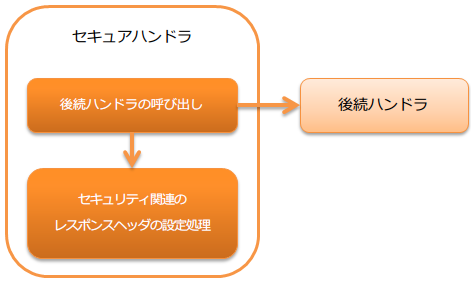

.. _secure_handler:

セキュアハンドラ
==================================================
.. contents:: 目次
  :depth: 3
  :local:

本ハンドラでは、Webアプリケーションのセキュリティに関する処理やヘッダ設定を行う。

デフォルトでは、レスポンスオブジェクト(:java:extdoc:`HttpResponse <nablarch.fw.web.HttpResponse>`)に対して以下のレスポンスヘッダを設定する。

* X-Frame-Options: SAMEORIGIN
* X-XSS-Protection: 1; mode=block
* X-Content-Type-Options: nosniff
* Referrer-Policy: strict-origin-when-cross-origin
* Cache-Control: no-store

本ハンドラでは、以下の処理を行う。

* Content-Security-Policyのnonceの生成
* セキュリティ関連のレスポンスヘッダの設定処理

処理の流れは以下のとおり。

  
ハンドラクラス名
--------------------------------------------------
* :java:extdoc:`nablarch.fw.web.handler.SecureHandler`

モジュール一覧
--------------------------------------------------
.. code-block:: xml

  <dependency>
    <groupId>com.nablarch.framework</groupId>
    <artifactId>nablarch-fw-web</artifactId>
  </dependency>

制約
------------------------------
:ref:`http_response_handler` よりも後ろに設定すること
  本ハンドラで設定したレスポンスヘッダを、 :ref:`http_response_handler` がServlet APIのレスポンスオブジェクトに設定するため。

デフォルトで適用されるヘッダの値を変更したい
--------------------------------------------------
要件により、デフォルトで適用されるセキュリティ関連のヘッダの値を変更したい場合がある。

例えば、フレーム内の表示を全て許可しない場合には、 ``X-Frame-Options`` ヘッダの値を ``DENY`` に変更する必要がある。
このような場合は、コンポーネント設定ファイルに明示的に設定することで対応する。

以下に例を示す。

.. code-block:: xml

  <component class="nablarch.fw.web.handler.SecureHandler">
    <property name="secureResponseHeaderList">
      <list>
        <!-- X-Frame-Optionsの値を明示的に指定 -->
        <component class="nablarch.fw.web.handler.secure.FrameOptionsHeader">
          <property name="option" value="DENY" />
        </component>

        <!-- 上記以外のヘッダはデフォルトのまま -->
        <component class="nablarch.fw.web.handler.secure.XssProtectionHeader" />
        <component class="nablarch.fw.web.handler.secure.ContentTypeOptionsHeader" />
        <component class="nablarch.fw.web.handler.secure.ReferrerPolicyHeader" />
        <component class="nablarch.fw.web.handler.secure.CacheControlHeader" />
      </list>
    </property>
  </component>

.. tip::

  値を変更するためのプロパティの詳細は、以下のクラスを参照。

  * :java:extdoc:`FrameOptionsHeader <nablarch.fw.web.handler.secure.FrameOptionsHeader>`
  * :java:extdoc:`ContentTypeOptionsHeader <nablarch.fw.web.handler.secure.ContentTypeOptionsHeader>`
  * :java:extdoc:`XssProtectionHeader <nablarch.fw.web.handler.secure.XssProtectionHeader>`
  * :java:extdoc:`ReferrerPolicyHeader <nablarch.fw.web.handler.secure.ReferrerPolicyHeader>`
  * :java:extdoc:`CacheControlHeader <nablarch.fw.web.handler.secure.CacheControlHeader>`

デフォルト以外のレスポンスヘッダを設定する
-------------------------------------------------------
デフォルト以外のセキュリティ関連のレスポンスヘッダを設定する手順を以下に示す。

1. :java:extdoc:`SecureResponseHeader <nablarch.fw.web.handler.secure.SecureResponseHeader>` インタフェースの実装クラスで、
   レスポンスヘッダに設定するフィールド名と値を指定する。

  .. tip::
    ロジックを含まない単純なレスポンスヘッダを作成する場合は、
    :java:extdoc:`SecureResponseHeaderSupport <nablarch.fw.web.handler.secure.SecureResponseHeaderSupport>`
    を継承して作成すればよい。

2. 本ハンドラ(:java:extdoc:`SecureHandler <nablarch.fw.web.handler.SecureHandler>`)に、``No1`` で作成したクラスを設定する。

.. important::

  :java:extdoc:`SecureResponseHeader <nablarch.fw.web.handler.secure.SecureResponseHeader>` 実装クラスを設定する際は、
  デフォルトで適用されていたコンポーネントも設定すること。

  以下に設定ファイルの例を示す。

  .. code-block:: xml

    <component class="nablarch.fw.web.handler.SecureHandler">
      <property name="secureResponseHeaderList">
        <list>
          <component class="nablarch.fw.web.handler.secure.FrameOptionsHeader" />
          <component class="nablarch.fw.web.handler.secure.XssProtectionHeader" />
          <component class="nablarch.fw.web.handler.secure.ContentTypeOptionsHeader" />
          <component class="nablarch.fw.web.handler.secure.ReferrerPolicyHeader" />
          <component class="nablarch.fw.web.handler.secure.CacheControlHeader" />

          <!-- 追加で作成したコンポーネント -->
          <component class="nablarch.fw.web.handler.secure.SampleSecurityHeader" />
        </list>
      </property>
    </component>

.. _content_security_policy:

Content Security Policy(CSP)に対応する
-------------------------------------------------------
本ハンドラの設定と ``ContentSecurityPolicyHeader`` 、そして :ref:`JSPカスタムタグのCSP対応 <tag-content_security_policy>` を組み合わせることでCSPに関する機能を有効にできる。

  .. tip::
    Content Security Policy(CSP)は、クロスサイトスクリプティングなどのコンテンツへのインジェクションに関する攻撃を検知し影響を
    軽減するために追加できる仕組みのことである。CSPそのものについては、 `Content Security Policy Level 3(外部サイト、英語) <https://www.w3.org/TR/CSP3/>`_ や
    `Content Security Policy Level 2(外部サイト、英語) <https://www.w3.org/TR/CSP2/>`_ を参照すること。

:ref:`tag` を使用している場合は一部のカスタムタグでJavaScriptを出力するため、本ハンドラの機能でnonceを生成しレスポンスヘッダやscript要素などに埋め込むことで対応する。

Content-Security-Policyヘッダの出力には、 ``ContentSecurityPolicyHeader`` を使用することで本ハンドラで生成したnonceを
埋め込むことができる。

固定のContent-Security-Policyヘッダを設定する
^^^^^^^^^^^^^^^^^^^^^^^^^^^^^^^^^^^^^^^^^^^^^^^^^^^^^^^^^

固定のContent-Security-Policyヘッダを設定する手順を以下に示す。

1. 本ハンドラ(:java:extdoc:`SecureHandler <nablarch.fw.web.handler.SecureHandler>`)に、 ``ContentSecurityPolicyHeader`` を設定する。

2. ``ContentSecurityPolicyHeader`` に ``policy`` を設定する。

以下に例を示す。

.. code-block:: xml

  <component class="nablarch.fw.web.handler.SecureHandler">
    <property name="secureResponseHeaderList">
      <list>
        <component class="nablarch.fw.web.handler.secure.FrameOptionsHeader" />
        <component class="nablarch.fw.web.handler.secure.XssProtectionHeader" />
        <component class="nablarch.fw.web.handler.secure.ContentTypeOptionsHeader" />
        <component class="nablarch.fw.web.handler.secure.ReferrerPolicyHeader" />
        <component class="nablarch.fw.web.handler.secure.CacheControlHeader" />

        <!-- Content-Security-Policyを付与するコンポーネント -->
        <component class="nablarch.fw.web.handler.secure.ContentSecurityPolicyHeader">
          <!-- ポリシーを設定する -->
          <property name="policy" value="default-src 'self'" />
        </component>
      </list>
    </property>
  </component>

この場合、 ``Content-Security-Policy: default-src 'self'`` といったレスポンスヘッダが書き出される。
   
nonceを生成してContent-Security-Policyヘッダに設定する
^^^^^^^^^^^^^^^^^^^^^^^^^^^^^^^^^^^^^^^^^^^^^^^^^^^^^^^^^^^^^^^^^

nonceを生成してContent-Security-Policyヘッダに設定する手順を以下に示す。

1. 本ハンドラ(:java:extdoc:`SecureHandler <nablarch.fw.web.handler.SecureHandler>`)の ``generateCspNonce`` プロパティを ``true`` に設定する。

2. 本ハンドラに、``ContentSecurityPolicyHeader`` を設定する。

3. ``ContentSecurityPolicyHeader`` に ``policy`` を設定し、プレースホルダー ``$cspNonceSource$`` を含める。

以下に例を示す。

.. code-block:: xml

  <component class="nablarch.fw.web.handler.SecureHandler">
    <!-- nonceを生成するように設定する -->
    <property name="generateCspNonce" value="true" />
    <property name="secureResponseHeaderList">
      <list>
        <component class="nablarch.fw.web.handler.secure.FrameOptionsHeader" />
        <component class="nablarch.fw.web.handler.secure.XssProtectionHeader" />
        <component class="nablarch.fw.web.handler.secure.ContentTypeOptionsHeader" />
        <component class="nablarch.fw.web.handler.secure.ReferrerPolicyHeader" />
        <component class="nablarch.fw.web.handler.secure.CacheControlHeader" />

        <!-- Content-Security-Policyを付与するコンポーネント -->
        <component class="nablarch.fw.web.handler.secure.ContentSecurityPolicyHeader">
          <!-- nonceを含んだポリシーを設定する -->
          <property name="policy" value="default-src 'self' '$cspNonceSource$'" />
        </component>
      </list>
    </property>
  </component>

この場合プレースホルダー ``$cspNonceSource$`` は ``nonce-[本ハンドラで生成されたnonce]`` に置換され、たとえば ``Content-Security-Policy: default-src 'self' 'nonce-DhcnhD3khTMePgXwdayK9BsMqXjhguVV'`` のようなレスポンスヘッダとして書き出される。

本ハンドラではnonceをリクエストの都度生成する。
生成したnonceはリクエストスコープに格納され、 :ref:`tag` の動作を以下のように変更する。

* script要素を生成するカスタムタグの場合、生成したnonceを自動でnonce属性に設定する。
* onclick属性にサブミット用の関数呼び出しを設定するカスタムタグは、その内容をscript要素に出力するように変更する。

また任意の要素にnonceを設定したい場合に使えるカスタムタグも有効になる。

詳しくは :ref:`JSPカスタムタグのCSP対応 <tag-content_security_policy>` を参照すること。

.. important::
  Internet Explorer 11はCSPに対応していないため、開発するアプリケーションの動作対象環境にInternet Explorer 11が含まれているかどうかを確認したうえで
  NablarchのCSPに関する機能を利用すること。

report-only モードで動作させる
^^^^^^^^^^^^^^^^^^^^^^^^^^^^^^^^^^^^^^^^^^^^^^^^^^^^^^^^^

report-only モードで動作させる場合は ``reportOnly`` を ``true`` に設定する。

以下に例を示す。

.. code-block:: xml

  <component class="nablarch.fw.web.handler.SecureHandler">
    <property name="secureResponseHeaderList">
      <list>
        <component class="nablarch.fw.web.handler.secure.FrameOptionsHeader" />
        <component class="nablarch.fw.web.handler.secure.XssProtectionHeader" />
        <component class="nablarch.fw.web.handler.secure.ContentTypeOptionsHeader" />
        <component class="nablarch.fw.web.handler.secure.ReferrerPolicyHeader" />
        <component class="nablarch.fw.web.handler.secure.CacheControlHeader" />

        <component class="nablarch.fw.web.handler.secure.ContentSecurityPolicyHeader">
          <property name="policy" value="default-src 'self'; report-uri http://example.com/report" />
          <!-- report-onlyモードで動作させる -->
          <property name="reportOnly" value="true" />
        </component>
      </list>
    </property>
  </component>

この場合、 ``Content-Security-Policy-Report-Only: default-src 'src'; report-uri http://example.com/report`` といったレスポンスヘッダが書き出される。
