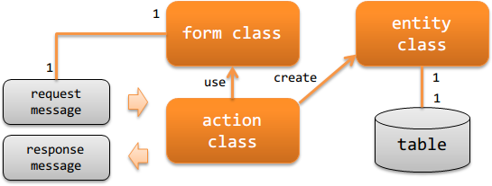

.. _`http_messaging-design`:

アプリケーションの責務配置
================================
HTTPメッセージングを作成する際に実装すべきクラスとその責務について説明する。

**クラスとその責務**

アクションクラス(action class)
  アクションクラスは、リクエストメッセージ(:java:extdoc:`RequestMessage<nablarch.fw.messaging.RequestMessage>`)
  を元に業務ロジックを実行し、レスポンスメッセージ(:java:extdoc:`ResponseMessage<nablarch.fw.messaging.ResponseMessage>`)
  を作成し返却する。

  例えば、リクエストメッセージの取り込み処理であれば、業務ロジックとして以下の処理を行う。

  - リクエストメッセージからフォームクラスを作成し、バリデーションを行う。
  - フォームクラスからエンティティクラスを作成して、データベースにデータを追加する。
  - レスポンスメッセージを作成し返却する。

フォームクラス(form class)
  リクエストメッセージ(:java:extdoc:`RequestMessage<nablarch.fw.messaging.RequestMessage>`)をマッピングするクラス。

  バリデーションするためのアノテーションの設定や相関バリデーションのロジックを持つ。

  フォームクラスのプロパティは全て `String` で定義する
    プロパティを `String` とすべき理由は、 :ref:`Bean Validation <bean_validation-form_property>` を参照。
    ただし、バイナリ項目の場合はバイト配列で定義する。

エンティティクラス(entity class)
  テーブルと1対1で対応するクラス。カラムに対応するプロパティを持つ。

