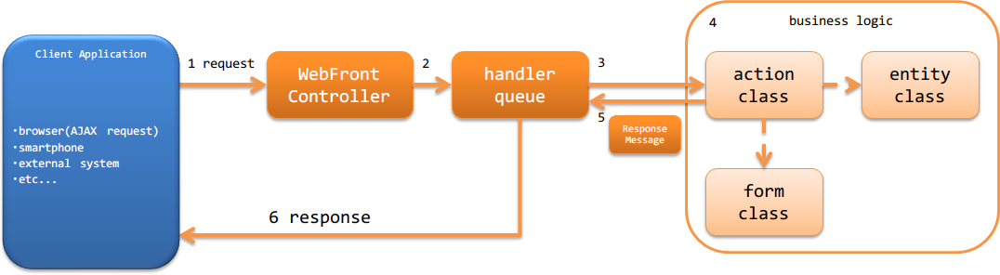

アーキテクチャ概要
==============================
HTTPメッセージングでは、外部(ブラウザや外部システムなど)から送信されたhttpメッセージ
を処理するウェブサービスを構築するための機能を提供している。

.. important::

  本機能ではなく、 :ref:`RESTfulウェブサービス <restful_web_service>` の使用を推奨する。
  詳細は、 :ref:`RESTfulウェブサービスを推奨する理由 <web_service-recommended_jaxrs>` を参照。

HTTPメッセージングの構成
--------------------------------------------------
Nablarchウェブアプリケーションと同じ構成となる。
詳細は、 :ref:`web_application-structure` を参照。

HTTPメッセージングの処理の流れ
--------------------------------------------------
HTTPメッセージング機能がリクエストを処理し、レスポンスを返却するまでの処理の流れを以下に示す。

1. :ref:`WebFrontController <web_front_controller>` ( `javax.servlet.Filter` の実装クラス)がrequestを受信する。
2. :ref:`WebFrontController <web_front_controller>` は、requestに対する処理をハンドラキュー(handler queue)に委譲する。
3. ハンドラキューに設定されたディスパッチハンドラ(`DispatchHandler`) が、URIを元に処理すべきアクションクラス(action class)を特定しハンドラキューの末尾に追加する。
4. アクションクラス(action class)は、フォームクラス(form class)やエンティティクラス(entity class)を使用して業務ロジック(business logic) を実行する。 |br|
   各クラスの詳細は、 :ref:`http_messaging-design` を参照。

5. アクションクラス(action class)は、処理結果を示す `ResponseMessage` を作成し返却する。
6. ハンドラキュー内の :ref:`http_messaging_response_building_handler` が、 `ResponseMessage` をクライアントに返却するレスポンス(jsonやxmlなど)に変換し、クライアントへ応答を返す。 |br|

HTTPメッセージングで使用するハンドラ
--------------------------------------------------
Nablarchでは、HTTPメッセージングを使用したウェブサービスを構築するために必要なハンドラを標準で幾つか提供している。
プロジェクトの要件に従い、ハンドラキューを構築すること。(要件によっては、プロジェクトカスタムなハンドラを作成することになる)

各ハンドラの詳細は、リンク先を参照すること。

リクエストやレスポンスの変換を行うハンドラ
  * :ref:`http_response_handler`
  * :ref:`http_messaging_request_parsing_handler`
  * :ref:`http_messaging_response_building_handler`
  * :ref:`message_resend_handler`

リクエストのフィルタリングを行うハンドラ
  * :ref:`service_availability`
  * :ref:`permission_check_handler`

データベースに関連するハンドラ
  * :ref:`database_connection_management_handler`
  * :ref:`transaction_management_handler`

エラー処理に関するハンドラ
  * :ref:`global_error_handler`
  * :ref:`http_messaging_error_handler`

その他のハンドラ
  * :ref:`http_request_java_package_mapping`
  * :ref:`thread_context_handler`
  * :ref:`thread_context_clear_handler`
  * :ref:`http_access_log_handler`

HTTPメッセージングの最小ハンドラ構成
--------------------------------------------------
HTTPメッセージングを使用したウェブサービスを構築する際の必要最小限のハンドラキューを以下に示す。
これをベースに、プロジェクト要件に従ってNablarchの標準ハンドラやプロジェクトで作成したカスタムハンドラの追加を行う。

.. list-table:: 最小ハンドラ構成
  :header-rows: 1
  :class: white-space-normal
  :widths: 4,24,24,24,24

  * - No.
    - ハンドラ
    - 往路処理
    - 復路処理
    - 例外処理
 
  * - 1
    - :ref:`thread_context_clear_handler`
    -
    - :ref:`thread_context_handler` でスレッドローカル上に設定した値を全て削除する。
    -
    
  * - 2
    - :ref:`global_error_handler`
    -
    -
    - 実行時例外、またはエラーの場合、ログ出力を行う。

  * - 3
    - :ref:`http_response_handler`
    -
    - サーブレットフォーワード、リダイレクト、レスポンス書き込みのいずれかを行う。
    - 実行時例外、またはエラーの場合、既定のエラーページを表示する。

  * - 4
    - :ref:`thread_context_handler`
    - リクエストの情報からリクエストIDなどのスレッドコンテキスト変数を初期化する。
    - 
    -

  * - 5
    - :ref:`http_messaging_error_handler`
    - 
    - 後続ハンドラで生成したレスポンスのボディが空の場合、ステータスコードに応じたデフォルトのボディを設定する。
    - ログ出力及び、例外に応じたレスポンスの生成を行う。

  * - 6
    - :ref:`request_path_java_package_mapping`
    - リクエストパスから処理対象の業務アクションを特定し、ハンドラキューの末尾に追加する。
    - 
    - 

  * - 7
    - :ref:`http_messaging_request_parsing_handler`
    - httpリクエストのボディを解析し :java:extdoc:`RequestMessage <nablarch.fw.messaging.RequestMessage>` を生成し、
      後続のハンドラにリクエストオブジェクトとして引き渡す。
    - 
    - 

  * - 8
    - :ref:`database_connection_management_handler`
    - DB接続を取得する。
    - DB接続を解放する。
    -

  * - 9
    - :ref:`http_messaging_response_building_handler`
    - 
    - 
    - 業務アクションが生成したエラー用のメッセージを元に、エラー用のhttpスポンスを生成する。

  * - 10
    - :ref:`transaction_management_handler`
    - トランザクションを開始する。
    - トランザクションをコミットする。
    - トランザクションをロールバックする。

  * - 11
    - :ref:`http_messaging_response_building_handler`
    - 
    - 業務アクションが生成したメッセージを元に、http用のレスポンスを生成する。
    - 後続ハンドラで発生した例外を元にエラー用のhttpレスポンスを生成する。

HTTPメッセージングで使用するアクション
---------------------------------------------------------------------------------
Nablarchでは、HTTPメッセージングを構築するために必要なアクションクラスを標準で提供している。
詳細は、リンク先を参照すること。

* :java:extdoc:`MessagingAction (同期応答メッセージング用アクションのテンプレートクラス)<nablarch.fw.messaging.action.MessagingAction>`

.. |br| raw:: html

   
