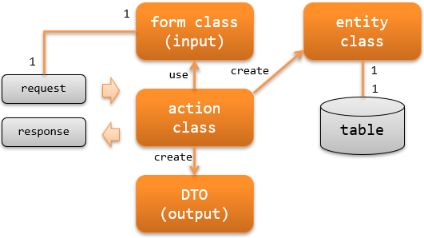

.. _rest-application_design:

RESTFulウェブサービスの責務配置
====================================

.. contents:: 目次
  :depth: 3
  :local:

RESTFulウェブサービスを作成する際に実装すべきクラスとその責務について説明する。

**クラスとその責務**

アクションクラス(action class)
  アクションクラスはリクエストを元に業務ロジックを実行し、レスポンスの生成と返却を行う。

  例えば、フォームクラスからエンティティクラスを作成し、その内容をデータベースに永続化するなどの処理を行う。

フォームクラス(form class)
  クライアント(ブラウザや外部システム、スマートフォンのアプリ等)から送信された値(http body)をマッピングするクラス。
  また、クライアントに応答する値(response body)にマッピングする値を保持するクラス。

  クライアントから送信された値を保持するフォームクラスは、値をバリデーションするためのアノテーションの設定や相関バリデーションのロジックを持つ。

  APIの仕様によっては、フォームクラスは階層構造(フォームクラスがフォームクラスを持つ)となる場合がある。

  .. _`application_design-form_html`:

  フォームクラスはAPI単位に作成する
    フォームクラスはクライアントとのインタフェースを定義するものであり、インタフェース(API)が異なる場合は別のフォームクラスとして作成する。
    例えば、似たような項目を持つことが多い登録用APIと更新用APIであっても、APIが異なるため別のフォームクラスとする必要がある。

    API単位でフォームクラスを作成することで、インタフェース変更の影響範囲を限定出来るメリットがある。
    また、1つのインタフェースに対応したバリデーションロジックだけを持つため、責務が明確で可読性や保守性が高くなる。

    なお、相関バリデーションのロジックは複数のフォームクラスで共通となることがある。
    この場合は、相関バリデーションのロジックを別クラスに抽出しロジックを共通化すると良い。

  フォームクラスのプロパティは全て `String` で定義する
    プロパティを `String` とすべき理由は、 :ref:`Bean Validation <bean_validation-form_property>` を参照。

エンティティクラス(entity class)
  テーブルと1対1で対応するクラス。カラムに対応するプロパティを持つ。

