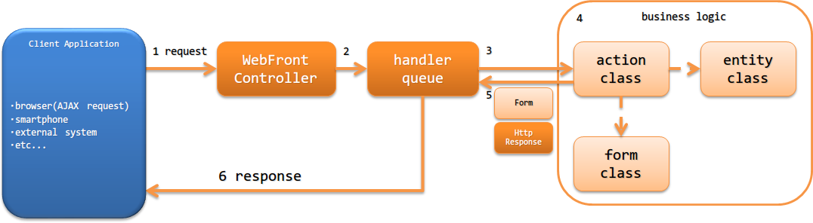

.. _`restful_web_service_architecture`:

アーキテクチャ概要
==============================

.. contents:: 目次
  :depth: 3
  :local:

Nablarchでは、JAX-RSのリソースクラスを作るのと同じように、ウェブアプリケーションの業務アクションを使用して
RESTfulウェブサービスを作成する機能（JAX-RSサポート）を提供する。

JAX-RSサポートは、Nablarchのウェブアプリケーションをベースとする。
そのため、JAX-RSで使用できる@Contextアノテーションを使用したServletリソースのインジェクションやCDIなどは利用することはできない。
以下に、JAX-RSサポートで利用できるアノテーションを示す。

 - Produces(レスポンスのメディアタイプの指定)
 - Consumes(リクエストのメディアタイプの指定)
 - Valid(リクエストに対するBeanValidationの実行)

JSR339とJAX-RSサポートとの機能比較は、 :ref:`restful_web_service_functional_comparison` を参照。

.. important::

 JAX-RSサポートでは、クライアントサイドの機能は提供しない。
 JAX-RSクライアントを使用する必要がある場合は、JAX-RS実装(JerseyやRESTEasyなど)を使用すること。

RESTfulウェブサービスの構成
----------------------------------------
Nablarchウェブアプリケーションと同じ構成となる。
詳細は、 :ref:`web_application-structure` を参照。

RESTfulウェブサービスの処理の流れ
----------------------------------------
RESTfulウェブサービスがリクエストを処理し、レスポンスを返却するまでの処理の流れを以下に示す。

1. :ref:`web_front_controller` ( `javax.servlet.Filter` の実装クラス)がrequestを受信する。
2. :ref:`web_front_controller` は、requestに対する処理をハンドラキュー(handler queue)に委譲する。
3. ハンドラキューに設定されたディスパッチハンドラ(`DispatchHandler`) が、URIを元に処理すべきアクションクラス(action class)を特定しハンドラキューの末尾に追加する。
4. アクションクラス(action class)は、フォームクラス(form class)やエンティティクラス(entity class)を使用して業務ロジック(business logic) を実行する。 |br|
   各クラスの詳細は、 :ref:`rest-application_design` を参照。

5. action classは、処理結果を示すフォームクラス(form class)や `HttpResponse` を作成し返却する。
6. ハンドラキュー内のHTTPレスポンスハンドラ(`JaxRsResponseHandler`)が、 `HttpResponse` をクライアントに返却するレスポンスに変換し、クライアントへ応答を返す。 |br|
   なお、アクションクラス(action class)の処理結果がフォームクラス(form class)の場合には、 `BodyConvertHandler` により `HttpResponse` に変換される。 |br|
   変換される `HttpResponse` のボディの形式は、 アクションクラス(action class)に設定されたメディアタイプとなる。

RESTfulウェブサービスで使用するハンドラ
--------------------------------------------------
Nablarchでは、RESTfulウェブサービスを構築するために必要なハンドラを標準で幾つか提供している。
プロジェクトの要件に従い、ハンドラキューを構築すること。(要件によっては、プロジェクトカスタムなハンドラを作成することになる)

各ハンドラの詳細は、リンク先を参照すること。

リクエストやレスポンスの変換を行うハンドラ
  * :ref:`jaxrs_response_handler`
  * :ref:`body_convert_handler`

データベースに関連するハンドラ
  * :ref:`database_connection_management_handler`
  * :ref:`transaction_management_handler`

リクエストの検証を行うハンドラ
  * :ref:`jaxrs_bean_validation_handler`

エラー処理に関するハンドラ
  * :ref:`global_error_handler`

その他のハンドラ
  * :ref:`リクエストURIとアクションを紐付けるハンドラ <router_adaptor>`

標準ハンドラ構成
~~~~~~~~~~~~~~~~~~~~~~~~~~~~~~~~~~~~~~~~~~~~~~~~~~
NablarchでRESTfulウェブサービスを構築する際の、必要最小限のハンドラキューを以下に示す。
これをベースに、プロジェクト要件に従ってNablarchの標準ハンドラやプロジェクトで作成したカスタムハンドラの追加を行う。

.. list-table:: 最小ハンドラ構成
  :header-rows: 1
  :class: white-space-normal
  :widths: 4 24 24 24 24

  * - No.
    - ハンドラ
    - 往路処理
    - 復路処理
    - 例外処理

  * - 1
    - :ref:`global_error_handler`
    -
    -
    - 実行時例外、またはエラーの場合、ログ出力を行う。

  * - 2
    - :ref:`jaxrs_response_handler`
    - 
    - レスポンスの書き込み処理を行う。
    - 例外(エラー)に対応したレスポンスの生成と書き込み処理とログ出力処理を行う。

  * - 3
    - :ref:`database_connection_management_handler`
    - DB接続を取得する。
    - DB接続を解放する。
    -

  * - 4
    - :ref:`transaction_management_handler`
    - トランザクションを開始する。
    - トランザクションをコミットする。
    - トランザクションをロールバックする。

  * - 5
    - :ref:`リクエストURIとアクションを紐付けるハンドラ <router_adaptor>`
    - リクエストパスをもとに呼び出すアクション(メソッド)を決定する。
    -
    -

  * - 6
    - :ref:`body_convert_handler`
    - request bodyをアクションで受け付けるフォームクラスに変換する。
    - アクションの処理結果のフォームの内容をresponse bodyに変換する。
    -

  * - 7
    - :ref:`jaxrs_bean_validation_handler`
    - No6で変換したフォームクラスに対してバリデーションを実行する。
    - 
    -

.. tip::

   :ref:`リクエストURIとアクションを紐付けるハンドラ <router_adaptor>` より後ろに設定するハンドラは、
   ハンドラキューに直接設定するのではなく :ref:`リクエストURIとアクションを紐付けるハンドラ <router_adaptor>` に対して設定する。

   :ref:`jaxrs_adaptor` を使用した場合、自動的に :ref:`body_convert_handler` と :ref:`jaxrs_bean_validation_handler` がハンドラキューに追加される。

   :ref:`body_convert_handler` と :ref:`jaxrs_bean_validation_handler` 以外のハンドラを設定したい場合や、サポートするメディアタイプを増やしたい場合は、
   以下の設定例や :ref:`jaxrs_adaptor` の実装を参考にハンドラキューを構築すること。

   .. code-block:: xml

    <component name="webFrontController" class="nablarch.fw.web.servlet.WebFrontController">
      <property name="handlerQueue">
        <list>
          <!-- 前段のハンドラは省略 -->

          <!-- リクエストURIとアクションを紐付けるハンドラの設定 -->
          <component name="packageMapping" class="nablarch.integration.router.RoutesMapping">
            <!-- ハンドラ以外の設定値は省略 -->
            <property name="methodBinderFactory">
              <component class="nablarch.fw.jaxrs.JaxRsMethodBinderFactory">
                <property name="handlerList">
                  <list>
                    <!--
                    リクエストURIとアクションを紐付けるハンドラ以降のハンドラキューの設定
                    ※各クラスの設定値は省略
                    -->
                    <component class="nablarch.fw.jaxrs.BodyConvertHandler">
                      <!-- サポートするメディアタイプのコンバータを設定する -->
                    </component>
                    <component class="nablarch.fw.jaxrs.JaxRsBeanValidationHandler" />
                  </list>
                </property>
              </component>
            </property>
          </component>
        </list>
      </property>
    </component>

.. |br| raw:: html
 
    
 
