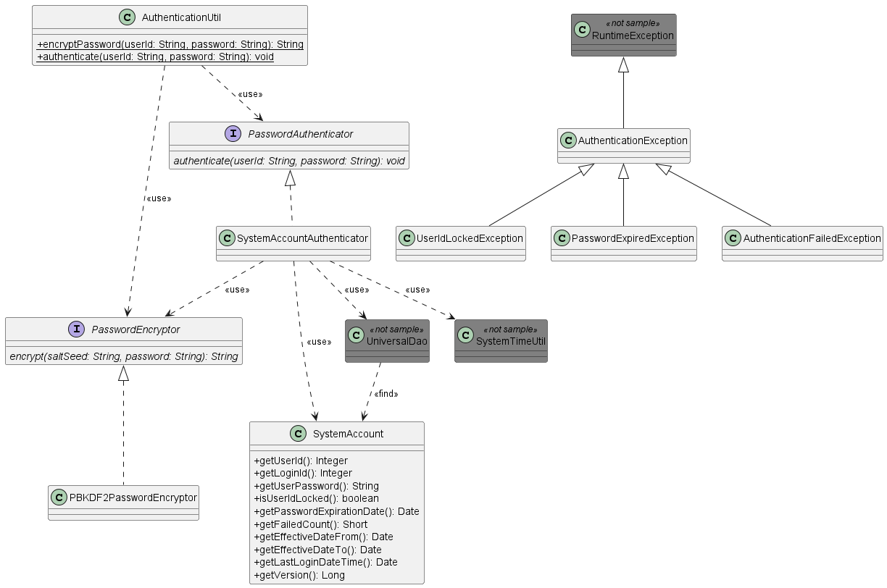

.. _authentication:

====================================================
データベースを用いたパスワード認証機能サンプル
====================================================

本サンプルは、データベースに保存されたアカウント情報(ユーザID、パスワード)を使用して認証処理を行う実装サンプルである。

.. toctree::
  :hidden:

  0101_PBKDF2PasswordEncryptor

`ソースコード <https://github.com/nablarch/nablarch-biz-sample-all>`_

--------------
提供パッケージ
--------------

本サンプルは、以下のパッケージで提供される。

  *please.change.me.*\ **common.authentication**

------------
概要
------------
ウェブアプリケーションにおけるユーザの認証(ユーザIDとパスワードによる認証)を行う機能の実装サンプルを提供する。

本サンプルは、ログイン処理を実行する業務処理 [#auth_action]_ の中で使用することを想定している。

.. tip::

  Nablarch導入プロジェクトでは、要件を満たすよう本サンプル実装を修正し使用すること。

.. [#auth_action]

  本機能では、ログイン処理を実行する業務処理は提供しない。
  Nablarch導入プロジェクトにて、要件に応じてログイン処理を作成すること。

本機能では、デフォルトでは `PBKDF2 <https://www.ietf.org/rfc/rfc2898.txt>`_ を使用してパスワードを暗号化するため、
各プロジェクトで、パスワード暗号化のストレッチング回数やソルトなどを設定する必要がある。

設定内容の詳細については :doc:`0101_PBKDF2PasswordEncryptor` を参照。

------------
構成
------------
本サンプルの構成を示す。

クラス図
========================

各クラスの責務
^^^^^^^^^^^^^^^^^^^^^^^^^^^^^^^^^^^^^^^

インタフェース定義
~~~~~~~~~~~~~~~~~~~~~~~~~~~~~~~~~~~~~~~~~~~~~~~~~~~

===================== ===============================================================
インタフェース名        概要
===================== ===============================================================
PasswordAuthenticator ユーザを認証するインタフェース。

PasswordEncryptor     パスワードを暗号化するインタフェース。

===================== ===============================================================

クラス定義
~~~~~~~~~~~~~~~~~~~~~~~~~~~~~~

\a) PasswordAuthenticatorの実装クラス

  =============================== ==========================================================================
  クラス名                        概要
  =============================== ==========================================================================
  SystemAccountAuthenticator      データベースに保存されたアカウント情報に対してパスワード認証するクラス。
  =============================== ==========================================================================

\b) PasswordEncryptorの実装クラス

  =============================== ==========================================================================
  クラス名                        概要
  =============================== ==========================================================================
  PBKDF2PasswordEncryptor         PBKDF2を使用してパスワードを暗号化するクラス。
  =============================== ==========================================================================

\c) ユーティリティクラス

  =============================== ==========================================================================
  クラス名                        概要
  =============================== ==========================================================================
  AuthenticationUtil              システムリポジトリから PasswordAuthenticator および PasswordEncryptor を
                                  取得して、ユーザ認証およびパスワード暗号化を行うユーティリティ。
  =============================== ==========================================================================

\d) エンティティクラス

  =============================== ==========================================================================
  クラス名                        概要
  =============================== ==========================================================================
  SystemAccount                   ユーザのアカウント情報を保持するクラス。ユニバーサルDAOの検索結果を格納する。
  =============================== ==========================================================================

.. tip::

  Nablarch導入プロジェクトでは、エンティティクラスは :ref:`gsp-dba-maven-plugin(DBA作業支援ツール) <gsp-maven-plugin>` を使用して自動生成する。
  本サンプルには動作確認のため :ref:`system-account-table-definition` に記載の定義に合わせて自動生成したエンティティクラスを同梱している。
  プロジェクトにて実装する際は本サンプルのエンティティクラスを使用するのではなく、各プロジェクトで自動生成したエンティティクラスを使用するよう修正すること。

\e) 例外クラス

  =============================== ==========================================================================
  クラス名                        概要
  =============================== ==========================================================================
  AuthenticationException         ユーザの認証に失敗した場合に発生する例外。

                                  認証処理に関する例外の基底クラス。
                                  認証方式に応じて、本クラスを継承した例外クラスを作成する。
                                  本クラス及びサブクラスでは、ユーザへ提示するメッセージの作成に
                                  必要な情報を保持し、メッセージの作成は行わない。

  AuthenticationFailedException   アカウント情報の不一致により認証に失敗した場合に発生する例外。

                                  対象ユーザのユーザIDを保持する。

  PasswordExpiredException        ユーザの認証時にパスワードの有効期限が切れている場合に発生する例外。

                                  対象ユーザのユーザID、パスワード有効期限とチェックに使用した業務日付を保持する。

  UserIdLockedException           ユーザの認証時にユーザIDがロックされている場合に発生する例外。

                                  対象ユーザのユーザIDとユーザIDをロックする認証失敗回数を保持する。
  =============================== ==========================================================================

.. _system-account-table-definition:

テーブル定義
~~~~~~~~~~~~~~~~~~~~~~~~~~~~~~
本サンプルで使用しているアカウントテーブルの定義を以下に示す。
本サンプルを導入プロジェクトに取り込む際には、導入プロジェクトのテーブル定義に従いSQLファイル及びソースコードを修正すること。

**システムアカウント(SYSTEM_ACCOUNT)**

システムアカウントテーブルには、アカウント情報を格納する。

  ========================= ========================= ==================== =====================================
  論理名                    物理名                    Javaの型             制約
  ========================= ========================= ==================== =====================================
  ユーザID                  USER_ID                   java.lang.Integer     主キー

  ログインID                LOGIN_ID                  java.lang.String

  パスワード                USER_PASSWORD             java.lang.String

  ユーザIDロック            USER_ID_LOCKED            boolean                ロックしている場合はtrue

  パスワード有効期限        PASSWORD_EXPIRATION_DATE   java.util.Date     

  認証失敗回数              FAILED_COUNT              java.lang.Short

  有効日(From)              EFFECTIVE_DATE_FROM       java.util.Date     

  有効日(To)                EFFECTIVE_DATE_TO         java.util.Date     

  最終ログイン日時          LAST_LOGIN_DATE_TIME       java.util.Date
  ========================= ========================= ==================== =====================================

.. tip::

  上記テーブル定義には、本サンプルで必要となる属性のみを列挙している。
  Nablarch導入プロジェクトでは、必要なユーザ属性を本テーブルに追加したり、本テーブルと1対1で紐づくユーザ情報テーブルなどを作成し要件を満たすようテーブル設計すること。

------------------------------------------------------------------------
使用方法
------------------------------------------------------------------------
データベースに保存したアカウント情報を使用したパスワード認証の使用方法について解説する。

パスワード認証の特徴を下記に示す。

* 認証時にアカウント情報の有効日（From/To）をチェックする。
* 認証時にパスワードの有効期限をチェックする。
* 連続で指定回数認証に失敗するとユーザIDにロックをかける。指定回数に達するまでに認証に成功すると失敗回数をリセットする。
* 暗号化されたパスワードを使用して認証する。本機能は、デフォルトでPBKDF2を使用したパスワードの暗号化を提供する。
* 最終ログイン日時を記録する。認証に成功した場合のみシステム日時を使用して最終ログイン日時を更新する。

また、 PasswordAuthenticator および PasswordEncryptor は、Nablarchのシステムリポジトリから取得して使用する想定となっている。
業務機能で使用する各箇所でシステムリポジトリからコンポーネントを取得して使用するべきではないため、
本機能では、システムリポジトリからのコンポーネントの取得と、パスワード認証およびパスワード暗号化処理をラップした
AuthenticationUtil を提供している。

プロジェクトで実装するログイン機能やユーザ登録機能などからは、 AuthenticationUtil を使用すること。

.. _passwordAuth-settings-label:

SystemAccountAuthenticatorの使用方法
=============================================================================================
SystemAccountAuthenticatorの使用方法について解説する。

.. code-block:: xml

    <component name="authenticator" class="please.change.me.common.authentication.SystemAccountAuthenticator">
      <!-- パスワードを暗号化するPasswordEncryptor -->
      <property name="passwordEncryptor" ref="passwordEncryptor" />

      <!-- データベースへのトランザクション制御を行うクラス -->
      <property name="dbManager">
        <component class="nablarch.core.db.transaction.SimpleDbTransactionManager">
          <property name="dbTransactionName" value="authenticator"/>
          <property name="connectionFactory" ref="connectionFactory"/>
          <property name="transactionFactory" ref="transactionFactory"/>
        </component>
      </property>

      <!-- ユーザIDをロックする認証失敗回数 -->
      <property name="failedCountToLock" value="5"/>
    </component>

プロパティの説明を下記に示す。

===================================================================== ==================================================================================================================================================================================
property名                                                            設定内容
===================================================================== ==================================================================================================================================================================================
passwordEncryptor(必須)                                               パスワードの暗号化に使用するPasswordEncryptor。

                                                                      :doc:`0101_PBKDF2PasswordEncryptor` を参考に設定したコンポーネント名を、refに指定すること。

dbManager(必須)                                                       データベースへのトランザクションを制御するSimpleDbTransactionManager。

                                                                      nablarch.core.db.transaction.SimpleDbTransactionManagerクラスのインスタンスを指定する。

                                                                      .. important::
                                                                         SystemAccountAuthenticatorのトランザクション制御が個別アプリケーションの処理に影響を与えないように、個別アプリケーションとは別のトランザクションを使用するように設定すること。
                                                                         設定例では、dbTransactionNameに"authenticator"という名前を指定しているので、個別アプリケーションでは同じ名前を使用しないように設定する。

failedCountToLock                                                     ユーザIDをロックする認証失敗回数。

                                                                      指定しない場合は0となり、ユーザIDのロック機能を使用しないことになる。
===================================================================== ==================================================================================================================================================================================

AuthenticaionUtilの使用方法
=============================================================================================

AuthenticaionUtilの使用方法について解説する。

AuthenticationUtilでは、以下のユーティリティメソッドを実装している。なお、システムリポジトリからコンポーネントを取得する際の
コンポーネント名は、上記の :ref:`passwordAuth-settings-label` で登録しているそれぞれのコンポーネント名と
あわせる必要があるため、上記の設定例と異なるコンポーネント名で登録している場合にはソースコードを修正すること。

================== ==============================================================================================
メソッド
================== ==============================================================================================
encryptPassword    システムリポジトリから、 passwordEncryptor というコンポーネント名で PasswordEncryptor を取得し、
                   PasswordEncryptor#encrypt(String, String) を呼び出す。

authenticate       システムリポジトリから、 authenticator というコンポーネント名で PasswordAuthenticator を取得し、
                   PasswordAuthenticator#authenticate(String, String) を呼び出す。
================== ==============================================================================================

AuthenticationUtilの使用例
^^^^^^^^^^^^^^^^^^^^^^^^^^^^^^^^^^^^^^^^^^^^^^^^^^^^^^^^^^^^^^^^^^^^^^^^^^^^^^^^^^^^^^^

本サンプルを使用した場合の認証処理の実装例を示す。

導入プロジェクトでは、本実装例を参考にし要件を満たす認証処理を実装すること。

.. code-block:: java

  // 事前に認証を行うためのユーザID及びパスワードを取得する。
  // String userId = ・・・;
  // Strign password = ・・・;

  try {

      AuthenticationUtil.authenticate(userId, password);

  } catch (AuthenticationFailedException e) {

      // 認証に失敗した場合の処理

  } catch (UserIdLockedException e) {

      // ユーザIDがロックされていた場合の処理

  } catch (PasswordExpiredException e) {

      // パスワードの有効期限が切れていた場合の処理

  }

.. tip::

   上記の例では、認証エラーの状態により細かく処理を分けているが、
   細かく処理を分ける必要がない場合には、以下のように上位の例外クラスを補足して処理を行えば良い。

  .. code-block:: java

    try {

        AuthenticationUtil.authenticate(userId, password);

    } catch (AuthenticationException e) {
        // 例外の処理
    }

