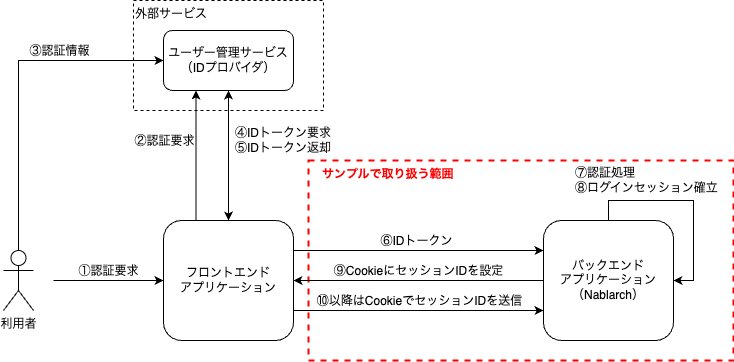
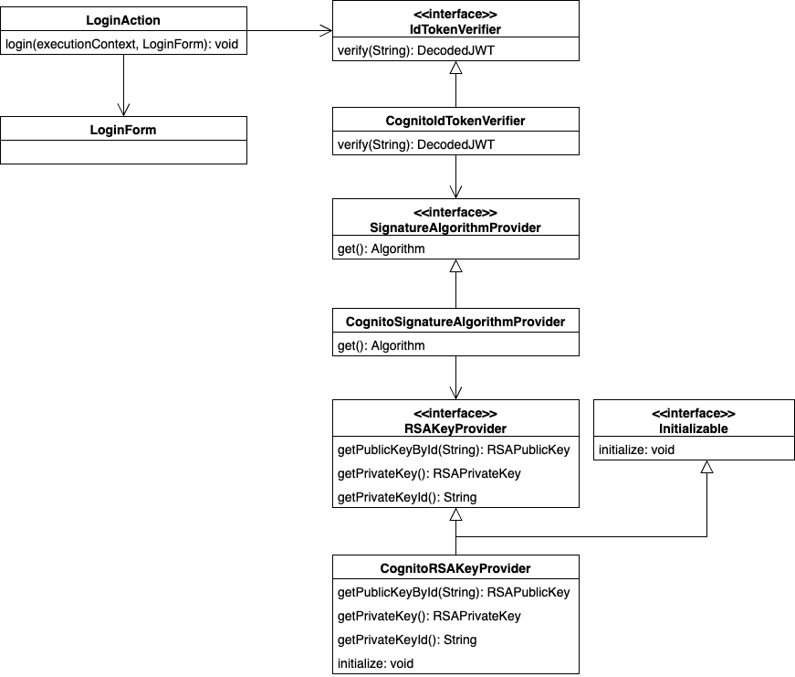

======================================
OIDCのIDトークンを用いた認証サンプル
======================================

--------------
提供パッケージ
--------------

`ソースコード <https://github.com/nablarch/nablarch-biz-sample-all/tree/main/nablarch-oidc>`_

本サンプルは、以下のパッケージで提供される。

  *please.change.me.*\ **common.oidc.verification**

--------------
概要
--------------

本サンプルは、OpenID Connect（以下OIDC）で発行されるIDトークンを用いて認証を行うサンプルである。

IDトークンの取得方法や実装場所などはアプリケーション構成によって様々あるが、本サンプルでは以下の構成を想定している。

* Nablarchを使用したRESTfulウェブサービスのアプリケーションを、バックエンドとして稼働させる
* IDトークンはフロントエンド（SPA、モバイルアプリ等）で取得し、バックエンドに送信する
* 認証成功時にログインセッションを確立し、認証後はステートフルなセッション管理を行う
* 認証処理は業務アクションで実装する

OIDCは様々なサービスで対応しているが、本サンプルでは以下のユーザー管理サービスで発行されるIDトークンを取り扱う。

* Amazon Web Services（以下AWS）

  * `Amazon Cognito ユーザープール <https://aws.amazon.com/jp/cognito/>`_ （以下ユーザープール）

* Microsoft Azure（以下Azure）

  * `Azure Active Directory B2C <https://learn.microsoft.com/ja-jp/azure/active-directory-b2c/>`_ （以下ADB2C）

提供パッケージ内では、対象のサービス別にさらにパッケージを分けている。

ユーザープールが発行するIDトークンを取り扱うサンプル

  *please.change.me.common.oidc.verification.*\ **cognito**

ADB2Cが発行するIDトークンを取り扱うサンプル

  *please.change.me.common.oidc.verification.*\ **adb2c**

考え方はどちらのパッケージでも同じであるため、本ページでは、cognito パッケージのサンプルをベースとして説明する。
adb2c パッケージを使用する場合は、適宜対応するコンポーネントに読み替えること。

.. tip::

  本サンプルは、2024年9月時点のユーザープール、ADB2Cの仕様に合わせて実装している。
  必ず利用するサービスの最新の仕様を確認し、適宜カスタマイズすること。

~~~~~~~~~~~~~~~~~~~~~~~~~
本サンプルで取り扱う範囲
~~~~~~~~~~~~~~~~~~~~~~~~~

全体の処理の流れ、および本サンプルで取り扱う範囲について、以下に示す。

本サンプルで取り扱うのはNablarchを使用するバックエンドアプリケーションのみとし、フロントエンドアプリケーション（Web、モバイルアプリ等）で行うIDトークンの取得方法については本サンプルの対象外とする。

--------------
構成
--------------

~~~~~~~~~~~~~~~~~~~~~~~~~
クラス図
~~~~~~~~~~~~~~~~~~~~~~~~~

本サンプルで提供するクラスについて、クラス図を以下に示す。

~~~~~~~~~~~~~~~~~~~~~~~~~
各クラスの責務
~~~~~~~~~~~~~~~~~~~~~~~~~

各クラスの責務については、以下のとおりである。

^^^^^^^^^^^^^^^^
インタフェース
^^^^^^^^^^^^^^^^

================================== =================================================================================================
インタフェース名                      概要
================================== =================================================================================================
IdTokenVerifier                    IDトークンが有効であるか検証するための機能を提供する
SignatureAlgorithmProvider         トークンの署名検証に使用するアルゴリズムを提供する
================================== =================================================================================================

^^^^^^^^^^^^^^^^^^^^^^^^^^
クラス（コンポーネント）
^^^^^^^^^^^^^^^^^^^^^^^^^^

================================== =================================================================================================
クラス名                             概要
================================== =================================================================================================
CognitoIdTokenVerifier             Cognitoが提供するIDトークンが有効であるか検証するための機能を提供する
CognitoSignatureAlgorithmProvider  Cognitoが提供するトークンの署名検証に使用するアルゴリズムを提供する
CognitoRSAKeyProvider              Cognitoが発行するトークンの検証に使用するRSA公開鍵を提供する
================================== =================================================================================================

^^^^^^^^^^^^^^^^^^^^^^^^^^
クラス（業務アクション）
^^^^^^^^^^^^^^^^^^^^^^^^^^

================================== =================================================================================================
クラス名                             概要
================================== =================================================================================================
LoginAction                        認証処理の業務アクション
LoginRequestForm                   認証のリクエスト情報を格納するフォーム
================================== =================================================================================================

--------------
使用方法
--------------

~~~~~~~~~~~~~~~~~~~~~~~~~
依存ライブラリの追加
~~~~~~~~~~~~~~~~~~~~~~~~~

IDトークンはJSON Web Tokens（以下JWT）の形式で作成される。
JWTを扱うためのライブラリはOSSでも多く公開されているが、サンプルではAuth0が公開している java-jwt と jwks-rsa-java を使用する。

.. tip::

  JWTを扱うライブラリは、 `OpenID Foundation <https://openid.net/developers/jwt-jws-jwe-jwk-and-jwa-implementations/>`_ や `jwt.io <https://jwt.io/libraries>`_ でも紹介されている。

ライブラリを使用可能にするため、プロジェクトの依存関係設定に以下の依存関係を追加する。

.. code-block:: xml

  <dependencies>
    ...
    <!-- JWTライブラリ -->
    <dependency>
      <groupId>com.auth0</groupId>
      <artifactId>java-jwt</artifactId>
      <version>4.4.0</version>
    </dependency>
    <dependency>
      <groupId>com.auth0</groupId>
      <artifactId>jwks-rsa</artifactId>
      <version>0.22.1</version>
    </dependency>
    ...
  </dependencies>

~~~~~~~~~~~~~~~~~~~~~~~~~
環境依存値の設定
~~~~~~~~~~~~~~~~~~~~~~~~~

IDトークンを検証するための処理はコンポーネントとして作成しており、サービスへアクセスするための情報を設定するために、環境依存値をプロパティとして参照している。
そのため、以下の環境依存値を実行環境に設定する。

=============================== =================================================================================================
名前                             説明
=============================== =================================================================================================
aws.cognito.region              Cognitoを作成しているリージョンコード（例：ap-northeast-1）
aws.cognito.userPool.id         ユーザープールID
aws.cognito.userPool.clientId   ユーザープールに登録したアプリケーションのクライアントID
=============================== =================================================================================================

環境依存値の設定方法については :ref:`repository-overwrite_environment_configuration` や :ref:`repository-overwrite_environment_configuration_by_os_env_var` を参照。

.. tip::

  サービスへのアクセスに必要な情報には、秘匿すべき情報が含まれている場合がある。
  そのような情報がある場合、外部への漏洩を防ぐため、バージョン管理システムで管理対象となるファイルへの記述は避けるのが望ましい。
  そのような情報を扱う場合には、システムプロパティやOS環境変数として設定することで、安全に使用できる。

~~~~~~~~~~~~~~~~~~~~~~~~~
コンポーネント定義の設定
~~~~~~~~~~~~~~~~~~~~~~~~~

IDトークンを検証するための処理は、プロパティの使用や起動時の初期化を考慮して、コンポーネントとして作成している。
そのため、それらのコンポーネントをコンポーネント設定ファイルに定義する。

.. code-block:: xml

  <!-- IDトークン検証コンポーネント -->
  <component name="idTokenVerifier" class="please.change.me.common.oidc.verification.cognito.jwt.CognitoIdTokenVerifier">
    <property name="region" value="${aws.cognito.region}" />
    <property name="userPoolId" value="${aws.cognito.userPool.id}" />
    <property name="clientId" value="${aws.cognito.userPool.clientId}" />
    <property name="signatureAlgorithmProvider" ref="signatureAlgorithmProvider" />
  </component>
  <!-- トークン署名検証用アルゴリズム提供コンポーネント -->
  <component name="signatureAlgorithmProvider" class="please.change.me.common.oidc.verification.cognito.jwt.CognitoSignatureAlgorithmProvider">
    <property name="rsaKeyProvider" ref="rsaKeyProvider" />
  </component>
  <!-- トークン署名検証用RSA公開鍵提供コンポーネント -->
  <component name="rsaKeyProvider" class="please.change.me.common.oidc.verification.cognito.jwt.CognitoRSAKeyProvider">
    <property name="region" value="${aws.cognito.region}" />
    <property name="userPoolId" value="${aws.cognito.userPool.id}" />
  </component>

~~~~~~~~~~~~~~~~~~~~~~~~~
IDトークンの検証
~~~~~~~~~~~~~~~~~~~~~~~~~

IDトークンの検証を行うコンポーネントでは、IDトークンを発行するサービスが案内している検証方法に従って検証する。

なお、検証方法に含まれる署名の検証では、サービスが提供しているJWKSエンドポイントにアクセスし、公開鍵情報を取得する必要がある。
サンプルでは、署名検証以外の処理についてローカル開発環境でテストが実装しやすくするため、署名検証に必要な情報を差し替えやすいように別のコンポーネントから提供するものとしている。

.. code-block:: java

  /**
   * Cognitoが発行するIDトークンが有効であるか検証するための機能を提供する。
   */
  public class CognitoIdTokenVerifier implements IdTokenVerifier {

      /** リージョン */
      private String region;

      /** ユーザープール ID */
      private String userPoolId;

      /** クライアントID */
      private String clientId;

      /** 署名アルゴリズムプロバイダ */
      private SignatureAlgorithmProvider signatureAlgorithmProvider;

      @Override
      public DecodedJWT verify(String idToken) throws JWTVerificationException {
          // トークンが有効であるか検証する検証方法はCognitoのガイドに従う
          //   https://docs.aws.amazon.com/ja_jp/cognito/latest/developerguide/amazon-cognito-user-pools-using-tokens-verifying-a-jwt.html
          // クライアント側でIDトークン取得後に即時送信されることを想定し、有効期限の許容範囲は60秒とする。
          JWTVerifier verifier = JWT.require(signatureAlgorithmProvider.get())
                  .acceptExpiresAt(60)
                  .withAudience(clientId)
                  .withIssuer(createUserPoolUrl(region, userPoolId))
                  .withClaim("token_use", "id")
                  .build();
          return verifier.verify(idToken);
      }

      /**
       * ユーザープールのURLを作成する。
       *
       * @param region リージョン
       * @param userPoolId ユーザープールID
       * @return ユーザープールのURL
       */
      private String createUserPoolUrl(String region, String userPoolId) {
          return "https://cognito-idp." + region + ".amazonaws.com/" + userPoolId;
      }
      ...
  }

署名検証に必要な情報を提供するコンポーネントでは、サービスがトークンの署名に使用するアルゴリズムに合わせて、アルゴリズム情報を返却する。
サンプルではRSA署名を用いるため公開鍵が必要であるが、サービスが提供している公開鍵情報を取得する処理については、別のコンポーネントから提供するものとしている。

.. code-block:: java

  /**
   * Cognitoが発行するトークンの署名検証に使用するアルゴリズムを提供する。
   */
  public class CognitoSignatureAlgorithmProvider implements SignatureAlgorithmProvider {

      /** RSA公開鍵プロバイダ */
      private RSAKeyProvider rsaKeyProvider;

      @Override
      public Algorithm get() {
          return Algorithm.RSA256(rsaKeyProvider);
      }
      ...
  }

RSA署名の公開鍵情報を提供するコンポーネントでは、ライブラリが提供している公開鍵情報を外部から取得するための RSAKeyProvider インタフェースを実装し、サービスが公開しているJson Web Key Set（以下JWKS）のエンドポイントからJson Web Key（以下JWK）および公開鍵情報を取得する。

.. tip::

  サービスによっては、安全性を向上させるために、署名に使用する情報を一定の周期でローテーションしている場合がある。
  またローテーション以外でも、情報漏洩等の緊急事態では情報が変更されるといったことも考えられる。
  署名検証を確実に行うため、事前に鍵情報が判明していた場合であっても固定値を使用せず、公開しているエンドポイントで最新情報を取得するのが望ましい。

.. code-block:: java

  /**
   * Cognitoが発行するトークンの検証に使用するRSA公開鍵を提供する。
   */
  public class CognitoRSAKeyProvider implements RSAKeyProvider, Initializable {

      /** リージョン */
      private String region;

      /** ユーザープール ID */
      private String userPoolId;

      /** JWKプロバイダ */
      private JwkProvider provider;

      @Override
      public RSAPublicKey getPublicKeyById(String keyId) {
          try {
              Jwk jwk = provider.get(keyId);
              return (RSAPublicKey) jwk.getPublicKey();
          } catch (JwkException e) {
              return null;
          }
      }

      @Override
      public RSAPrivateKey getPrivateKey() {
          // 公開鍵のみ取得可能であるため、秘密鍵の取得はサポートしない
          throw new UnsupportedOperationException("Get private key is not supported");
      }

      @Override
      public String getPrivateKeyId() {
          // 未定義であるためインタフェースの仕様に則り null を返却する
          return null;
      }

      @Override
      public void initialize() {
          // Cognitoが公開しているJWKSエンドポイントから公開鍵を取得するためのプロバイダを作成する。
          // プロバイダでは以下の設定をすることができる。
          // ・キーID（kidクレームの値）ごとの結果をどれだけの期間いくつまでキャッシュするか
          // ・JWKSエンドポイントへのアクセスをどれだけの期間で何回まで許容するか
          // ・JWKSエンドポイントへのアクセス時にプロキシを使用するか
          // ここでは以下のとおり設定している。
          // ・キーIDは1時間に4つまでキャッシュする（キーのローテーションを跨いだ場合でも通常使用ではキャッシュされる範囲）
          // ・JWKSエンドポイントへのアクセスは1分で10回まで許容する（キャッシュを考慮すると通常使用では到達しない範囲）
          // ・プロキシは使用しない
          this.provider = new JwkProviderBuilder(createUserPoolUrl(region, userPoolId))
                  .cached(true)
                  .cached(4, 1, TimeUnit.HOURS)
                  .rateLimited(true)
                  .rateLimited(10, 1, TimeUnit.MINUTES)
                  .proxied(Proxy.NO_PROXY)
                  .build();
      }

~~~~~~~~~~~~~~~~~~~~~~~~~~~~~~~~
認証用業務アクションのパス設定
~~~~~~~~~~~~~~~~~~~~~~~~~~~~~~~~

サンプルでは、認証用業務アクションのパスをJAX-RSのPathアノテーションで設定している。

.. code-block:: java

  @Path("/cognito/login")
  public class LoginAction {

JAX-RSのPathアノテーションによるマッピングについては  :ref:`router_adaptor_path_annotation` を参照。

~~~~~~~~~~~~~~~~~~~~~~~~~~~~~~~~~~~~
認証および成功時のログイン状態設定
~~~~~~~~~~~~~~~~~~~~~~~~~~~~~~~~~~~~

認証処理を実装する業務アクションでは、IDトークンの検証を呼び出し、異常が検知されなければログインセッションを確立する。
異常を検知した場合は、エラー情報としてHTTPステータスが401（Unauthorized）のレスポンスを返却する。

.. tip::

  本サンプルでは、CSRF(クロスサイトリクエストフォージェリ)への対策のため、CSRFトークン検証ハンドラの使用を想定している。
  CSRF対策の詳細については :ref:`csrf_token_verification_handler` を参照。

.. code-block:: java

  /**
   * IDトークンで認証を行い、成功すればログインセッションを確立する。
   *
   * @param context 実行コンテキスト
   * @param form リクエストボディ
   */
  @POST
  @Consumes(MediaType.APPLICATION_JSON)
  @Valid
  public void login(ExecutionContext context, LoginRequestForm form) {
      // IDトークンが有効であるか検証する
      DecodedJWT decodedJWT = verifyIdToken(form.getIdToken());

      // 安全性向上のため、認証成功後にセッションIDおよびCSRFトークンを変更する
      SessionUtil.changeId(context);
      CsrfTokenUtil.regenerateCsrfToken(context);

      // IDトークンで連携された情報からユーザー情報を特定して、認証状態をセッションに保持する
      String userId = decodedJWT.getSubject();
      SessionUtil.put(context, "user.id", userId);
  }

  /**
   * IDトークンが有効であるか検証する。
   *
   * @param idToken IDトークン
   * @return デコード済みのIDトークン
   * @throws HttpErrorResponse 無効なIDトークンである場合（HTTPステータスコードは401）
   */
  private DecodedJWT verifyIdToken(String idToken) {
      // プロパティを使用した検証用コンポーネントを定義しているため、システムリポジトリから取得する
      IdTokenVerifier idTokenVerifier = SystemRepository.get("idTokenVerifier");
      try {
          // IDトークンを検証する
          return idTokenVerifier.verify(idToken);
      } catch (JWTVerificationException e) {
          if (LOGGER.isDebugEnabled()) {
              LOGGER.logDebug("ID token verification failed...", e);
          }
          // 検証で異常を検知した場合は、ステータスコードが401(Unauthorized)のエラーレスポンスを返却する
          throw new HttpErrorResponse(HttpResponse.Status.UNAUTHORIZED.getStatusCode());
      }
  }
