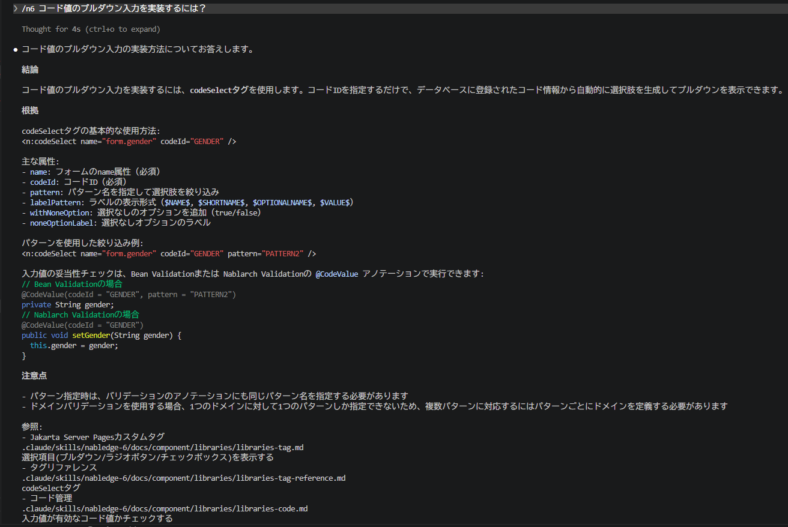
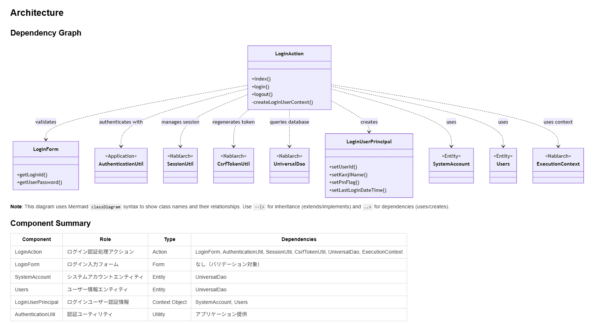
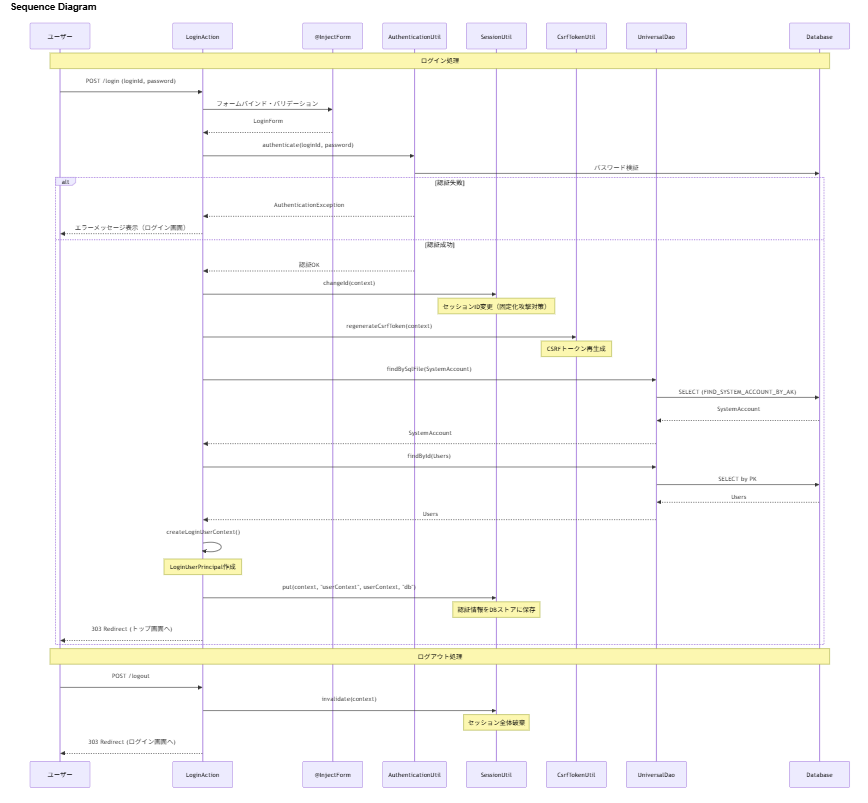

==========================================================================
Nablarch専用AIコーディングツール向けプラグイン
==========================================================================

.. contents:: 目次
  :depth: 2
  :local:

前提環境
==========================================================================

本プラグインの利用には、`Claude Code(外部サイト) <https://claude.ai/code>`_ または `GitHub Copilot(外部サイト) <https://github.com/features/copilot>`_ が必要である。

Nablarch専用AIコーディングツール向けプラグインとは
==========================================================================

Nablarch専用AIコーディングツール向けプラグインは、Nablarch公式解説書・システム開発ガイド・サンプルプロジェクトの知識を搭載したAIアシスタントである。
Claude Code または GitHub Copilot のプラグインとして動作し、Nablarch固有の仕様・作法を正確に回答する。

背景
--------------------------------------------

近年、生成AIが開発現場に急速に浸透し、開発者は日常的にAIを活用している。
しかし、Nablarchの情報はWEB上で複数の情報源に分散しており、横断的な理解が必要である。
そのため、生成AIはNablarch固有の仕様と作法を正確に回答できない。

よくある開発現場での困りごと
--------------------------------------------

Nablarch開発でこんな経験はないだろうか？

* 「あの設定、どの解説書に載ってたっけ？」
* 「このAPIの使い方、公式ドキュメントを何ページも行ったり来たり…」
* 「AIに聞いても、存在しないメソッドを提案されて余計に混乱する」
* 「メンバーへのNablarch説明に時間を取られて設計が進まない」

本プラグインで解決
--------------------------------------------

本プラグインを導入すると、Claude Code または GitHub Copilot Chat で ``/n6`` と入力して質問するだけで、Nablarchの仕様・作法を根拠付きでAIが即答する。

提供する機能
============================================

知識検索
--------------------------------------------

Nablarchのドキュメントに基づいて質問に回答する。

使用例： ::

  /n6 コード値のプルダウン入力を実装するには？

Nablarchのドキュメント全体から関連セクションを検索し、コード例・設定例を含めた回答を返す。

**回答例**

仕組み：

* Nablarch公式ドキュメントをAIが読めるJSON形式に変換
* キーワード全文検索＋AIによる関連度判定の2段階で精度を確保
* 全文検索でヒットしない場合は目次からAIがファイルを選択するフォールバック経路あり

コード分析
--------------------------------------------

プロジェクト内のアプリケーションコードをNablarchの観点から分析し、全体像をドキュメント化する。

使用例： ::

  /n6 code-analysis

以下の情報を可視化：

* クラス間の依存関係
* ハンドラキューの構成
* 処理フローをMermaid図で可視化

**出力例**

クラス依存関係図とコンポーネント概要:

処理フロー図（シーケンス図）:

上記のような図と合わせて、各コンポーネントの役割、Nablarchフレームワーク機能の使い方、実装ポイントなども含めた詳細なドキュメントが生成される。

主な活用シーン：新メンバーがプロジェクトに入ったときの素早い全体把握。

特徴
============================================

**ルールベース変換による知識ファイル作成**
  ルールベース変換により構造化された公式知識のみを使用する。
  公式情報源のみを使用することで、不確実な情報の混入を防止する。

**WEB検索ではなく、ルールベース変換でコンテキスト化した情報のみから回答**
  回答はNablarch公式ドキュメントのみを根拠とする。AIが勝手に外部情報を取得することはない。
  知識ファイルに含まれていない質問に対しては、「知識ファイルに含まれていません」と明示することで、不確実な推測は行わない。

**回答に必ずセクション単位の参照元を提示**
  すべての回答に参照元を明示することで、AIの回答が正確かどうかを即座に確認可能である。

  **参照元の提示構成**
    * 1行目: ページタイトル（例: HTTPエラー制御ハンドラ、など）
    * 2行目: ファイルパス（.md知識ファイル）
    * 3行目: 引用した各セクションのタイトル

対応バージョン
============================================

本プラグインは以下のNablarchバージョンに対応している。

.. list-table::
   :header-rows: 1
   :widths: 60, 40

   * - 対応バージョン
     - プラグイン
   * - Nablarch 6u3
     - `nabledge-6(外部サイト) <https://github.com/nablarch/nabledge/blob/main/plugins/nabledge-6/README.md>`_
   * - Nablarch 5u26
     - `nabledge-5(外部サイト) <https://github.com/nablarch/nabledge/blob/main/plugins/nabledge-5/README.md>`_
   * - Nablarch 1.4.11
     - `nabledge-1.4(外部サイト) <https://github.com/nablarch/nabledge/blob/main/plugins/nabledge-1.4/README.md>`_
   * - Nablarch 1.3.7
     - `nabledge-1.3(外部サイト) <https://github.com/nablarch/nabledge/blob/main/plugins/nabledge-1.3/README.md>`_
   * - Nablarch 1.2.8
     - `nabledge-1.2(外部サイト) <https://github.com/nablarch/nabledge/blob/main/plugins/nabledge-1.2/README.md>`_

インストール方法
============================================

本プラグインは GitHub 上で OSS として無償公開している。

ターミナルでコマンド1つ実行することで簡単にインストールできる。
上記の対応バージョン表の「プラグイン」列のリンクから、ご利用のNablarchバージョンの手順を確認すること。

セットアップ手順
--------------------------------------------

**Nablarch v6 の場合**

以下のコマンドをターミナルで実行する::

   curl -fsSL https://raw.githubusercontent.com/nablarch/nabledge/main/setup-cc.sh | bash

または::

   curl -fsSL https://raw.githubusercontent.com/nablarch/nabledge/main/setup-ghc.sh | bash

これで ``/n6`` コマンドが利用可能になる。

**他のバージョンの場合**

上記の対応バージョン表の「プラグイン」列から、該当するバージョンのリンクをクリックし、セットアップ手順を確認すること。

