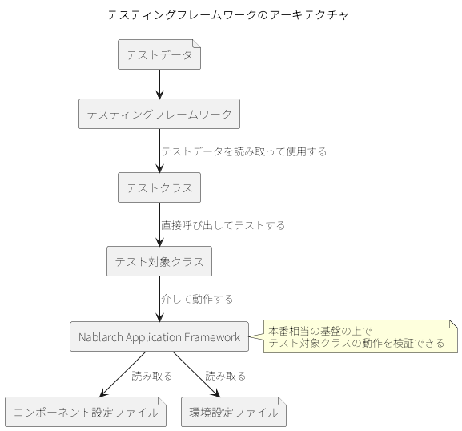
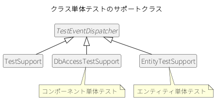
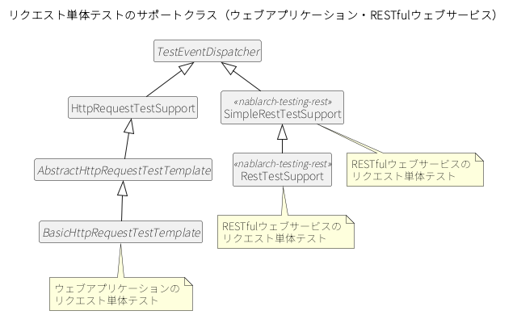
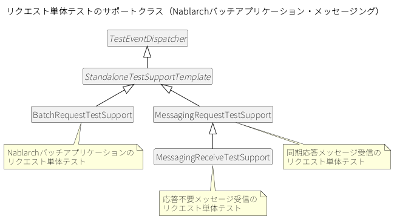

.. _testing_framework_about:

テスティングフレームワークとは
==================================================

.. contents:: 目次
  :depth: 3
  :local:

.. _testing_framework_about-overview:

全体像
--------------------------------------------------
テスティングフレームワークは、JUnitをベースに、クラス単体テスト・リクエスト単体テスト・取引単体テストという3種類の粒度でNablarchアプリケーションのテストを行えるフレームワークである。クラス単体テストはクラス単位、リクエスト単体テストは1リクエスト単位、取引単体テストは複数リクエストにまたがる業務単位でテストを行う。トランザクション制御やシステム日時の設定など、Nablarchアプリケーションに特化したAPIも提供する。

テスティングフレームワークには、次の特徴がある。

本番同等の経路でテストできる
~~~~~~~~~~~~~~~~~~~~~~~~~~~~~~~~~~~~~~~~~~~~~~~~~
リクエスト単体テストは、Nablarch Application Frameworkのハンドラキューを通して実行されるため、環境差分を除き本番と同じ経路でテストできる。単体テストの段階から本番相当の経路で検証できるため、結合テストや本番運用まで待たずに、経路に起因する問題を早期に見つけられる。

テストコードは定型かつ少量で済む
~~~~~~~~~~~~~~~~~~~~~~~~~~~~~~~~~~~~~~~~~~~~~~~~~
テストデータのセットアップや期待値とのアサートなどのテストロジックはテスティングフレームワークが提供するため、利用者はデータベースへの準備データや期待するテスト結果といったテストデータを、テストコードとは別のファイルに宣言的に記述するだけでよい。テストコードはテスト対象を呼び出す定型的な記述にとどまるため、テストを追加しても実装量が増えにくい。Nablarchが対象とする基幹システムはテーブル数や項目数が多く、テストデータのパターンも多数に上りやすいため、テストデータをテストコードから切り離せることが、大量のテストを効率的に用意・保守するうえで欠かせない。

利用目的に応じたテストデータ形式を選べる
~~~~~~~~~~~~~~~~~~~~~~~~~~~~~~~~~~~~~~~~~~~~~~~~~
テストデータは、人が編集しやすいExcel形式と、AIエージェントが扱いやすいテキストのYAML形式のいずれかで記述でき、両形式は相互に変換できる。開発者がレビュー・編集する場面と、AIエージェントが自動生成・解析する場面のどちらにも、同じテストデータ資産を無駄なく使い分けられる。両形式の記法は :ref:`テストデータの書き方 <testdata_notation>` で、形式の相互変換は :ref:`テストデータ変換ツール <testdata_converter>` で、それぞれ説明する。

使い慣れたJUnitの書き方をそのまま活かせる
~~~~~~~~~~~~~~~~~~~~~~~~~~~~~~~~~~~~~~~~~~~~~~~~~
テスティングフレームワークはJUnitの上で動作し、アノテーション・assertメソッド・Matcherクラスなど、JUnitが備える機能をそのまま利用できる。新たに専用の記法を覚える必要がなく、学習コストを抑えて導入できる。

テストメソッドは、JUnitのアノテーションを使って作成する。テスト対象の処理を記述したメソッドに、\ ``@Test`` アノテーションを付与する。

.. code-block:: java

  import org.junit.jupiter.api.Test;

  class SampleTest {

      @Test
      void testSomething() {
          // テスト処理
      }
  }

.. tip::

  ``@BeforeEach`` や ``@AfterEach`` などのアノテーションも使用できる。これらを使うと、テストメソッドの前後で、リソースの取得・解放などの共通処理を行える。

.. _testing_framework_about-test_types:

テストの種類
--------------------------------------------------
クラス単体テスト・リクエスト単体テスト・取引単体テストは、それぞれテスト範囲と実行方法が異なる。違いは以下のとおり。

* **クラス単体テスト**\ 。クラス単体（エンティティ、コンポーネント）をテストする。JUnitで自動実行する
* **リクエスト単体テスト**\ 。1リクエストを、ハンドラキューを通してテストする。本番に近い構成でテストできる。JUnitで自動実行する
* **取引単体テスト**\ 。複数リクエストにまたがる業務の流れをテストする。実行方法は処理方式によって異なり、手動操作またはJUnitで自動実行する。手動操作の場合は、アプリケーションサーバへのデプロイが必要で、エビデンスは画面ハードコピー・DBダンプとなる

取引単体テストの実行方法は、対象とする処理方式によって次のように異なる。

* ウェブアプリケーションの場合、テスト対象をアプリケーションサーバにデプロイし、手動で操作して取引単体テストを行う
* HTTPメッセージ送信または同期応答メッセージ送信を伴うウェブアプリケーションの場合、ウェブアプリケーションと同じく手動で操作して行う。テスティングフレームワークが提供するモックアップクラスが、外部システムの代わりに応答電文を返す
* RESTfulウェブサービス、Nablarchバッチアプリケーション、MOMによるメッセージングのメッセージ受信、テーブルをキューとして使ったメッセージングの場合、リクエスト単体テストを連続実行することにより、取引単体テストをJUnitで自動実行できる

.. _testing_framework_about-test_type_names:

3種類のテストのうち、リクエスト単体テストは、対象とする処理方式によって、次の6つに分かれる。

* :ref:`リクエスト単体テスト（ウェブアプリケーション） <request_unit_test_web>`\ 。HTTPリクエスト1件単位のテスト（シンクライアント型）。Ajax等のリッチクライアントは未対応
* :ref:`リクエスト単体テスト（RESTfulウェブサービス） <request_unit_test_rest>`\ 。REST APIの1リクエスト単位のテスト
* :ref:`リクエスト単体テスト（HTTPメッセージング） <request_unit_test_http_messaging>`\ 。HTTPによる電文の送信から応答受信までを1リクエスト単位で行うテスト
* :ref:`リクエスト単体テスト（Nablarchバッチアプリケーション） <request_unit_test_batch>`\ 。バッチの1起動単位のテスト
* :ref:`リクエスト単体テスト（MOMによるメッセージング） <request_unit_test_mom>`\ 。MOMによる要求電文の受信、または同期応答メッセージ送信を1リクエスト単位で行うテスト
* :ref:`リクエスト単体テスト（テーブルをキューとして使ったメッセージング） <request_unit_test_db_queue>`\ 。テーブル上の未処理レコードを対象に、Nablarchバッチアプリケーションと同じ方法で行うテスト

.. important::

  テスティングフレームワークは、 :ref:`Jakarta Batchに準拠したバッチアプリケーション <jsr352_batch>` を対象としていない。これらの基盤・ライブラリを使うアプリケーションでは、\ `JUnit(外部サイト、英語) <https://junit.org/junit5/>`_ を直接使うなど、テスティングフレームワーク以外の方法でテストする。

.. important::

  マルチスレッド機能を使うアプリケーションも、テスティングフレームワークの対象外である。結合テストなど、テスティングフレームワークとは別の方法でこれらのテストを行う。

.. _testing_framework_about-operating_environment:

対応するJUnitのバージョン
--------------------------------------------------
テスティングフレームワークは、JUnit 5で使用する。導入と設定は\ :ref:`JUnit 5での使用 <standard_usage>`\ を参照。既にJUnit 4で書いたテスト資産がある場合は\ :ref:`JUnit 4での使用 <junit4_support>`\ を参照。

.. _testing_framework_about-architecture:

アーキテクチャ
--------------------------------------------------
テストクラスは、テスティングフレームワークが提供するサポートクラスをインジェクションして使う。テストデータに記述した準備データの投入と、結果と期待値の照合はサポートクラスが行うため、テストクラスにはテストの手順だけを書く。テスト対象クラスの呼び出し方はテストの種類で異なる。クラス単体テストでは、テストクラスがテスト対象クラスを直接呼び出す。リクエスト単体テストでは、サポートクラスが\ Nablarch Application Framework\ にリクエストを送信し、ハンドラキューを通してテスト対象クラスが呼び出されるため、本番と同じ経路でテストできる。このとき\ Nablarch Application Framework\ が読み取るコンポーネント設定ファイルは、\ :ref:`テスト用のコンポーネント設定ファイルを用意する <testing_framework_introduction-test_component_config>`\ で用意する。

テスティングフレームワークが提供するサポートクラスの継承関係を、テストの種類ごとに次に示す。テストクラスは、サポートクラスのインスタンスをインジェクションされて使用する。

