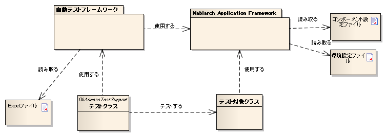

.. _testing_framework_about:

テスティングフレームワークとは
==================================================

.. _testing_framework_about-overview:

全体像
--------------------------------------------------
テスティングフレームワークは、JUnitをベースに、クラス単体テスト・リクエスト単体テスト・取引単体テストという3種類の粒度でNablarchアプリケーションのテストを行えるフレームワークである。クラス単体テストはクラス単位、リクエスト単体テストは1リクエスト単位、取引単体テストは複数リクエストにまたがる業務単位でテストを行う。トランザクション制御やシステム日時の設定など、Nablarchアプリケーションに特化したAPIも提供する。

テスティングフレームワークには、次の特徴がある。

本番同等の経路でテストできる
~~~~~~~~~~~~~~~~~~~~~~~~~~~~~~~~~~~~~~~~~~~~~~~~~
リクエスト単体テストは、Nablarch Application Frameworkのハンドラキューを通して実行されるため、環境差分を除き本番と同じ経路でテストできる。単体テストの段階から本番相当の経路で検証できるため、結合テストや本番運用まで待たずに、経路に起因する不具合を早期に見つけられる。

テストコードは定型かつ少量で済む
~~~~~~~~~~~~~~~~~~~~~~~~~~~~~~~~~~~~~~~~~~~~~~~~~
テストデータのセットアップや期待値とのアサートなどのテストロジックはテスティングフレームワークが提供するため、利用者はデータベースへの準備データや期待するテスト結果といったテストデータを、テストコードとは別のファイルに宣言的に記述するだけでよい。テストコードはテスト対象を呼び出す定型的な記述にとどまるため、テストケースを追加しても実装量が増えにくい。Nablarchが対象とする基幹システムはテーブル数や項目数が多く、テストデータのパターンも多数に上りやすいため、テストデータをテストコードから切り離せることが、大量のテストケースを効率的に用意・保守するうえで欠かせない。

利用目的に応じたテストデータ形式を選べる
~~~~~~~~~~~~~~~~~~~~~~~~~~~~~~~~~~~~~~~~~~~~~~~~~
テストデータは、人が編集しやすいExcel形式と、AIエージェントが扱いやすいテキストのYAML形式のいずれかで記述でき、両形式は相互に変換できる。開発者がレビュー・編集する場面と、AIエージェントが自動生成・解析する場面のどちらにも、同じテストデータ資産を無駄なく使い分けられる。両形式の記法は :ref:`テストデータの書き方 <testdata_notation>` で、形式の相互変換は :ref:`テストデータ変換ツール <testdata_converter>` で、それぞれ説明する。

使い慣れたJUnitの書き方をそのまま活かせる
~~~~~~~~~~~~~~~~~~~~~~~~~~~~~~~~~~~~~~~~~~~~~~~~~
テスティングフレームワークはJUnit 4を基盤としており、アノテーション・assertメソッド・Matcherクラスなど、JUnitが備える機能をそのまま利用できる。新たに専用の記法を覚える必要がなく、学習コストを抑えて導入できる。

テストメソッドは、JUnit 4のアノテーションを使って作成する。テスト対象の処理を記述したメソッドに、``@Test`` アノテーションを付与する。

.. code-block:: java

  public class SampleTest {

      @Test
      public void testSomething() {
          // テスト処理
      }
  }

.. tip::

  ``@Before`` や ``@After`` などのアノテーションも使用できる。これらを使うと、テストメソッドの前後で、リソースの取得・解放などの共通処理を行える。

.. _testing_framework_about-test_types:

テストの種類
--------------------------------------------------
クラス単体テスト・リクエスト単体テスト・取引単体テストは、それぞれ実行方法とテスト範囲が異なる。違いは以下のとおり。

.. list-table::
  :header-rows: 1
  :widths: 20,20,30,30

  * - テストの種類
    - 実行方法
    - テスト範囲
    - 備考
  * - クラス単体テスト
    - JUnitで自動実行
    - クラス単体
    - エンティティ、コンポーネント
  * - リクエスト単体テスト
    - JUnitで自動実行
    - 1リクエスト（ハンドラキューを通す）
    - 本番に近い構成でテストできる
  * - 取引単体テスト
    - 手動操作
    - 複数リクエストにまたがる業務の流れ
    - APサーバへのデプロイが必要。エビデンスは画面ハードコピー・DBダンプ

.. important::

  取引単体テストは、自動実行ではなく手動操作によって行う。自動実行の対象となるのは、クラス単体テストとリクエスト単体テストである。

.. _testing_framework_about-test_type_names:

このうちリクエスト単体テストは、対象とする処理方式によって、次の6つに分かれる。

==================================================================  ========================================================================================
処理方式                                                            内容
==================================================================  ========================================================================================
リクエスト単体テスト（ウェブアプリケーション）                      HTTPリクエスト1件単位のテスト（シンクライアント型）。Ajax等のリッチクライアントは未対応
リクエスト単体テスト（RESTfulウェブサービス）                       REST APIの1リクエスト単位のテスト
リクエスト単体テスト（HTTPメッセージング）                          HTTPによる電文の送信から応答受信までを1リクエスト単位で行うテスト
リクエスト単体テスト（Nablarchバッチアプリケーション）              バッチの1起動単位のテスト
リクエスト単体テスト（MOMによるメッセージング）                     MOMによる要求電文の受信、または同期応答メッセージ送信を1リクエスト単位で行うテスト
リクエスト単体テスト（テーブルをキューとして使ったメッセージング）  テーブル上の未処理レコードを対象に、Nablarchバッチアプリケーションと同じ方法で行うテスト
==================================================================  ========================================================================================

.. important::

  テスティングフレームワークは、 :ref:`Jakarta Batchに準拠したバッチアプリケーション <jsr352_batch>` を対象としていない。これらの基盤・ライブラリを使うアプリケーションでは、`JUnit(外部サイト、英語) <https://junit.org/junit5/>`_ を直接使うなど、テスティングフレームワーク以外の方法でテストする。

.. important::

  マルチスレッド機能を使うアプリケーションも、テスティングフレームワークの対象外である。結合テストなど、テスティングフレームワークとは別の方法でこれらのテストを行う。

.. _testing_framework_about-architecture:

アーキテクチャ
--------------------------------------------------
テスティングフレームワークを継承したテストクラスは、テスト対象クラスを直接呼び出してテストする。テスト対象クラスは、本番と同じくNablarch Application Frameworkを介して動作するため、テストクラスから見ても本番相当の基盤の上でテスト対象クラスの動作を検証できる。テストクラスは、Excelファイルなどのテストデータをテスティングフレームワーク経由で読み取って使用する。構成物どうしの関係は、次の図のとおり。

.. _testing_framework_about-operating_environment:

稼動環境
--------------------------------------------------
テスティングフレームワークは、JUnit 4をベースに動作する。JUnit 5で使用する場合は、 :ref:`JUnit 5用拡張機能 <junit5_extension>` を参照。
