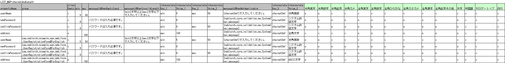

.. _entityUnitTestWithBeanValidation:

==========================================================
Bean Validationに対応したForm/Entityのクラス単体テスト
==========================================================
本項では、入力値チェックを :ref:`bean_validation` で実施しているFormおよびFormの一種であるEntityクラス単体テスト(以下Form単体テストまたはEntity単体テスト)について説明する。
両者はほぼ同じように単体テストを行えるため、共通する内容についてはForm単体テストをベースに説明し、特有の処理については個別に説明する。

.. tip::
   Entityとは、テーブルのカラムと1対1に対応するプロパティを持つFormのことである。

-----------------------------
Form/Entity単体テストの書き方
-----------------------------
本項で例として使用したテストクラスとテストデータは以下のとおり(右クリック->保存でダウンロード)。

* :download:`テストクラス(UserRegistrationFormTest.java)<./_download/UserRegistrationFormTest.java>`
* :download:`テストデータ(UserRegistrationFormTest.xlsx)<./_download/UserRegistrationFormTest.xlsx>`
* :download:`テスト対象クラス(UserRegistrationForm.java)<./_download/UserRegistrationForm.java>`  

テストデータの作成
==================
テストデータを記載したExcelファイルそのものの作成方法を説明する。テストデータを記載したExcelファイルは、テストソースコードと同じディレクトリに同じ名前で格納する(拡張子のみ異なる)。
なお、後述する :ref:`精査のテストケース<entityUnitTest_ValidationCase_BeanValidation>` のそれぞれが、1シートずつ使用する前提である。

テストデータの記述方法詳細については、 :doc:`../../06_TestFWGuide/01_Abstract` 、 :doc:`../../06_TestFWGuide/02_DbAccessTest` を参照。

なお、メッセージデータやコードマスタなどの、データベースに格納する静的マスタデータは、プロジェクトで管理されたデータがあらかじめ投入されている
(これらのデータを個別のテストデータとして作成しない)前提である。

テストクラスの作成
==================
Form/Entity単体テストのテストクラスは、以下の条件を満たすように作成する。

* テストクラスのパッケージは、テスト対象のForm/Entityと同じとする。
* <Form/Entityクラス名>Testというクラス名でテストクラスを作成する。
* nablarch.test.core.db.EntityTestSupportを継承する。

.. code-block:: java

   package com.nablarch.example.app.web.form; // 【説明】パッケージはUserRegistrationFormと同じ
   
   import nablarch.test.core.db.EntityTestSupport;
   import org.junit.Test;
   
   /**
    * {@link UserRegistrationForm}に対するテストを実行するクラス。
    * テスト内容はExcelシート参照のこと。
    *
    * @author Takayuki Uchida
    * @since 1.0
    */
   public class UserRegistrationFormTest extends EntityTestSupport {
   // 【説明】クラス名はUserRegistrationFormTestで、EntityTestSupportを継承する

   // 【説明】〜後略〜                

テストメソッドの記述方法は本項以降に記載されているコード例を参照。

.. _entityUnitTest_ValidationCase_BeanValidation:

文字種と文字列長の単項目精査テストケース
========================================

単項目精査に関するテストケースは、入力される文字種および文字列長に関するものがほとんどである。\
例えば、以下のようなプロパティがあるとする。

* プロパティ名「フリガナ」
* 最大文字列長は50文字
* 必須項目
* 全角カタカナのみを許容する

この場合、以下のようなテストケースを作成することになる。

 =============================================== =========================
 ケース                                           観点			 
 =============================================== =========================
 全角カタカナ50文字を入力し精査が成功する。        最大文字列長、文字種の確認	 
 全角カタカナ51文字を入力し精査が失敗する。        最大文字列長の確認		 
 全角カタカナ1文字を入力し精査が成功する。         最小文字列長、文字種の確認	 
 空文字を入力し、精査が失敗する。                  必須精査の確認		 
 半角カタカナを入力し精査が失敗する。              文字種の確認\ [#]_\		 
 =============================================== =========================

\ 
 
 .. [#] 同様に、半角英字、全角ひらがな、漢字...等が入力され精査が失敗するケースが必要である。

このように、単項目精査のテストケースは、ケース数が多くなりデータ作成の労力がかかる。\
そこで、単項目精査テスト専用のテスト方法を提供する。これにより以下の効果が見込まれる。

* 単項目精査のテストケース作成を容易になる。
* 保守性の高いテストデータが作成でき、レビューやメンテナンスが容易になる。

.. tip::
   本テスト方法は、プロパティとして別のFormを保持するFormに対しては使用できない。その場合、独自に精査処理のテストを実装すること。
   プロパティとして別のFormを保持するFormとは、以下の形式でプロパティにアクセスする親Formのこと。
   
   .. code-block:: none
   
      <親Form>.<子Form>.<子フォームのプロパティ名>

.. _entityUnitTest_CharsetAndLengthInputData_BeanValidation:

テストケース表の作成方法
------------------------

以下のカラムを用意する。

+-----------------------------+--------------------------------------------------+
| カラム名                    | 記載内容                                         |
+=============================+==================================================+
|propertyName                 |テスト対象のプロパティ名                          |
+-----------------------------+--------------------------------------------------+
|allowEmpty                   |そのプロパティが未入力を許容するか                |
+-----------------------------+--------------------------------------------------+
|group                        |Bean Validationのグループ（省略可）               |
+-----------------------------+--------------------------------------------------+
|min                          |そのプロパティが入力値として許容する最小文字列長（|
|                             |省略可）                                          |
+-----------------------------+--------------------------------------------------+
|max                          |そのプロパティが入力値として許容する最大文字列長（|
|                             |省略可）                                          |
+-----------------------------+--------------------------------------------------+
|messageIdWhenEmptyInput      |未入力時に期待するメッセージ（省略可）            |
+-----------------------------+--------------------------------------------------+
|messageIdWhenInvalidLength   |文字列長不適合時に期待するメッセージ（省略可）    |
+-----------------------------+--------------------------------------------------+
|messageIdWhenNotApplicable   |文字種不適合時に期待するメッセージ                |
+-----------------------------+--------------------------------------------------+
|interpolateKey\_\ *n*        |埋め込み文字のキー名（\ *n*\ は1からの連番、省略可|
|                             |）                                                |
+-----------------------------+--------------------------------------------------+
|interpolateValue\_\ *n*      |埋め込み文字の値（\ *n*\ は1からの連番、省略可）  |
+-----------------------------+--------------------------------------------------+
|半角英字                     |半角英字を許容するか                              |
+-----------------------------+--------------------------------------------------+
|半角数字                     |半角数字を許容するか                              |
+-----------------------------+--------------------------------------------------+
|半角記号                     |半角記号を許容するか                              |
+-----------------------------+--------------------------------------------------+
|半角カナ                     |半角カナを許容するか                              |
+-----------------------------+--------------------------------------------------+
|全角英字                     |全角英字を許容するか                              |
+-----------------------------+--------------------------------------------------+
|全角数字                     |全角数字を許容するか                              |
+-----------------------------+--------------------------------------------------+
|全角ひらがな                 |全角ひらがなを許容するか                          |
+-----------------------------+--------------------------------------------------+
|全角カタカナ                 |全角カタカナを許容するか                          |
+-----------------------------+--------------------------------------------------+
|全角漢字                     |全角漢字を許容するか                              |
+-----------------------------+--------------------------------------------------+
|全角記号その他               |全角記号その他を許容するか                        |
+-----------------------------+--------------------------------------------------+
|外字                         |外字を許容するか                                  |
+-----------------------------+--------------------------------------------------+

許容するかどうかを記入するカラムには、以下の値を設定する。

 ========== ======= ========================
 設定内容    設定値    備考
 ========== ======= ========================
 許容する     o      半角英小文字のオー
 許容しない   x      半角英小文字のエックス
 ========== ======= ========================

Bean Validationのグループには、グループに指定するクラスをFQCNで指定する。
内部クラスを指定する場合は、クラスを ``$`` で区切ること。

messageIdWhenEmptyInput、messageIdWhenInvalidLengthを省略した場合は、それぞれ :ref:`entityUnitTest_EntityTestConfiguration_BeanValidation` で
設定したデフォルト値が使用される。

メッセージの指定で、メッセージ内の ``{}`` で囲まれた部分は、 :ref:`message-format-spec` の埋め込み文字であると見なされる。
埋め込み文字がある場合は、interpolateKey\_\ *n* 及び interpolateValue\_\ *n* のカラムを追加し、
interpolateKey\_\ *n* には埋め込み文字のキー名を、 interpolateKey\_\ *n* には埋め込み文字の値を、それぞれ記載する。

メッセージ全体を ``{}`` で囲んだ場合は、メッセージIDと見なされ、 :ref:`message` で解決される。
 
具体例を以下に示す。

テストメソッドの作成方法
------------------------

 
スーパクラスの以下のメソッドを起動する。

.. code-block:: java

   void testValidateCharsetAndLength(Class entityClass, String sheetName, String id)

\ 

.. code-block:: java

   // 【説明】〜前略〜                
   public class UserRegistrationFormTest extends EntityTestSupport {
   
       /**
        * テスト対象Formクラス。
        */
       private static final Class<?> TARGET_CLASS = UserRegistrationForm.class;
   
       /**
        * 文字種および文字列長の単項目精査テストケース
        */
       @Test
       public void testCharsetAndLength() {
   
           // 【説明】テストデータを記載したシート名
           String sheetName = "testCharsetAndLength";
   
           // 【説明】テストデータのID
           String id = "charsetAndLength";
   
           // 【説明】テスト実行
           testValidateCharsetAndLength(TARGET_CLASS, sheetName, id);
       }
   
   // 【説明】〜後略〜                

このメソッドを実行すると、テストデータの各行毎に以下の観点でテストが実行される。

+---------------+-----------------------------+---------------------------------------------------+
| 観点          |入力値                       | 備考                                              |
+===============+=============================+===================================================+
| 文字種        |半角英字                     | max(最大文字列長)欄に記載した長さの文字列で構成さ |
+---------------+-----------------------------+ れる。                                            |
| 文字種        |半角数字                     | max欄が省略された場合は、min（最小文字列長）欄に  |
+---------------+-----------------------------+ 記載した長さの文字列で構成される。                |
| 文字種        |半角数字                     | max欄、min欄ともに省略された場合は、長さ1の文字列 |
+---------------+-----------------------------+ で構成される。                                    |
| 文字種        |半角記号                     |                                                   |
+---------------+-----------------------------+                                                   |
| 文字種        |半角カナ                     |                                                   |
+---------------+-----------------------------+                                                   |
| 文字種        |全角英字                     |                                                   |
+---------------+-----------------------------+                                                   |
| 文字種        |全角数字                     |                                                   |
+---------------+-----------------------------+                                                   |
| 文字種        |全角ひらがな                 |                                                   |
+---------------+-----------------------------+                                                   |
| 文字種        |全角カタカナ                 |                                                   |
+---------------+-----------------------------+                                                   |
| 文字種        |全角漢字                     |                                                   |
+---------------+-----------------------------+                                                   |
| 文字種        |全角記号その他               |                                                   |
+---------------+-----------------------------+                                                   |
| 文字種        |外字                         |                                                   |
+---------------+-----------------------------+---------------------------------------------------+
| 未入力        |空文字                       |長さ0の文字列                                      |
+---------------+-----------------------------+---------------------------------------------------+
| 最小文字列    |最小文字列長の文字列         |入力値は、o印を付けた文字種で構成される            |
+---------------+-----------------------------+max欄が省略された場合は、最長文字列・文字列長超過  |
| 最長文字列    |最長文字列長の文字列         |のテストは実行されない。                           |
+---------------+-----------------------------+                                                   |
| 文字列長不足  |最小文字列長－１の文字列     |                                                   |
+---------------+-----------------------------+                                                   |
| 文字列長超過  |最大文字列長＋１の文字列     |                                                   |
+---------------+-----------------------------+---------------------------------------------------+

その他の単項目精査のテストケース
================================

前述の、文字種と文字列長の単項目精査テストケースを使用すれば\
大部分の単項目精査がテストできるが、一部の精査についてはカバーできないものもある。
例えば、日付入力項目のフォーマット精査が挙げられる。

このような単項目精査のテストについても、簡易にテストできる仕組みを用意している。
各プロパティについて、１つの入力値と期待するメッセージIDのペアを記述することで、
任意の値で単項目精査のテストができる。

.. tip::
   本テスト方法は、プロパティとして別のFormを保持するFormに対しては使用できない。その場合は、独自に精査処理のテストを実装すること。
   プロパティとして別のFormを保持するFormとは、以下の形式でプロパティにアクセスする親Formのこと。
   
   .. code-block:: none
   
      <親Form>.<子Form>.<子フォームのプロパティ名>

テストケース表の作成方法
------------------------

以下のカラムを用意する。

+-------------------------------+--------------------------------------------------+
| カラム名                      | 記載内容                                         |
+===============================+==================================================+
|propertyName                   |テスト対象のプロパティ名                          |
+-------------------------------+--------------------------------------------------+
|case                           |テストケースの簡単な説明                          |
+-------------------------------+--------------------------------------------------+
|group                          |Bean Validationのグループ（省略可）               |
+-------------------------------+--------------------------------------------------+
|input1\ [#]_                   |入力値 [#]_                                       |
+-------------------------------+--------------------------------------------------+
|messageId\ [#]_                |上記入力値で単項目精査した場合に、発生すると期待す|
|                               |るメッセージ（精査エラーにならないことを期待する場|
|                               |合は空欄）                                        |
+-------------------------------+--------------------------------------------------+
|interpolateKey\_\ *n* \ [#]_   |埋め込み文字のキー名（\ *n*\ は1からの連番、省略可|
|                               |）                                                |
+-------------------------------+--------------------------------------------------+
|interpolateValue\_\ *n* \ [#]_ |埋め込み文字の値（\ *n*\ は1からの連番、省略可）  |
+-------------------------------+--------------------------------------------------+

.. [#] ひとつのキーに対して複数のパラメータを指定する場合は、input2, input3 というようにカラムを増やす。

\

.. [#]  :ref:`special_notation_in_cell` の記法を使用することで、効率的に入力値を作成できる。

\

.. [#]  メッセージの指定方法は、 :ref:`文字種と文字列長の単項目精査テストケースの作成方法<entityUnitTest_CharsetAndLengthInputData_BeanValidation>` に記載の方法と同じである。

\

.. [#] 埋め込み文字が複数存在する場合は、interpolateKey_1, interpolateKey_2のようにカラムを増やす。

\

.. [#] 埋め込み文字が複数存在する場合は、interpolateValue_1, interpolateValue_2のようにカラムを増やす。

       

具体例を以下に示す。

.. image:: ./_image/entityUnitTest_singleValidationDataExample_BeanValidation.png
      :scale: 70           

テストメソッドの作成方法
------------------------

 
スーパクラスの以下のメソッドを起動する。

.. code-block:: java

   void testSingleValidation(Class entityClass, String sheetName, String id)

.. code-block:: java

   // 【説明】〜前略〜
   public class UserRegistrationFormTest extends EntityTestSupport {
   
       /**
        * テスト対象Formクラス。
        */
       private static final Class<?> TARGET_CLASS = UserRegistrationForm.class;
   
       // 【説明】〜中略〜

       /**
        * 単項目精査のテストケース（上記以外）
        */
       @Test
       public void testSingleValidation() {
   
           // 【説明】テストデータを記載したシート名
           String sheetName = "testSingleValidation";
   
           // 【説明】テストデータのID
           String id = "singleValidation";
   
           // 【説明】テスト実行
           testSingleValidation(TARGET_CLASS, sheetName, id);
       }
   
       // 【説明】〜後略〜

Form全体の精査のテストケース
============================

上記までの単項目精査のテストでは、Formの1個のプロパティに対して、フィールドもしくはゲッターメソッドに付与されたアノテーションが正しいかテストされる。
しかし、 :java:extdoc:`@AssertTrue <javax.validation.constraints.AssertTrue>` や :java:extdoc:`@AssertFalse <javax.validation.constraints.AssertFalse>` を付与したプロパティ（メソッド）のような、
ゲッターメソッド内で複数のプロパティを参照しうるプロパティは、単項目精査でテストできない。

そのため、上記のようなプロパティが存在し、Form全体での整合性を検証する必要がある場合は、別途テストを作成する必要がある。

テストケース表の作成
--------------------

* IDは"testShots"固定とする。
* 以下のカラムを用意する。

 +-----------------------------------+--------------------------------------------------+
 | カラム名                          | 記載内容                                         |
 +===================================+==================================================+
 | title                             | テストケースのタイトル                           |
 +-----------------------------------+--------------------------------------------------+
 | description                       | テストケースの簡単な説明                         |
 +-----------------------------------+--------------------------------------------------+
 | group                             | Bean Validationのグループ（省略可）              |
 +-----------------------------------+--------------------------------------------------+
 | expectedMessageId\ *n* \ [#]_     | 期待するメッセージ（\ *n*\ は1からの連番 ）      |
 +-----------------------------------+--------------------------------------------------+
 | propertyName\ *n*                 | 期待するプロパティ（\ *n*\ は1からの連番 ）      |
 +-----------------------------------+--------------------------------------------------+
 | interpolateKey\ *n*\_\ *k*        | 埋め込み文字のキー名（\ *n*\ はexpectedMessageId |
 |                                   | の *n* に対応、\ *k*\ は1からの連番、省略可）    |
 +-----------------------------------+--------------------------------------------------+
 | interpolateValue\ *n*\_\ *k*      | 埋め込み文字の値（\ *n*\ はexpectedMessageId     |
 |                                   | の *n* に対応、\ *k*\ は1からの連番、省略可）    |
 +-----------------------------------+--------------------------------------------------+

 精査エラーが発生するプロパティ名と、そのプロパティの精査エラーメッセージを記載する。精査エラーが発生しないプロパティは記載しない。

 複数のメッセージを期待する場合、expectedMessageId2, propertyName2というように数値を増やして右側に追加していく。
 対応する埋め込み文字が存在する場合は、同様にinterpolateKey2_1, interpolateValue2_1, interpolateKey2_2, interpolateValue2_2のように
 数値を増やして右側に追加していく。

.. [#]  メッセージの指定方法は、 :ref:`文字種と文字列長の単項目精査テストケースの作成方法<entityUnitTest_CharsetAndLengthInputData_BeanValidation>` に記載の方法と同じである。

* 入力パラメータ表の作成

  * IDは"params"固定とする。
  * 上記のテストケース表に対応する、入力パラメータ\ [#]_ \を1行ずつ記載する。

\

    .. [#] :ref:`special_notation_in_cell` の記法を使用することで、効率的に入力値を作成できる。

\

    入力パラメータ表には、Form全体の整合性を検証するために必要なプロパティの値を記載する。

    具体例を以下に示す。
    下図では、"newPasswordとconfirmPasswordが等しいか否か"を ``boolean`` として返すプロパティに対する正常系のケースを作成している。

    .. image:: ./_image/entityUnitTest_validationTestData_BeanValidation.png
          :scale: 70

    ※Formの保有するプロパティ名のExcelへの記述手順は、 :ref:`property-name-copy-label` を参照。

.. tip::

   Form単体テストのテストケースやテストデータを作成する際、\
   **プロパティに保持している別のFormのプロパティ** を指定したいことがある。\
   この場合、次のように指定できる。
   
   * Formのコード例
   
   .. code-block:: java
   
     public class SampleForm {

         /** システムユーザ */
         private SystemUserEntity systemUser;

         /** 電話番号配列 */
         private UserTelEntity[] userTelArray;
     
         // 【説明】プロパティ以外は省略
     
     }

   * 保持しているFormのプロパティを指定する方法(SystemUserEntity.userIdを指定する場合)
   
   .. code-block:: none
   
      sampleForm.systemUser.userId

   * Form配列の要素のプロパティを指定する方法(UserTelEntity配列の先頭要素のプロパティを指定する場合)
   
   .. code-block:: none
   
      sampleForm.userTelArray[0].telNoArea

テストメソッドの作成方法
------------------------

これまでに作成したテストケース、データを使用するテストメソッドを以下に示す。\
下記コードの変数内容を変更するだけで、異なるFormの精査のテストに対応できる。

.. code-block:: java

   // 【説明】〜前略〜   
   public class UserRegistrationFormTest extends EntityTestSupport {

       /**
        * テスト対象Formクラス。
        */
       private static final Class<?> TARGET_CLASS = UserRegistrationForm.class;
   
       // 【説明】〜中略〜   

       /**
        * Form全体の精査のテストケース
        */
       @Test
       public void testWholeFormValidation() {
           // 【説明】テストデータを記載したシート名
           String sheetName = "testWholeFormValidation";
   
           // 【説明】テスト実行
           testBeanValidation(TARGET_CLASS, sheetName);
       }
   }

コンストラクタに対するテストケース
==================================

:ref:`entityUnitTest_ConstructorCase` を参照。

setter、getterに対するテストケース
==================================

:ref:`entityUnitTest_SetterGetterCase` を参照。

.. _entityUnitTest_EntityTestConfiguration_BeanValidation:

自動テストフレームワーク設定値
==============================

:ref:`精査のテストケース<entityUnitTest_ValidationCase_BeanValidation>`\ を実施する際に必要な初期値設定について説明する。

設定項目一覧
------------

``nablarch.test.core.entity.EntityTestConfiguration``\ クラスを使用し、\
以下の値をコンポーネント設定ファイルで設定する。

+-------------------------+--------------------------------------------------------------------------+
|     設定項目名          |説明                                                                      |
+=========================+==========================================================================+
|maxMessageId             |最大文字列長超過時のメッセージのデフォルト値                              |
+-------------------------+--------------------------------------------------------------------------+
|maxAndMinMessageId       |最長最小文字列長範囲外のメッセージのデフォルト値(可変長、超過時)          |
+-------------------------+--------------------------------------------------------------------------+
|underLimitMessageId      |最長最小文字列長範囲外のメッセージのデフォルト値(可変長、不足時)          |
+-------------------------+--------------------------------------------------------------------------+
|fixLengthMessageId       |最長最小文字列長範囲外のメッセージのデフォルト値(固定長)                  |
+-------------------------+--------------------------------------------------------------------------+
|minMessageId             |文字列長不足時のメッセージのデフォルト値 \ [#]_\                          |
+-------------------------+--------------------------------------------------------------------------+
|emptyInputMessageId      |未入力時のメッセージのデフォルト値                                        |
+-------------------------+--------------------------------------------------------------------------+
|characterGenerator       |文字列生成クラス \ [#]_\                                                  |
+-------------------------+--------------------------------------------------------------------------+
|validationTestStrategy   |テスト用バリデーションストラテジ \ [#]_\                                  |
+-------------------------+--------------------------------------------------------------------------+

\

.. [#]
 :ref:`entityUnitTest_ValidationCase_BeanValidation` で、maxを省略したテストケースを作成する場合は指定必須。
   
.. [#]
 ``nablarch.test.core.util.generator.CharacterGenerator``\ の実装クラスを指定する。
 このクラスがテスト用の入力値を生成する。
 通常は、\ ``nablarch.test.core.util.generator.BasicJapaneseCharacterGenerator``\ を使用すれば良い。

.. [#]
 Bean Validationを使用する場合は、 ``nablarch.test.core.entity.BeanValidationTestStrategy``\ を固定で指定する。

コンポーネント設定ファイルの記述例
------------------------------------

テスト用コンポーネント設定ファイル記述例を示す。

.. code-block:: xml
 
  <!-- エンティティテスト設定 -->
  <component name="entityTestConfiguration" class="nablarch.test.core.entity.EntityTestConfiguration">
    <property name="maxMessageId"        value="{nablarch.core.validation.ee.Length.max.message}"/>
    <property name="maxAndMinMessageId"  value="{nablarch.core.validation.ee.Length.min.max.message}"/>
    <property name="fixLengthMessageId"  value="{nablarch.core.validation.ee.Length.fixed.message}"/>
    <property name="underLimitMessageId" value="{nablarch.core.validation.ee.Length.min.max.message}"/>
    <property name="maxMessageId"        value="{nablarch.core.validation.ee.Length.min.message}"/>
    <property name="emptyInputMessageId" value="{nablarch.core.validation.ee.Required.message}"/>
    <property name="characterGenerator">
      <component name="characterGenerator"
                 class="nablarch.test.core.util.generator.BasicJapaneseCharacterGenerator"/>
    </property>
    <property name="validationTestStrategy">
      <component class="nablarch.test.core.entity.BeanValidationTestStrategy"/>
    </property>
  </component>
