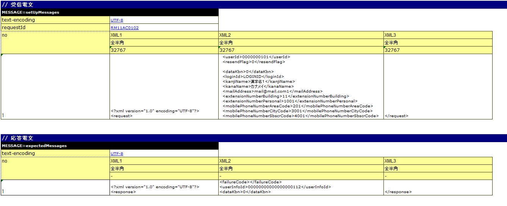

====================================================================
リクエスト単体テストの実施方法（HTTP同期応答メッセージ受信処理）
====================================================================

リクエスト単体テストの実施方法は、\ :ref:`real_request_test`\ を参照すること。

本項では、\ :ref:`real_request_test`\ と記述方法が異なる箇所の解説を行う。

--------------------
テストデータの書き方
--------------------

テストショット一覧
==================

LIST_MAPのデータタイプで１テストメソッド分のテストショット表を記載する。IDは、\ **testShots**\ とする。

HTTP同期応答メッセージ受信処理特有の内容について以下に示す。

================== ============================================================================================== =======
カラム名           説明                                                                                           必須   
================== ============================================================================================== =======
diConfig           HTTP同期応答メッセージ受信リクエスト単体テスト用のコンポーネント設定ファイルへのパスを記載する 必須   
                   |br|
                   (例：http-messaging-test-component-configuration.xml)。                                               

expectedStatusCode JSON及びXMLデータ形式使用時は空欄にする。                                                      必須   
                                                                                                                         
requestPath        アクションを実行するためのURLから、ホスト名を抜いた部分。                                      必須   
                   |br|
                   例えばアクション実行のURLが「http://127.0.0.1/msgaction/ss11AC/RM11AC0102」であれば、
                   |br|
                   「/msgaction/ss11AC/RM11AC0102」となる。                                                              

userId             認証認可チェックに使用するユーザID                                                                     必須   
================== ============================================================================================== =======

.. tip::
 JSON及びXMLデータ形式使用時は、ステータスコードの比較も、Excelファイルのメッセージボディとの比較で行う。フレームワーク制御ヘッダもメッセージボディに含まれるためである。
 

各種準備データ
==============

テスト実施に際して必要となる各種準備データの記述方法を説明する。
バッチでは、データベース、リクエストメッセージの準備を行う。

リクエストメッセージ
--------------------

テストの入力データとなる要求電文を記載する。以下に例を示す。

-----

 MESSAGE=setUpMessages

 // 共通情報（ディレクティブ、フレームワーク制御ヘッダ）

 +------------------+--------------+------------+
 | text-encoding    | Windows-31J  |            |
 +------------------+--------------+------------+
 | requestId        | RM11AC0102   |            |
 +------------------+--------------+------------+

 // メッセージボディ

【XML】

 +------------------+--------------------------------------------+---------------------------------+------------+
 | no               | XML1                                       | XML2                            | XML3       |
 +------------------+--------------------------------------------+---------------------------------+------------+
 |                  | 全半角                                     | 全半角                          | 全半角     |
 +------------------+--------------------------------------------+---------------------------------+------------+
 |                  | 32767                                      | 32767                           | 32767      |
 +==================+============================================+=================================+============+
 | 1                |<?xml version="1.0" encoding="UTF-8"?> |br| |<userId>0000000101</userId> |br| | </request> |
 |                  |<request>                                   |<resendFlag>0</resendFlag> |br|  |            |
 |                  |                                            |<dataKbn>0</dataKbn>             |            |
 +------------------+--------------------------------------------+---------------------------------+------------+

【JSON】

 +------------------+-----------------------------------------+
 | no               | JSON                                    |
 +------------------+-----------------------------------------+
 |                  | 全半角                                  |
 +------------------+-----------------------------------------+
 |                  | 32767                                   |
 +==================+=========================================+
 | 1                | {                                       |
 |                  |                                         |
 |                  |      "userId" : "0000000101", |br|      |
 |                  |      "resendFlag" : "0", |br|           |
 |                  |      "dataKbn" : "0", |br|              |
 |                  |                                         |
 |                  | }                                       |
 |                  |                                         |
 +------------------+-----------------------------------------+

------

1. 先頭行

 テスト対象リクエストに対する要求電文を準備する。名前は、\ ``MESSAGE=setUpMessages``\ 固定とする。

2. 共通情報

 名前の次行以降には以下の情報を記載する。これらの値は、リクエストメッセージの全メッセージで共通の値となる。

 * ディレクティブ
 * フレームワーク制御ヘッダ

 書式は、key-value形式である。

  +----+----+
  |キー|値  |
  +----+----+

.. important::

  フレームワーク制御ヘッダの項目をPJで変更している場合、
  以下のようにコンフィグファイルに ``reader.fwHeaderfields`` というキーでフレームワーク制御ヘッダ名を指定する必要がある。

  .. code-block:: properties

    # フレームワーク制御ヘッダ名をカンマ区切りで指定する。
    reader.fwHeaderfields=requestId,addHeader

3. メッセージボディ

フレームワーク制御ヘッダ以降のメッセージを記載する。

 +------------+---------------+----------------------------------------+
 |行          |記述内容       |備考                                    |
 +============+===============+========================================+
 |1行目       |フィールド名称 |先頭セルは"no"とする。                  |
 +------------+---------------+----------------------------------------+
 |2行目       |データタイプ   |先頭セルは空白                          |
 +------------+---------------+----------------------------------------+
 |3行目       |フィールド長   |先頭セルは空白                          |
 +------------+---------------+----------------------------------------+
 |4行目以降   |XMLデータ |br| |先頭セルは1からの通番 |br|              |
 |            |および |br|    |フィールドを跨いで記載することも可能    |
 |            |JSONデータ     |                                        |
 +------------+---------------+----------------------------------------+

.. tip::
 JSON及びXMLデータ形式使用時は、1Excelシートに1テストケースのみ記述すること。
 
 これはメッセージボディについて、Excelの各行の文字列長が同一であることを期待しているというNTFの制約によるものである。JSON及びXMLデータ形式は、要求電文の長さがリクエスト毎に異なるのが一般的なので、事実上1テストケースしか記述できない。

.. important::
 フィールド名称に\ **重複した名称は許容されない**\ 。
 例えば、「氏名」というフィールドが2つ以上存在してはならない。
 （通常、このような場合は「本会員氏名」と「家族会員氏名」のようにユニークなフィールド名称が付与される）
 
各種期待値
==========

レスポンスメッセージ
--------------------

\ `リクエストメッセージ`_\ と同じ。

ただし、名前が\ ``MESSAGE=expectedMessages``\ となる。

応答電文のフィールド長は"-"(ハイフン)を設定する。

.. |br| raw:: html

   
