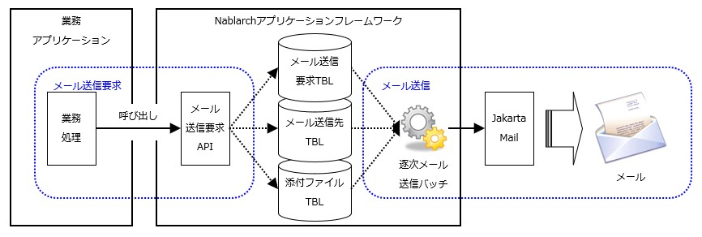

ma.. _`mail_request_test`:

==========================================
リクエスト単体テストの実施方法(メール送信)
==========================================

メール送信処理の構造とテスト範囲
============================================

本フレームワークを使用した\ :ref:`メール送信 <mail>`\ では、
業務アプリケーションは本フレームワークが提供するメール送信要求APIを呼び出すだけである。

よってリクエスト単体テストの範囲は、\
メール送信要求が正常に受け付けられデータベースに格納されることを確認するところまでとなる。

メール送信処理の処理概要と業務アプリケーションのテスト範囲を、下図に示す。

テストの実施方法
================

上述の通り、メール送信に関してリクエスト単体テストで確認すべきことは、\
メール送信要求が :ref:`各テーブル（メール送信要求テーブル、メール送信先テーブル、メール添付ファイルテーブル）<mail>` に
正しく格納されることである。

そのため、他の単体テストの実施方法と同様に、期待する上記3テーブルの状態をExcelシートに記述すればよい。
