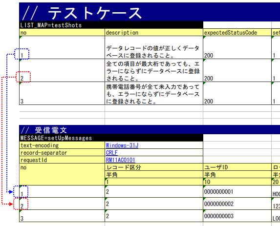

.. _`real_request_test`:

============================================================
リクエスト単体テストの実施方法(同期応答メッセージ受信処理)
============================================================

--------------------
テストクラスの書き方
--------------------

テストクラスは以下の条件を満たすように作成する。

* テストクラスのパッケージは、テスト対象のActionクラスと同じとする。
* <Actionクラス名>RequestTestというクラス名でテストクラスを作成する。
* \ ``nablarch.test.core.http.MessagingRequestTestSupport``\ を継承する。

例えば、テスト対象のActionクラスが、\ ``nablarch.sample.ss21AA.RM21AA001Action``\ だとすると、\
テストクラスは以下のようになる。

.. code-block:: java

  package nablarch.sample.ss21AA;
  
  // ～中略～

  public class RM21AA001ActionRequestTest extends MessagingRequestTestSupport {

------------------
テストメソッド分割
------------------

１テストクラスにつき１テストメソッド、１テストシートを原則とする。

ケースが複雑であったりデータ量が多い場合は、メソッドやシートを分割しても良い。

--------------------
テストデータの書き方
--------------------

テストデータを記載したExcelファイルは、クラス単体テストと同様に\
テストソースコードと同じディレクトリに同じ名前で格納する（拡張子のみ異なる）。

テストデータの記述方法詳細については、「\ :ref:`how_to_write_excel`\ 」を参照。

テストクラスで共通のデータベース初期値
======================================

ウェブアプリケーションの場合と同様である。「\ :ref:`request_test_setup_db`\ 」を参照。

テストショット一覧
==================

LIST_MAPのデータタイプで１テストメソッド分のテストショット表を記載する。IDは、\ **testShots**\ とする。

..    .. image:: ./_image/new_testCases.png
..    :scale: 80

１ケース毎に以下の要素を持たせる。

================== ========================================================================================== =====
カラム名           説明                                                                                       必須 
================== ========================================================================================== =====
no                 テストケース番号を1からの連番で記載する。                                                  必須
description        そのテストケースの説明を記載する。                                                         必須       
expectedStatusCode 期待するステータスコード                                                                   必須 
setUpTable         各テストケース実行前にデータベースに登録する場合は、同じシート内に記載したデータの\ 
                   :ref:`グループID<tips_groupId>`\ を記載する\ [1]_\ 。データの投入は自動テストフレーム
                   ワークにより行われる。                                                         
expectedTable      データベースの内容を比較する場合、期待するテーブルの\ :ref:`グループID<tips_groupId>`\ 
                   を記載する\ [1]_\ 。                                                                 
expectedLog        期待するログメッセージのIDを記載する。そのログメッセージが実際に出力されたかどうか、
                   自動テストフレームワークにて検証される。                                            
diConfig           常駐プロセスを実行する際のコンポーネント設定ファイルへのパスを記載する        。           必須
                   (\ :ref:`コマンドライン引数 <main-run_application>`\ を参照)\ [2]_\                       
requestPath        常駐プロセスを実行する際のリクエストパスを記載する。                                       必須
                   (\ :ref:`コマンドライン引数 <main-run_application>`\ を参照)\ [2]_\                                       
userId             常駐プロセス実行ユーザIDを記載する。                                                       必須
                   (\ :ref:`コマンドライン引数 <main-run_application>`\ を参照)\ [2]_\
================== ========================================================================================== =====                                                                                                                 

\

.. [1]
 デフォルトのグループIDを使用したい（グループIDを使わない）場合は、\ `default`\ と記載する。
 デフォルトのグループIDと個別のグループを併用することも可能である。
 両方のデータが混在した場合、デフォルトのグループIDのデータとグループID指定のデータ両方が有効になる。

.. [2]
 ここで言う「常駐プロセス」とは、メッセージ送受信を行うプロセスのことである。

各種準備データ
==============

テスト実施に際して必要となる各種準備データの記述方法を説明する。
バッチでは、データベース、リクエストメッセージの準備を行う。

データベースの準備
------------------

:ref:`オンライン<request_test_testcases>`\ と同様に、グループIDで対応付けを行う。

.. image:: ./_image/msg_shot_to_db.png

`テストショット一覧`_\ にて、setUpTableの欄がない場合、または空欄の場合、データベース準備は行われない。

リクエストメッセージ
--------------------

テストの入力データとなる要求電文を記載する。以下に例を示す。

-----

 MESSAGE=setUpMessages

 // 共通情報（ディレクティブ、フレームワーク制御ヘッダ）

 +------------------+--------------+------------+
 | text-encoding    | Windows-31J  |            |
 +------------------+--------------+------------+
 | record-separator | CRLF         |            |
 +------------------+--------------+------------+
 | requestId        | RM11AC0101   |            |
 +------------------+--------------+------------+

 // メッセージボディ

 +------------------+--------------+------------+
 | no               | レコード区分 |   ユーザID |
 +------------------+--------------+------------+
 |                  | 半角         |       半角 |
 +------------------+--------------+------------+
 |                  | 1            |         10 |
 +==================+==============+============+
 | 1                | 7            | 0000000001 |
 +------------------+--------------+------------+
 | 2                | 2            | 0000000001 |
 +------------------+--------------+------------+

------

1. 先頭行

 テスト対象リクエストに対する要求電文を準備する。名前は、\ ``MESSAGE=setUpMessages``\ 固定とする。

2. 共通情報

 名前の次行以降には以下の情報を記載する。これらの値は、リクエストメッセージの全メッセージで共通の値となる。

 * ディレクティブ
 * フレームワーク制御ヘッダ

 書式は、key-value形式である。

  +----+----+
  |キー|値  |
  +----+----+

.. important::

  フレームワーク制御ヘッダの項目をPJで変更している場合、
  以下のようにコンフィグファイルに ``reader.fwHeaderfields`` というキーでフレームワーク制御ヘッダ名を指定する必要がある。

  .. code-block:: properties

    # フレームワーク制御ヘッダ名をカンマ区切りで指定する。
    reader.fwHeaderfields=requestId,addHeader

3. メッセージボディ

フレームワーク制御ヘッダ以降のメッセージを記載する。
1行目～3行目は、外部インターフェース設計書の記載内容と同じであり、
設計書から行列を入れ替えてコピーすると効率良く作成できる。

 +------------+---------------+--------------------------+
 |行          |記述内容       |備考                      |
 +============+===============+==========================+
 |1行目       |フィールド名称 |先頭セルは"no"とする。    |
 +------------+---------------+--------------------------+
 |2行目       |データタイプ   |先頭セルは空白            |
 +------------+---------------+--------------------------+
 |3行目       |フィールド長   |先頭セルは空白            |
 +------------+---------------+--------------------------+
 |4行目以降   |データ         |先頭セルは1からの通番     |
 +------------+---------------+--------------------------+

.. important::
 フィールド名称に\ **重複した名称は許容されない**\ 。
 例えば、「氏名」というフィールドが2つ以上存在してはならない。
 （通常、このような場合は「本会員氏名」と「家族会員氏名」のようにユニークなフィールド名称が付与される）

 

本表は、\ `テストショット一覧`_\ のnoと対応関係にある。\
すなわち、テストショットno1で使用される要求電文は、本表の1行目（no 1）のデータとなる。

各種期待値
==========

検索結果、データベースを期待値と比較する場合は、
それぞれのデータとテストケース一覧とをIDで紐付けする。

レスポンスメッセージ
--------------------

\ `リクエストメッセージ`_\ と同じ。

ただし、名前が\ ``MESSAGE=expectedMessages``\ となる。

また、テストデータのディレクティブに設定されたfile-typeの値により、以下のように応答電文のアサート方法が変化する。

 +------------------------+---------------------------------------------------------------------+
 | file-typeの値          | アサート方法                                                        |
 +========================+=====================================================================+
 | Fixed または 指定なし  | テストデータに記載された項目単位に電文を分割し、アサートを行う。    |
 +------------------------+---------------------------------------------------------------------+
 | その他の値             | 電文全体を文字列として扱い、アサートを行う。                        |
 +------------------------+---------------------------------------------------------------------+

フォーマット定義ファイルではなく、テストデータにfile-typeを設定する必要があるので、注意すること。

なお、項目単位にアサートを行うfile-typeの値は以下の値を環境設定ファイルに定義することにより変更可能である。

  .. code-block:: text
  
    messaging.assertAsMapFileType=<カンマ区切りのfile-typeリスト>

.. tip::
 | XMLやJSONでは電文ごとに電文長が異なるため、テストデータの内容に応じて自動計算される。
 | テストデータの電文長に合わせて実電文を読み込むため、実電文とテストデータの電文長が異なると正常に読み込めない場合がある。
 | そのためXMLやJSONを使用する場合は必ずfile-typeを設定し、電文全体を文字列としてアサートを行う必要がある。

期待するデータベースの状態
--------------------------

`データベースの準備`_ と同様に、期待するデータベースの状態をテストケース一覧とリンクさせる。

----------------------
テストメソッドの書き方
----------------------

スーパクラスについて
====================

``MessagingRequestTestSupport``\ クラスを継承する。
このクラスでは、準備したテストデータを元に以下の手順でリクエスト単体テストを実行する。

テストメソッド作成
==================

準備したテストシートに対応するメソッドを作成する。

.. code-block:: java
    
    @Test
    public void testRegisterUser() {
    }

スーパクラスのメソッド呼び出し
==============================

テストメソッド内で、スーパクラスの以下のいずれかのメソッドを呼び出す。

* void execute()
* void execute(String sheetName)

引数ありのexecuteメソッドでは、テストデータのシート名を指定できる。
引数なしのexecuteメソッドを使用すると、引数ありのexecuteメソッドに
テストデータのシート名にテストメソッド名を指定した場合と同じ動作となる。

通常、テストシート名とテストメソッド名は同一であるので、
引数なしのexecuteメソッドを使用するとよい。

.. code-block:: java
    
    @Test
    public void testRegisterUser() {
        execute();   // 【説明】execute("testRegisterUser") と等価
    }

--------------
テスト起動方法
--------------

クラス単体テストと同様。通常のJUnitテストと同じように実行する。

--------------
テスト結果検証
--------------

自動テストフレームワーク側で以下の結果検証が行われる。

* レスポンスメッセージの結果検証（必須）
* データベースの結果検証
* ログの結果検証

データベースとログの結果検証は、\ `テストショット一覧`_\ に期待値の記載が無い場合（空欄であれば）、
スキップされる。

