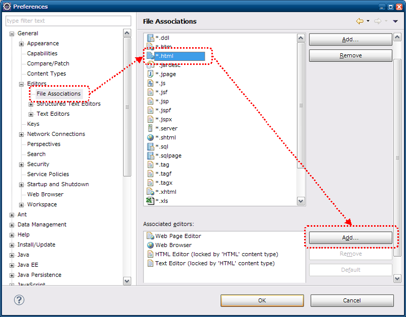
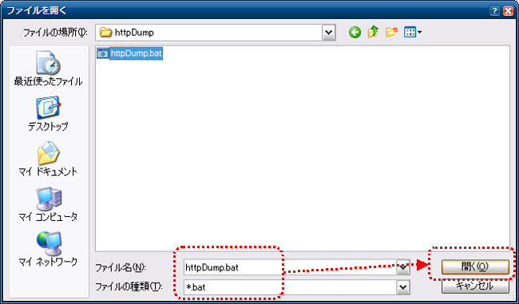
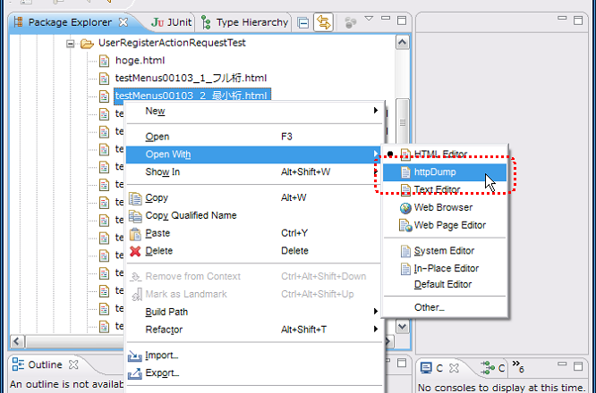

=================================================
リクエスト単体データ作成ツール インストールガイド
=================================================

:doc:`index`\ のインストール方法について説明する。

.. _http_dump_tool_prerequisite:

前提事項
========

本ツールを使用する際、以下の前提事項を満たす必要がある。

* javaコマンドがパスに含まれていること
* htmlファイルがブラウザに関連付けされていること
* ブラウザのプロキシ設定で、localhostが除外されていること

提供方法
==================

本ツールは、Nablarchのサンプルアプリケーションに同梱して提供する。
本ツールのツール構成を下記に示す。

 ========================================== ====================================================================================
 ファイル名                                 説明
 ========================================== ====================================================================================
 httpDump.bat                               | 起動バッチファイル（Windows用）
 nablarch-tfw-X.X.jar                       | Nablarch Testing Framework のJARファイル（X.Xの部分はバージョン番号）
 poi-X.X.jar                                | Apache POI のJARファイル（X.Xの部分はバージョン番号など）
 jetty.jar                                  | Jetty Server のJARファイル
 jetty-util.jar                             | Jetty Utilities のJARファイル
 servlet-api.jar                            | Servlet Specification 2.5 API のJARファイル
 ========================================== ====================================================================================

各JARファイルへのクラスパスが設定されたhttpDump.batがサンプルアプリケーションの下記パスに配置されている。

 .. code-block:: bash

  /test/tool/httpDump.bat

Eclipseとの連携
===============

以下の設定をすることでEclipseから本ツールを起動することができる。

設定画面起動
------------

ツールバーから、ウィンドウ(Window)→設定(Prefernce)を選択する。
左側のペインから一般(General)→エディタ(Editors)→ファイルの関連付け(File Associations)
を選択、右側のペインから*.htmlを選択し、追加(Add)ボタンを押下する。

 
外部プログラム選択
------------------

ラジオボタンから外部プログラム(External program)を選択し、参照(Browse)ボタンを押下する。

.. image:: ./_image/02_Eclipse_EditorSelection.png
   :scale: 100

起動用バッチファイル（シェルスクリプト）選択
--------------------------------------------

Windowsの場合はバッチファイル(httpDump.bat)を、
Linuxの場合はシェルスクリプト(httpDump.sh)を選択する。

.. _howToExecuteFromEclipse:

HTMLファイルからの起動方法
--------------------------

Eclipseのパッケージエクスプローラ等からHTMLファイルを右クリックし、
httpDumpで開くことでツールを起動できる。

