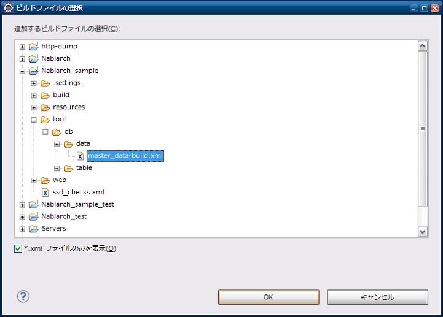

=========================================
マスタデータ投入ツール インストールガイド
=========================================

:doc:`index`\ のインストール方法について説明する。

.. _master_data_setup_prerequisite:

前提事項
========

* 以下のツールがインストール済みであること

  * Eclipse
  * Maven

* :ref:`Nablarchのアーキタイプ <blank_project>` から生成されたプロジェクトであること
* テーブルが作成済みであること
* バックアップ用スキーマにテーブルが作成済みであること\ [#]_

.. [#] 
 バックアップ用スキーマおよびそのテーブルの作成については、\
 『\ :doc:`../../06_TestFWGuide/04_MasterDataRestore`\ 』の\ :ref:`master_data_backup_settings`\ を参照。

提供方法
========

本ツールはnablarch-testing-XXX.jar にて提供する。

ツール使用前に、プロジェクトのユニットテストと同じDB設定を使用できるようにするためにプロジェクトのコンパイルと、ツールの実行に必要なjarファイルのダウンロードを行なう。
以下のコマンドを実行する。

.. code-block:: text

  mvn compile
  mvn dependency:copy-dependencies -DoutputDirectory=lib

以下のファイルをダウンロードし、プロジェクトのディレクトリ(pom.xmlが存在するディレクトリ）にディレクトリ付きで展開する。

* :download:`master-data-setup-tool.zip <download/master-data-setup-tool.zip>`

上記ファイルに含まれる設定ファイルを下記に示す。

+--------------------------------------------+----------------------------------------+
|ファイル名                                  |説明                                    |
+============================================+========================================+
|tool/db/data/master_data-build.properties   |環境設定用プロパティファイル            |
+--------------------------------------------+----------------------------------------+
|tool/db/data/master_data-build.xml          |Antビルドファイル                       |
+--------------------------------------------+----------------------------------------+
|tool/db/data/master_data-log.properties     |ログ出力プロパティファイル              |
+--------------------------------------------+----------------------------------------+
|tool/db/data/master_data-app-log.properties |ログ出力プロパティファイル              |
+--------------------------------------------+----------------------------------------+
|tool/db/data/MASTER_DATA.xlsx               |マスタデータファイル                    |
+--------------------------------------------+----------------------------------------+

本ツールを実行する前に以下のコマンドを実行する。

.. code-block:: text

  mvn compile
  mvn dependency:copy-dependencies -DoutputDirectory=lib

プロパティファイルの書き換え
----------------------------

マスタデータ自動復旧機能が使用する、バックアップスキーマ名を設定する。

.. code-block:: bash
 
 # テスト用マスタデータバックアップスキーマ名
 masterdata.test.backup-schema=nablarch_test_master

その他の設定値については、ディレクトリ構造が変わらない限り修正の必要はない。

.. _how_to_setup_ant_view_in_eclipse:

Eclipseとの連携設定
===================

以下の設定をすることでEclipseから本ツールを起動することができる。

Antビュー起動
-------------

ツールバーから、ウィンドウ(Window)→設定(Show View)を選択し、Antビューを開く。

.. image:: ./_image/open_ant_view.png
   :width: 100%

 
ビルドファイル登録
------------------

＋印のアイコンを押下し、ビルドスクリプトを選択する。

.. image:: ./_image/register_build_file.png
   :scale: 100

Antビルドファイル(master_data-build.xml)を選択する。

Antビューに登録したビルドファイルが表示されることを確認する。

.. image:: ./_image/build_file_in_view.png
   :scale: 100
 
