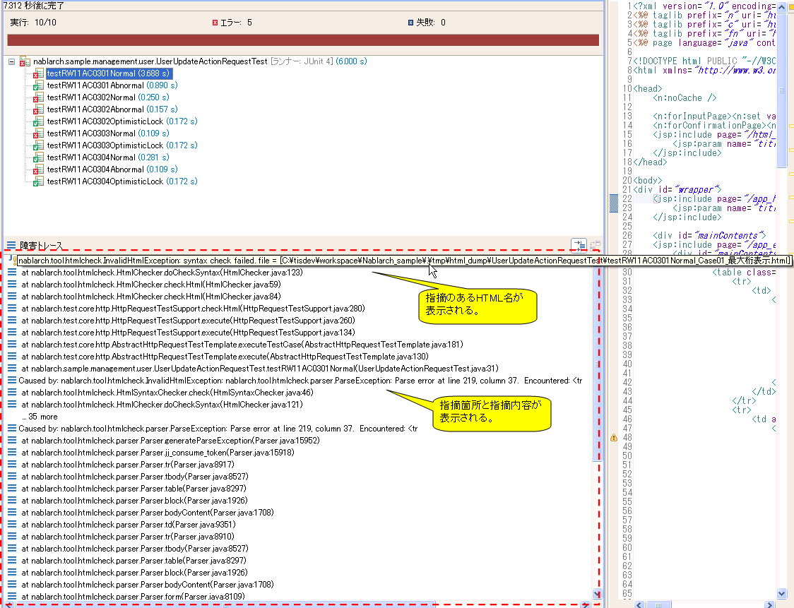

.. _html_check_tool:

======================
HTMLチェックツール
======================

HTMLチェックツールの目的、仕様、使用方法に関して記述する。

目的
====

* 終了タグ忘れ等の構文不正により、想定している画面表示とは異なる画面がユーザーに表示されることを防ぐ。
* プロジェクトの規約により禁止されているタグが使用されることを防ぐ。

仕様
====

リクエスト単体テストにて自動生成されたHTMLファイルに対して下記のチェックを行い、不正なHTMLを検出した場合、テスト失敗とする。
本ツールはリクエスト単体テストに標準で組み込まれており、リクエスト単体テスト実行時に本ツールも実行される。

* デフォルトでは\ [#]_\ HTML4.01に準拠してHTMLファイルの構文チェックを行う。\ [#]_\ 
* 開始タグ・終了タグの記述漏れをチェックする。 HTML4.01で省略可能と規定されているタグについても、省略を許可しない。
* 設定ファイル\ [#]_ \に記載されたタグ・属性を使用していないかチェックを行う。
* 大文字・小文字の区別は行わない。 例：) <tr>, <TR>, <Tr>, <tR>
* boolean属性は使用可能である。 例：) <textarea disabled>
* 属性指定におけるクォーテーション省略を許可しない。 例：) ○ <table align="center"> × <table align=center>

.. [#] 設定値の変更により、チェック内容がカスタマイズできる。

.. [#] 一部例外あり。次項『\ `HTML4.01との相違点`_ 』を参照。

.. [#]
  デフォルトの設定では、 `W3C公式サイト <http://www.w3.org/TR/html401/>`_ にて非推奨とされているタグ・属性(以下では、「非推奨タグ・属性」と略記する)が設定されている。
  設定ファイルをカスタマイズすることにより、使用を禁止するタグ・属性を変更することができる。（カスタマイズ方法は :ref:`01_custom` を参照のこと。）

.. tip::

 HTMLに直接記述したJavaScriptに「-」が2つ以上連続で現れた場合は、テスト失敗となる。\
 テスト失敗となるJavaScript実装例とエラーメッセージを下記に示す。
 
 テスト失敗となるJavaScript実装例
 
  .. code-block:: jsp
   
   var message = "--"   // 文字列で「-」が連続する。
     , count = 10;
   count--;             //  デクリメント演算子で「-」が連続する。
 
 エラーメッセージ
 
  .. code-block:: bash
   
   Lexical error at line 965, column 31.  Encountered: "-" (45), after : "--"

 対応方法

  JavaScriptをHTML(JSP)に直接記述するのではなく、外部ファイル化して記述するように対応する。

.. エラー内容と対応方法については、javascriptコーディング規約の\
 【JavaScriptをHTMLに直接記述する場合、「-」（ハイフン）を2つ以上連続して記述しない。】\
 を参照。

HTML4.01との相違点
------------------

現状のウェブアプリケーションでは、クライントサイドで動的なDOM操作を行うことが一般化しているため、
本ツールではボディが空のタグを許容することとしている。

例えば、以下のようなタグはエラーとはならない。

.. code-block:: html

  <!-- 空のspanタグ -->
  

  <!-- optionのないselectタグ -->
  <select id="bar"></select>  

使用方法
========

前提条件
--------

* リクエスト単体テストを実行可能であること。

.. _01_custom:

使用禁止タグ・属性のカスタマイズ方法
-------------------------------------

デフォルトの設定をそのまま使用する場合、プロジェクト開始時に下記に述べる設定変更を行う必要はない。

テストプロジェクトの自動テスト用設定ファイルに禁止するタグ・属性を記述した設定ファイルへのパスが記述されている。
設定ファイルへのパスは、htmlCheckerConfigプロパティに指定するため、設定ファイルを配布時とは異なる場所に配置する場合にはこのプロパティを修正する。 

  .. code-block:: xml

     <component name="httpTestConfiguration" class="nablarch.test.core.http.HttpTestConfiguration">
      
          (省略)

          <property name="htmlCheckerConfig" value="test/resources/httprequesttest/html-check-config.csv" />

          (省略)

     </component>

設定ファイル（htmlCheckerConfigプロパティで指定したファイル）は、下記の記述方法で修正する。  

  設定ファイルは一行にカンマ区切りでタグ名と属性名を記述する。
  一つのタグに複数の属性を設定する場合は、複数行にて記述する。
  ::

    body,bgcolor
    body,link
    body,text
    table,align
    table,bgcolor
    td,bgcolor
    td,height
    td,nowrap
    th,bgcolor
    th,height
    th,nowrap
    tr,bgcolor

  また、属性欄を省略すれば、タグ自体の使用を指摘する。
  ::

    body,

  属性欄を省略する際でも、カンマを省略することはできない。

HTMLチェック実行要否の設定方法
---------------------------------

リクエスト単体テスト実行時にHTMLチェックを実施するか否かは、自動テスト用設定ファイルを変更することにより、設定可能である。

checkHtmlプロパティがtrueの場合、HTMLチェックを実施する。falseの場合、実施しない。

  .. code-block:: xml

     <component name="httpTestConfiguration" class="nablarch.test.core.http.HttpTestConfiguration">
      
          (省略)

          <property name="checkHtml" value="true" />

          (省略)

     </component>

.. _`customize_html_check`:

HTMLチェック内容の変更
---------------------------------

リクエスト単体テスト実行時に実施するHTMLチェックの内容は、 nablarch.test.core.http.HttpTestConfiguration クラスの htmlChecker プロパティを
変更することで変更できる。

例えば <html> タグが必ず初めに始めるシンプルなHTMLチェックを行うクラスは下記のように実装する。

  .. code-block:: java

	public class SimpleHtmlChecker implements HtmlChecker {
	
	    private String encoding;
	    
	    @Override
	    public void checkHtml(File html) throws InvalidHtmlException {
	        StringBuilder sb = new StringBuilder();
	        InputStreamReader reader = null;
	        
	        
	        try {
	            reader = new InputStreamReader(new FileInputStream(html), encoding);
	
	            char[] buf = new char[1024];
	            int len = 0;
	            while ((len = reader.read(buf)) > 0) {
	                sb.append(buf, 0, len);
	            }
	        } catch (Exception e) {
	            throw new RuntimeException(e);
	        } finally {
	            FileUtil.closeQuietly(reader);
	        }
	        
	        if (!sb.toString().trim().startsWith("<html>")) {
	            throw new InvalidHtmlException("html not starts with <html>");
	        }
	    }
	
	    public void setEncoding(String encoding) {
	        this.encoding = encoding;
	    }
	}

上記クラスを使用してHTMLチェックを行う場合、下記のように設定すればよい。

  .. code-block:: xml
	
	
	  <component name="httpTestConfiguration"
	      class="nablarch.test.core.http.HttpTestConfiguration">
	          (省略)
	    <!-- HTMLチェッカの設定 -->
	    <property name="htmlChecker" ref="htmlChecker" /> 
	  </component>
	
	
	  <component name="htmlChecker" class="nablarch.test.core.http.example.htmlcheck.SimpleHtmlChecker">
	  	<property name="encoding" value="UTF-8"/>
	  </component>  

テスト実行時指摘確認方法
------------------------

リクエスト単体テスト実行時、自動生成されたHTMLファイルに指摘が存在した場合、該当するテストケースは失敗する。

下記のようにJUnitコンソールに指摘箇所と指摘内容が出力される。

該当するHTMLの出力元となるJSPを修正し、テストを再実行する。

