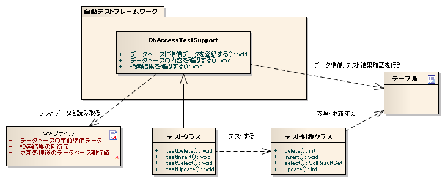
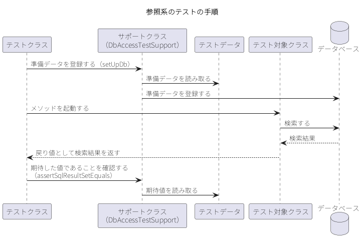
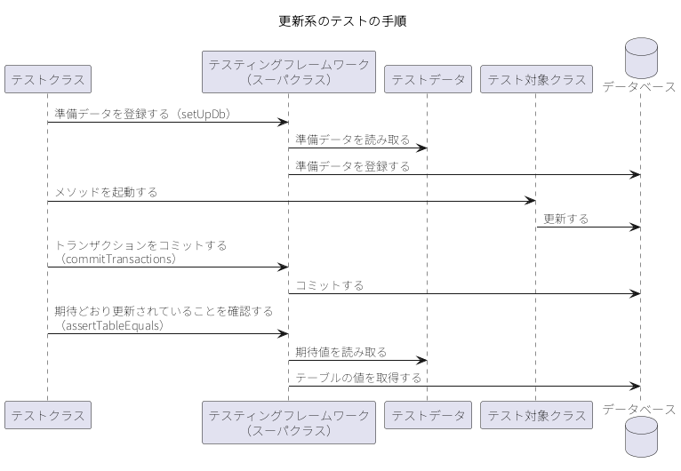

.. _component_unit_test:

コンポーネント単体テスト
==================================================

.. contents:: 目次
  :depth: 3
  :local:

コンポーネント単体テストは、\ Action\ クラスと\ Component\ クラスを対象とするクラス単体テストである。テスティングフレームワークは、データベースを使用するクラスのテストに必要な準備データの投入・結果の確認・トランザクションの制御を提供する。

機能概要
--------------------------------------------------

テストクラスは\ :java:extdoc:`DbAccessTestSupport <nablarch.test.core.db.DbAccessTestSupport>`\ を継承して作成する。準備データと期待値はテストデータに記述し、テストクラスにはテストロジックだけを書く。全体像を次に示す。

このページで扱う主なクラスとリソースを次に示す。

.. list-table::
  :header-rows: 1
  :widths: 30,45,25

  * - 名称
    - 役割
    - 作成単位
  * - テストクラス
    - テストロジックを実装する。
    - テスト対象クラスにつき1つ作成する。
  * - テストデータ
    - テーブルに格納する準備データや期待値を記述する。
    - テストクラスにつき1つ作成する。
  * - テスト対象クラス
    - テストされるクラス。
    - －
  * - :java:extdoc:`DbAccessTestSupport <nablarch.test.core.db.DbAccessTestSupport>`
    - 準備データの投入や更新結果の確認など、データベースを使用するテストに必要な機能を提供する。テストメソッドの実行前後にデータベーストランザクションの開始・終了も行う。
    - －

コンポーネント単体テストで確認する対象は、次の4つに分かれる。どれに当てはまるかによって、テストメソッドの組み立て方と、結果の確認に使用するメソッドが変わる。

.. list-table::
  :header-rows: 1
  :widths: 55,45

  * - 確認する対象
    - 当てはまる処理の例
  * - 戻り値（データベースの検索結果）
    - 検索処理
  * - 戻り値（データベースの検索結果以外）
    - 計算処理、判定処理
  * - 処理終了後のデータベースの状態
    - 挿入処理、更新処理、削除処理
  * - メッセージID
    - エラー処理

1つのテスト対象メソッドが複数に当てはまることがある。例えば、登録処理で二重登録時のエラーも確認する場合は、「処理終了後のデータベースの状態」と「メッセージ\ ID\ 」の2つに当てはまる。

使用方法
--------------------------------------------------

コンポーネント単体テストは、テストクラスとテストデータを作成し、\ JUnit\ でテストを実行するという流れで進める。テストデータのカラムを省略したときのデフォルト値を変更する場合は、\ :ref:`省略したテーブルのカラムのデフォルト値を変更する <class_unit_test_setting-column_default_values>`\ に従ってあらかじめ設定しておく。

テストクラスを作成する
~~~~~~~~~~~~~~~~~~~~~~~~~~~~~~~~~~~~~~~~~~~~~~~~~
テストクラスは、次の条件を満たすように作成する。

* パッケージは、テスト対象のクラスと同じとする。
* クラス名は\ ``<テスト対象クラス名>Test``\ とする。
* :java:extdoc:`DbAccessTestSupport <nablarch.test.core.db.DbAccessTestSupport>`\ を継承する。

テスト対象が\ ``UserComponent``\ の場合、テストクラスは次のようになる。

.. code-block:: java

  package nablarch.sample.management.user;   // テスト対象クラスと同じパッケージ

  import nablarch.test.core.db.DbAccessTestSupport;

  import org.junit.Test;

  public class UserComponentTest extends DbAccessTestSupport {
      // 中略
  }

``DbAccessTestSupport``\ を継承すると、テストメソッドの実行前にデータベーストランザクションが開始され、実行後に終了する。テストクラス側でトランザクションを開始・終了する必要はない。

デフォルトのトランザクション以外も使用する場合は、テスト用のコンポーネント設定ファイルと環境設定ファイルへの設定が必要である（\ :ref:`デフォルト以外のトランザクションを使用する <class_unit_test_setting-db_transaction>`\ ）。

別のクラスを継承しなければならないなどの理由で\ ``DbAccessTestSupport``\ を継承できない場合は、これをインスタンス化して処理を委譲する。コンストラクタにはテストクラス自身の\ ``Class``\ オブジェクトを渡す。この場合はトランザクションの開始・終了が自動では行われないため、前処理・後処理から明示的に呼び出す。

.. code-block:: java

  public class SampleTest extends AnotherSuperClass {

      private DbAccessTestSupport dbSupport = new DbAccessTestSupport(getClass());

      @Before
      public void setUp() {
          dbSupport.beginTransactions();   // トランザクションを開始する
      }

      @After
      public void tearDown() {
          dbSupport.endTransactions();     // トランザクションを終了する
      }

      @Test
      public void test() {
          dbSupport.setUpDb("test");
          // 中略（テスト対象メソッドを起動し、戻り値をactualに受け取る）
          dbSupport.assertSqlResultSetEquals("従業員検索", "test", "expected", actual);
      }
  }

テスト実行前後の共通処理は、\ JUnit\ のアノテーション（\ ``@Before``\ ・\ ``@After``\ ・\ ``@BeforeClass``\ ・\ ``@AfterClass``\ ）で実装する。

.. important::

  ``@BeforeClass``\ ・\ ``@AfterClass``\ を使用する場合、サブクラスにスーパクラスと同名で同じアノテーションを付けたメソッドを作成しない。同名のメソッドに同種のアノテーションを付けると、スーパクラスのメソッドが起動されなくなる。次の例で\ ``TestSub``\ を実行すると、\ ``TestSuper#setUpBeforeClass``\ は呼び出されない。

  .. code-block:: java

    public class TestSuper {
        @BeforeClass
        public static void setUpBeforeClass() {
            System.out.println("super");   // 呼び出されない
        }
    }

    public class TestSub extends TestSuper {
        @BeforeClass
        public static void setUpBeforeClass() {
            // スーパクラスのメソッドを上書きしている
        }
    }

.. tip::

  JUnit 5\ でテストを書く場合は、継承ではなくインジェクションでテスティングフレームワークの機能を使用する（\ :ref:`JUnit 5用拡張機能 <junit5_extension>`\ ）。

テストメソッドを作成する
~~~~~~~~~~~~~~~~~~~~~~~~~~~~~~~~~~~~~~~~~~~~~~~~~
テストメソッドの組み立て方は、参照系のテストか更新系のテストかによって異なる。両者の手順を示したうえで、どちらにも共通する書き方として、\ ``ThreadContext``\ への値の設定、テストデータからの引数と期待値の取得、データを変えた繰り返し実行、テストショットごとのデータの使い分けを説明する。

参照系のテストを作成する
^^^^^^^^^^^^^^^^^^^^^^^^^^^^^^^^^^^^^^^^^^^^^^^^^
参照系のテストでは、次の手順でデータベースからの参照結果を確認する。

1. データベースに準備データを登録する。
2. テスト対象クラスのメソッドを起動する。
3. 戻り値として受け取った検索結果が期待した値であることを確認する。

.. code-block:: java

  public class EmployeeDbAccessTest extends DbAccessTestSupport {

      /** 従業員テーブルに登録されたレコードを全件取得できることを確認する。 */
      @Test
      public void testSelectAll() {
          // データベースに準備データを登録する（引数は読み込み単位の名前）
          setUpDb("testSelectAll");

          // テスト対象メソッドを起動する
          EmployeeDbAccess target = new EmployeeDbAccess();
          SqlResultSet actual = target.selectAll();

          // テストデータに記述した期待値と実際の値が等しいことを確認する
          assertSqlResultSetEquals("全件検索", "testSelectAll", "expected", actual);
      }
  }

更新系のテストを作成する
^^^^^^^^^^^^^^^^^^^^^^^^^^^^^^^^^^^^^^^^^^^^^^^^^
更新系のテストでは、次の手順でデータベースの更新結果を確認する。

1. データベースに準備データを登録する。
2. テスト対象クラスのメソッドを起動する。
3. トランザクションをコミットする。
4. データベースの値が期待どおり更新されていることを確認する。

.. important::

  Nablarch\ では複数種類のトランザクションを併用することが前提となっている。このため、テスト対象クラスの実行後にデータベースの内容を確認するときは、トランザクションをコミットしなければならない。コミットしない場合、テスト結果の確認が正常に行われない。

.. tip::

  参照系のテストではコミットする必要はない。

.. code-block:: java

  public class EmployeeDbAccessTest extends DbAccessTestSupport {

      /** 期限切れの従業員データを削除できることを確認する。 */
      @Test
      public void testDeleteExpired() {
          // データベースに準備データを登録する
          setUpDb("testDeleteExpired");

          // テスト対象メソッドを起動する
          EmployeeDbAccess target = new EmployeeDbAccess();
          target.deleteExpired();

          // トランザクションをコミットする
          commitTransactions();

          // テストデータに記述した期待値とテーブルの状態が等しいことを確認する
          assertTableEquals("testDeleteExpired");
      }
  }

ThreadContextに値を設定する
^^^^^^^^^^^^^^^^^^^^^^^^^^^^^^^^^^^^^^^^^^^^^^^^^
コンポーネント単体テストでは、ハンドラを経由せずテストクラスからテスト対象クラスを直接起動する。このため、アプリケーションの実行時と異なり\ ``ThreadContext``\ には値が設定されていない。``ThreadContext``\ に設定する値をテストデータに記述し、\ ``setThreadContextValues``\ を呼び出すことで設定できる。

.. code-block:: java

  @Test
  public void testInsert() {
      // ThreadContextに値を設定する（引数は読み込み単位の名前とID）
      setThreadContextValues("testInsert", "threadContext");

      // 中略
  }

設定する値は\ ``LIST_MAP``\ として記述する（\ :ref:`LIST_MAPのデータを記述する <testdata_notation-list_map>`\ ）。

.. important::

  :ref:`SQL実行時に共通的な値を自動的に設定したい <database-common_bean>`\ で説明している自動設定項目を使用してデータベースに登録・更新する場合は、\ ``ThreadContext``\ にリクエスト\ ID\ とユーザ\ ID\ が設定されている必要がある。テスト対象クラスを起動する前に設定しておく。

テストデータから引数と期待値を取得する
^^^^^^^^^^^^^^^^^^^^^^^^^^^^^^^^^^^^^^^^^^^^^^^^^
テスト対象メソッドの引数や、戻り値に対する期待値をテストデータから取得する場合は、\ ``getListMap``\ を使用する。

.. code-block:: java

  @Test
  public void testGetName() {
      // テストデータから値を取得する
      List<Map<String, String>> parameters = getListMap("testGetName", "parameters");
      Map<String, String> param = parameters.get(0);

      // 引数および期待値を取得する
      String empNo = param.get("empNo");
      String expected = param.get("expected");

      // テスト対象メソッドを起動する
      EmployeeComponent target = new EmployeeComponent();
      String actual = target.getName(empNo);

      // 結果を確認する
      assertEquals(expected, actual);
  }

データを変えて同じテストメソッドを実行する
^^^^^^^^^^^^^^^^^^^^^^^^^^^^^^^^^^^^^^^^^^^^^^^^^
``getListMap``\ で取得したデータでテストをループさせると、テストデータを追加するだけでテストショットを増やせる。

.. code-block:: java

  @Test
  public void testSelectByPk() {
      setUpDb("testSelectByPk");

      List<Map<String, String>> parameters = getListMap("testSelectByPk", "parameters");

      for (Map<String, String> param : parameters) {
          // 引数および期待値のIDを取得する
          String empNo = param.get("empNo");
          String expectedDataId = param.get("expectedDataId");

          EmployeeComponent target = new EmployeeComponent();
          SqlResultSet actual = target.selectByPk(empNo);

          assertSqlResultSetEquals("主キー検索", "testSelectByPk", expectedDataId, actual);
      }
  }

.. important::

  更新系のテストをループさせる場合は、ループの中で\ ``setUpDb``\ を呼び出す。呼び出さないと、テストの成否がデータの順番に依存する。

テストショットごとにデータを使い分ける
^^^^^^^^^^^^^^^^^^^^^^^^^^^^^^^^^^^^^^^^^^^^^^^^^
1つの読み込み単位に複数のテストショットのデータを混在させる場合は、グループ\ ID\ を引数に取るオーバーロードメソッドを呼び出す。指定したグループ\ ID\ のデータだけが処理の対象になる。

.. code-block:: java

  // グループIDが"case_001"の準備データだけを登録する
  setUpDb("testUpdate", "case_001");

  // グループIDが"case_001"の期待値だけを確認の対象にする
  assertTableEquals("従業員更新", "testUpdate", "case_001");

グループ\ ID\ の記述方法は\ :ref:`グループIDによる使い分け <testdata_notation-group_id>`\ を参照。

テストデータを作成する
~~~~~~~~~~~~~~~~~~~~~~~~~~~~~~~~~~~~~~~~~~~~~~~~~
テストデータの格納場所と記述方法は\ :ref:`テストデータの書き方 <testdata_notation>`\ に従う。準備データと期待値は\ :ref:`テーブルのデータを記述する <testdata_notation-table_data>`\ に、テストクラス全体で共通する準備データは\ :ref:`共通の準備データをまとめる <testdata_notation-setupdb>`\ に従って記述する。記述例は\ :ref:`テストデータの記載例 <testdata_examples>`\ を参照。

期待値には、アプリケーションが設定する項目だけでなく、\ :ref:`SQL実行時に共通的な値を自動的に設定したい <database-common_bean>`\ で説明している自動設定項目も記述する。

登録処理でテーブル採番を使用する場合は、採番用テーブルの準備データも用意する。用意しないと採番される値が定まらず、挿入結果を確認できない。

メッセージデータやコードマスタなどの静的マスタデータは、プロジェクトで管理されたデータがあらかじめ投入されていることを前提とする。テストデータとして個別に作成しない。

外部キーが設定されたテーブルに準備データを登録する場合は、テーブルの親子関係を判断して削除と登録が行われる。詳細は\ :ref:`マスタデータ復旧機能 <master_data_restore>`\ を参照。

テストコードと別のディレクトリにあるテストデータを読み込む場合は、\ :java:extdoc:`TestDataParser <nablarch.test.core.reader.TestDataParser>`\ の実装クラスをシステムリポジトリから取得して直接使用する。第1引数にディレクトリ、第2引数に\ ``<ファイル名>/<読み込み単位の名前>``\ 、第3引数にデータブロックのIDを指定する。\ Excel\ 形式では\ ``<ディレクトリ>/<ファイル名>.xls``\ （または\ ``.xlsx``\ ）の\ ``<読み込み単位の名前>``\ シートが、\ YAML\ 形式では\ ``<ディレクトリ>/<ファイル名>/<読み込み単位の名前>.yaml``\ が読み込まれる。

.. code-block:: java

  TestDataParser parser = (TestDataParser) SystemRepository.getObject("testDataParser");
  List<Map<String, String>> list = parser.getListMap("/test/data/common", "CommonTestData/employees", "params");

テストを実行する
~~~~~~~~~~~~~~~~~~~~~~~~~~~~~~~~~~~~~~~~~~~~~~~~~
通常の\ JUnit\ テストと同じように実行する。

テスト結果を確認する
~~~~~~~~~~~~~~~~~~~~~~~~~~~~~~~~~~~~~~~~~~~~~~~~~
確認する対象によって、使用するメソッドが異なる。

.. list-table::
  :header-rows: 1
  :widths: 40,60

  * - 確認する対象
    - 使用するメソッド
  * - 戻り値（データベースの検索結果）
    - ``assertSqlResultSetEquals``\ 、\ ``assertSqlRowEquals``
  * - 戻り値（データベースの検索結果以外）
    - JUnit\ の\ ``assertEquals``\ など
  * - 処理終了後のデータベースの状態
    - ``assertTableEquals``
  * - メッセージID
    - JUnit\ の\ ``assertEquals``\ など

メッセージ\ ID\ を確認する場合は、発生を想定する例外をキャッチし、そのメッセージ\ ID\ を期待値と比較する。

.. code-block:: java

  @Test
  public void testRegisterUserDuplicated() {
      // 中略

      try {
          target.registerUser(sysAcct, users, grpSysAcct);
          fail();   // 例外が発生しなければテストは失敗である
      } catch (ApplicationException e) {
          assertEquals(expectedMessageId, e.getMessages().get(0).getMessageId());
      }
  }

.. important::

  キャッチする例外は発生を想定する例外とし、\ ``RuntimeException``\ などの上位の例外クラスは使用しない。メッセージ\ ID\ は合っているが例外そのものを間違えている誤りを検出できなくなる。

``assertSqlResultSetEquals``\ による確認には、次の性質がある。

* SELECT\ 文で指定されたすべてのカラム名（別名）が比較の対象になる。特定のカラムだけを比較の対象から外すことはできない。
* レコードの順序が異なる場合は等価とみなさない。SELECT\ 文で指定されたカラムに主キーが含まれているとは限らず、比較のために並べ替えることができないためである。また\ SELECT\ 文には\ ORDER BY\ が指定されることがほとんどであり、順序そのものが確認すべき対象になる。
