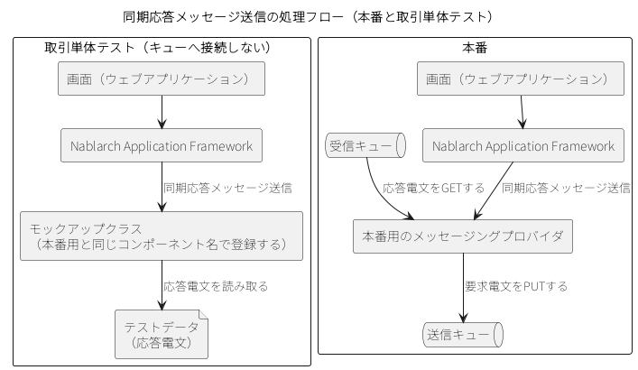

.. _deal_unit_test_mom:

取引単体テスト（MOMによるメッセージング）
==================================================

.. contents:: 目次
  :depth: 3
  :local:

機能概要
--------------------------------------------------

MOM\ によるメッセージングの取引単体テストは、テスト対象によって2通りに分かれる。メッセージを受信するアプリケーションでは、複数のメッセージによって1つの取引が成立する場合に、リクエストごとのテストを1つのテストメソッドの中で順に実行する。同期応答メッセージ送信を伴うウェブアプリケーションでは、テスティングフレームワークが提供するモックアップクラスに応答電文を返させることで、キューを用意せずに取引全体を検証する。

同期応答メッセージ受信では、取引が1つのメッセージで完結することがほとんどである。このように1リクエストが1取引に対応する場合は、取引単体テストを実施する必要はない。複数のメッセージによって1つの取引が成立する場合は、リクエストごとのテストを1つのテストメソッドの中で連続して実行することで取引単体テストを実施できる。応答不要メッセージ受信も同じである。

同期応答メッセージ送信を伴うウェブアプリケーションの取引単体テストでは、テスティングフレームワークが提供するモックアップクラスを使用する。モックアップクラスは、本番用のメッセージングプロバイダと同じコンポーネント名で登録することにより、キューへ接続する処理を置き換える。登録方法は\ :ref:`取引単体テストの設定（MOMによるメッセージング） <deal_unit_test_setting_mom>`\ を参照。

同期応答メッセージ送信を伴うウェブアプリケーションの通常の処理フローと、モックアップクラスを使用して取引単体テストを行う場合の処理フローを次に示す。

モックアップクラスは次の3つの機能を提供する。

* **任意の応答電文を返す**\ 。画面から同期応答メッセージ送信が行われる場合に、送信キューおよび受信キューに接続することなく、取引単体テストに必要な応答電文を返す
* **要求電文をログに出力する**\ 。画面から送信された要求電文をログに出力する。出力されたログを確認することで、正常にメッセージ送信が行われたかどうかを確認できる。また、出力されたログをエビデンスとして使用できる
* **障害を発生させる**\ 。同期応答メッセージ送信で発生するタイムアウトエラーや、メッセージ送受信エラーを意図的に発生させ、障害系のテストを行える

モックアップクラスを使用すればキューが不要になるため、ミドルウェアのインストールや環境設定を行わずに取引単体テストを実施できる。

.. important::

  モックアップクラスが担うのは同期応答メッセージ送信だけである。メッセージIDを指定して応答を受信する\ ``receiveMessage``\ メソッドを呼び出すと\ ``UnsupportedOperationException``\ が発生する。接続を閉じる\ ``close``\ メソッドは何も行わない。応答を待たずに送信する\ ``send``\ ・\ ``sendMessage``\ メソッドは、要求電文をログに出力し、固定のメッセージIDを返すだけである。

使用方法
--------------------------------------------------

取引単体テストの進め方は、テスト対象によって異なる。メッセージを受信するアプリケーションを対象とする場合は\ :ref:`取引単体テスト（Nablarchバッチアプリケーション） <deal_unit_test_batch>`\ と、同期応答メッセージ送信を伴うウェブアプリケーションを対象とする場合は\ :ref:`取引単体テスト（ウェブアプリケーション） <deal_unit_test_web>`\ と同じである。ここでは、\ MOM\ によるメッセージングに固有の点として、テストクラスの作り方、テストデータの作り方、テストの実行のしかた、テスト結果の確認のしかたを順に説明する。

テストクラスを作成する
~~~~~~~~~~~~~~~~~~~~~~~~~~~~~~~~~~~~~~~~~~~~~~~~~
メッセージを受信するアプリケーションを対象とする場合、テストクラスは次の条件を満たすように作成する。

* パッケージは、テスト対象の取引のパッケージとする。
* クラス名は\ ``<取引ID>Test``\ とする。
* :java:extdoc:`MessagingRequestTest <nablarch.test.junit5.extension.messaging.MessagingRequestTest>`\ をテストクラスに設定し、\ :java:extdoc:`MessagingRequestTestSupport <nablarch.test.core.messaging.MessagingRequestTestSupport>`\ 型のフィールドを宣言する。

取引\ ID\ が\ ``M21AA03``\ の場合、テストクラスは次のようになる。

.. code-block:: java

  package nablarch.sample.ss21AA03;

  import nablarch.test.core.messaging.MessagingRequestTestSupport;
  import nablarch.test.junit5.extension.messaging.MessagingRequestTest;

  @MessagingRequestTest
  class M21AA03Test {
      MessagingRequestTestSupport support;

      // 中略
  }

モックアップクラスはコンポーネント設定ファイルで登録するため、テストクラスに記述することはない。

テストデータを作成する
~~~~~~~~~~~~~~~~~~~~~~~~~~~~~~~~~~~~~~~~~~~~~~~~~
メッセージを受信するアプリケーションを対象とする場合のテストデータは、\ :ref:`取引単体テスト（Nablarchバッチアプリケーション） <deal_unit_test_batch>`\ と同じ書き方である。

モックアップクラスを使用する場合は、応答電文のフォーマットとデータを定義する。要求電文については、フォーマットのみ定義する。テストデータはリクエスト\ ID\ ごとに用意する。\ Excel\ 形式ではリクエスト\ ID\ と同じ名前のファイルの\ ``message``\ シート、\ YAML\ 形式ではリクエスト\ ID\ と同じ名前のディレクトリ配下の\ ``message.yaml``\ が読み込み単位になる（\ ``message``\ は固定の名前）。たとえばリクエスト\ ID\ が\ ``RM21AA0101``\ である場合、\ Excel\ 形式では\ ``RM21AA0101.xlsx``\ の\ ``message``\ シートに記述する。電文の記述方法は\ :ref:`メッセージングのデータを記述する <testdata_notation-messaging_data>`\ を、テストデータを置くディレクトリの設定は\ :ref:`同期応答メッセージ送信・HTTPメッセージ送信のテストデータの読み込みを設定する <testing_framework_common-send_sync_test_data>`\ を参照。

モックアップクラスは、要求電文のフレームワーク制御ヘッダに\ ``requestId``\ という名前のフィールドがあることを前提に動作する。ここで扱うリクエスト\ ID\ の意味は\ :ref:`リクエスト単体テスト（MOMによるメッセージング） <request_unit_test_mom-request_id>`\ を参照。

テストを実行する
~~~~~~~~~~~~~~~~~~~~~~~~~~~~~~~~~~~~~~~~~~~~~~~~~
1つの取引の中で同じリクエスト\ ID\ への同期応答メッセージ送信が複数回行われる場合は、その回数分の応答電文をテストデータに記述する。モックアップクラスは、記述した順に応答電文を1件ずつ返す。何件目まで返したかは、アプリケーションサーバが起動している間は初期化されない。応答電文を2件記述した例は\ :ref:`同期応答メッセージ送信の応答電文を配置する <testdata_examples-send_sync_response>`\ を参照。1回目の同期送信では1件目が、2回目の同期送信では2件目が返る。

テストデータのタイムスタンプが更新されると、モックアップクラスはテストデータを読み込み直し、次に返す応答電文を1件目に戻す。テストデータを手動で編集してテストをやり直す場合や、同じデータで繰り返しテストを行う場合は、アプリケーションサーバを再起動せずにテストを続けられる。

テスト結果を確認する
~~~~~~~~~~~~~~~~~~~~~~~~~~~~~~~~~~~~~~~~~~~~~~~~~
モックアップクラスは、送信された要求電文をログに出力する。ログは\ Map\ 形式と\ CSV\ 形式の両方で出力される。\ Map\ 形式のログはデバッグ用に、\ CSV\ 形式のログはエビデンスとして取得する場合に使用する。以下の出力例は、いずれもログのメッセージ部分だけを抜き出したものである。日時やロガー名が付くかどうかは、ログの出力設定によって変わる。

Map\ 形式の出力例を次に示す。行頭の字下げはタブである。

.. code-block:: text

  request id=[RM11AD0101]. following message has been sent:
    message fw header = {requestId=RM11AD0101, testCount=, resendFlag=0, reserved=}
    message body      = {authors=test3, title=test1, publisher=test2}

CSV\ 形式の出力例を次に示す。

.. code-block:: text

  request id=[RM11AD0102]. following message has been sent:
  message header =
  "requestId","testCount","resendFlag","reserved"
  "RM11AD0102","","0",""
  message body   =
  "authors","title","publisher"
  "test3","test1","test2"

Map\ 形式のログは\ ``MESSAGING_MAP``\ 、\ CSV\ 形式のログは\ ``MESSAGING_CSV``\ という名前のロガーに、\ DEBUG\ レベルで出力される。出力先はログの設定で切り替える。\ ``log.properties``\ の設定例を次に示す。この例では、\ Map\ 形式のログを標準出力とアプリケーションログファイルに、\ CSV\ 形式のログを専用のログファイルに出力する。

.. code-block:: properties

  # CSV形式のメッセージログのライタ（./messaging-evidence.logに出力する）
  writer.MESSAGING_CSV.className=nablarch.core.log.basic.FileLogWriter
  writer.MESSAGING_CSV.filePath=./messaging-evidence.log
  writer.MESSAGING_CSV.formatter.className=nablarch.core.log.basic.BasicLogFormatter
  writer.MESSAGING_CSV.formatter.format=$message$

  # CSV形式のメッセージログのロガー
  loggers.MESSAGING_CSV.nameRegex=MESSAGING_CSV
  loggers.MESSAGING_CSV.level=DEBUG
  loggers.MESSAGING_CSV.writerNames=MESSAGING_CSV

  # Map形式のメッセージログのロガー
  loggers.MESSAGING_MAP.nameRegex=MESSAGING_MAP
  loggers.MESSAGING_MAP.level=DEBUG
  loggers.MESSAGING_MAP.writerNames=stdout,appFile
