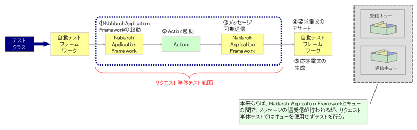
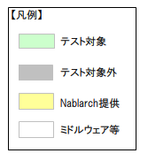

.. _request_unit_test_mom:

リクエスト単体テスト（MOMによるメッセージング）
==================================================

.. contents:: 目次
  :depth: 3
  :local:

MOM\ によるメッセージングのリクエスト単体テストは、テスト対象によって3つに分かれる。メッセージを受け取る側の同期応答メッセージ受信・応答不要メッセージ受信と、メッセージを送る側の同期応答メッセージ送信である。以降、同期応答メッセージ受信と応答不要メッセージ受信をあわせてメッセージ受信と呼ぶ。いずれもテスティングフレームワークが提供するスーパクラスとテストデータを使うことで、テストコードをほとんど書かずにテストを実施できる。応答不要メッセージ送信は\ Nablarch\ バッチアプリケーションであるため、そのリクエスト単体テストは\ :ref:`リクエスト単体テスト（Nablarchバッチアプリケーション） <request_unit_test_batch>`\ で行う。

機能概要
--------------------------------------------------

メッセージ受信のリクエスト単体テストでは、要求電文1件を受信したときの動作を擬似的に再現する。

テストクラスは、同期応答メッセージ受信では\ ``MessagingRequestTestSupport``\ を、応答不要メッセージ受信ではそのサブクラスの\ ``MessagingReceiveTestSupport``\ を継承して作成する。スーパクラスがテストデータを読み取り、テストショットを1件ずつ実行する。テスト用のメインクラス\ ``MainForRequestTesting``\ を通じて\ Nablarch Application Framework\ が起動され、テスト対象のアプリケーションが実行される。準備データの投入とテスト結果の確認は、データベースについては\ ``DbAccessTestSupport``\ が、キューについては\ ``MQSupport``\ が行う。

応答不要メッセージ受信では、メッセージを受け取る\ Action\ クラスが\ Nablarch\ の一部として提供される（\ :ref:`MOMメッセージングで使用するアクション <mom_messaging-action>`\ ）。このため、リクエスト単体テストではその\ Action\ クラスを使用して、次の3つの成果物を確認する。

* 電文のレイアウトを定義したフォーマット定義ファイル
* データベースへ電文を登録する際に使用する\ Form\ クラス
* データベースへ電文を登録するための\ INSERT\ 文

.. tip::
  Action\ クラスは\ Nablarch\ が提供するものであるため、他のテストのように\ Action\ クラスに対する条件網羅や限界値テストを実施する必要はない。

同期応答メッセージ送信のリクエスト単体テストでは、要求電文1件をキューに送信し、結果を同期的に受信する際の動作を擬似的に再現する。テストは、その処理に付与されたリクエスト\ ID\ 単位で行う。以降、\ Action\ がキューへ送信する電文を要求電文、\ Action\ がキューから受信する電文を応答電文と呼ぶ。

Nablarch\ バッチアプリケーションから同期応答メッセージ送信を行う場合、テストクラスは、\ :java:extdoc:`BatchRequestTestSupport <nablarch.test.core.batch.BatchRequestTestSupport>`\ を継承して作成する。スーパクラスがテストデータを読み取り、テストショットを1件ずつ実行する。テスト用のメインクラス\ ``MainForRequestTesting``\ を通じて\ Nablarch Application Framework\ が起動され、テスト対象のアプリケーションが\ ``MessageSender``\ を使って同期応答メッセージ送信を行う。\ ``MessageSender``\ が生成した要求電文は\ ``RequestTestingMessagingProvider``\ が受け取り、テストデータに記述した要求電文の期待値とアサートしたうえで、テストデータに記述した応答電文を生成して返す。

.. _request_unit_test_mom-request_id:

.. tip::
  ここで扱うリクエスト\ ID\ とは、メッセージを送信する相手先システムの機能を一意に識別するために定義する\ ID\ である。ウェブアプリケーションや\ Nablarch\ バッチアプリケーションで使用するリクエスト\ ID\ とは意味が異なる。このリクエスト\ ID\ にもとづき、要求電文および応答電文のフォーマット、送信キュー名、受信キュー名が決まる。

同期応答メッセージ送信のリクエスト単体テストを実施するときの流れを次に示す。

図の凡例を次に示す。

1. テスティングフレームワークが\ Nablarch Application Framework\ を起動する。
2. Nablarch Application Framework\ が\ Action\ の入力となるパラメータ（画面ならばリクエスト、バッチならばファイルやデータベース）を読み込み、\ Action\ を起動する。
3. Action\ が\ Nablarch Application Framework\ の同期応答メッセージ送信を実行する。\ Nablarch Application Framework\ は\ Action\ から受け取ったパラメータを要求電文に変換する。
4. テスティングフレームワークが、テストデータをもとに要求電文をアサートする（要求電文はキューに\ PUT\ しない）。
5. テスティングフレームワークが、テストデータをもとに応答電文を生成し、\ Action\ へ返す（応答電文はキューから\ GET\ しない）。

同期応答メッセージ送信では、このようにキューを使用せずにテストが完結する。このため、特別なミドルウェアのインストールや環境設定を行わずにテストを実施できる。

同期応答メッセージ送信のテストがテストデータだけで書けるのは、次の2点による。1点目は、テスティングフレームワークが同期応答メッセージ送信用のテストデータ書式を提供している点である。電文レイアウトはフィールド長が固定されていることがほとんどであり、そのままではテストデータとして記載しにくい。この書式に従えば、外部インタフェース設計書のフォーマット定義に沿って記述できる。2点目は、要求電文のアサートと応答電文の返却をテスティングフレームワークが自動的に行う点である。同期応答メッセージ送信についてのテストコードを書く必要がない。

このページで扱う主なクラスとリソースを次に示す。

.. list-table::
  :header-rows: 1
  :widths: 30,45,25

  * - 名称
    - 役割
    - 作成単位
  * - リクエスト単体テストクラス
    - テストロジックを実装する。
    - テスト対象クラス（Action）につき1つ作成する。
  * - テストデータ
    - テーブルに格納する準備データや期待値、要求電文・応答電文などを記載する。
    - テストクラスにつき1つ作成する。
  * - ``MessagingRequestTestSupport``
    - 同期応答メッセージ受信のリクエスト単体テストで必要となるテスト準備機能、各種アサートを提供する。
    - －
  * - ``MessagingReceiveTestSupport``
    - 応答不要メッセージ受信のリクエスト単体テストで必要となるテスト準備機能を提供する。
    - －
  * - ``RequestTestingMessagingProvider``
    - 同期応答メッセージ送信のリクエスト単体テストで、要求電文のアサート機能および応答電文の生成・返却機能を提供する。
    - －
  * - ``TestDataConverter``
    - テストデータに記述した値を編集するためのインタフェース。実装方法は\ :ref:`リクエスト単体テストの設定（MOMによるメッセージング） <request_unit_test_setting_mom>`\ を参照。
    - －

使用方法
--------------------------------------------------

MOM\ によるメッセージングのリクエスト単体テストは、テストクラスとテストデータを作成し、\ JUnit\ でテストを実行するという流れで進める。同期応答メッセージ送信のテストは、テスト対象の処理方式（ウェブアプリケーション・\ Nablarch\ バッチアプリケーション）のテストを踏襲して行うため、ここでは\ MOM\ によるメッセージングに固有の点を説明する。コンポーネント設定は\ :ref:`リクエスト単体テストの設定（MOMによるメッセージング） <request_unit_test_setting_mom>`\ に従ってあらかじめ済ませておく。

.. _request_unit_test_mom-test_class:

テストクラスを作成する
~~~~~~~~~~~~~~~~~~~~~~~~~~~~~~~~~~~~~~~~~~~~~~~~~
同期応答メッセージ受信のテストクラスは、次の条件を満たすように作成する。

* パッケージは、テスト対象の\ Action\ クラスと同じとする。
* クラス名は\ ``<Actionクラス名>RequestTest``\ とする。
* :java:extdoc:`MessagingRequestTestSupport <nablarch.test.core.messaging.MessagingRequestTestSupport>`\ を継承する。

テスト対象の\ Action\ クラスが\ ``nablarch.sample.ss21AA.RM21AA001Action``\ である場合、テストクラスは次のようになる。

.. code-block:: java

  package nablarch.sample.ss21AA;

  import nablarch.test.core.messaging.MessagingRequestTestSupport;

  public class RM21AA001ActionRequestTest extends MessagingRequestTestSupport {
      // 中略
  }

応答不要メッセージ受信のテストクラスは、次の条件を満たすように作成する。

* パッケージは、テスト対象機能のパッケージとする。
* クラス名は\ ``<電文のリクエストID>RequestTest``\ とする。
* :java:extdoc:`MessagingReceiveTestSupport <nablarch.test.core.messaging.MessagingReceiveTestSupport>`\ を継承する。

テスト対象機能のパッケージが\ ``nablarch.sample.ss21AA``\ 、電文のリクエスト\ ID\ が\ ``RM21AA100``\ である場合、テストクラスは次のようになる。

.. code-block:: java

  package nablarch.sample.ss21AA;

  import nablarch.test.core.messaging.MessagingReceiveTestSupport;

  public class RM21AA100RequestTest extends MessagingReceiveTestSupport {
      // 中略
  }

同期応答メッセージ送信のテストクラスの作り方は、テスト対象の処理方式のテストと同じである。\ :ref:`リクエスト単体テスト（ウェブアプリケーション） <request_unit_test_web>`\ ・\ :ref:`リクエスト単体テスト（Nablarchバッチアプリケーション） <request_unit_test_batch>`\ を参照。テストクラスは、テスト対象の処理方式に合わせて次のどちらかのスーパクラスを継承する。

* :java:extdoc:`BatchRequestTestSupport <nablarch.test.core.batch.BatchRequestTestSupport>`\ ：\ Nablarch\ バッチアプリケーションのテストで使用する。
* :java:extdoc:`BasicHttpRequestTestTemplate <nablarch.test.core.http.BasicHttpRequestTestTemplate>`\ ：ウェブアプリケーションのテストで使用する。

.. tip::

  JUnit 5\ でテストを書く場合は、継承ではなくインジェクションでテスティングフレームワークの機能を使用する（\ :ref:`JUnit 5用拡張機能 <junit5_extension>`\ ）。

.. _request_unit_test_mom-test_method:

テストメソッドを作成する
~~~~~~~~~~~~~~~~~~~~~~~~~~~~~~~~~~~~~~~~~~~~~~~~~
メッセージ受信のテストでは、1テストクラスにつき1テストメソッド、1読み込み単位を原則とする。テストの内容が複雑であったりデータ量が多い場合は、メソッドや読み込み単位を分割してもよい。

テストメソッドには\ ``@Test``\ を付与し、その中でスーパクラスの次のどちらかのメソッドを呼び出す。

* ``void execute()``
* ``void execute(String sheetName)``

引数ありの\ ``execute``\ メソッドでは、テストデータの読み込み単位の名前を指定できる。引数なしの\ ``execute``\ メソッドは、テストメソッド名と同じ名前の読み込み単位を読み込む。通常は読み込み単位の名前とテストメソッド名を同じにするため、引数なしの\ ``execute``\ メソッドを使用するとよい。

.. code-block:: java

  @Test
  public void testRegisterUser() {
      execute();   // execute("testRegisterUser") と等価
  }

同期応答メッセージ送信のテストメソッドの書き方は、テスト対象の処理方式のテストと同じである。\ :ref:`リクエスト単体テスト（ウェブアプリケーション） <request_unit_test_web>`\ ・\ :ref:`リクエスト単体テスト（Nablarchバッチアプリケーション） <request_unit_test_batch>`\ を参照。

.. _request_unit_test_mom-test_data:

テストデータを作成する
~~~~~~~~~~~~~~~~~~~~~~~~~~~~~~~~~~~~~~~~~~~~~~~~~
3つのテストに共通して、テストデータの格納場所と記述方法は\ :ref:`テストデータの書き方 <testdata_notation>`\ に従う。要求電文・応答電文の書式や、フレームワーク制御ヘッダの扱いは\ :ref:`メッセージングのデータを記述する <testdata_notation-messaging_data>`\ を参照。

メッセージ受信のテストでは、実行するテストショットを\ :ref:`テストショット一覧（testShots）を記述する <testdata_notation-test_shots>`\ に従って記述する。テストクラス全体で共通する準備データは、\ :ref:`共通の準備データをまとめる <testdata_notation-setupdb>`\ に従ってまとめる。

同期応答メッセージ送信のテストデータも、テストクラスに対応する読み込み単位に記述する。要求電文の期待値と返却する応答電文は、テストショット一覧の\ ``expectedMessage``\ ・\ ``responseMessage``\ にグループ\ ID\ を記述することでテストショットと対応付ける（\ :ref:`テストショット一覧（testShots）を記述する <testdata_notation-test_shots>`\ ）。

.. tip::
  パディングおよびバイナリデータの扱いは、固定長ファイルのテストデータと同じである。\ :ref:`ファイルのデータを記述する <testdata_notation-file_data>`\ を参照。

.. _request_unit_test_mom-execute:

テストを実行する
~~~~~~~~~~~~~~~~~~~~~~~~~~~~~~~~~~~~~~~~~~~~~~~~~
通常の\ JUnit\ テストと同じように実行する。

メッセージ受信のテストでは、スーパクラスがテストデータを読み取り、記述されたテストショットを順に実行する。1件のテストショットは、入力データの準備・メインクラスの起動・出力結果の確認という流れで進む。入力データの準備では、テストデータから作成した要求電文が受信キューに\ PUT\ される。メインクラスには、テスト用の\ ``MainForRequestTesting``\ を使用する。このクラスは、テスト用のコンポーネント設定ファイルからシステムリポジトリを初期化し、テスト対象の実行後に元のリポジトリへ戻す。

同期応答メッセージ送信のテストでは、キューへの接続は行われない。要求電文のアサートと応答電文の生成・返却は\ ``RequestTestingMessagingProvider``\ が担う。実際の処理は、同クラスの内部クラスである\ ``RequestTestingMessagingContext``\ に委譲される。

.. _request_unit_test_mom-assertion:

テスト結果を確認する
~~~~~~~~~~~~~~~~~~~~~~~~~~~~~~~~~~~~~~~~~~~~~~~~~
同期応答メッセージ受信のテストでは、テスティングフレームワークが次の結果確認を行う。

* 応答電文の内容の確認（必須）
* データベースの更新内容の確認
* ログの出力内容の確認

応答電文の内容の確認では、構造化データ以外のフレームワーク制御ヘッダを使用する場合、テストショット一覧の\ ``expectedStatusCode``\ とステータスコードの照合も行われる。データベースとログの結果確認は、テストショット一覧に期待値の記載がない場合はスキップされる。

応答不要メッセージ受信では応答電文が存在しないため、応答電文の内容の確認は行われない。データベースとログの結果確認は同期応答メッセージ受信と同じであり、機能概要で挙げた3つの成果物は、この結果確認によって確かめる。

同期応答メッセージ送信のテストでは、要求電文の期待値を定義した場合に、テスティングフレームワークが次の確認を行う。確認は、要求電文が送信されるたびではなく、\ Action\ の実行後に一括で行う。

* 要求電文の内容の確認
* 要求電文の送信件数の確認
