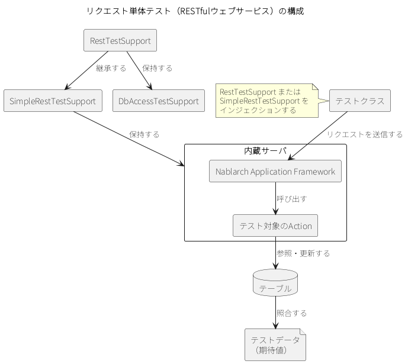

.. _request_unit_test_rest:

リクエスト単体テスト（RESTfulウェブサービス）
==================================================

.. contents:: 目次
  :depth: 3
  :local:

機能概要
--------------------------------------------------

RESTfulウェブサービスのリクエスト単体テストは、テスティングフレームワークが起動する内蔵サーバにリクエストを送信し、返されたレスポンスを検証することで実施する。

RESTfulウェブサービスのリクエスト単体テストは、\ :ref:`リクエスト単体テスト（ウェブアプリケーション） <request_unit_test_web>`\ と同じく内蔵サーバを使用して実施する。必要なモジュールは他の処理方式より多い。モジュールの追加とコンポーネント設定は、\ :ref:`リクエスト単体テストの設定（RESTfulウェブサービス） <request_unit_test_setting_rest>`\ に従ってあらかじめ済ませておく。

テストクラスは\ ``RestTestSupport``\ または\ ``SimpleRestTestSupport``\ をインジェクションして作成する。\ ``SimpleRestTestSupport``\ が内蔵サーバを保持し、\ ``RestTestSupport``\ はこれを継承したうえでデータベース関連機能（\ ``DbAccessTestSupport``\ ）を保持する。テストメソッドが送信したリクエストは、内蔵サーバ上でウェブアプリケーションとして動作する\ Nablarch Application Framework\ が受け取り、テスト対象の\ Action\ を呼び出す。\ Action\ がテーブルを参照・更新した結果は、テストデータに記述した期待値と照合する。

このページで扱う主なクラスとリソースを次に示す。

.. list-table::
  :class: white-space-normal
  :header-rows: 1
  :widths: 30,45,25

  * - 名称
    - 役割
    - 作成単位
  * - リクエスト単体テストクラス
    - テストロジックを実装する。
    - テスト対象クラス（Action）につき1つ作成する。
  * - テストデータ
    - テーブルに格納する準備データや期待値、HTTPパラメータなどを記載する。
    - 必要に応じて、テストクラスにつき1つ作成する。
  * - テスト対象クラス（Action）
    - テスト対象のクラス。Action以降の業務ロジックを実装する各クラスを含む。
    - 取引につき1クラス作成する。
  * - ``RestTestSupport``\ ・\ ``SimpleRestTestSupport``
    - 内蔵サーバの起動や、リクエスト単体テストで必要となるステータスコードのアサートなどの機能を提供する。テストクラスにインジェクションされる。\ ``RestTestSupport``\ は、これにデータベース関連機能を加えたクラスである。
    - －

使用方法
--------------------------------------------------

リクエスト単体テストは、次の流れで実装する。テスティングフレームワークが用意したサポートクラスをインジェクションするテストクラスを作成し、\ ``@Test``\ を付与したテストメソッドの中で、リクエストを生成し、送信し、結果を確認する。データベースの準備データが必要な場合は、あわせてテストデータを作成する。

テストクラスを作成する
~~~~~~~~~~~~~~~~~~~~~~~~~~~~~~~~~~~~~~~~~~~~~~~~~
テストクラスには、テスティングフレームワークが用意した次のいずれかのサポートクラスをインジェクションする。リクエストの生成・送信・結果確認の機能は、どちらのクラスも同じものを持つ。

* \ ``nablarch.test.core.http.RestTestSupport``\ ：\ ``SimpleRestTestSupport``\ を継承し、データベース関連機能を加えたクラス。合成アノテーションは\ :java:extdoc:`RestTest <nablarch.test.junit5.extension.http.RestTest>`\ 。
* \ ``nablarch.test.core.http.SimpleRestTestSupport``\ ：データベース関連機能を持たないクラス。データベース関連機能が不要な場合はこちらを使用する。合成アノテーションは\ :java:extdoc:`SimpleRestTest <nablarch.test.junit5.extension.http.SimpleRestTest>`\ 。

.. tip::

  ``RestTestSupport``\ を使用する場合は、\ ``testDataParser``\ のコンポーネントを準備する必要がある（\ ``dbInfo``\ はそのプロパティとして設定する）。設定方法は\ :ref:`リクエスト単体テストの設定（RESTfulウェブサービス） <request_unit_test_setting_rest>`\ を参照。データベースへの依存が不要な場合は、\ ``SimpleRestTestSupport``\ を使用することでコンポーネント定義を簡略化できる。

テストクラスの全体像を次に示す。各手順の詳細は以降で説明する。

.. code-block:: java

  import nablarch.fw.web.HttpResponse;
  import nablarch.fw.web.RestMockHttpRequest;
  import nablarch.test.core.http.RestTestSupport;
  import nablarch.test.junit5.extension.http.RestTest;
  import org.json.JSONException;
  import org.junit.jupiter.api.Test;
  import org.skyscreamer.jsonassert.JSONAssert;
  import org.skyscreamer.jsonassert.JSONCompareMode;

  import static com.jayway.jsonpath.matchers.JsonPathMatchers.hasJsonPath;
  import static org.hamcrest.MatcherAssert.assertThat;
  import static org.hamcrest.Matchers.hasSize;

  @RestTest  //合成アノテーションをテストクラスに設定する
  class SampleTest {
      RestTestSupport support;  //RestTestSupportがインジェクションされる

      @Test  //アノテーションを付与する
      void プロジェクト一覧が取得できること() throws JSONException {
          String message = "プロジェクト一覧取得";

          RestMockHttpRequest request = support.get("/projects");               //リクエストを生成する
          HttpResponse response = support.sendRequest(request);                 //リクエストを送信する
          support.assertStatusCode(message, HttpResponse.Status.OK, response);  //結果を確認する

          assertThat(response.getBodyString(), hasJsonPath("$", hasSize(10)));    //json-path-assertを使ったレスポンスボディの検証

          JSONAssert.assertEquals(message, support.readTextResource(getClass(), "プロジェクト一覧が取得できること.json")
                  , response.getBodyString(), JSONCompareMode.LENIENT);                  //JSONAssertを使ったレスポンスボディの検証
      }
  }

データベース関連機能は、\ ``RestTestSupport``\ から\ ``DbAccessTestSupport``\ に処理を委譲することで実現している。\ ``DbAccessTestSupport``\ の詳細は\ :ref:`コンポーネント単体テスト <component_unit_test>`\ を参照。ただし、\ ``DbAccessTestSupport``\ が持つ次のメソッドは、RESTfulウェブサービスのリクエスト単体テストでは不要であり、アプリケーションプログラマに誤解を与えないよう、意図的に委譲していない。

* ``public void beginTransactions()``
* ``public void commitTransactions()``
* ``public void endTransactions()``
* ``public void setThreadContextValues(String sheetName, String id)``
* ``public void assertSqlResultSetEquals(String message, String sheetName, String id, SqlResultSet actual)``
* ``public void assertSqlRowEquals(String message, String sheetName, String id, SqlRow actual)``

.. tip::

  データベース関連機能はアプリケーションプログラマの利便性を考慮して委譲しているが、RESTfulウェブサービスのテストでは、委譲された\ ``assertTableEquals``\ などでテーブルの内容を確認するテストよりも、サービスとして公開されたAPIに問い合わせ、データベースに依存することなくシステムが持つデータを確認するテストを推奨する。

テストメソッドを作成する
~~~~~~~~~~~~~~~~~~~~~~~~~~~~~~~~~~~~~~~~~~~~~~~~~
テストメソッドには\ ``@Test``\ を付与し、その中でテスト対象へ送るリクエストを組み立てる。内蔵サーバへのリクエスト送信には、\ ``HttpRequest``\ のインスタンスが必要となる。サポートクラスは、\ ``HttpRequest``\ をリクエスト単体テスト用に拡張した\ ``RestMockHttpRequest``\ のインスタンスを簡単に作成できるよう、次の5つのメソッドを用意している。

.. code-block:: java

  RestMockHttpRequest get(String uri)
  RestMockHttpRequest post(String uri)
  RestMockHttpRequest put(String uri)
  RestMockHttpRequest patch(String uri)
  RestMockHttpRequest delete(String uri)

引数には、テスト対象となるリクエストURIを引き渡す。これらのメソッドは、受け取ったリクエストURIを元に\ ``RestMockHttpRequest``\ インスタンスを生成し、メソッド名に応じたHTTPメソッドを設定したうえで返す。リクエストパラメータなどURI以外のデータを設定する場合は、返されたインスタンスに対してデータを設定する。

リクエストボディは\ ``setBody``\ メソッドで設定する。引数には任意のオブジェクトを渡せる。文字列を渡した場合はその文字列がそのままボディになり、それ以外のオブジェクトは\ Content-Type\ が\ ``application/json``\ の場合に\ JSON\ へ変換される。\ Content-Type\ ヘッダを設定していない状態で\ ``setBody``\ を呼び出すと、\ ``application/json``\ が設定される。

これら以外のHTTPメソッドで\ ``RestMockHttpRequest``\ のインスタンスを作成する場合は、次のメソッドを使用する。第1引数にはHTTPメソッドを、第2引数にはテスト対象となるリクエストURIを引き渡す。

.. code-block:: java

  RestMockHttpRequest newRequest(String httpMethod, String uri)

.. tip::

  ``RestMockHttpRequest``\ は、流れるようなインタフェースでパラメータなどを設定できるよう、メソッドをオーバーライドして自身のインスタンスを返すようにしてある。使用できるメソッドの詳細は\ :java:extdoc:`Javadoc <nablarch.fw.web.RestMockHttpRequest>`\ を参照。

  リクエストを構築する例を次に示す。

  .. code-block:: java

    RestMockHttpRequest request = support.post("/projects")
                                             .setHeader("Authorization","Bearer token")
                                             .setCookie(cookie);

テストデータを作成する
~~~~~~~~~~~~~~~~~~~~~~~~~~~~~~~~~~~~~~~~~~~~~~~~~
テストデータの格納場所と記述方法は\ :ref:`テストデータの書き方 <testdata_notation>`\ に従う。ただし、RESTfulウェブサービスのリクエスト単体テストで自動的に読み込まれるのは、次の2つの読み込み単位だけである。

* テストクラス全体で共通する準備データ（\ :ref:`共通の準備データをまとめる <testdata_notation-setupdb>`\ 参照）
* テストメソッドごとの準備データ（読み込み単位の名前をテストメソッド名と同じにする。\ :ref:`テストクラスとテストデータの対応 <testdata_notation-file_structure>`\ 参照）

この2つ以外のテストデータも記述できるが、その場合は\ :ref:`LIST_MAPのデータを記述する <testdata_notation-list_map>`\ に従い、値を取得する処理をテストクラスに実装する必要がある。この実装量を減らすため、\ ``RestTestSupport``\ は次のメソッドを提供する。

.. code-block:: java

  List<Map<String, String>> getListMap(String sheetName, String id)
  List<Map<String, String[]>> getListParamMap(String sheetName, String id)
  Map<String, String[]> getParamMap(String sheetName, String id)

.. tip::

  RESTfulウェブサービス以外の処理方式ではテストクラス1つにつきテストデータが1つ必要であるが、RESTfulウェブサービスのリクエスト単体テストでは、テストデータが存在しない場合でもエラーにはならず、データベースへのデータ投入がスキップされるだけである。

テストを実行する
~~~~~~~~~~~~~~~~~~~~~~~~~~~~~~~~~~~~~~~~~~~~~~~~~
内蔵サーバは、サポートクラスがテストメソッドの実行前に起動する。サポートクラスの次のメソッドを呼び出すことで、起動済みの内蔵サーバにリクエストが送信される。

.. code-block:: java

  HttpResponse sendRequest(HttpRequest request)

テスト結果を確認する
~~~~~~~~~~~~~~~~~~~~~~~~~~~~~~~~~~~~~~~~~~~~~~~~~
確認する対象は、レスポンスのHTTPステータスコードとレスポンスボディの2つである。ステータスコードの確認にはテスティングフレームワークが用意したメソッドを使用し、レスポンスボディの検証には外部のライブラリを使用する。

ステータスコードを確認する
^^^^^^^^^^^^^^^^^^^^^^^^^^^^^^^^^^^^^^^^^^^^^^^^^
サポートクラスの次のメソッドを呼び出すことで、レスポンスのHTTPステータスコードが想定どおりであることを確認する。

.. code-block:: java

  void assertStatusCode(String message, HttpResponse.Status expected, HttpResponse response)

引数には、次の値を引き渡す。

* アサート失敗時のメッセージ
* 期待するステータスコード（\ ``HttpResponse.Status``\ の列挙型）
* 内蔵サーバから返された\ ``HttpResponse``\ インスタンス

期待するステータスコードとレスポンスのステータスコードが一致しなかった場合、アサート失敗となる。

レスポンスボディを検証する
^^^^^^^^^^^^^^^^^^^^^^^^^^^^^^^^^^^^^^^^^^^^^^^^^
レスポンスボディの検証について、テスティングフレームワークは仕組みを用意していない。各プロジェクトの要件に合わせて、\ `JSONAssert(外部サイト、英語) <https://jsonassert.skyscreamer.org/>`_\ や\ `json-path-assert(外部サイト、英語) <https://github.com/json-path/JsonPath/tree/master/json-path-assert>`_\ 、\ `XMLUnit(外部サイト、英語) <https://github.com/xmlunit/user-guide/wiki>`_\ などのライブラリを使用する。

.. tip::

  アーキタイプから\ :doc:`RESTfulウェブサービスプロジェクト <../../../../application_framework/application_framework/blank_project/setup_blankProject/setup_WebService>`\ を作成した場合は、これら3つのライブラリが\ ``pom.xml``\ に記載されている。必要に応じて、ライブラリの削除や差し替えを行う。

レスポンスボディを検証する際に、期待されるボディをJSONファイルやXMLファイルとして用意したい場合がある。JSONAssertのように、外部ライブラリが期待値の引数に\ ``String``\ しか受け付けない場合に対応するため、サポートクラスにはファイルを読み込み\ ``String``\ に変換する次のメソッドを用意している。

.. code-block:: java

  String readTextResource(Class<?> testClass, String fileName)

第1引数にはテストクラス自身の\ ``Class``\ オブジェクト（\ ``getClass()``\ ）を指定する。このメソッドは、指定したクラスと同じ名前のディレクトリにあるリソースから、第2引数で指定した名前のファイルを読み込み、\ ``String``\ に変換する。ファイルの配置は次のとおりである。

.. list-table::
  :class: white-space-normal
  :header-rows: 1
  :widths: 30,45,25

  * - ファイルの種類
    - 配置ディレクトリ
    - ファイル名
  * - テストクラスソースファイル
    - ``<PROJECT_ROOT>/src/test/java/com/example/``
    - ``SampleTest.java``
  * - レスポンスボディの期待値ファイル
    - ``<PROJECT_ROOT>/src/test/resources/com/example/SampleTest/``
    - ``response.json``\ （引数の\ ``fileName``\ に指定した名前）
