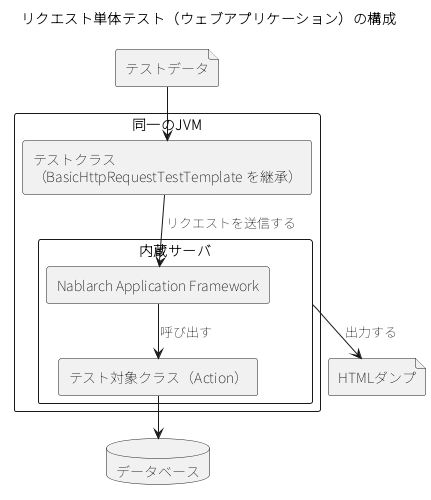
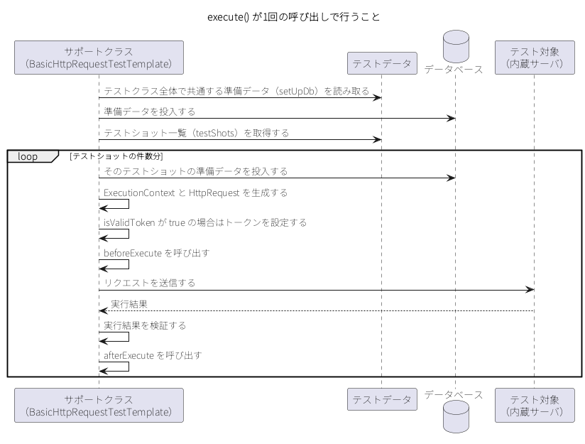
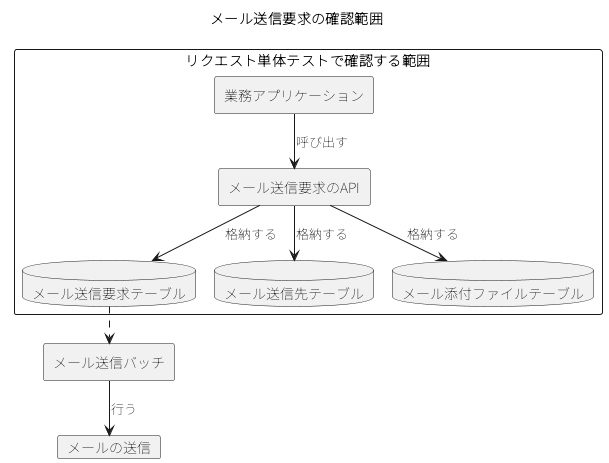
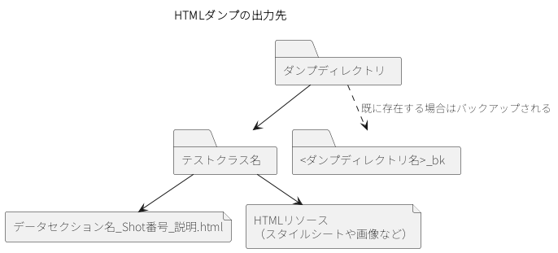

.. _request_unit_test_web:

リクエスト単体テスト（ウェブアプリケーション）
==================================================

.. contents:: 目次
  :depth: 3
  :local:

機能概要
--------------------------------------------------

ウェブアプリケーションのリクエスト単体テストは、テスティングフレームワークが起動する内蔵サーバにリクエストを送信し、返された\ HTML\ とデータベースの状態を検証することで実施する。

ウェブアプリケーションのリクエスト単体テストでは、テストデータに記述したテストショット（\ :ref:`テストショット一覧（testShots）を記述する <testdata_notation-test_shots>`\ ）を1件ずつ実行し、リクエストの生成から結果の確認までをテスティングフレームワークが行う。テストコードに記述するのは、テスト対象の\ URI\ と、テスティングフレームワークが用意していない確認処理だけである。テストの実行に必要なコンポーネント設定は、\ :ref:`リクエスト単体テストの設定（ウェブアプリケーション） <request_unit_test_setting_web>`\ に従ってあらかじめ済ませておく。

このページで扱う主なクラスとリソースを次に示す。

.. list-table::
  :class: white-space-normal
  :header-rows: 1
  :widths: 30,45,25

  * - 名称
    - 役割
    - 作成単位
  * - リクエスト単体テストクラス
    - テストロジックを実装する。
    - テスト対象クラス（\ Action\ ）につき1つ作成する。
  * - テストデータ
    - テーブルに格納する準備データや期待値、\ HTTP\ リクエストパラメータなどを記載する。
    - テストクラスにつき1つ作成する。
  * - テスト対象クラス（\ Action\ ）
    - テスト対象のクラス。\ Action\ 以降の業務ロジックを実装する各クラスを含む。
    - 取引につき1クラス作成する。
  * - ``BasicHttpRequestTestTemplate``
    - テストショットを1件ずつ実行する定型処理を提供する。テストクラスにインジェクションされる。
    - －
  * - ``TestCaseInfo``
    - テストデータに定義されたテストショットの情報を保持する。
    - －

これらのクラスと内蔵サーバは、すべて同一の\ JVM\ 上で動作する。このため、リクエストやセッションなどサーバ側のオブジェクトをテストコードから加工できる。

内蔵サーバを使用して\ HTML\ ダンプを出力するというテストの方式は、1リクエストで1画面遷移するシンクライアント型のウェブアプリケーションを対象としている。Ajaxやリッチクライアントを使用したアプリケーションでは、\ HTML\ ダンプによるレイアウトの確認はできない。

.. tip::

  本書ではViewテクノロジに\ JSP\ を用いているが、サーブレットコンテナ上で画面全体をレンダリングする方式であれば、\ JSP\ 以外のViewテクノロジでも\ HTML\ ダンプを出力できる。

ファイルアップロードとメール送信のテストも、ウェブアプリケーションのリクエスト単体テストの一種である。いずれも以降で説明する手順の上に、それぞれ固有の準備と確認が加わる（\ :ref:`アップロードファイルを用意する <request_unit_test_web-upload_file>`\ ・\ :ref:`メール送信要求を確認する <request_unit_test_web-mail>`\ ）。

使用方法
--------------------------------------------------

リクエスト単体テストは、テスティングフレームワークが用意したサポートクラスをインジェクションするテストクラスを作成し、\ ``@Test``\ を付与したテストメソッドの中でサポートクラスの\ ``execute``\ を呼び出す形で実装する。

テストクラスを作成する
~~~~~~~~~~~~~~~~~~~~~~~~~~~~~~~~~~~~~~~~~~~~~~~~~
テストクラスは、合成アノテーションを設定し、テスト対象のベース\ URI\ を指定して作成する。ここでは、サポートクラスのインジェクション、ベース\ URI\ の指定、ハンドラが行うためテストクラスに書かなくてよい処理の3つを説明する。

サポートクラスをインジェクションする
^^^^^^^^^^^^^^^^^^^^^^^^^^^^^^^^^^^^^^^^^^^^^^^^^
テストクラスは、次の条件を満たすように作成する。

* パッケージは、テスト対象の\ Action\ クラスと同じにする。
* クラス名は\ ``<Actionクラス名>RequestTest``\ とする。
* \ :java:extdoc:`BasicHttpRequestTest <nablarch.test.junit5.extension.http.BasicHttpRequestTest>`\ をテストクラスに設定し、\ :java:extdoc:`BasicHttpRequestTestTemplate <nablarch.test.core.http.BasicHttpRequestTestTemplate>`\ 型のフィールドを宣言する。プロジェクトで拡張したテンプレートの実装がある場合は、その型のフィールドと、対応する合成アノテーションを使用する（\ :ref:`拡張例 <standard_usage-extension>`\ ）。

テスト対象の\ Action\ クラスが\ ``nablarch.sample.management.user.UserSearchAction``\ である場合、テストクラスは次のようになる。

.. code-block:: java

  package nablarch.sample.management.user;

  // 中略

  @BasicHttpRequestTest(baseUri = "/action/management/user/UserSearchAction/")
  class UserSearchActionRequestTest {

      BasicHttpRequestTestTemplate support;

      // 中略

  }

.. tip::

  JUnit 4\ でテストを書く場合は、インジェクションではなく継承でテスティングフレームワークの機能を使用する（\ :ref:`JUnit 4で使用する <junit4_support>`\ ）。

サポートクラスは、テストデータに記述したテストショットを次の手順で1件ずつ実行する。テストクラス全体で共通する準備データ（\ ``setUpDb``\ ）は、この繰り返しに入る前に1回だけ投入される。

* テストデータからテストショット一覧（\ ``testShots``\ ）を取得する。
* 取得したテストショットの件数分、次を繰り返す。

  * そのテストショットの準備データをデータベースへ投入する。
  * \ ``ExecutionContext``\ と\ ``HttpRequest``\ を生成する。
  * テストショットの\ ``isValidToken``\ が\ ``true``\ の場合は、トークンを設定する。
  * リクエストの送信前に呼び出される拡張ポイント（\ ``beforeExecute``\ ）を呼び出す。
  * テスト対象へリクエストを送信する。
  * 実行結果を検証する。
  * リクエストの送信後に呼び出される拡張ポイント（\ ``afterExecute``\ ）を呼び出す。

.. tip::

  \ ``HttpRequestTestSupport``\ は、内蔵サーバの起動機能と、リクエスト単体テストで必要となるアサートを提供する。データベースを使用するテストに必要な機能は、このクラスが\ :java:extdoc:`DbAccessTestSupport <nablarch.test.core.db.DbAccessTestSupport>`\ へ処理を委譲することで実現している。このため、準備データの投入やテーブルの検証は\ :ref:`コンポーネント単体テスト <component_unit_test>`\ と同じように行える。

ベースURIを指定する
^^^^^^^^^^^^^^^^^^^^^^^^^^^^^^^^^^^^^^^^^^^^^^^^^
ベース\ URI\ は、前項の例のように、合成アノテーション\ :java:extdoc:`BasicHttpRequestTest <nablarch.test.junit5.extension.http.BasicHttpRequestTest>`\ の\ ``baseUri``\ 属性へ指定する。リクエスト送信先の\ URI\ は、ここに指定した値と、テストショットで指定したリクエスト\ ID\ を連結して組み立てられる。リクエスト\ ID\ の指定方法は\ :ref:`テストショット一覧（testShots）を記述する <testdata_notation-test_shots>`\ を参照。

指定した値の扱いは\ :ref:`BasicHttpRequestTestTemplateを使用する <standard_usage-base_uri>`\ を参照。

ハンドラが行う処理をテストクラスから省く
^^^^^^^^^^^^^^^^^^^^^^^^^^^^^^^^^^^^^^^^^^^^^^^^^
リクエスト単体テストは、クラス単体テストと違ってハンドラを経由してテスト対象を呼び出す。このため、クラス単体テストではテストクラスに書いていた次の処理を書く必要はない。

* \ ``ThreadContext``\ への値の設定。ハンドラが設定するため不要である。ログインユーザの\ ID\ は、テストショットの\ ``context``\ カラムで指定する。
* トランザクションの制御。ハンドラがコミットするため、テストクラスから明示的にコミットする必要はない。

\ ``DbAccessTestSupport``\ が持つ次のメソッドは、上記のとおりハンドラが行うためリクエスト単体テストでは不要である。アプリケーションプログラマに誤解を与えないよう、これらは意図的に委譲しておらず、テストクラスから呼び出せない。

* ``public void beginTransactions()``
* ``public void commitTransactions()``
* ``public void endTransactions()``
* ``public void setThreadContextValues(String sheetName, String id)``

テストメソッドを作成する
~~~~~~~~~~~~~~~~~~~~~~~~~~~~~~~~~~~~~~~~~~~~~~~~~
テストメソッドは、テストデータの読み込み単位（\ :ref:`テストクラスとテストデータの対応 <testdata_notation-file_structure>`\ 参照）と1対1で対応させて作成する。ここでは、テストメソッドの分割方針、テストを実行するメソッドの呼び出し、実行前後への固有処理の挿し込み、二重サブミット防止機能のトークンの設定、リクエストと実行コンテキストの組み立ての5つを説明する。

テストメソッドを分割する
^^^^^^^^^^^^^^^^^^^^^^^^^^^^^^^^^^^^^^^^^^^^^^^^^
作成するテストメソッドは、次の手順で決める。

* リクエスト\ ID\ ごと（\ Action\ のメソッドごと）に、テストショットを正常系と異常系に分類し、それぞれテストメソッドを作成する。メニューからの単純な画面遷移のように異常系がない場合は、正常系のテストメソッドだけを作成する。
* 画面表示の検証項目は、正常系と異常系のいずれかのテストメソッドに含められるかを検討する。1つの読み込み単位に正常系・異常系・画面表示の検証を混在させるとテストデータの記述が煩雑になる場合は、画面表示の検証用のテストメソッドを別に作成する。そうでない場合は、正常系または異常系のテストメソッドに含める。

正常系・異常系・画面表示の検証用に分割した場合の例を次に示す。読み込み単位の名前は、既定ではテストメソッド名と同じにする（後述）。

.. list-table::
  :class: white-space-normal
  :header-rows: 1
  :widths: 20,25,55

  * - リクエストID
    - Actionメソッド名
    - テストメソッド名（＝読み込み単位の名前）
  * - ``USERS00101``
    - ``doUsers00101``
    - ``testUsers00101Normal``\ （正常系）・\ ``testUsers00101Abnormal``\ （異常系）・\ ``testUsers00101View``\ （画面表示の検証用）

.. tip::

  テストメソッドを分割するのは、1つの読み込み単位が煩雑になり可読性が下がることを避けるためである。この例以外でも、1つの読み込み単位にさまざまなテストショットを詰め込むと可読性が下がる場合は、読み込み単位を分割する。

テストを実行するメソッドを呼び出す
^^^^^^^^^^^^^^^^^^^^^^^^^^^^^^^^^^^^^^^^^^^^^^^^^
テストメソッドには\ ``@Test``\ を付与し、その中でサポートクラスの\ ``execute``\ を呼び出す。実行前後に固有の処理が不要な場合は、引数のない\ ``execute``\ を使用する。

.. code-block:: java

  @Test
  void testUsers00101Normal() {
      support.execute();
  }

引数のない\ ``execute``\ は、テストメソッド名と同じ名前の読み込み単位を読み込む。読み込み単位の名前をテストメソッド名と変えたい場合は、読み込み単位の名前を引数に取るオーバーロードメソッドを呼び出す。

.. code-block:: java

  void execute()
  void execute(String sheetName)
  void execute(boolean shouldSetUpDb)
  void execute(String sheetName, boolean shouldSetUpDb)

.. tip::

  \ ``shouldSetUpDb``\ に\ ``false``\ を指定すると、テストクラス全体で共通する準備データ（\ ``setUpDb``\ ）の投入を省略できる。

実行前後に固有の処理を挿し込む
^^^^^^^^^^^^^^^^^^^^^^^^^^^^^^^^^^^^^^^^^^^^^^^^^
サポートクラスは、どのテストショットでも必要になる処理を定型化している。テストショットによっては、これに加えて固有の処理が必要になる。リクエストスコープに格納されたエンティティの内容を確認したい場合などである。

固有の準備処理や結果確認処理が必要な場合は、\ :java:extdoc:`Advice <nablarch.test.core.http.Advice>`\ を引数に取るオーバーロードメソッドを呼び出し、リクエストの送信前後に処理を挿し込む。\ :java:extdoc:`BasicAdvice <nablarch.test.core.http.BasicAdvice>`\ には次の2つのメソッドが用意されており、それぞれリクエストの送信前と送信後に呼び出される。

.. code-block:: java

  void beforeExecute(TestCaseInfo testCaseInfo, ExecutionContext context)
  void afterExecute(TestCaseInfo testCaseInfo, ExecutionContext context)

実装例を次に示す。

.. code-block:: java

  @Test
  void testMenus00102Normal() {
      support.execute(new BasicAdvice() {
          // リクエストの送信前に呼び出される
          @Override
          public void beforeExecute(TestCaseInfo testCaseInfo,
                  ExecutionContext context) {
              // ここに準備処理を記述する
          }

          // リクエストの送信後に呼び出される
          @Override
          public void afterExecute(TestCaseInfo testCaseInfo,
                  ExecutionContext context) {
              // ここに結果確認処理を記述する
          }
      });
  }

.. tip::

  2つのメソッドの両方をオーバーライドする必要はない。必要なものだけをオーバーライドする。また、これらのメソッドの中にすべての処理を記述する必要もない。記述が長くなる場合や、テストメソッド間で共通する処理がある場合は、プライベートメソッドに切り出す。

\ ``TestCaseInfo``\ からは、実行中のテストショットの情報を取得できる。結果確認処理で使用する主なメソッドは次のとおりである。

.. list-table::
  :class: white-space-normal
  :header-rows: 1
  :widths: 40,60

  * - メソッド
    - 取得できる値
  * - ``getTestCaseName()``
    - テストショットを識別する名前（\ ``読み込み単位の名前_Shot番号_説明``\ ）。アサート失敗時のメッセージと\ HTML\ ダンプのファイル名に使用する
  * - ``getSheetName()``
    - 読み込み単位の名前
  * - ``getTestCaseNo()``
    - テストショット番号
  * - ``getHttpRequest()``
    - テスト対象の実行後の\ ``HttpRequest``

.. _how_to_set_token_in_request_unit_test:

二重サブミット防止機能のトークンを設定する
^^^^^^^^^^^^^^^^^^^^^^^^^^^^^^^^^^^^^^^^^^^^^^^^^
二重サブミット防止機能（\ :ref:`二重サブミットを防ぐ <tag-double_submission>`\ ）は、サーバサイドとクライアントサイドの両方で動作する。リクエスト単体テストでは、このうちサーバサイドの動作を確認する。

二重サブミット防止を施した\ URI\ に対するテストでは、リクエストの送信前に有効なトークンを発行し、セッションに設定しておく必要がある。テストショットの\ ``isValidToken``\ カラムに\ ``true``\ を指定すると、サポートクラスがトークンを発行して設定する。\ ``false``\ を指定するとトークンが設定されないため、エラーになることを確認することで、二重サブミット防止機能が動作していることを確認できる。カラムの詳細は\ :ref:`テストショット一覧（testShots）を記述する <testdata_notation-test_shots>`\ を参照。

サポートクラスが生成するリクエストを使わず、テストコードからトークンを設定する場合は、次のメソッドを呼び出す。トークンの発行とセッションへの格納が行われる。

.. code-block:: java

  void setValidToken(HttpRequest request, ExecutionContext context)

トークンを設定するかどうかをテストデータで制御したい場合は、次のメソッドを使用する。第3引数が\ ``true``\ の場合は\ ``setValidToken``\ と同じ動作になり、\ ``false``\ の場合はセッションからトークンが取り除かれる。テストクラスに分岐処理を書かずに済む。

.. code-block:: java

  void setToken(HttpRequest request, ExecutionContext context, boolean valid)

実装例を次に示す。

.. code-block:: java

  // テストデータから取得した値（"true" または "false"）が isValidToken に
  // 格納されているものとする。"true"の場合はトークンが設定される
  support.setToken(request, context, Boolean.parseBoolean(isValidToken));

リクエストと実行コンテキストを組み立てる
^^^^^^^^^^^^^^^^^^^^^^^^^^^^^^^^^^^^^^^^^^^^^^^^^
内蔵サーバへのリクエストの送信には、\ ``HttpRequest``\ と\ ``ExecutionContext``\ のインスタンスが必要である。\ ``execute``\ を使う場合、これらはテストショットの内容から自動的に生成されるため、テストコードで組み立てる必要はない。テストショットを使わずにテストを組み立てる場合は、次のメソッドでインスタンスを生成する。

.. code-block:: java

  HttpRequest createHttpRequest(String requestUri, Map<String, String[]> params)
  HttpRequest createHttpRequest(String requestUri, String httpMethod, Map<String, String[]> params)
  ExecutionContext createExecutionContext(String userId)

\ ``createHttpRequest``\ は、受け取ったリクエスト\ URI\ とリクエストパラメータを元に\ ``HttpRequest``\ インスタンスを生成して返す。\ HTTP\ メソッドを指定しないオーバーロードメソッドでは、\ ``POST``\ が設定される。リクエストパラメータと\ URI\ 以外のデータを設定する場合は、返されたインスタンスに対して設定する。

\ ``createExecutionContext``\ の引数にはユーザ\ ID\ を指定する。指定したユーザ\ ID\ はセッションに格納され、そのユーザ\ ID\ でログインしている状態になる。

生成したインスタンスは、次のメソッドに引き渡して送信する。内蔵サーバが起動され、リクエストが送信される。第1引数にはテストクラス自身の\ ``Class``\ オブジェクト（\ ``getClass()``\ ）を指定する。指定したクラスの名前が、\ HTML\ ダンプの出力先ディレクトリの決定に使われる。第2引数に指定した名前が、\ HTML\ ダンプのファイル名になる。

.. code-block:: java

  HttpResponse execute(Class<?> testClass, String caseName, HttpRequest req, ExecutionContext ctx)

テストデータを作成する
~~~~~~~~~~~~~~~~~~~~~~~~~~~~~~~~~~~~~~~~~~~~~~~~~
テストデータの格納場所と記述方法は\ :ref:`テストデータの書き方 <testdata_notation>`\ に従う。記述例は\ :ref:`テストデータの記載例 <testdata_examples>`\ を参照。ここでは、サポートクラスが自動的に読み込むデータブロックと、ファイルアップロードのテストで必要になるアップロードファイルの用意を説明する。

サポートクラスが読み込むデータブロックを記述する
^^^^^^^^^^^^^^^^^^^^^^^^^^^^^^^^^^^^^^^^^^^^^^^^^
サポートクラスが自動的に読み込むのは、次のデータブロックである。

* テストクラス全体で共通する準備データ（\ :ref:`共通の準備データをまとめる <testdata_notation-setupdb>`\ 参照）
* テストショット一覧（\ :ref:`テストショット一覧（testShots）を記述する <testdata_notation-test_shots>`\ 参照）
* \ HTTP\ リクエストパラメータ（\ ``requestParams``\ ）とレスポンスの期待値（\ ``responseResult``\ ）（\ :ref:`テストショット一覧（testShots）を記述する <testdata_notation-test_shots>`\ 参照）
* テストショットのカラムから参照される準備データ・期待値

これら以外のテストデータも記述できる。その場合は\ :ref:`LIST_MAPのデータを記述する <testdata_notation-list_map>`\ に従って記述し、値を取得する処理をテストコードに実装する。取得には\ ``getListMap``\ を使用する（後述）。

.. tip::

  テストショット一覧に記述するリクエストパラメータは、出力された\ HTML\ ダンプから\ :ref:`リクエスト単体データ作成ツール <request_data_tool>`\ を使って得られる。パラメータ名を人手で書き写す必要がなくなる。

.. _request_unit_test_web-upload_file:

アップロードファイルを用意する
^^^^^^^^^^^^^^^^^^^^^^^^^^^^^^^^^^^^^^^^^^^^^^^^^
ファイルアップロードのテストでは、\ HTTP\ リクエストパラメータの値に\ ``${attach:ファイルパス}``\ と記述してアップロードファイルを指定する。記法の詳細は\ :ref:`null・空文字・改行など特殊な値を記述する <testdata_notation-special_notation>`\ を参照。

アップロードするファイルの用意には、2つの方法がある。

* **ファイルをあらかじめ配置する。** 画像ファイルなどのバイナリファイルの場合はこの方法を採る。配置したファイルへのパスを\ ``${attach:...}``\ に指定する。
* **ファイルの内容をテストデータに記述する。** 固定長ファイルや\ CSV\ ファイルの場合はこの方法を採れる。テストの実行時に、テスティングフレームワークがこのデータを元にファイルを作成する。ファイルのデータブロックの記述方法は\ :ref:`ファイルのデータを記述する <testdata_notation-file_data>`\ を参照。

.. tip::

  固定長ファイルや\ CSV\ ファイルをアップロードする場合でも、バイナリファイルと同じようにファイルをあらかじめ配置しておくことはできる。ただし、テストデータの保守しやすさを考えると、ファイルの内容はテストデータに記述するほうがよい。

テストを実行する
~~~~~~~~~~~~~~~~~~~~~~~~~~~~~~~~~~~~~~~~~~~~~~~~~
通常の\ JUnit\ テストと同じように実行する。内蔵サーバの起動とリクエストの送信は、サポートクラスが行う。

テストショットごとに\ HTML\ ダンプが出力される。出力先のディレクトリ（以下、ダンプディレクトリ）と、\ HTML\ ダンプの内容に関する設定は\ :ref:`リクエスト単体テストの設定（ウェブアプリケーション） <request_unit_test_setting_web>`\ を参照。

テスト結果を確認する
~~~~~~~~~~~~~~~~~~~~~~~~~~~~~~~~~~~~~~~~~~~~~~~~~
サポートクラスは、テストショットごとに次の項目を自動的に確認する。確認する内容はテストショット一覧のカラムで指定するため、テストコードに確認処理を書く必要はない。カラムの詳細は\ :ref:`テストショット一覧（testShots）を記述する <testdata_notation-test_shots>`\ を参照。

* \ HTTP\ ステータスコードの確認（\ ``expectedStatusCode``\ ）
* アプリケーション例外に格納されたメッセージ\ ID\ の確認（\ ``expectedMessageId``\ ）
* リクエストスコープの値の確認（\ ``responseResult``\ ）
* 検索結果の確認（\ ``expectedSearch``\ ）
* テーブルの更新結果の確認（\ ``expectedTable``\ ）
* フォワード先の\ URI\ の確認（\ ``forwardUri``\ ）
* ダウンロードしたファイルのコンテンツレングス・コンテンツタイプ・ファイル名の確認（\ ``expectedContentLength``\ ・\ ``expectedContentType``\ ・\ ``expectedContentFileName``\ ）
* 同期送信したメッセージの確認（\ ``expectedMessage``\ ・\ ``responseMessage``\ ）

ここでは、これらで確認できない項目を\ ``afterExecute``\ の中で確認する4つ（リクエストスコープの値の確認、オブジェクトのプロパティの確認、アプリケーションのメッセージの確認、ダウンロードファイルの確認）と、テストコードを書かずに確認する2つ（メール送信要求の確認、\ HTML\ ダンプの目視での確認）を説明する。

リクエストスコープの値を確認する
^^^^^^^^^^^^^^^^^^^^^^^^^^^^^^^^^^^^^^^^^^^^^^^^^
リクエストスコープに複数種類の検索結果が格納されている場合など、テストショット一覧のカラムだけでは指定しきれない場合は、\ ``afterExecute``\ の中で値を取り出して確認する。次の例では、2種類の検索結果がそれぞれ期待値のとおりであることを確認している。

.. code-block:: java

  @Test
  void testMenus00103() {
      support.execute(new BasicAdvice() {
          @Override
          public void afterExecute(TestCaseInfo testCaseInfo,
                  ExecutionContext context) {

              String message = testCaseInfo.getTestCaseName();
              String sheetName = testCaseInfo.getSheetName();
              String no = testCaseInfo.getTestCaseNo();

              // グループ検索結果を確認する
              SqlResultSet actualGroup = (SqlResultSet) context.getRequestScopedVar("allGroup");
              support.assertSqlResultSetEquals(message, sheetName, "expectedUgroup" + no, actualGroup);

              // ユースケース検索結果を確認する
              SqlResultSet actualUseCase = (SqlResultSet) context.getRequestScopedVar("allUseCase");
              support.assertSqlResultSetEquals(message, sheetName, "expectedUseCase" + no, actualUseCase);
          }
      });
  }

格納されている値の型ごとに、次のメソッドを使い分ける。

.. list-table::
  :class: white-space-normal
  :header-rows: 1
  :widths: 25,75

  * - 値の型
    - 使用するメソッド
  * - ``SqlResultSet``
    - ``assertSqlResultSetEquals(String message, String sheetName, String id, SqlResultSet actual)``
  * - ``SqlRow``
    - ``assertSqlRowEquals(String message, String sheetName, String id, SqlRow actual)``
  * - エンティティ・\ Form
    - ``assertEntity(String sheetName, String id, Object actual)``
  * - 上記以外
    - 期待値を読み込む処理を記述したうえで、テスティングフレームワークまたは\ JUnit\ のAPIで確認する

エンティティや\ Form\ を確認する場合の例を次に示す。期待値は、\ :ref:`エンティティ単体テスト <entity_unit_test>`\ のsetter・getterのテストと同じ書式で記述する。ただし、この場合はsetterの欄は不要である。

.. code-block:: java

  @Test
  void testUsers00302Normal() {
      support.execute(new BasicAdvice() {
          @Override
          public void afterExecute(TestCaseInfo testCaseInfo,
                  ExecutionContext context) {
              String sheetName = testCaseInfo.getSheetName();

              // 期待値のID（接頭辞"systemAccount" + テストショット番号）
              String expectedSystemAccountId = "systemAccount" + testCaseInfo.getTestCaseNo();
              // 実際の値をリクエストスコープから取り出す
              Object actualSystemAccount = context.getRequestScopedVar("systemAccount");
              support.assertEntity(sheetName, expectedSystemAccountId, actualSystemAccount);
          }
      });
  }

.. tip::

  リクエストスコープに\ Form\ が格納されている場合、別の\ Form\ を設定したプロパティでなければ、エンティティと同じように確認できる。別の\ Form\ を設定したプロパティの場合は、その\ Form\ を取得したうえで、エンティティと同じように確認する。

上記以外の型の値を確認する場合は、期待値をテストデータから取得する処理を記述する。取得には\ ``getListMap``\ を使用する。

.. code-block:: java

  @Test
  void testUsers00303Normal() {
      support.execute(new BasicAdvice() {
          @Override
          public void afterExecute(TestCaseInfo testCaseInfo, ExecutionContext context) {
              // 期待値をテストデータから取得する（読み込み単位はテストメソッド名と同じ）
              List<Map<String, String>> expected =
                      support.getListMap(testCaseInfo.getSheetName(), "result_1");
              // テストの実行後のリクエストスコープから実際の値を取得する
              List<Map<String, String>> actual = context.getRequestScopedVar("pageData");
              // nablarch.test.Assertion のstaticメソッド
              Assertion.assertListMapEquals(expected, actual);
          }
      });
  }

テスト対象がリクエストパラメータを書き換える場合は、\ ``TestCaseInfo``\ から実行後の\ ``HttpRequest``\ を取り出して確認する。\ :ref:`入力データを画面間で持ち回る(ウィンドウスコープ) <tag-window_scope>`\ の値をリセットするためにリクエストパラメータを書き換える場合などが該当する。

.. code-block:: java

  @Test
  void testUsers00304Normal() {
      support.execute(new BasicAdvice() {
          @Override
          public void afterExecute(TestCaseInfo testCaseInfo, ExecutionContext context) {
              // テストの実行後のHttpRequest
              HttpRequest request = testCaseInfo.getHttpRequest();
              // リクエストパラメータがリセットされていること
              assertEquals("", support.getParam(request, "resetparameter")[0]);
          }
      });
  }

オブジェクトのプロパティを確認する
^^^^^^^^^^^^^^^^^^^^^^^^^^^^^^^^^^^^^^^^^^^^^^^^^
リクエストスコープなどから取り出したオブジェクトのプロパティを確認する場合は、次のメソッドを使用する。エンティティや\ Form\ を1件だけ確認する場合は前述の\ ``assertEntity``\ でもよいが、配列やリストを確認する場合や、アサート失敗時のメッセージを指定したい場合はこちらを使用する。第1引数にはアサート失敗時のメッセージ、第2引数には読み込み単位の名前、第3引数には期待値の\ ID\ 、第4引数には確認対象を指定する。

.. code-block:: java

  void assertObjectPropertyEquals(String message, String sheetName, String id, Object actual)
  void assertObjectArrayPropertyEquals(String message, String sheetName, String id, Object[] actual)
  void assertObjectListPropertyEquals(String message, String sheetName, String id, List<?> actual)

期待値は\ ``LIST_MAP``\ で記述する。キーにプロパティ名、値に確認に使用するプロパティの値を記述する。記述方法は\ :ref:`LIST_MAPのデータを記述する <testdata_notation-list_map>`\ を参照。

実装例を次に示す。

.. code-block:: java

  @Test
  void testRW11AC0301Normal() {
      support.execute(new BasicAdvice() {
          @Override
          public void afterExecute(TestCaseInfo testCaseInfo,
                  ExecutionContext context) {
              String message = testCaseInfo.getTestCaseName();
              String sheetName = testCaseInfo.getSheetName();

              UserForm form = (UserForm) context.getRequestScopedVar("user_form");
              UsersEntity users = form.getUsers();

              // usersのプロパティ kanjiName・kanaName・mailAddress を確認する
              support.assertObjectPropertyEquals(message, sheetName, "expectedUsers", users);
          }
      });
  }

アプリケーションのメッセージを確認する
^^^^^^^^^^^^^^^^^^^^^^^^^^^^^^^^^^^^^^^^^^^^^^^^^
アプリケーション例外に格納されたメッセージは、テストショット一覧の\ ``expectedMessageId``\ カラムで指定すればサポートクラスが確認する。\ ``afterExecute``\ の中から直接確認する場合は、次のメソッドを呼び出す。

.. code-block:: java

  void assertApplicationMessageId(String expectedCommaSeparated, ExecutionContext actual)

引数には、期待するメッセージ\ ID\ （複数ある場合はカンマ区切り）と、リクエストの送信に使用した\ ``ExecutionContext``\ を引き渡す。例外が発生しなかった場合や、アプリケーション例外以外の例外が発生した場合は、アサート失敗になる。

.. tip::

  メッセージ\ ID\ の比較は\ ID\ をソートした状態で行うため、テストデータに記述する際に順序を気にする必要はない。

ダウンロードファイルを確認する
^^^^^^^^^^^^^^^^^^^^^^^^^^^^^^^^^^^^^^^^^^^^^^^^^
ダウンロードされたファイルは、\ HTML\ ダンプと同じディレクトリへ出力される。ファイル名は\ ``読み込み単位の名前_Shot番号_説明_ダウンロードされたファイル名``\ で、\ HTML\ ダンプのファイル名の拡張子を、ダウンロードされたファイル名に置き換えたものになる。

期待するファイルの内容はテストデータに記述し、\ :java:extdoc:`FileSupport <nablarch.test.core.file.FileSupport>`\ の\ ``assertFile``\ で確認する。ファイルのデータブロックの記述方法は\ :ref:`ファイルのデータを記述する <testdata_notation-file_data>`\ を参照。

.. code-block:: java

  FileSupport fileSupport = new FileSupport(getClass());

  @Test
  void testRW11AC0104Download() {
      support.execute(new BasicAdvice() {
          @Override
          public void afterExecute(TestCaseInfo testCaseInfo, ExecutionContext context) {
              String msgOnFail = "ダウンロードしたユーザ一覧照会結果のCSVファイルのアサートに失敗しました。";
              fileSupport.assertFile(msgOnFail, "testRW11AC0104Download");
          }
      });
  }

.. _request_unit_test_web-mail:

メール送信要求を確認する
^^^^^^^^^^^^^^^^^^^^^^^^^^^^^^^^^^^^^^^^^^^^^^^^^
\ :ref:`メール送信 <mail>`\ では、業務アプリケーションはメール送信要求のAPIを呼び出すだけであり、メールの送信そのものはメール送信バッチが行う。このため、リクエスト単体テストで確認する範囲は、メール送信要求が受け付けられ、データベースに格納されるところまでとなる。

確認するのは、メール送信要求テーブル・メール送信先テーブル・メール添付ファイルテーブルの3つに、要求が正しく格納されることである。他のテストと同じように、この3つのテーブルの期待値をテストデータに記述すればよい。

HTMLダンプを目視で確認する
^^^^^^^^^^^^^^^^^^^^^^^^^^^^^^^^^^^^^^^^^^^^^^^^^
出力された\ HTML\ ダンプは、ブラウザで開いて目視で確認する。

ダンプディレクトリの配下にはテストクラスごとのディレクトリが作られ、その配下に\ ``読み込み単位の名前_Shot番号_説明.html``\ という名前で\ HTML\ ダンプが出力される。\ HTML\ ダンプが参照する\ HTML\ リソース（スタイルシートや画像など）も同じディレクトリへ出力されるため、このディレクトリを保存しておけば、どの環境でも同じように表示を確認できる。

ダンプディレクトリが既に存在する場合は、\ ``<ダンプディレクトリ名>_bk``\ という名前でバックアップされる。ダンプディレクトリの指定とバックアップの抑止は\ :ref:`リクエスト単体テストの設定（ウェブアプリケーション） <request_unit_test_setting_web>`\ を参照。

.. tip::

  \ HTML\ チェックを有効にしている場合、出力された\ HTML\ は、テスティングフレームワークが\ :ref:`HTMLチェックツール <html_check_tool>`\ を使って自動的にチェックする。構文の誤りなどの違反があった場合は、その内容に応じた例外が発生し、そのテストショットは失敗になる。有効・無効の切り替えは\ :ref:`リクエスト単体テストの設定（ウェブアプリケーション） <request_unit_test_setting_web>`\ を参照。
