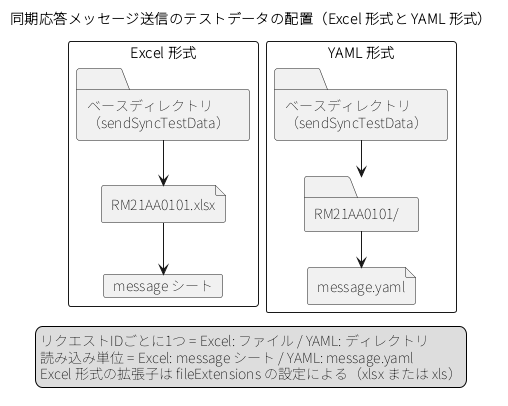

.. _testing_framework_common:

共通設定
==================================================

.. contents:: 目次
  :depth: 3
  :local:

機能概要
--------------------------------------------------
共通設定は、テストの種類によらず、テスティングフレームワークを使うすべてのプロジェクトで行う設定である。依存関係の追加とテスト用のコンポーネント設定ファイルの用意は必須で、テストを書く前に済ませておく。そのほかに、システム日時の固定やテストデータの読み込み先の変更など、テストを安定して繰り返すための設定をここでまとめて行う。

使用方法
--------------------------------------------------

テスティングフレームワークを依存関係に追加する
~~~~~~~~~~~~~~~~~~~~~~~~~~~~~~~~~~~~~~~~~~~~~~~~~
テスティングフレームワークは\ ``nablarch-testing``\ として提供される。テストでのみ使用するため、\ ``test``\ スコープで依存関係に追加する。

.. code-block:: xml

  <!-- テスティングフレームワーク -->
  <dependency>
    <groupId>com.nablarch.framework</groupId>
    <artifactId>nablarch-testing</artifactId>
    <scope>test</scope>
  </dependency>

.. tip::

  処理方式によっては、専用のモジュールを使用する。専用のモジュールが\ ``nablarch-testing``\ に依存する場合は、\ ``nablarch-testing``\ を個別に追加しなくてよい。必要なモジュールは、\ :ref:`リクエスト単体テストの設定（RESTfulウェブサービス） <request_unit_test_setting_rest>`\ のように、該当するページに記載している。

.. _testing_framework_common-test_component_config:

テスト用のコンポーネント設定ファイルを用意する
~~~~~~~~~~~~~~~~~~~~~~~~~~~~~~~~~~~~~~~~~~~~~~~~~
テスティングフレームワークは、テストの実行時にクラスパス直下の\ ``unit-test.xml``\ をコンポーネント設定ファイルとして読み込む。このファイルには、本番用のコンポーネント設定ファイルをimportしたうえで、テストに必要な設定を記述する。本番用と異なる設定にするコンポーネントは、importの後に同じ名前で定義して上書きする（\ :ref:`repository-override_bean`\ ）。以降のページで「テスト用のコンポーネント設定ファイル」と書いている設定は、すべてこのファイルに記述する。

環境設定ファイルは、importした本番用のコンポーネント設定ファイルが読み込むものがそのまま使われる。テストだけで使う設定値と、本番用と異なる値にする設定値は、テスト用の環境設定ファイルに記述し、このファイルからconfig-file要素で読み込む（\ :ref:`repository-user_environment_configuration`\ ）。後から読み込んだ値が優先されるため、config-file要素はimportの後に置く。以降のページで「環境設定ファイルに記述する」と書いている設定値は、このテスト用の環境設定ファイルに記述する。

.. code-block:: xml

  <component-configuration
          xmlns="http://tis.co.jp/nablarch/component-configuration"
          xmlns:xsi="http://www.w3.org/2001/XMLSchema-instance"
          xsi:schemaLocation="http://tis.co.jp/nablarch/component-configuration https://nablarch.github.io/schema/component-configuration.xsd">

    <!-- 本番用のコンポーネント設定ファイル -->
    <import file="web-component-configuration.xml"/>

    <!-- テスティングフレームワークのデフォルト設定（必要なものを各ページに従って追加する） -->
    <import file="nablarch/test/test-data.xml"/>

    <!-- 本番用の設定の上書き -->
    <component name="..." class="..."/>

    <!-- テスト用の環境設定ファイル -->
    <config-file file="unit-test.properties"/>

  </component-configuration>

.. _testing_framework_common-yaml_testdata:

テストデータの形式をYAMLに変更する
~~~~~~~~~~~~~~~~~~~~~~~~~~~~~~~~~~~~~~~~~~~~~~~~~
テストデータは、デフォルトでは\ Excel\ 形式で読み込まれる。\ Excel\ 形式で記述する場合、設定は不要である。

YAML\ 形式で記述する場合は、\ ``nablarch-testing-yaml``\ を依存関係に追加する。\ YAML\ 形式のテストデータを解析するクラスは、このモジュールが提供する。

.. code-block:: xml

  <!-- YAML形式のテストデータ -->
  <dependency>
    <groupId>com.nablarch.framework</groupId>
    <artifactId>nablarch-testing-yaml</artifactId>
    <scope>test</scope>
  </dependency>

あわせて、テストデータを解析するコンポーネント\ ``testDataParser``\ を\ YAML\ 形式用のクラスに差し替える。特殊記法を解釈するクラス群も、\ YAML\ 形式用のものを指定する。

.. code-block:: xml

  <!-- YAML形式のテストデータ記法の解釈を行うクラス群 -->
  <list name="yamlInterpreters">
    <component class="nablarch.test.core.util.interpreter.DateTimeInterpreter">
      <property name="systemTimeProvider" ref="systemTimeProvider"/>
    </component>
    <component class="nablarch.test.core.util.interpreter.CompositeInterpreter">
      <property name="interpreters">
        <list>
          <component class="nablarch.test.core.util.interpreter.BasicJapaneseCharacterInterpreter"/>
        </list>
      </property>
    </component>
  </list>

  <!-- テストデータを解析するコンポーネント -->
  <component name="testDataParser"
             class="nablarch.test.core.reader.YamlTestDataParser">
    <property name="dbInfo" ref="dbInfo"/>
    <property name="interpreters" ref="yamlInterpreters"/>
  </component>

``yamlInterpreters``\ に指定するのは、この2つだけでよい。\ null\ ・空文字・ダブルクォート・改行文字は\ YAML\ のパーサが構文として解釈するため、\ Excel\ 形式で必要な\ ``NullInterpreter``\ ・\ ``QuotationTrimmer``\ ・\ ``LineSeparatorInterpreter``\ は指定しない。

.. important::

  ``NullInterpreter``\ を指定してはならない。指定すると、文字列として記述した ``"null"``\ も\ Java\ の\ null\ になり、両者を区別できなくなる。

``testDataReader``\ は指定しない。\ :java:extdoc:`YamlTestDataParser <nablarch.test.core.reader.YamlTestDataParser>`\ は\ YAML\ ファイルを直接読み込むため、この設定を使用しない。

テストデータの記法は :ref:`テストデータの書き方 <testdata_notation>` を参照。

テストデータの読み込み先を変更する
~~~~~~~~~~~~~~~~~~~~~~~~~~~~~~~~~~~~~~~~~~~~~~~~~
テストデータは、デフォルトでは\ ``src/test/java``\ 配下から読み込まれる。プロジェクトのディレクトリ構成に合わせて読み込み先を変更する場合は、環境設定ファイルに\ ``nablarch.test.resource-root``\ を設定する。値には、テスト実行時のカレントディレクトリからの相対パスを指定する。

.. code-block:: properties

  nablarch.test.resource-root=path/to/test-data-dir

読み込み先は、セミコロン（\ ``;``\ ）で区切って複数指定できる。

.. code-block:: properties

  nablarch.test.resource-root=test/online;test/batch

.. important::

  同名のテストデータが複数のディレクトリに存在する場合、最初に見つかったものが読み込まれる。

.. tip::

  読み込み先を一時的に変更したい場合は、環境設定ファイルを変更せずに、テスト実行時に\ ``-Dnablarch.test.resource-root=path/to/test-data-dir``\ をシステムプロパティとして指定してもよい。詳細は\ :ref:`システムプロパティを使って環境依存値を上書きする <repository-overwrite_environment_configuration>`\ を参照。

システム日時を固定する
~~~~~~~~~~~~~~~~~~~~~~~~~~~~~~~~~~~~~~~~~~~~~~~~~
登録日時や更新日時のようにシステム日時を設定する項目は、そのままテストを実行すると実行日によって値が変わるため、設定値が正しいことを自動テストで確認できない。テスティングフレームワークは、システム日時として固定値を返す機能を提供する。この機能を使うと、システム日時を設定する項目についても、期待値と比較して設定値が正しいことを確認できる。

Nablarch Application Frameworkでは、\ :java:extdoc:`SystemTimeProvider <nablarch.core.date.SystemTimeProvider>`\ インタフェースの実装クラスがシステム日時を提供する。テストでは、コンポーネント設定ファイルでこの実装クラスを指定している箇所を、固定値を返す\ :java:extdoc:`FixedSystemTimeProvider <nablarch.test.FixedSystemTimeProvider>`\ に差し替え、\ ``fixedDate``\ プロパティに固定したい日時を指定する。システム日時を2010年9月14日12時34分56秒に固定する場合の例を示す。

.. code-block:: xml

  <component name="systemTimeProvider"
      class="nablarch.test.FixedSystemTimeProvider">
    <property name="fixedDate" value="20100914123456" />
  </component>

``fixedDate``\ には、\ ``yyyyMMddHHmmss``\ （14桁）または\ ``yyyyMMddHHmmssSSS``\ （17桁）のいずれかの形式に合致する文字列を指定する。この設定を行うと、テスト対象のアプリケーションが\ ``SystemTimeProvider``\ を通じて取得するシステム日時は、指定した日時に固定される。

シーケンス採番をテーブル採番に置き換える
~~~~~~~~~~~~~~~~~~~~~~~~~~~~~~~~~~~~~~~~~~~~~~~~~
シーケンスオブジェクトを使用して採番する処理は、次に採番される値を事前に予測できないため、期待値を設定できない。テスティングフレームワークは、シーケンスオブジェクトを使用した採番処理を、コンポーネント設定ファイルの変更だけでテーブル採番に置き換える機能を提供する。テーブル採番に置き換えたうえで、採番用テーブルに準備データを投入し、投入した値を元に期待値を設定することで、採番処理が正しく行われていることを確認できる。

本番用のコンポーネント設定ファイルに、次のようなシーケンスオブジェクトを使用した採番の設定があるとする。

.. code-block:: xml

  <!-- シーケンスオブジェクトを使用した採番設定 -->
  <component name="idGenerator" class="com.example.common.idgenerator.OracleSequenceIdGenerator">
    <property name="idTable">
      <map>
        <entry key="1101" value="SEQ_1"/> <!-- ID1採番用 -->
        <entry key="1102" value="SEQ_2"/> <!-- ID2採番用 -->
        <entry key="1103" value="SEQ_3"/> <!-- ID3採番用 -->
        <entry key="1104" value="SEQ_4"/> <!-- ID4採番用 -->
      </map>
    </property>
  </component>

テスト用のコンポーネント設定ファイルでは、この設定をテーブル採番の設定で上書きする。

.. code-block:: xml

  <!-- シーケンスオブジェクトの採番設定をテーブルを使用した採番設定に置き換える -->
  <component name="idGenerator" class="nablarch.common.idgenerator.FastTableIdGenerator">
    <property name="tableName" value="TEST_SBN_TBL"/>
    <property name="idColumnName" value="ID_COL"/>
    <property name="noColumnName" value="NO_COL"/>
    <property name="dbTransactionManager" ref="dbTransactionManager"/>
  </component>

.. tip::

  テーブル採番用の設定値の詳細は、\ :java:extdoc:`IdGenerator <nablarch.common.idgenerator.IdGenerator>`\ を参照。

採番用テーブルの準備データと期待値の記述例は、\ :ref:`テーブルのデータを記述する <testdata_examples-table_data>`\ を参照。

.. _testing_framework_common-send_sync_test_data:

同期応答メッセージ送信・HTTPメッセージ送信のテストデータの読み込みを設定する
~~~~~~~~~~~~~~~~~~~~~~~~~~~~~~~~~~~~~~~~~~~~~~~~~~~~~~~~~~~~~~~~~~~~~~~~~~~~
同期応答メッセージ送信・HTTPメッセージ送信を伴う取引単体テスト（\ :ref:`HTTPメッセージング <deal_unit_test_setting_http_messaging>`\ ・\ :ref:`MOMによるメッセージング <deal_unit_test_setting_mom>`\ ）では、モックアップクラスが応答電文をテストデータから読み込む。読み込みには、テストデータのベースディレクトリと、テストデータを解析するコンポーネントの設定が必要である。どちらもテスティングフレームワークのデフォルト設定には含まれないため、テスト用のコンポーネント設定ファイルに記述する。設定していない場合は、テストの実行時に例外が発生する。設定ファイルを環境ごとに切り替える方法は\ :ref:`環境ごとにコンポーネントを切り替える方法(モックに切り替える方法) <how_to_change_componet_define>`\ を参照。

テストデータのベースディレクトリは、\ :ref:`ファイルパス管理 <file_path_management>`\ の\ ``sendSyncTestData``\ というキーに設定する。同じコンポーネントに、電文のフォーマット定義ファイルのベースディレクトリ（\ ``format``\ ）も設定する。テストデータを解析するコンポーネントは、\ ``messagingTestDataParser``\ という名前で登録する。ベースディレクトリの配下でのファイル名の決まりは\ :ref:`メッセージングのデータを記述する <testdata_notation-messaging_data>`\ を参照。

ベースディレクトリの指定と、テストデータを解析するコンポーネント、テストデータの記法を解釈するクラス群の設定は、テストデータの形式によって異なる。\ Excel\ 形式と\ YAML\ 形式のそれぞれについて後述する。

ベースディレクトリ配下のテストデータの配置と読み込み単位の対応を次に示す。

.. tip::

  ベースディレクトリは、クラスパス（\ ``classpath:``\ ）ではなくファイルシステムのパス（\ ``file:``\ ）で指定することを推奨する。ファイルシステムのパスを指定すると、アプリケーションサーバの起動中にテストデータを編集して、そのままテストを続けられる。

Excel形式の場合
^^^^^^^^^^^^^^^^^^^^^^^^^^^^^^^^^^^^^^^^^^^^^^^^^
.. code-block:: xml

  <!-- テストデータとフォーマット定義ファイルのベースディレクトリ -->
  <component name="filePathSetting"
             class="nablarch.core.util.FilePathSetting" autowireType="None">
    <property name="basePathSettings">
      <map>
        <entry key="sendSyncTestData" value="file:/path/to/test/message"/>
        <entry key="format" value="classpath:web/format"/>
      </map>
    </property>
    <property name="fileExtensions">
      <map>
        <entry key="sendSyncTestData" value="xlsx"/>
        <entry key="format" value="fmt"/>
      </map>
    </property>
  </component>

  <!-- テストデータ記法の解釈を行うクラス群 -->
  <list name="messagingTestInterpreters">
    <component class="nablarch.test.core.util.interpreter.NullInterpreter"/>
    <component class="nablarch.test.core.util.interpreter.QuotationTrimmer"/>
    <component class="nablarch.test.core.util.interpreter.CompositeInterpreter">
      <property name="interpreters">
        <list>
          <component class="nablarch.test.core.util.interpreter.BasicJapaneseCharacterInterpreter"/>
        </list>
      </property>
    </component>
  </list>

  <!-- テストデータを解析するコンポーネント -->
  <component name="messagingTestDataParser"
             class="nablarch.test.core.reader.BasicTestDataParser">
    <property name="testDataReader">
      <component class="nablarch.test.core.reader.PoiXlsReader"/>
    </property>
    <property name="interpreters" ref="messagingTestInterpreters"/>
  </component>

``fileExtensions``\ の\ ``sendSyncTestData``\ には、実際に配置するテストデータのファイルの拡張子（\ ``xlsx``\ または\ ``xls``\ ）を指定する。指定した拡張子と一致しないファイルは読み込まれない。ベースディレクトリの配下には、リクエストIDごとに1つのファイルを置く。

YAML形式の場合
^^^^^^^^^^^^^^^^^^^^^^^^^^^^^^^^^^^^^^^^^^^^^^^^^
.. code-block:: xml

  <!-- テストデータとフォーマット定義ファイルのベースディレクトリ -->
  <component name="filePathSetting"
             class="nablarch.core.util.FilePathSetting" autowireType="None">
    <property name="basePathSettings">
      <map>
        <entry key="sendSyncTestData" value="file:/path/to/test/message"/>
        <entry key="format" value="classpath:web/format"/>
      </map>
    </property>
    <property name="fileExtensions">
      <map>
        <entry key="format" value="fmt"/>
      </map>
    </property>
  </component>

  <!-- YAML形式のテストデータ記法の解釈を行うクラス群 -->
  <list name="yamlMessagingInterpreters">
    <component class="nablarch.test.core.util.interpreter.CompositeInterpreter">
      <property name="interpreters">
        <list>
          <component class="nablarch.test.core.util.interpreter.BasicJapaneseCharacterInterpreter"/>
        </list>
      </property>
    </component>
  </list>

  <!-- テストデータを解析するコンポーネント -->
  <component name="messagingTestDataParser"
             class="nablarch.test.core.reader.YamlTestDataParser">
    <property name="interpreters" ref="yamlMessagingInterpreters"/>
  </component>

``interpreters``\ に指定するのは、この1つだけでよい。\ null\ ・空文字・ダブルクォート・改行文字は\ YAML\ のパーサが構文として解釈するため、\ Excel\ 形式で必要な\ ``NullInterpreter``\ ・\ ``QuotationTrimmer``\ は指定しない。\ ``testDataReader``\ は指定しない。\ :java:extdoc:`YamlTestDataParser <nablarch.test.core.reader.YamlTestDataParser>`\ は\ YAML\ ファイルを直接読み込むため、この設定を使用しない。

.. important::

  ``fileExtensions``\ には\ ``sendSyncTestData``\ を設定しない。\ YAML\ 形式ではリクエストIDと同じ名前のディレクトリを参照するため、拡張子を設定するとテストデータが見つからず、テストの実行時に例外が発生する。
