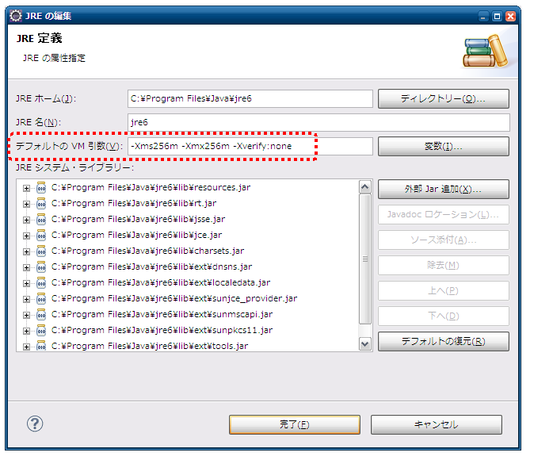

.. _request_unit_test_setting_web:

リクエスト単体テストの設定（ウェブアプリケーション）
====================================================

.. contents:: 目次
  :depth: 3
  :local:

使用方法
--------------------------------------------------
ここでは、ウェブアプリケーションのリクエスト単体テストで使用する設定項目と、テストの実行速度を上げる設定について説明する。

コンポーネント設定ファイルに設定項目を登録する
~~~~~~~~~~~~~~~~~~~~~~~~~~~~~~~~~~~~~~~~~~~~~~~~~
実行環境に依存する設定値は、コンポーネント設定ファイルで変更できる。テスト用のコンポーネント設定ファイルに、\ :java:extdoc:`HttpTestConfiguration <nablarch.test.core.http.HttpTestConfiguration>`\ を\ ``httpTestConfiguration``\ という名前で登録する。設定できる項目は次のとおりである。

.. list-table::
  :header-rows: 1
  :widths: 22,48,30

  * - 設定項目名
    - 説明
    - デフォルト値
  * - ``htmlDumpDir``
    - HTMLダンプを出力するディレクトリ
    - ``./tmp/html_dump``
  * - ``webBaseDir``
    - ウェブアプリケーションのルートディレクトリ
    - ``../main/web``
  * - ``xmlComponentFile``
    - リクエスト単体テストの実行時に使用するコンポーネント設定ファイル
    - （なし）
  * - ``userIdSessionKey``
    - ログイン中のユーザIDを格納するセッションのキー
    - ``user.id``
  * - ``exceptionRequestVarKey``
    - \ :java:extdoc:`ApplicationException <nablarch.core.message.ApplicationException>`\ が格納されるリクエストスコープのキー
    - ``nablarch_application_error``
  * - ``dumpFileExtension``
    - HTMLダンプの拡張子
    - ``html``
  * - ``httpHeader``
    - HTTPリクエストヘッダとして送信する値
    - ``Content-Type``\ が\ ``application/x-www-form-urlencoded``\ 、\ ``Accept-Language``\ が\ ``ja JP``
  * - ``sessionInfo``
    - セッションに格納する値
    - （なし）
  * - ``htmlResourcesExtensionList``
    - ダンプディレクトリへコピーするHTMLリソースの拡張子
    - ``css``\ ・\ ``js``\ ・\ ``jpg``
  * - ``jsTestResourceDir``
    - JavaScriptの自動テストで使用するリソースを配置したディレクトリ
    - ``../test/web``
  * - ``backup``
    - ダンプディレクトリをバックアップするかどうか
    - ``true``
  * - ``htmlResourcesCharset``
    - CSSファイル（スタイルシート）の文字コード
    - ``UTF-8``
  * - ``checkHtml``
    - HTMLチェックを実施するかどうか
    - ``true``
  * - ``htmlChecker``
    - HTMLチェックを行うオブジェクト。\ :java:extdoc:`HtmlChecker <nablarch.test.tool.htmlcheck.HtmlChecker>`\ を実装したクラスのインスタンスを指定する。詳細は\ :ref:`HTMLチェックツール <html_check_tool>`\ を参照
    - （なし）
  * - ``htmlCheckerConfig``
    - HTMLチェックツールの設定ファイルのパス。この項目を設定すると、指定した設定ファイルを適用した\ :java:extdoc:`Html4HtmlChecker <nablarch.test.tool.htmlcheck.Html4HtmlChecker>`\ が\ ``htmlChecker``\ に設定される
    - （なし）
  * - ``ignoreHtmlResourceDirectory``
    - HTMLリソースのうちコピー対象外とするディレクトリ名のリスト
    - （なし）
  * - ``tempDirectory``
    - JSPのコンパイル先ディレクトリ
    - （なし。Jettyのデフォルト動作に従う）
  * - ``uploadTmpDirectory``
    - アップロードファイルを一時的に格納するディレクトリ。テストで準備したアップロード対象のファイルは、このディレクトリにコピーしてから処理される。アップロード対象のファイルそのものが移動されることを防ぐためである
    - ``./tmp``
  * - ``dumpVariableItem``
    - HTMLダンプに可変項目を出力するかどうか。可変項目とは、JSESSIONIDと二重サブミット防止用のトークンを指す。いずれもテストの実行ごとに異なる値になるため、HTMLダンプを毎回同じ内容にしたい場合は\ ``false``\ を指定する
    - ``false``

.. important::

  ``checkHtml``\ を\ ``true``\ のままにする場合は、\ ``htmlChecker``\ と\ ``htmlCheckerConfig``\ のどちらか一方を必ず設定する。どちらも設定していないと、HTMLのレスポンスに対するHTMLチェックの実行時に例外が発生する。

``webBaseDir``\ には、カンマ区切りで複数のディレクトリを指定できる。プロジェクト共通のウェブモジュールがある場合など、ルートディレクトリが複数に分かれているときに使用する。指定した順にリソースが探索される。

.. code-block:: xml

  <property name="webBaseDir" value="/path/to/web-a/,/path/to/web-common"/>

``xmlComponentFile``\ を設定すると、リクエストの送信直前に、指定したコンポーネント設定ファイルでシステムリポジトリが再初期化される。通常は設定する必要はない。クラス単体テストとリクエスト単体テストとで設定を変える必要がある場合にのみ設定する。

.. tip::

  ``ignoreHtmlResourceDirectory``\ にバージョン管理用のディレクトリ（\ ``.svn``\ や\ ``.git``\ ）を指定すると、HTMLリソースをコピーする際のパフォーマンスが向上する。

.. tip::

  ``tempDirectory``\ を省略した場合のJettyのデフォルト動作では、\ ``./work``\ がコンパイル先ディレクトリになる。\ ``./work``\ が存在しない場合は、OSの一時ディレクトリが出力先になる。

記述例を示す。デフォルト値のままでよい項目も含めて記述しており、\ ``sessionInfo``\ には次の値を設定している。

.. list-table::
  :header-rows: 1
  :widths: 30,25,45

  * - キー
    - 値
    - 説明
  * - ``commonHeaderLoginUserName``
    - ``リクエスト単体テストユーザ``
    - 共通ヘッダ領域に表示するログインユーザ名
  * - ``commonHeaderLoginDate``
    - ``20100914``
    - 共通ヘッダ領域に表示するログイン日時

.. code-block:: xml

  <component name="httpTestConfiguration" class="nablarch.test.core.http.HttpTestConfiguration">
    <property name="htmlDumpDir" value="./tmp/html_dump"/>
    <property name="webBaseDir" value="../main/web"/>
    <property name="xmlComponentFile" value="http-request-test.xml"/>
    <property name="userIdSessionKey" value="user.id"/>
    <property name="httpHeader">
      <map>
        <entry key="Content-Type" value="application/x-www-form-urlencoded"/>
        <entry key="Accept-Language" value="ja JP"/>
      </map>
    </property>
    <property name="sessionInfo">
      <map>
        <entry key="commonHeaderLoginUserName" value="リクエスト単体テストユーザ"/>
        <entry key="commonHeaderLoginDate" value="20100914"/>
      </map>
    </property>
    <property name="htmlResourcesExtensionList">
      <list>
        <value>css</value>
        <value>jpg</value>
        <value>js</value>
      </list>
    </property>
    <property name="backup" value="true"/>
    <property name="htmlResourcesCharset" value="UTF-8"/>
    <property name="ignoreHtmlResourceDirectory">
      <list>
        <value>.svn</value>
      </list>
    </property>
    <property name="tempDirectory" value="webTemp"/>
    <property name="htmlCheckerConfig"
      value="test/resources/httprequesttest/html-check-config.csv"/>
  </component>

テストの実行速度を上げる
~~~~~~~~~~~~~~~~~~~~~~~~~~~~~~~~~~~~~~~~~~~~~~~~~
処理性能が高くないPCで開発している場合は、JVMオプションの指定とHTMLリソースのコピーの抑止により、リクエスト単体テストの実行速度の改善が見込まれる。いずれもコンポーネント設定ファイルではなく、テストの実行時に指定する。

.. tip::

  JVMオプションの指定は、処理性能が低いCPUを搭載したPCで効果がある。比較的新しいCPUを搭載したPCでは効果が小さいため、無理に設定する必要はない。

JVMオプションを指定する
^^^^^^^^^^^^^^^^^^^^^^^^^^^^^^^^^^^^^^^^^^^^^^^^^
最大ヒープサイズと最小ヒープサイズに同じ値を指定すると、ヒープサイズを拡張する際のオーバヘッドを回避できる。

.. code-block:: bash

  -Xms256m -Xmx256m

また、クラスファイルの検証を省略すると実行速度が向上する。

.. code-block:: bash

  -Xverify:none

.. important::

  ``-Xverify:none``\ はJDK 13で非推奨になっている。指定自体は受け付けられるが、JVMの起動時に非推奨である旨の警告が出力される。

Eclipseでの設定方法は次のとおりである。

* メニューバーより「実行」→「実行構成」を選択する。
* 「実行構成」ウィンドウが表示されるので、「引数」タブをクリックし、「VM 引数」欄に前述のオプションを指定する。

.. image:: images/web/vmoptions.png

実行構成を変更せずに、デフォルトのJVMオプションとして指定することもできる。

* メニューバーより「ウィンドウ」→「設定」を選択する。「設定」ウィンドウが表示されるので、「インストール済みのJRE」を選択する。
* インストール済みのJREの一覧が表示されるので、使用するJREを選択し「編集」ボタンを押下する。

.. image:: images/web/installed_jre.png

* 「デフォルトの VM 引数」欄に前述のオプションを指定する。

HTMLリソースのコピーを抑止する
^^^^^^^^^^^^^^^^^^^^^^^^^^^^^^^^^^^^^^^^^^^^^^^^^
リクエスト単体テストの実行時に次のシステムプロパティを指定すると、\ :ref:`HTMLダンプ <request_unit_test_web>`\ の出力時にHTMLリソースをコピーしなくなる。CSSや画像ファイルなどの静的なHTMLリソースを頻繁に編集しない場合は、テストを実行するたびにHTMLリソースをコピーする必要はないため、このシステムプロパティを設定してもよい。

.. code-block:: bash

  -Dnablarch.test.skip-resource-copy=true

.. important::

  このシステムプロパティを指定するとHTMLリソースがコピーされなくなるため、CSSなどのHTMLリソースを編集しても\ :ref:`HTMLダンプ <request_unit_test_web>`\ に反映されない。

.. tip::

  HTMLリソースのディレクトリが存在しない場合は、このシステムプロパティの指定の有無にかかわらず、HTMLリソースのコピーが実行される。

Eclipseでの設定方法は次のとおりである。

* メニューバーより「実行」→「実行構成」を選択する。
* 「実行構成」ウィンドウが表示されるので、「引数」タブをクリックし、「VM 引数」欄に前述のシステムプロパティを指定する。

.. image:: images/web/skip_resource_copy.png

拡張例
--------------------------------------------------

テストデータの記法を拡張する
~~~~~~~~~~~~~~~~~~~~~~~~~~~~~~~~~~~~~~~~~~~~~~~~~
テストデータの書き方を変える場合は、\ :java:extdoc:`AbstractHttpRequestTestTemplate <nablarch.test.core.http.AbstractHttpRequestTestTemplate>`\ と\ :java:extdoc:`TestCaseInfo <nablarch.test.core.http.TestCaseInfo>`\ を継承する。

前者はリクエスト単体テストのテストクラスの基底クラスである。アプリケーションプログラマが直接使用することはなく、テスティングフレームワークを拡張する際に用いる。後者はテストデータに定義されたテストショットの情報を格納するクラスであり、前者の型引数に指定する。
