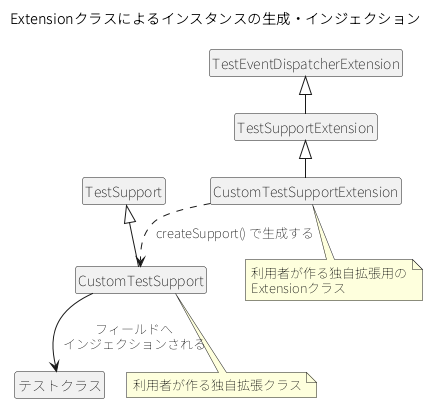

.. _standard_usage:

JUnit 5で使用する
==================================================

.. contents:: 目次
  :depth: 3
  :local:

機能概要
--------------------------------------------------
テスティングフレームワークはJUnit 4を前提に作られており、\ :java:extdoc:`TestSupport <nablarch.test.TestSupport>`\ などテストに必要な機能を実装したクラス（以下、サポートクラス）は、テストクラスが継承して使う設計である。サポートクラスの前処理・後処理はJUnit 4のアノテーションで動くため、JUnit 5のテストクラスから継承しても動かない。

このためテスティングフレームワークは、JUnit 5用のExtensionを提供している。使用するサポートクラスに対応する合成アノテーションをテストクラスに付けると、Extensionクラスがサポートクラスのインスタンスを生成し、テストクラスのフィールドにインジェクションする。テストクラスはサポートクラスを継承しないため、パラメータ化テストなどJUnit 5が提供する機能と組み合わせてテストを書ける。Extensionクラスと合成アノテーションは、サポートクラスごとに用意されている。

新しくテストを書く場合はJUnit 5で書く。ブランクプロジェクトも、JUnit 5とこのExtensionを使う構成になっている。JUnit 4で書いた既存のテスト資産は、\ :ref:`JUnit 4で使用する <junit4_support>`\ を参照。

JUnit 5そのものの導入方法やテストの書き方は、このページでは説明しない。\ `公式のユーザガイド(外部サイト、英語) <https://junit.org/junit5/docs/5.11.0/user-guide/>`_\ を参照。

.. tip::

  合成アノテーションはJUnit 5が提供する機能で、複数のアノテーションの設定を別の1つのアノテーションにまとめられる。詳しくは\ `公式のユーザガイドの「2.1.1. Meta-Annotations and Composed Annotations」(外部サイト、英語) <https://junit.org/junit5/docs/5.11.0/user-guide/#writing-tests-meta-annotations>`_\ を参照。

Extensionクラスと合成アノテーションの一覧
~~~~~~~~~~~~~~~~~~~~~~~~~~~~~~~~~~~~~~~~~~~~~~~~~
サポートクラスと、それぞれに対応するExtensionクラス・合成アノテーションを次に示す。

.. list-table::
  :class: white-space-normal
  :header-rows: 1
  :widths: 34,33,33

  * - サポートクラス
    - Extensionクラス
    - 合成アノテーション
  * - :java:extdoc:`TestSupport <nablarch.test.TestSupport>`
    - :java:extdoc:`TestSupportExtension <nablarch.test.junit5.extension.TestSupportExtension>`
    - :java:extdoc:`NablarchTest <nablarch.test.junit5.extension.NablarchTest>`
  * - :java:extdoc:`BatchRequestTestSupport <nablarch.test.core.batch.BatchRequestTestSupport>`
    - :java:extdoc:`BatchRequestTestExtension <nablarch.test.junit5.extension.batch.BatchRequestTestExtension>`
    - :java:extdoc:`BatchRequestTest <nablarch.test.junit5.extension.batch.BatchRequestTest>`
  * - :java:extdoc:`DbAccessTestSupport <nablarch.test.core.db.DbAccessTestSupport>`
    - :java:extdoc:`DbAccessTestExtension <nablarch.test.junit5.extension.db.DbAccessTestExtension>`
    - :java:extdoc:`DbAccessTest <nablarch.test.junit5.extension.db.DbAccessTest>`
  * - :java:extdoc:`EntityTestSupport <nablarch.test.core.db.EntityTestSupport>`
    - :java:extdoc:`EntityTestExtension <nablarch.test.junit5.extension.db.EntityTestExtension>`
    - :java:extdoc:`EntityTest <nablarch.test.junit5.extension.db.EntityTest>`
  * - :java:extdoc:`BasicHttpRequestTestTemplate <nablarch.test.core.http.BasicHttpRequestTestTemplate>`
    - :java:extdoc:`BasicHttpRequestTestExtension <nablarch.test.junit5.extension.http.BasicHttpRequestTestExtension>`
    - :java:extdoc:`BasicHttpRequestTest <nablarch.test.junit5.extension.http.BasicHttpRequestTest>`
  * - :java:extdoc:`HttpRequestTestSupport <nablarch.test.core.http.HttpRequestTestSupport>`
    - :java:extdoc:`HttpRequestTestExtension <nablarch.test.junit5.extension.http.HttpRequestTestExtension>`
    - :java:extdoc:`HttpRequestTest <nablarch.test.junit5.extension.http.HttpRequestTest>`
  * - :java:extdoc:`RestTestSupport <nablarch.test.core.http.RestTestSupport>`
    - :java:extdoc:`RestTestExtension <nablarch.test.junit5.extension.http.RestTestExtension>`
    - :java:extdoc:`RestTest <nablarch.test.junit5.extension.http.RestTest>`
  * - :java:extdoc:`SimpleRestTestSupport <nablarch.test.core.http.SimpleRestTestSupport>`
    - :java:extdoc:`SimpleRestTestExtension <nablarch.test.junit5.extension.http.SimpleRestTestExtension>`
    - :java:extdoc:`SimpleRestTest <nablarch.test.junit5.extension.http.SimpleRestTest>`
  * - :java:extdoc:`IntegrationTestSupport <nablarch.test.core.integration.IntegrationTestSupport>`
    - :java:extdoc:`IntegrationTestExtension <nablarch.test.junit5.extension.integration.IntegrationTestExtension>`
    - :java:extdoc:`IntegrationTest <nablarch.test.junit5.extension.integration.IntegrationTest>`
  * - :java:extdoc:`MessagingReceiveTestSupport <nablarch.test.core.messaging.MessagingReceiveTestSupport>`
    - :java:extdoc:`MessagingReceiveTestExtension <nablarch.test.junit5.extension.messaging.MessagingReceiveTestExtension>`
    - :java:extdoc:`MessagingReceiveTest <nablarch.test.junit5.extension.messaging.MessagingReceiveTest>`
  * - :java:extdoc:`MessagingRequestTestSupport <nablarch.test.core.messaging.MessagingRequestTestSupport>`
    - :java:extdoc:`MessagingRequestTestExtension <nablarch.test.junit5.extension.messaging.MessagingRequestTestExtension>`
    - :java:extdoc:`MessagingRequestTest <nablarch.test.junit5.extension.messaging.MessagingRequestTest>`

前提事項
~~~~~~~~~~~~~~~~~~~~~~~~~~~~~~~~~~~~~~~~~~~~~~~~~
JUnit 5を使用するには、\ ``maven-surefire-plugin``\ が2.22.0以上である必要がある。

使用方法
--------------------------------------------------

依存関係を追加する
~~~~~~~~~~~~~~~~~~~~~~~~~~~~~~~~~~~~~~~~~~~~~~~~~
Extensionクラスと合成アノテーションは\ ``nablarch-testing-junit5``\ が提供する。これとJUnit 5本体を、\ ``test``\ スコープで依存関係に追加する。JUnit 5のアーティファクトのバージョンを揃えるため、\ ``org.junit:junit-bom``\ を\ ``dependencyManagement``\ に読み込む。

.. code-block:: xml

  <dependencyManagement>
    <dependencies>
      ...

      <!-- バージョンを揃えるため、JUnitが提供しているbomを読み込む -->
      <dependency>
        <groupId>org.junit</groupId>
        <artifactId>junit-bom</artifactId>
        <version>5.11.0</version>
        <type>pom</type>
        <scope>import</scope>
      </dependency>
    </dependencies>
  </dependencyManagement>

  <dependencies>
    ...

    <dependency>
      <groupId>com.nablarch.framework</groupId>
      <artifactId>nablarch-testing-junit5</artifactId>
      <scope>test</scope>
    </dependency>
    <dependency>
      <groupId>org.junit.jupiter</groupId>
      <artifactId>junit-jupiter</artifactId>
      <scope>test</scope>
    </dependency>
  </dependencies>

.. tip::

  ``nablarch-testing-junit5``\ は\ ``nablarch-testing``\ に依存する。これを追加することで、\ :ref:`テスティングフレームワーク <testing_framework_about>`\ が提供するAPIも使用できる。

  ただし、\ :java:extdoc:`RestTestExtension <nablarch.test.junit5.extension.http.RestTestExtension>`\ と\ :java:extdoc:`SimpleRestTestExtension <nablarch.test.junit5.extension.http.SimpleRestTestExtension>`\ が必要とする\ ``nablarch-testing-rest``\ は\ ``optional``\ 指定のため推移的に解決されない。これらを使用する場合は、\ :ref:`リクエスト単体テストの設定（RESTfulウェブサービス） <request_unit_test_setting_rest>`\ を参照して依存関係を別途追加する。

.. _standard_usage-inject:

テストクラスに合成アノテーションを設定する
~~~~~~~~~~~~~~~~~~~~~~~~~~~~~~~~~~~~~~~~~~~~~~~~~
使用するサポートクラスに対応する合成アノテーションをテストクラスに設定し、そのクラス型のインスタンスフィールドを宣言する。\ :java:extdoc:`TestSupport <nablarch.test.TestSupport>`\ を使用する場合の実装例を示す。

.. code-block:: java

  // 1. 対応する合成アノテーションをテストクラスに設定する
  @NablarchTest
  class YourTest {
      // 2. 使用するサポートクラスをテストクラスのフィールドとして宣言する
      TestSupport support;

      @Test
      void test() {
          ...
          // 3. テスト内で使用する
          Map<String, String> map = support.getMap(sheetName, id);
          ...
      }
  }

合成アノテーション\ :java:extdoc:`NablarchTest <nablarch.test.junit5.extension.NablarchTest>`\ をテストクラスに設定すると、\ :java:extdoc:`TestSupportExtension <nablarch.test.junit5.extension.TestSupportExtension>`\ がテストクラスに適用される。Extensionクラスは、テストの実行前に\ :java:extdoc:`TestSupport <nablarch.test.TestSupport>`\ のインスタンスを生成し、テストクラスのフィールドにインジェクションする。

インジェクションの対象になるのは、生成したインスタンスを代入できる型で宣言されたフィールドすべてである。フィールドの可視性は何でもよく、スーパクラスで宣言されたフィールドも対象になる。該当するフィールドが複数ある場合は、そのすべてに同じインスタンスが代入される。1つもない場合は、何もインジェクションされない。対象のフィールドに既に値が入っている場合、Extensionクラスは\ ``IllegalStateException``\ を送出し、そのテストは失敗する。\ ``Object``\ 型のように、サポートクラスを代入できる幅広い型のフィールドは対象になるため、テストクラスでは宣言しない。

.. _standard_usage-base_uri:

BasicHttpRequestTestTemplateを使用する
~~~~~~~~~~~~~~~~~~~~~~~~~~~~~~~~~~~~~~~~~~~~~~~~~
:java:extdoc:`BasicHttpRequestTestTemplate <nablarch.test.core.http.BasicHttpRequestTestTemplate>`\ を使用する場合だけは、合成アノテーション\ :java:extdoc:`BasicHttpRequestTest <nablarch.test.junit5.extension.http.BasicHttpRequestTest>`\ に\ ``baseUri``\ を指定する。\ ``baseUri``\ の指定以外の手順は、\ :ref:`テストクラスに合成アノテーションを設定する <standard_usage-inject>`\ と同じである。

.. code-block:: java

  // 1. BasicHttpRequestTest の baseUri を指定する
  @BasicHttpRequestTest(baseUri = "/test/")
  class YourTest {
      // 2. BasicHttpRequestTestTemplate のインジェクション方法は、他と変わらない
      BasicHttpRequestTestTemplate support;

      @Test
      void test() {
          support.execute();
      }
  }

指定した値は、\ :java:extdoc:`AbstractHttpRequestTestTemplate <nablarch.test.core.http.AbstractHttpRequestTestTemplate>`\ の\ ``getBaseUri()``\ メソッドが返す値になる。

RegisterExtensionでExtensionクラスを適用する
~~~~~~~~~~~~~~~~~~~~~~~~~~~~~~~~~~~~~~~~~~~~~~~~~
Extensionクラスは、合成アノテーションを使わず、JUnit 5の\ ``RegisterExtension``\ で適用することもできる。ただし\ :java:extdoc:`BasicHttpRequestTestExtension <nablarch.test.junit5.extension.http.BasicHttpRequestTestExtension>`\ は、\ ``baseUri``\ を合成アノテーション\ :java:extdoc:`BasicHttpRequestTest <nablarch.test.junit5.extension.http.BasicHttpRequestTest>`\ から読み取るため、この方法では適用できない。

.. code-block:: java

  class YourTest {
      // 1. static フィールドで RegisterExtension を使用する
      @RegisterExtension
      static TestSupportExtension extension = new TestSupportExtension();

      // 2. サポートクラスのインスタンスフィールドを宣言する
      TestSupport support;

      @Test
      void test() {
          // 3. support をテストで使用する
          ...
      }
  }

.. important::

  ``RegisterExtension``\ を使う場合は、必ず\ ``static``\ フィールドで宣言する。インスタンスフィールドで宣言すると\ ``beforeAll``\ や\ ``afterAll``\ などの処理が実行されず、Extensionクラスが正しく動作しない。

.. tip::

  ``RegisterExtension``\ については、\ `公式のユーザガイドの「5.2.2. Programmatic Extension Registration」(外部サイト、英語) <https://junit.org/junit5/docs/5.11.0/user-guide/#extensions-registration-programmatic>`_\ を参照。

.. _standard_usage-extension:

拡張例
--------------------------------------------------
サポートクラスを継承して独自の拡張を加える場合は、次の3つを行う。JUnit 4で書いた既存の独自拡張クラスをJUnit 5に移す場合も同じである。

#. サポートクラスを継承し、独自拡張クラスを作成する
#. 継承元のクラスに対応するExtensionクラスを継承し、独自拡張クラスのインスタンスを生成するExtensionクラスを作成する
#. ``ExtendWith``\ アノテーションで、作成したExtensionクラスをテストクラスに適用する

このほか、\ ``baseUri``\ を渡す合成アノテーションの作成、事前処理・事後処理の実装、JUnit 4の\ ``TestRule``\ の再現についても、独自拡張用のExtensionクラスで対応できる。

独自拡張クラスを作成する
~~~~~~~~~~~~~~~~~~~~~~~~~~~~~~~~~~~~~~~~~~~~~~~~~
サポートクラスを継承する。\ :java:extdoc:`TestSupport <nablarch.test.TestSupport>`\ を拡張する場合の実装例を示す。

.. code-block:: java

  public class CustomTestSupport extends TestSupport {
      // テストクラスの Class オブジェクトを TestSupport のコンストラクタに渡せるように実装する
      public CustomTestSupport(Class<?> testClass) {
          super(testClass);
      }

      // 独自の拡張メソッドを実装する
  }

サポートクラスは、基本的にインスタンスの生成時にテストクラスの\ ``Class``\ オブジェクトを受け取る。したがって、独自拡張クラスにも\ ``Class``\ オブジェクトを受け取るコンストラクタを定義する。

独自拡張用のExtensionクラスを作成する
~~~~~~~~~~~~~~~~~~~~~~~~~~~~~~~~~~~~~~~~~~~~~~~~~
継承元のクラスに対応するExtensionクラスを継承する。前項の例では\ :java:extdoc:`TestSupport <nablarch.test.TestSupport>`\ を継承しているので、対応するExtensionクラスは\ :java:extdoc:`TestSupportExtension <nablarch.test.junit5.extension.TestSupportExtension>`\ である。

.. code-block:: java

  public class CustomTestSupportExtension extends TestSupportExtension {

      // createSupport() をオーバーライドし、独自拡張クラスのインスタンスを返すように実装する
      @Override
      protected TestEventDispatcher createSupport(Object testInstance, ExtensionContext context) {
          return new CustomTestSupport(testInstance.getClass());
      }
  }

``createSupport()``\ メソッドをオーバーライドし、独自拡張クラスのインスタンスを返すように実装する。このメソッドが返したインスタンスは、すべてのExtensionクラスのスーパクラスである\ :java:extdoc:`TestEventDispatcherExtension <nablarch.test.junit5.extension.event.TestEventDispatcherExtension>`\ に定義された\ ``support``\ という\ :java:extdoc:`TestEventDispatcher <nablarch.test.event.TestEventDispatcher>`\ 型のインスタンスフィールドに保存される。このフィールドは\ ``protected``\ なので、サブクラスから参照できる。

ExtendWithでテストクラスに適用する
~~~~~~~~~~~~~~~~~~~~~~~~~~~~~~~~~~~~~~~~~~~~~~~~~
作成した独自拡張用のExtensionクラスは、\ ``ExtendWith``\ アノテーションでテストクラスに適用する。

.. code-block:: java

  ...
  import org.junit.jupiter.api.extension.ExtendWith;

  // 1. ExtendWith で独自拡張用のExtensionクラスをテストクラスに適用する
  @ExtendWith(CustomTestSupportExtension.class)
  class YourTest {
      // 2. 独自拡張クラスをインスタンスフィールドで宣言する
      CustomTestSupport support;

      @Test
      void test() {
          // 3. テスト内で独自拡張クラスを使用する
          support.customMethod();
      }
  }

baseUriを渡す合成アノテーションを作成する
~~~~~~~~~~~~~~~~~~~~~~~~~~~~~~~~~~~~~~~~~~~~~~~~~
:java:extdoc:`BasicHttpRequestTestTemplate <nablarch.test.core.http.BasicHttpRequestTestTemplate>`\ または\ :java:extdoc:`AbstractHttpRequestTestTemplate <nablarch.test.core.http.AbstractHttpRequestTestTemplate>`\ を拡張する場合は、\ ``baseUri``\ を独自拡張クラスのインスタンスに渡す必要がある。\ ``ExtendWith``\ ではパラメータを渡せないため、合成アノテーションも独自に作成する。

まず、コンストラクタでテストクラスと\ ``baseUri``\ を受け取る独自拡張クラスを作成する。

.. code-block:: java

  public class CustomHttpRequestTestSupport extends BasicHttpRequestTestTemplate {
      private final String baseUri;

      // baseUri を外部から連携できるように実装しておく
      public CustomHttpRequestTestSupport(Class<?> testClass, String baseUri) {
          super(testClass);
          this.baseUri = baseUri;
      }

      @Override
      protected String getBaseUri() {
          return baseUri;
      }
  }

次に、\ ``baseUri``\ を渡せる合成アノテーションを作成する。

.. code-block:: java

  import org.junit.jupiter.api.extension.ExtendWith;

  import java.lang.annotation.ElementType;
  import java.lang.annotation.Retention;
  import java.lang.annotation.RetentionPolicy;
  import java.lang.annotation.Target;

  @Retention(RetentionPolicy.RUNTIME)
  @Target(ElementType.TYPE)
  // この後作成する独自拡張用のExtensionクラスを指定する
  @ExtendWith(CustomHttpRequestTestExtension.class)
  public @interface CustomHttpRequestTest {
      // baseUri を渡せるように宣言する
      String baseUri();
  }

続いて、\ ``ExtendWith``\ に指定する独自拡張用のExtensionクラスを作成する。

.. code-block:: java

  public class CustomHttpRequestTestExtension extends BasicHttpRequestTestExtension {

      @Override
      protected TestEventDispatcher createSupport(Object testInstance, ExtensionContext context) {
          // テストクラスからアノテーションの情報を取得する
          CustomHttpRequestTest annotation = findAnnotation(testInstance, CustomHttpRequestTest.class);
          // 独自拡張クラスのコンストラクタに baseUri の情報を連携する
          return new CustomHttpRequestTestSupport(testInstance.getClass(), annotation.baseUri());
      }
  }

``findAnnotation(Object, Class)``\ を使うと、テストクラスに設定されたアノテーションの情報を取得できる。これを使用して、独自拡張クラスに\ ``baseUri``\ の値を渡す。取得できるのはテストクラスに直接設定されたアノテーションだけで、スーパクラスに設定されたアノテーションや、他のアノテーションを介して間接的に設定されたアノテーションは取得できない。

最後に、作成した合成アノテーションをテストクラスに設定する。

.. code-block:: java

  // 独自の合成アノテーションをテストクラスに設定する(baseUri も設定する)
  @CustomHttpRequestTest(baseUri = "/custom/")
  class YourTest {
      // 独自拡張クラスをフィールドで宣言する
      CustomHttpRequestTestSupport support;

      @Test
      void test() {
          // 独自拡張クラスをテストで使用する
          support.customMethod();
      }
  }

事前処理・事後処理を実装する
~~~~~~~~~~~~~~~~~~~~~~~~~~~~~~~~~~~~~~~~~~~~~~~~~
独自拡張用のExtensionクラスでは、\ ``beforeAll``\ ・\ ``afterAll``\ ・\ ``beforeEach``\ ・\ ``afterEach``\ の4つのメソッドをオーバーライドして、テストの事前処理・事後処理を実装できる。\ ``beforeAll``\ と\ ``afterAll``\ はテストクラス全体に対して、\ ``beforeEach``\ と\ ``afterEach``\ はテストメソッドごとに実行される。

.. code-block:: java

  @Override
  public void beforeAll(ExtensionContext context) {
      // 必ず最初にスーパクラスのメソッドを実行する
      super.beforeAll(context);

      // 独自の事前処理を実装する
      ...
  }

.. important::

  オーバーライドするときは、必ずスーパクラスの同じメソッドを実行する。実行しないと、スーパクラスで定義された事前処理・事後処理が呼ばれなくなる。

JUnit 4のTestRuleを再現する
~~~~~~~~~~~~~~~~~~~~~~~~~~~~~~~~~~~~~~~~~~~~~~~~~
独自拡張クラスの中でJUnit 4の\ ``org.junit.rules.TestRule``\ を使用している場合は、JUnit 5でもそれを再現できる。ただしJUnit 5は\ ``TestRule``\ をそのままの形では扱えないため、再現には後述の制約が付く。

.. important::

  JUnit 5に同等の機能がある場合は、\ ``TestRule``\ を移植せずにJUnit 5の機能を使用する。後述の制約は\ ``TestRule``\ を再現する仕組みに由来するため、JUnit 5の機能に置き換えれば当てはまらない。

  - ``Timeout``\ … ``@Timeout``
  - ``TemporaryFolder``\ … ``@TempDir``
  - ``ExpectedException``\ … ``assertThrows``
  - ``ExternalResource``\ … ``BeforeEachCallback``\ と\ ``AfterEachCallback``\ の組

例えば、次のような独自拡張クラスがあるとする。

.. code-block:: java

  import org.junit.Rule;
  import org.junit.rules.TestRule;

  public class CustomTestSupport extends TestSupport {
      // JUnit 4のTestRuleを使用している（CustomRuleはプロジェクトで作成したTestRule実装）
      @Rule
      public TestRule customRule = new CustomRule();

      public CustomTestSupport(Class<?> testClass) {
          super(testClass);
      }
  }

この場合、独自拡張用のExtensionクラスで\ ``resolveTestRules()``\ メソッドをオーバーライドし、再現したい\ ``TestRule``\ のリストを返すように実装する。

.. code-block:: java

  public class CustomTestSupportExtension extends TestSupportExtension {

      @Override
      protected TestEventDispatcher createSupport(Object testInstance, ExtensionContext context) {
          return new CustomTestSupport(testInstance.getClass());
      }

      // 1. resolveTestRules メソッドをオーバーライドする
      @Override
      protected List<TestRule> resolveTestRules() {
          // 2. 独自拡張クラスで定義しているTestRuleのリストを返す
          return Collections.singletonList(((CustomTestSupport) support).customRule);
      }
  }

複数の\ ``TestRule``\ を返す場合は、リストの先頭にあるものほど内側、末尾にあるものが最も外側になる（JUnit 4の\ ``RunRules``\ と同じ順序）。テスティングフレームワークが内部で使用する\ ``TestRule``\ は別のメソッドが返すため、スーパクラスの\ ``resolveTestRules()``\ が返すリストをベースにする必要はない。

.. warning::

  次の5つは、テストが失敗せず例外も出ないまま、\ ``TestRule``\ が期待どおりに動かない。

  * \ ``TestRule``\ が包むのはテストメソッドの実行だけであり、\ ``@BeforeEach``\ ・\ ``@AfterEach``\ は含まれない。JUnit 4では\ ``@Before``\ ・\ ``@After``\ の外側にあったが、ここでは\ ``TestRule``\ の前処理が\ ``@BeforeEach``\ の後、後処理が\ ``@AfterEach``\ の前に実行される。
  * \ ``@BeforeEach``\ が失敗すると、\ ``TestRule``\ は前処理も後処理も実行されない。リソースの解放を\ ``TestRule``\ に任せていると、このときだけ解放漏れが起きる。
  * \ ``Timeout``\ は\ :java:extdoc:`DbAccessTestExtension <nablarch.test.junit5.extension.db.DbAccessTestExtension>`\ と併用できない。\ ``Timeout``\ はテスト本体を別スレッドで実行するが、データベース接続とトランザクションは元のスレッドに束縛されているため、テスト本体からは取得できない。取得時の例外を捕捉していると、この状態でもテストは成功する。同じ理由で、\ ``@BeforeEach``\ などで\ ``ThreadLocal``\ に束縛した値もテスト本体からは見えない。
  * \ ``@TestFactory``\ が生成した\ ``DynamicTest``\ には\ ``TestRule``\ が適用されない。
  * \ ``@Nested``\ を使うテストクラスでは、独自拡張クラスから取り出した\ ``TestRule``\ が正しく動作しない。Extensionのインスタンスが外側のクラスと入れ子のクラスとで共有され、\ ``support``\ フィールドが後から生成されたインスタンスで上書きされるためである。Extensionクラスを適用するテストクラスでは\ ``@Nested``\ を使用しない。

  なお、\ ``base.evaluate()``\ を呼ばない\ ``TestRule``\ （スキップ系）と、2回以上呼ぶ\ ``TestRule``\ （リトライ系）は使用できない。こちらはテストが例外で失敗するため気づける。

  \ ``TestRule``\ ごとの可否と制約の全体は\ :java:extdoc:`TestEventDispatcherExtension <nablarch.test.junit5.extension.event.TestEventDispatcherExtension>`\ のJavadocにある。
