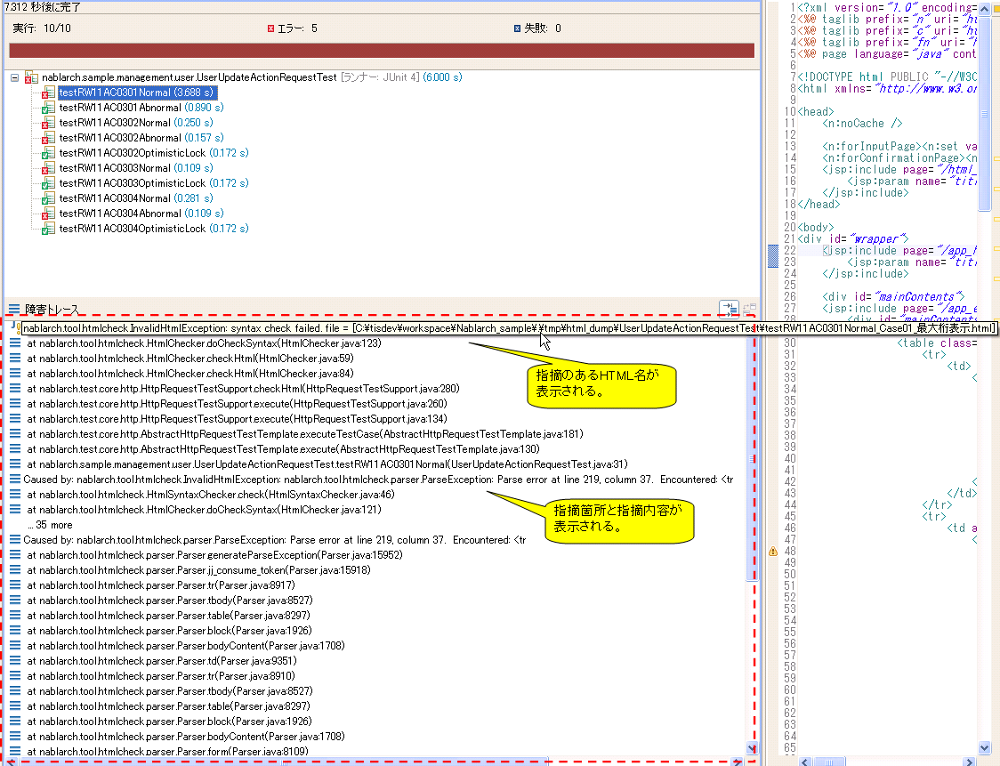

.. _html_check_tool:

HTMLチェックツール
==================================================

.. contents:: 目次
  :depth: 3
  :local:

HTMLチェックツールは、リクエスト単体テスト（ウェブアプリケーション）が出力したHTMLダンプに対して、構文の誤りと、プロジェクトで使用を禁止したタグ・属性の使用を検出するツールである。リクエスト単体テストに組み込まれているため、導入の手順はない。終了タグの記述漏れのように、画面を目視しただけでは気づきにくい誤りを、テストの実行と同時に検出できる。

機能概要
--------------------------------------------------
本ツールは、リクエスト単体テスト（ウェブアプリケーション）がリクエストを送信するたびに、出力されたHTMLダンプを読み込んで次の2つのチェックを行う。

* 構文チェック。終了タグの記述漏れなど、構文の誤りを検出する。
* 使用禁止タグ・属性のチェック。設定ファイルに記述したタグ・属性の使用を検出する。

いずれかで誤りを検出した場合、その内容を指摘としてメッセージに出力し、例外を送出してそのテストメソッドを失敗させる。

チェックの対象になるのは、ステータスコードが500未満で、かつ\ ``Content-Type``\ のサブタイプが\ ``htm``\ で始まるレスポンス（\ ``text/html``\ など）に限られる。HTMLダンプは、文字コードをUTF-8として読み込む。

構文チェックの仕様
~~~~~~~~~~~~~~~~~~~~~~~~~~~~~~~~~~~~~~~~~~~~~~~~~
構文チェックは、HTML4.01に準拠しているかどうかを検査する。HTML4.01で定義されていないタグを使用した場合は指摘の対象になる。仕様は次のとおりである。

* 開始タグを記述した要素は、終了タグを省略できない。HTML4.01が終了タグを省略できると規定している\ ``p``\ ・\ ``li``\ ・\ ``td``\ ・\ ``option``\ などについても、省略を許可しない。\ ``<html>``\ と\ ``</html>``\ も省略できない。
* \ ``head``\ 要素・\ ``body``\ 要素・\ ``tbody``\ 要素は、要素ごと省略できる。
* タグ名・属性名の大文字・小文字は区別しない。\ ``<tr>``\ ・\ ``<TR>``\ ・\ ``<Tr>``\ ・\ ``<tR>``\ はいずれも同じタグとして扱う。
* boolean属性を使用できる。\ ``<textarea disabled>``\ のように値を省略して記述してよい。
* 属性値のクォートは省略できない。\ ``<input type="text">``\ は許可されるが、\ ``<input type=text>``\ は指摘の対象になる。シングルクォートでも記述できる。
* 文書型宣言は省略できる。記述する場合は\ ``PUBLIC``\ と公開識別子を伴う形式に限られ、\ ``<!DOCTYPE html>``\ は指摘の対象になる。文書型宣言の前にXML宣言を記述してよい。

.. important::

  構文チェックはHTML4.01に準拠しているかどうかを検査するため、画面をHTML5で記述しているプロジェクトでは本ツールを使用できない。\ ``<!DOCTYPE html>``\ や、\ ``nav``\ のようにHTML4.01で定義されていないタグが指摘の対象になるためである。この場合は、HTMLチェックを実施しない設定にするか（\ :ref:`html_check_tool-switch`\ 参照）、チェックの内容を差し替える（\ :ref:`html_check_tool-replace`\ 参照）。

.. tip::

  HTMLコメント（\ ``<!--``\ から\ ``-->``\ まで）の中に\ ``--``\ が現れると、指摘の対象になる。JSPに直接記述したJavaScriptを\ ``<!--``\ と\ ``-->``\ で囲んでいる場合、デクリメント演算子や文字列中の連続したハイフンがこれに該当する。

  .. code-block:: html

    

  この場合、メッセージに\ ``after : "--"``\ が出力される。JavaScriptを外部ファイルに切り出すと回避できる。コメントで囲まずに記述した\ ``--``\ は、指摘の対象にならない。

HTML4.01との相違点
~~~~~~~~~~~~~~~~~~~~~~~~~~~~~~~~~~~~~~~~~~~~~~~~~
クライアントサイドで動的にDOMを操作することが一般化しているため、本ツールはボディが空のタグを許容する。次の記述は指摘の対象にならない。

.. code-block:: html

  <!-- 空のspanタグ -->
  

  <!-- optionのないselectタグ -->
  <select id="bar"></select>

前提事項
~~~~~~~~~~~~~~~~~~~~~~~~~~~~~~~~~~~~~~~~~~~~~~~~~
本ツールを使用するには、リクエスト単体テスト（ウェブアプリケーション）を実行できる状態になっている必要がある（\ :ref:`request_unit_test_setting_web`\ 参照）。

使用方法
--------------------------------------------------
リクエスト単体テスト（ウェブアプリケーション）を実行すると、本ツールも実行される。実行するための手順はない。デフォルト設定を読み込んでいる場合は、\ `W3CのHTML4.01勧告 <https://www.w3.org/TR/html401/>`_\ で非推奨とされているタグ・属性の使用を禁止する設定ファイルが適用されるため、設定を変更しなくてよい（\ :ref:`request_unit_test_setting_web`\ 参照）。

.. _html_check_tool-forbidden:

使用を禁止するタグ・属性を変更する
~~~~~~~~~~~~~~~~~~~~~~~~~~~~~~~~~~~~~~~~~~~~~~~~~
使用を禁止するタグ・属性は、CSV形式の設定ファイルに記述する。1行にカンマ区切りでタグ名と属性名を記述する。1つのタグに複数の属性を指定する場合は、複数行に分けて記述する。タグ名・属性名の大文字・小文字は区別せず、前後の空白は除去される。

.. code-block:: text

  body,bgcolor
  body,link
  body,text
  table,align
  table,bgcolor
  td,bgcolor

属性名を省略すると、そのタグ自体の使用を禁止する。属性名を省略する場合も、カンマは省略できない。

.. code-block:: text

  body,

.. important::

  設定ファイルは、次の条件を満たしていないと読み込み時に例外が発生する。例外のメッセージには、条件を満たしていない行の行番号が出力される。

  * すべての行がカンマを1つ含むこと。カンマのない行や、カンマが2つ以上ある行があってはならない。
  * 空行を含まないこと。空行もカンマのない行として扱われる。
  * タグ名の欄が空でないこと。

.. important::

  設定ファイルにBOMを付けない。BOMがあると、先頭行のタグ名がBOMを含む名前として読み込まれ、例外を出さずに先頭行の設定だけが無効になる。

.. important::

  同じタグについて、タグ自体を禁止する行（\ ``font,``\ ）と属性を禁止する行（\ ``font,size``\ ）の両方を記述すると、タグ自体の禁止は無効になり、属性の禁止だけが有効になる。タグ自体を禁止する場合は、そのタグの属性を禁止する行を残さない。

.. important::

  タグ自体を禁止した場合、そのタグの配下にある使用禁止タグ・属性は検出されない。禁止したタグを取り除いたうえで、あらためてテストを実行して残りの指摘を確認する。

設定ファイルの配置先は、\ ``httpTestConfiguration``\ の\ ``htmlCheckerConfig``\ に指定する。デフォルト設定とは異なる場所に配置する場合に変更する。相対パスは、テストを実行するディレクトリからの相対パスとして解決される。設定ファイルは、コンポーネント設定ファイルの読み込み時に読み込まれる。

.. code-block:: xml

  <component name="httpTestConfiguration" class="nablarch.test.core.http.HttpTestConfiguration">
    <!-- 省略 -->
    <property name="htmlCheckerConfig" value="src/test/resources/project/html-check-config.csv"/>
  </component>

.. _html_check_tool-switch:

HTMLチェックの実行要否を切り替える
~~~~~~~~~~~~~~~~~~~~~~~~~~~~~~~~~~~~~~~~~~~~~~~~~
HTMLチェックを実施するかどうかは、\ ``httpTestConfiguration``\ の\ ``checkHtml``\ で切り替える。\ ``true``\ の場合は実施し、\ ``false``\ の場合は実施しない。デフォルト値は\ ``true``\ である。

.. code-block:: xml

  <component name="httpTestConfiguration" class="nablarch.test.core.http.HttpTestConfiguration">
    <!-- 省略 -->
    <property name="checkHtml" value="false"/>
  </component>

.. important::

  \ ``checkHtml``\ を\ ``true``\ のままにする場合は、\ ``htmlChecker``\ と\ ``htmlCheckerConfig``\ のどちらか一方を設定する（\ :ref:`request_unit_test_setting_web`\ 参照）。

.. _html_check_tool-replace:

チェックの内容を差し替える
~~~~~~~~~~~~~~~~~~~~~~~~~~~~~~~~~~~~~~~~~~~~~~~~~
HTMLチェックの内容そのものを変更する場合は、\ :java:extdoc:`HtmlChecker <nablarch.test.tool.htmlcheck.HtmlChecker>`\ を実装したクラスを作成し、\ ``httpTestConfiguration``\ の\ ``htmlChecker``\ に設定する。指摘があった場合は\ :java:extdoc:`InvalidHtmlException <nablarch.test.tool.htmlcheck.InvalidHtmlException>`\ を送出する。

次の例は、HTMLが\ ``<html>``\ で始まっていることだけを確認するクラスである。

.. code-block:: java

  public class SimpleHtmlChecker implements HtmlChecker {

      private String encoding;

      @Override
      public void checkHtml(File html) {
          String content;
          try {
              content = new String(Files.readAllBytes(html.toPath()), encoding);
          } catch (IOException e) {
              throw new RuntimeException(e);
          }
          if (!content.trim().startsWith("<html>")) {
              throw new InvalidHtmlException("html not starts with <html>");
          }
      }

      public void setEncoding(String encoding) {
          this.encoding = encoding;
      }
  }

作成したクラスは、コンポーネントとして登録して\ ``htmlChecker``\ から参照する。

.. code-block:: xml

  <component name="httpTestConfiguration" class="nablarch.test.core.http.HttpTestConfiguration">
    <!-- 省略 -->
    <property name="htmlChecker" ref="htmlChecker"/>
  </component>

  <component name="htmlChecker" class="com.example.test.htmlcheck.SimpleHtmlChecker">
    <property name="encoding" value="UTF-8"/>
  </component>

.. important::

  \ ``htmlCheckerConfig``\ を設定すると、その設定ファイルを適用した\ :java:extdoc:`Html4HtmlChecker <nablarch.test.tool.htmlcheck.Html4HtmlChecker>`\ が\ ``htmlChecker``\ に設定される。チェックの内容を差し替える場合は、同じコンポーネントに\ ``htmlCheckerConfig``\ を記述しない。

指摘の内容を確認する
~~~~~~~~~~~~~~~~~~~~~~~~~~~~~~~~~~~~~~~~~~~~~~~~~
指摘があった場合、該当するテストメソッドは失敗し、例外のスタックトレースがJUnitのコンソールに出力される。

最上位の例外メッセージの形式は次のとおりである。メッセージ中の行番号と桁番号は、チェック対象のHTMLダンプにおける位置を指す。

.. list-table::
  :header-rows: 1
  :widths: 30,70

  * - 指摘の種類
    - メッセージの形式
  * - 構文・字句の誤り
    - ``syntax check failed. file = [<HTMLダンプのパス>]``
  * - 使用禁止タグ
    - ``forbidden tag or attribute detected. file = [<HTMLダンプのパス>] : (<タグ名>) at line <行番号> column <桁番号> is forbidden.``
  * - 使用禁止属性
    - ``forbidden tag or attribute detected. file = [<HTMLダンプのパス>] : (<タグ名>, <属性名>) at line <行番号> column <桁番号> is forbidden.``

構文・字句の誤りは、最上位のメッセージに指摘箇所が出力されない。指摘箇所は、原因例外（\ ``Caused by``\ ）のメッセージに次の形式で出力される。

.. list-table::
  :header-rows: 1
  :widths: 30,70

  * - 指摘の種類
    - メッセージの形式
  * - 構文の誤り
    - ``Parse error at line <行番号>, column <桁番号>.  Encountered: <検出したトークン>``
  * - 字句の誤り
    - ``Lexical error at line <行番号>, column <桁番号>.  Encountered: "<検出した文字>" (<文字コード>), after : "<直前に読み込んだ文字列>"``

指摘を確認したら、該当するHTMLの出力元となるJSPを修正し、テストを再実行する。

.. tip::

  構文チェックは、使用禁止タグ・属性のチェックより先に実行される。構文の誤りを検出した時点で処理が終わるため、構文の誤りと使用禁止タグ・属性の使用が同時に存在する場合、後者は出力されない。構文の誤りを解消してから、あらためて確認する。

  使用禁止タグ・属性の指摘は、検出したものがすべて1つのメッセージにまとめて出力される。
