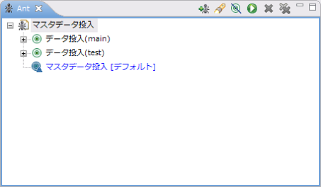

.. _master_data_tool:

マスタデータ投入ツール
==================================================

.. contents:: 目次
  :depth: 3
  :local:

機能概要
--------------------------------------------------
マスタデータ投入ツールは、データベースにマスタデータを投入するツールである。投入するデータは、自動テストのテストデータと同じ書式で記述する。\ Excel\ 形式・\ YAML\ 形式のどちらでも記述できる。EclipseのAntビューからターゲットを実行すると、アプリケーション用・自動テスト用・バックアップ用の各スキーマに同じデータを投入できる。テストデータの書式をそのまま使えるので、マスタデータのためだけに別の記述方法を覚える必要がない。

自動テストを実行するには、あらかじめデータベースにマスタデータが投入されている必要がある。本ツールは、テストデータと同じ書式で記述したファイルを読み込み、データベースにマスタデータを投入する。本ツールには次の特徴がある。

* 自動テストのテストデータと同じ書式で記述できる。
* Nablarch Application Frameworkのコンポーネント設定ファイルを使用するので、別途設定ファイルを用意する必要がない。
* \ :ref:`master_data_restore`\ が使うバックアップ用スキーマへの投入も、同じターゲットの実行でまとめて行える。

マルチスレッド機能を使うアプリケーションは、テスティングフレームワーク自体の対象外である（\ :ref:`testing_framework_about`\ 参照）。

.. tip::

  \ :ref:`blank_project`\ を使用してプロジェクトを構築した場合、データベース関連のツールとして\ :ref:`gsp-dba-maven-plugin <gsp-maven-plugin>`\ が設定される。このため、データベースへのマスタデータの投入は、本ツールではなく\ :ref:`gsp-dba-maven-plugin <gsp-maven-plugin>`\ の使用を推奨する。

.. important::

  マスタデータファイルが\ Excel\ 形式の場合、コンポーネント設定ファイルの\ ``testDataParser``\ には\ YAML\ 形式用のパーサを設定しない。設定すると、投入の対象が0件になり、例外も警告も出ない。\ ``testDataParser``\ の記述例は\ :ref:`省略したテーブルのカラムのデフォルト値を変更する <testdata_setting-column_default_values>`\ を参照。

.. _master_data_tool-setup:

導入
--------------------------------------------------
本ツールの実体は、\ ``nablarch-testing``\ に含まれる\ :java:extdoc:`MasterDataSetUpper <nablarch.test.core.db.MasterDataSetUpper>`\ である。これをAntから起動するためのビルドファイルと設定ファイルを配布物として提供する。依存jarを取得して配布物を展開し、バックアップ用スキーマ名を設定したうえで、Antビューに登録する。

前提事項
~~~~~~~~~~~~~~~~~~~~~~~~~~~~~~~~~~~~~~~~~~~~~~~~~
本ツールを使用するには、次の条件を満たす必要がある。

* EclipseとMavenがインストール済みであること
* \ :ref:`テスティングフレームワークの導入 <testing_framework_introduction>`\ のとおり、\ ``nablarch-testing``\ が依存関係に追加済みであること
* Mavenの標準ディレクトリ構成のプロジェクトであること（\ :ref:`blank_project`\ のアーキタイプから生成したプロジェクトはこれに該当する）
* マスタデータファイルに記述するすべてのテーブルが、自動テスト用スキーマに作成済みであること
* バックアップ用スキーマにも同じテーブルが作成済みであること（\ :ref:`バックアップ用スキーマを作成する <master_data_restore-backup_schema>`\ 参照）

バックアップ用スキーマには、テーブルを作成しておくだけでよい。復旧用のデータは本ツールが投入する。バックアップ用スキーマへの投入を行わない場合は、この条件は不要である。

依存jarを取得して配布物を展開する
~~~~~~~~~~~~~~~~~~~~~~~~~~~~~~~~~~~~~~~~~~~~~~~~~
pom.xmlと同じディレクトリで次のコマンドを実行し、プロジェクトをコンパイルして、jarファイルを\ ``lib``\ ディレクトリにダウンロードする。

.. code-block:: bash

  mvn compile
  mvn dependency:copy-dependencies -DoutputDirectory=lib

次のファイルをダウンロードし、pom.xmlと同じディレクトリで展開する。

* :download:`master-data-setup-tool.zip <downloads/master_data_tool/master-data-setup-tool.zip>`

zipにディレクトリは含まれないので、次の6ファイルがpom.xmlと同じディレクトリに並ぶ。

.. list-table::
  :class: white-space-normal
  :header-rows: 1
  :widths: 40,60

  * - ファイル名
    - 説明
  * - ``master_data-build.xml``
    - Antビルドファイル
  * - ``master_data-build.properties``
    - 環境設定用プロパティファイル
  * - ``master_data-log.properties``
    - ログ出力設定ファイル
  * - ``master_data-app-log.properties``
    - アプリケーションログの出力設定ファイル
  * - ``MASTER_DATA.xls``
    - マスタデータファイル
  * - ``MASTER_DATA-FOR_UI_TEST.xls``
    - マスタデータファイル（\ ``REQUEST``\ テーブルのデータ）

2つのマスタデータファイルには、Nablarchのサンプルアプリケーションのマスタデータが入っている。そのまま実行すると、記述されているテーブルのデータがすべて置き換わる。不要なシートを削除し、投入するデータに書き換えてから使用する。

.. tip::

  Antは、ビルドファイルが置かれたディレクトリを基準に相対パスを解決する（\ ``master_data-build.xml``\ の\ ``basedir="."``\ ）。プロジェクトルート（\ ``project.root``\ ）とマスタデータの格納先（\ ``masterdata.dir``\ ）がいずれも\ ``./``\ であるため、配布物はpom.xmlと同じディレクトリに置く必要がある。

バックアップ用スキーマ名を設定する
~~~~~~~~~~~~~~~~~~~~~~~~~~~~~~~~~~~~~~~~~~~~~~~~~
\ ``master_data-build.properties``\ の\ ``masterdata.test.backup-schema``\ に、バックアップ用スキーマ名を設定する。

.. code-block:: properties

  masterdata.test.backup-schema=NABLARCH_TEST_MASTER

マスタデータ復旧機能を使用しない場合は、この値を空にする。バックアップ用スキーマへの投入は行われない。

コンポーネント設定ファイルの名前が\ ``unit-test.xml``\ でないプロジェクトでは、\ ``masterdata.config``\ もあわせて修正する。その他の設定値は、ディレクトリ構成を変えない限り修正の必要はない。

AntビューにAntビルドファイルを登録する
~~~~~~~~~~~~~~~~~~~~~~~~~~~~~~~~~~~~~~~~~~~~~~~~~
EclipseのAntビューにAntビルドファイルを登録すると、Eclipseから本ツールを実行できるようになる。手順は次のとおりである。

* メニューバーの「ウィンドウ(Window)」から「ビューの表示(Show View)」→「Ant」を選び、Antビューを開く。

.. image:: images/master_data_tool/open_ant_view.png
  :scale: 100

* Antビューのツールバーにある「ビルド・ファイルの追加(Add Buildfiles)」ボタン（蟻の図柄に緑の＋が付いたアイコン）を押す。

.. image:: images/master_data_tool/register_build_file.png
  :scale: 100

* 展開した\ ``master_data-build.xml``\ を選び、「OK」を押す。

.. image:: images/master_data_tool/select_build_file.png
  :scale: 100

登録すると、Antビューにビルドファイルとターゲットが表示される。

使用方法
--------------------------------------------------
あらかじめ\ :ref:`導入 <master_data_tool-setup>`\ の手順を済ませておく。アプリケーションのソースを変更した場合は、変更後のクラスを読み込ませるために、実行前に\ ``mvn compile``\ を実行する。

マスタデータを記述する
~~~~~~~~~~~~~~~~~~~~~~~~~~~~~~~~~~~~~~~~~~~~~~~~~
投入するデータは、準備データ（\ ``SETUP_TABLE``\ ）としてマスタデータファイルに記述する。記述方法は自動テストのテストデータと同じである（\ :ref:`テーブルのデータを記述する <testdata_notation-table_data>`\ 参照）。期待値のデータタイプ（\ ``EXPECTED_TABLE``\ など）を記述しても、投入の対象にはならない。

マスタデータファイルは、\ ``master_data-build.properties``\ の\ ``masterdata.file``\ に指定したパターン（デフォルト値は\ ``MASTER_DATA*.xls``\ ）に一致するものがすべて対象になる。ファイルを分けたい場合は、このパターンに一致する名前を付けて、\ ``masterdata.dir``\ に指定したディレクトリ（デフォルトはビルドファイルと同じディレクトリ）に置く。拡張子が\ ``.xlsx``\ のファイルを使う場合や、\ YAML\ 形式のファイルを使う場合は、\ ``masterdata.file``\ もあわせて変更する（\ YAML\ 形式の場合は\ ``MASTER_DATA*.yaml``\ ）。

読み込み単位の数え方は形式によって異なる。\ Excel\ 形式では1つのファイルに含まれるすべてのシートが読み込まれるため、シートを分けてデータを整理できる。\ YAML\ 形式では1つのファイルがそのまま1つの読み込み単位であり、シートに相当する区切りは無い。データを分けたい場合はファイルを分ける。自動テストのテストデータと異なり、テストクラスに対応するディレクトリは作らず、\ ``masterdata.dir``\ の直下にファイルを並べる。

.. important::

  マスタデータファイルに記述するテーブルと、コンポーネント設定ファイルの\ ``tablesTobeWatched``\ に登録するテーブルは、同じ集合に保つ（\ :ref:`監視対象テーブルを登録する <master_data_restore-watched_tables>`\ 参照）。マスタデータファイルにだけ追加すると、そのテーブルはマスタデータ復旧機能の対象から外れ、そのテーブルを変更するテストのあとに実行するテストが、変更後のデータを見ることになる。\ ``tablesTobeWatched``\ にだけ追加すると、本ツールはそのテーブルをバックアップ用スキーマにコピーしないため、バックアップ用スキーマ側のデータで復旧される。

Antビューからターゲットを実行する
~~~~~~~~~~~~~~~~~~~~~~~~~~~~~~~~~~~~~~~~~~~~~~~~~
Antビューに登録したビルドファイルを開き、実行したいターゲットをダブルクリックする。

ターゲットは次の3つである。

.. list-table::
  :class: white-space-normal
  :header-rows: 1
  :widths: 30,70

  * - ターゲット名
    - 説明
  * - データ投入(main)
    - \ ``src/main/resources``\ を優先してコンポーネント設定ファイルを読み込み、データを投入する。取引単体テストなど、アプリケーションサーバ上でアプリケーションを動作させる際のスキーマが対象になる。\ ``src/main/resources``\ にコンポーネント設定ファイルを置いていない場合は、\ ``src/test/resources``\ のものが読み込まれる。バックアップ用スキーマへの投入は行わない。
  * - データ投入(test)
    - \ ``src/test/resources``\ を優先してコンポーネント設定ファイルを読み込み、データを投入する。自動テスト用スキーマが対象になる。マスタデータファイルに記述したすべてのテーブルを、バックアップ用スキーマにもコピーする。
  * - マスタデータ投入
    - 上の2つのターゲットをこの順で実行する。デフォルトのターゲットである。

.. important::

  投入に失敗した場合も、Antの実行結果は\ ``BUILD SUCCESSFUL``\ になる。投入できたかどうかは、コンソールに出力されるログで確認する。

.. tip::

  データの投入では、マスタデータファイルに記述したテーブルのデータを削除してから挿入する。削除はすべてのマスタデータファイルを読み込んだあとにまとめて行われるため、同じテーブルのデータが複数の読み込み単位に分かれていても、いずれかが失われることはない。ただし、行が重複して一意性制約に違反する場合はエラーになる。読み込み単位の読み込み順は保証されないので、順序に依存する記述はしない。

  削除・挿入の順序は、テーブルの依存関係の解析で決まる。解析を抑止した場合は\ ``tablesTobeWatched``\ の記述順になる（\ :ref:`テーブルの依存関係の解析を抑止する <master_data_restore-suppress_table_sort>`\ 参照）。
