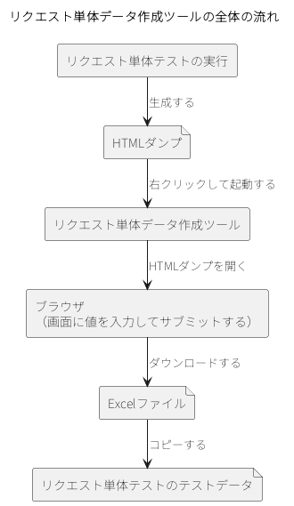

.. _request_data_tool:

リクエスト単体データ作成ツール
==================================================

.. contents:: 目次
  :depth: 3
  :local:

機能概要
--------------------------------------------------
リクエスト単体データ作成ツールは、リクエスト単体テスト（ウェブアプリケーション）が出力したHTMLダンプをブラウザで表示するツールである。画面に値を入力してサブミットすると、次画面へのリクエストパラメータが\ Excel\ 形式で得られる。パラメータ名を人手で書き写す必要がなくなる。

リクエスト単体テスト（ウェブアプリケーション）では、画面から送信されるリクエストパラメータのキーと値をテストデータとして記述する。キーと値を人手で書き写すと、リクエストパラメータ名（form要素のname属性）を写し間違えるおそれがある。パラメータ数が多い登録画面などでは、その可能性が高くなる。

本ツールは、この書き写しをブラウザ操作に置き換える。リクエスト単体テストが生成したHTMLダンプをブラウザで表示し、画面に値を入力してサブミットすると、そのとき発生したHTTPリクエストのパラメータが\ Excel\ 形式で得られる。ウェブアプリケーションを操作する感覚でテストデータを作成できる。

リクエストパラメータをテストデータに記述する書式は、\ :ref:`テストショット一覧（testShots）を記述する <testdata_notation-test_shots>`\ を参照。

.. _request_data_tool-setup:

導入
--------------------------------------------------
本ツールの実体は、\ ``nablarch-testing``\ と\ ``nablarch-testing-jetty12``\ の2つのモジュールに含まれる。依存関係を確認してjarを取得し、起動用スクリプトを配置する。

前提事項
~~~~~~~~~~~~~~~~~~~~~~~~~~~~~~~~~~~~~~~~~~~~~~~~~
本ツールを使用するには、次の条件を満たす必要がある。

* Windowsで使用すること。起動用スクリプトとして配布しているのは\ ``httpDump.bat``\ だけである
* JavaとMavenがインストール済みで、環境変数\ ``JAVA_HOME``\ が設定されていること
* プロジェクトがMavenで管理されていること
* HTMLファイルがブラウザに関連付けられていること
* ブラウザのプロキシ設定で、localhostが除外されていること

依存関係を確認して起動用スクリプトを配置する
~~~~~~~~~~~~~~~~~~~~~~~~~~~~~~~~~~~~~~~~~~~~~~~~~
pom.xmlのdependencies要素に、次の依存関係が記述されていることを確認する。

.. code-block:: xml

  <!-- テスティングフレームワーク -->
  <dependency>
    <groupId>com.nablarch.framework</groupId>
    <artifactId>nablarch-testing</artifactId>
    <scope>test</scope>
  </dependency>
  <!-- リクエスト単体データ作成ツールの実装 -->
  <dependency>
    <groupId>com.nablarch.framework</groupId>
    <artifactId>nablarch-testing-jetty12</artifactId>
    <scope>test</scope>
  </dependency>

pom.xmlと同じディレクトリで次のコマンドを実行し、jarファイルを\ ``lib``\ ディレクトリにダウンロードする。

.. code-block:: bash

  mvn dependency:copy-dependencies -DoutputDirectory=lib

次の起動用スクリプトを、pom.xmlと同じディレクトリに配置する。

* :download:`httpDump.bat <downloads/request_data_tool/httpDump.bat>`

.. tip::

  起動用スクリプトは、自身が置かれたディレクトリに移動したうえで\ ``./lib/*``\ をクラスパスに指定する。pom.xmlと同じディレクトリに配置するのは、\ ``mvn dependency:copy-dependencies``\ が\ ``lib``\ ディレクトリを作る場所と合わせるためである。

使用方法
--------------------------------------------------
あらかじめ\ :ref:`導入 <request_data_tool-setup>`\ の手順を済ませておく。全体の流れは次のとおりである。

入力となるHTMLダンプを生成する
~~~~~~~~~~~~~~~~~~~~~~~~~~~~~~~~~~~~~~~~~~~~~~~~~
リクエスト単体テストを実行し、HTMLダンプを生成する。出力先は、\ :ref:`リクエスト単体テストの設定（ウェブアプリケーション） <request_unit_test_setting_web>`\ の\ ``htmlDumpDir``\ で指定したダンプディレクトリであり、その下にテストクラス名のディレクトリが作られる。

初期画面表示のテストデータだけは、手動で用意する必要がある。初期画面表示のリクエスト（例えば、メニューからの単純な画面遷移）にはリクエストパラメータが含まれていないことがほとんどだが、その場合も\ ``requestParams``\ には、テストショット番号の列だけを記載した列を用意する（\ :ref:`テストショット一覧（testShots）を記述する <testdata_notation-test_shots>`\ 参照）。

HTMLダンプからツールを起動する
~~~~~~~~~~~~~~~~~~~~~~~~~~~~~~~~~~~~~~~~~~~~~~~~~
コマンドプロンプトで、起動用スクリプトに生成されたHTMLダンプのパスを渡して実行すると、ツールが起動する。パスは絶対パスで指定する。起動用スクリプトは自身が置かれたディレクトリに移動してから動くため、相対パスは起動時のディレクトリからは解決されない。

.. code-block:: bat

  httpDump.bat C:\path\to\htmldump\ProjectActionRequestTest\show.html

エクスプローラーでHTMLダンプを起動用スクリプトにドラッグ＆ドロップしても、同じように起動する。

.. tip::

  Windows上で本ツールを起動するとコマンドプロンプトが現れるが、これは本ツールが内部で起動するサーバのプロセスである。本ツールを使用する間は実行したままにしておくとよい。既にこのサーバが動いている場合は起動処理がスキップされるため、2回目以降は速く立ち上がる。誤ってこのコマンドプロンプトを閉じても、次回のツール起動時に自動で立ち上がるため問題はない。

画面を操作してリクエストを送信する
~~~~~~~~~~~~~~~~~~~~~~~~~~~~~~~~~~~~~~~~~~~~~~~~~
HTMLダンプがブラウザで開かれるので、画面に値を入力してサブミットする。

Excelファイルをダウンロードする
~~~~~~~~~~~~~~~~~~~~~~~~~~~~~~~~~~~~~~~~~~~~~~~~~
サブミットで発生したHTTPリクエストのパラメータを記載したExcelファイルを、ダウンロードできる。ローカルに保存する必要はないので、ブラウザから直接\ Excel\ やOpenOfficeで開けばよい。

リクエストパラメータをテストデータにコピーする
~~~~~~~~~~~~~~~~~~~~~~~~~~~~~~~~~~~~~~~~~~~~~~~~~
ダウンロードしたExcelファイルのデータを、リクエスト単体テストのテストデータにコピーする。
