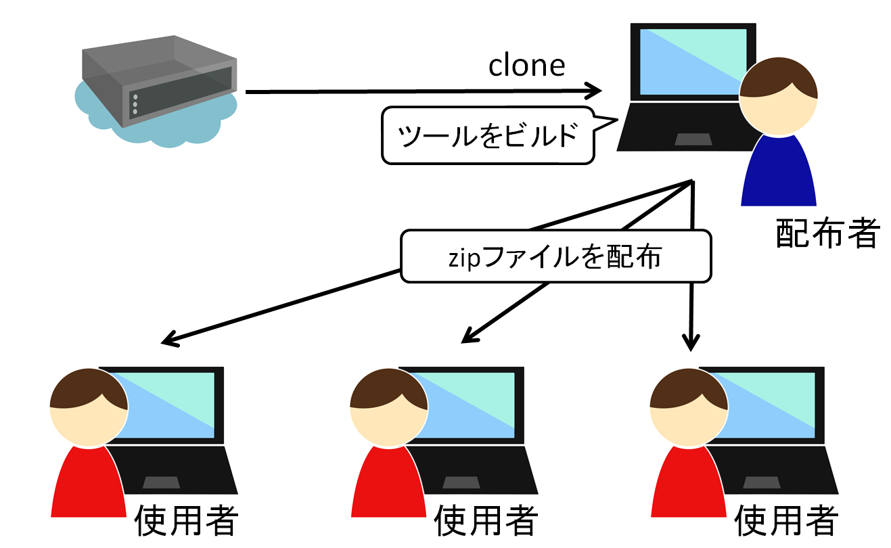
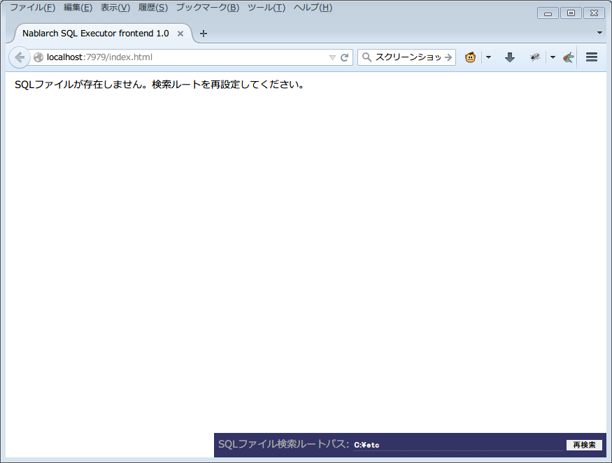
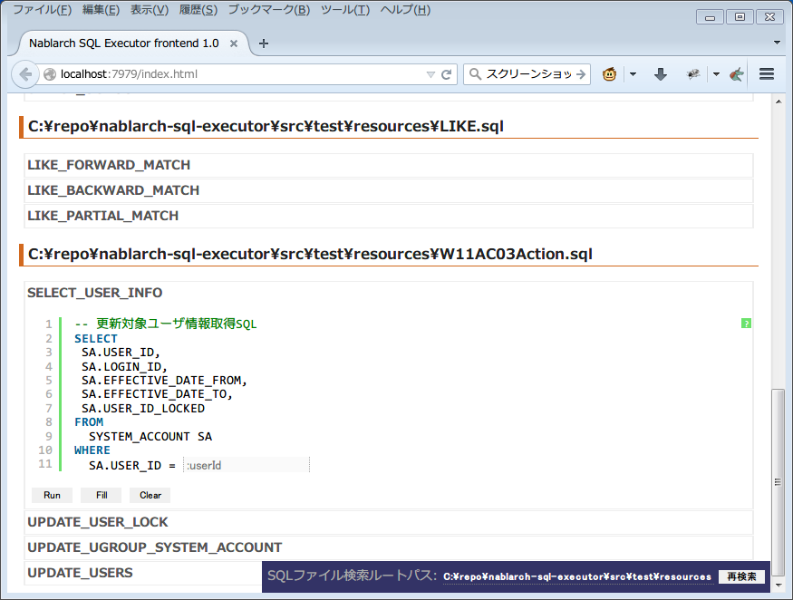
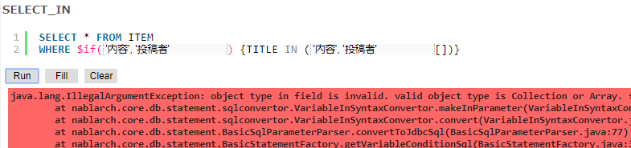

Nablarch SQL Executor
=====================

.. contents:: 目次
  :depth: 2
  :local:

概要
-------

Nablarch SQL ExecutorはNablarch特殊構文を含むSQLファイルを対話的に実行するツールである。
PJにおいて設計者がSQL設計を行う際などに使用する。

本ツールはPJで使用するDBの設定を行い、ビルドして使う必要がある。

想定使用方法
--------------

本ツールの想定使用方法
^^^^^^^^^^^^^^^^^^^^^^^^^^^^^^^^^^^^^^^^
本ツールを使用するためには、DBの設定を行い、Mavenでビルドする必要がある。
ビルド済みのツールは配布可能であるため、本作業を行うのはPJ内の1人でよい。

本ツールは以下のような使用方法を想定している。

* PJの環境構築担当者がSQL Executorをビルドして配布する。
* 配布したファイルは設計者が使用する。

ビルド済みのツールはJavaとDBへの接続環境があれば使用可能である。

   [1]_

DB接続方法の選択
^^^^^^^^^^^^^^^^^^^^^^^^^^^^^^^^^^^^
本ツールは、DBの接続において以下の2つの方法をとることができる。

* ツール使用者全員がPJ共通のDBに接続する
* ツール使用者それぞれがローカルのDBに接続する

本ツールを使用する際、PJ共通のDBを使用できる。

.. figure:: ./_images/sql-executor-db-same.png
   :alt: 各ユーザが同じDBに接続するイメージ

   [1]_

ツール使用者がそれぞれがローカルのDBを使用することもできる。

.. figure:: ./_images/sql-executor-db-separate.png
   :alt: 各ユーザが別々のDBに接続するイメージ

   [1]_

制約
^^^^

本ツールには以下の制約がある。
このため、これらのSQLを実行したい場合には、本ツールではなく使用するデータベース付属のSQL実行環境などを用いること。

* WITH句で始まるSQLを実行することが出来ない
* IN句の条件に ``,`` を含めることができない
* DATETIMEリテラルを条件とした検索ができない。

.. tip::

  Nablarchでは2-way SQLとしてSQLを記述できる `Doma(外部サイト、英語) <https://doma.readthedocs.io/en/stable/>`_ 用の :ref:`アダプタ <doma_adaptor>` を提供している。

  Domaを使用した場合、本ツールのような複雑なツールのセットアップを行わなくても、本番環境用に定義したSQLを簡単にテスト実行出来る。
  (動的な条件を構築するような場合でも、SQLを書き換えることなく実行できる)

  このため、Domaの使用を検討することを推奨する。

配布方法
-------------------------

前提条件
^^^^^^^^

本ツールをビルドし配布するための前提条件を以下に示す。

* FirefoxまたはChromeがインストール済みであること。
* Nablarchの開発環境が設定済みであること。
* Maven Central RepositoryにJDBCドライバが存在しないRDBMSを使用する場合は、Project Local RepositoryまたはLocal RepositoryにJDBCドライバを登録済みであること。
  登録方法は、:ref:`customizeDBAddFileMavenRepo` を参照。

ソースコード取得
^^^^^^^^^^^^^^^^

以下のサイトで公開されているリポジトリをcloneする。

https://github.com/nablarch/sql-executor (外部サイト)

.. _db-settings:

DB設定変更
^^^^^^^^^^

使用するRDBMSに応じて設定変更を行う。

~~~~~~~~~~~~~~
基本設定の変更
~~~~~~~~~~~~~~

src/main/resources/db.configの修正
~~~~~~~~~~~~~~~~~~~~~~~~~~~~~~~~~~

接続URLやユーザ、パスワードを変更する場合、src/main/resources/db.configを修正する。

以下に設定例を示す。

**H2の設定例(デフォルト)**

.. code-block:: text

  db.url=jdbc:h2:./h2/db/SAMPLE
  db.user=SAMPLE
  db.password=SAMPLE

**Oracleの設定例**

.. code-block:: text

  # jdbc:oracle:thin:@ホスト名:ポート番号:データベースのSID
  db.url=jdbc:oracle:thin:@localhost:1521/xe
  db.user=sample
  db.password=sample

**PostgreSQLの設定例**

.. code-block:: text

  # jdbc:postgresql://ホスト名:ポート番号/データベース名
  db.url=jdbc:postgresql://localhost:5432/postgres
  db.user=sample
  db.password=sample

**DB2の設定例**

.. code-block:: text

  # jdbc:db2://ホスト名:ポート番号/データベース名
  db.url=jdbc:db2://localhost:50000/SAMPLE
  db.user=sample
  db.password=sample

**SQL Serverの設定例**

.. code-block:: text

  # jdbc:sqlserver://ホスト名:ポート番号;instanceName=インスタンス名
  db.url=jdbc:sqlserver://localhost:1433;instanceName=SQLEXPRESS
  db.user=SAMPLE
  db.password=SAMPLE

~~~~~~~~~~~~~~~~~~
JDBCドライバの変更
~~~~~~~~~~~~~~~~~~

JDBCドライバを変更する場合、以下のファイルを修正する。

pom.xml
~~~~~~~~~~~~~~~~~~~~~~~~~

pom.xml中の「使用するRDBMSにあわせて、下記JDBCドライバの dependency を更新してください。」とのコメントがある箇所を修正する。

以下、データベース毎の設定例を記述する。

**H2の設定例(デフォルト)**

.. code-block:: xml

    <dependencies>
      <!-- 中略 -->

      <!-- 使用するRDBMSにあわせて、下記JDBCドライバの dependency を更新してください。 -->
      <dependency>
        <groupId>com.h2database</groupId>
        <artifactId>h2</artifactId>
        <version>1.3.176</version>
        <scope>runtime</scope>
      </dependency>
    </dependencies>

**Oracleの設定例**

.. code-block:: xml

    <dependencies>
      <!-- 中略 -->

      <!-- 使用するRDBMSにあわせて、下記JDBCドライバの dependency を更新してください。 -->
      <dependency>
        <groupId>com.oracle.database.jdbc</groupId>
        <artifactId>ojdbc6</artifactId>
        <version>11.2.0.4</version>
        <scope>runtime</scope>
      </dependency>
    </dependencies>

**PostgreSQLの設定例**

.. code-block:: xml

    <dependencies>
      <!-- 中略 -->

      <!-- 使用するRDBMSにあわせて、下記JDBCドライバの dependency を更新してください。 -->
      <dependency>
        <groupId>org.postgresql</groupId>
        <artifactId>postgresql</artifactId>
        <version>9.4.1207</version>
        <scope>runtime</scope>
      </dependency>
    </dependencies>

**DB2の設定例**

.. code-block:: xml

    <dependencies>
      <!-- 中略 -->

      <!-- 使用するRDBMSにあわせて、下記JDBCドライバの dependency を更新してください。 -->
      <dependency>
        <groupId>com.ibm</groupId>
        <artifactId>db2jcc4</artifactId>
        <version>10.5.0.7</version>
        <scope>runtime</scope>
      </dependency>
    </dependencies>

src/main/resources/db.xml
~~~~~~~~~~~~~~~~~~~~~~~~~
JDBCドライバのクラス名とダイアレクトのクラス名を修正する。
dataSourceコンポーネントのdriverClassNameプロパティに、ドライバのクラス名を設定する。

該当箇所を以下に示す。

.. code-block:: xml

  <!-- データソース設定 -->
  <component name="dataSource" class="org.apache.commons.dbcp.BasicDataSource">
    <!-- JDBCドライバのクラス名設定 -->
    <!-- TODO: データベース接続情報を変更する場合、ここを修正します -->
    <property name="driverClassName"
              value="org.h2.Driver" />
    <!-- 中略 -->
  </component>

  <!-- データベース接続用設定 -->
  <component name="connectionFactory"
      class="nablarch.core.db.connection.BasicDbConnectionFactoryForDataSource">
    <!-- 中略 -->
    <property name="dialect">
      <!-- ダイアレクトのクラス名設定 -->
      <!-- TODO: データベースを変更する場合、ここを修正します。-->
      <component class="nablarch.core.db.dialect.H2Dialect"/>
    </property>
  </component>

設定値の例を以下に示す。

.. list-table::
   :widths: 5 8 10
   :header-rows: 1

   * - データベース
     - JDBCドライバのクラス名
     - ダイアレクトのクラス名
   * - H2
     - org.h2.Driver
     - nablarch.core.db.dialect.H2Dialect
   * - Oracle
     - oracle.jdbc.driver.OracleDriver
     - nablarch.core.db.dialect.OracleDialect
   * - PostgreSQL
     - org.postgresql.Driver
     - nablarch.core.db.dialect.PostgreSQLDialect
   * - DB2
     - com.ibm.db2.jcc.DB2Driver
     - nablarch.core.db.dialect.DB2Dialect
   * - SQL Server
     - com.microsoft.sqlserver.jdbc. |br| SQLServerDriver
     - nablarch.core.db.dialect.SqlServerDialect

起動確認
^^^^^^^^

以下のコマンドを実行する。

.. code-block:: text

  mvn compile exec:java

その後、ブラウザを起動して、 http://localhost:7979/index.html を表示する。

.. tip::

  * 初回起動時等、起動に時間がかかる場合、ブラウザがタイムアウトすることがある。
    この場合は、起動完了後にブラウザをリロードする。
  * 本ツールは、Internet Explorerでは、正常に動作しない。Internet Explorerが起動した場合は、URLをコピーし、FirefoxまたはChromeのアドレス欄に貼り付けること。

配布ファイル作成
^^^^^^^^^^^^^^^^
以下のコマンドを実行する。

.. code-block:: text

  mvn package

target直下に作成されたsql-executor-distribution.zipを配布することで、Git, Mavenの環境なしでツールを使用できる。

配布されたツールの使用方法
---------------------------

前提条件
^^^^^^^^^

ツールを使用するための前提条件を以下に示す。

- PJで使用されるバージョンのJavaがインストール済みであること。
- :ref:`db-settings` で設定したDBに接続可能であること。
- FirefoxまたはChromeがインストール済みであること。  

配布されたファイルの起動
^^^^^^^^^^^^^^^^^^^^^^^^^^^^^^^^^^
配布されたsql-executor-distribution.zipを解凍する。

sql-executor-distribution/sql-executor直下のsql-executor.batを実行する。
ファイルをダブルクリックするか、コマンドプロンプトから起動する。

.. code-block:: bat

  sql-executor.bat

配布時に設定済みのDB以外に接続したい場合
^^^^^^^^^^^^^^^^^^^^^^^^^^^^^^^^^^^^^^^^^^^^^^^^^^^^^^^^^^^^^^^^^^^^
``sql-executor.bat`` を編集する。設定項目は以下の通り。

.. csv-table:: 設定項目

  "db.url", "データベースURL"
  "db.user", "接続ユーザ"
  "db.password", "パスワード"

例として ``db.url=jdbc:h2:./h2/db/SAMPLE`` , ``db.user=SAMPLE``, ``db.password=SAMPLE`` へ接続する場合の編集方法を以下に示す。

.. code-block:: bat
  :emphasize-lines: 3

  cd /d %~dp0

  start java -Ddb.url=jdbc:h2:./h2/db/SAMPLE -Ddb.user=SAMPLE -Ddb.password=SAMPLE -jar sql-executor.jar （以降略）
  cmd /c start http://localhost:7979/index.html

実行しても何も出力されずに異常終了する場合は、 :ref:`faq` を参照。

操作方法
--------

基本的な操作方法
^^^^^^^^^^^^^^^^^^^^^^^^^^^^^^

初回起動時はカレントディレクトリ配下のSQLファイルの一覧を表示するが、
存在しない場合は以下のような画面が表示される。

   初期画面

右下の入力欄にローカルフォルダのパスを指定し、下図のように **[再検索]**
をクリックすると
その配下の検索してSQLファイルと各ファイルに記述されているステートメントの
一覧を表示する。

.. figure:: ./_images/setting_search_root_path.png
   :alt: 検索パス設定

   検索パス設定

各ステートメント名をクリックすると、その内容と操作用のボタンが表示される。

   SQLステートメント一覧

ステートメント内の埋込み変数は入力フィールドになっており、内容を編集して
**[Run]**
をクリックすることで、当該ステートメントを実行できる。

また **[Fill]**
をクリックすると、前回の実行時の入力フィールドの内容を復元する。

.. figure:: ./_images/running_sql_scripts.png
   :alt: SQL実行結果(クエリ)

   SQL実行結果(クエリ)

.. figure:: ./_images/running_dml_scripts.png
   :alt: SQL実行結果(DML)

   SQL実行結果(DML)

SQLExecutorでの記法
^^^^^^^^^^^^^^^^^^^^^^^^^^^^^^
~~~~~~~~~~~~~~~~~~
文字列の記述
~~~~~~~~~~~~~~~~~~

本ツールにおいて文字列を条件として入力したい場合は、文字列を ``'`` で囲む必要がある。

~~~~~~~~~~~~~~~~~~
文字列以外の記述
~~~~~~~~~~~~~~~~~~

文字列以外は ``'`` で囲まずに記述する。

~~~~~~~~~~~~~~~~~~
IN句の記述
~~~~~~~~~~~~~~~~~~

本ツールにおいてIN句を実行するためには、条件を ``[]`` で囲む必要がある。また、複数項目を入力する場合は ``,`` で区切る必要がある。

また、 ``$if`` 特殊構文とIN句の条件に同一の変数名を指定している場合は、同一の値を入力する必要がある。

下記に例を示す。

.. figure:: ./_images/in-success.png
   :alt: IN句の条件を[]で囲んでいる画像

IN句の条件の項目に ``[]`` が付与されていない場合、以下のエラーが出力される。
``java.lang.IllegalArgumentException: object type in field is invalid. valid object type is Collection or Array.``

.. warning::

    ただし、本ツールにおいて ``,`` をIN句の検索条件として扱うことはできない。

~~~~~~~~~~~~~~~~~~
日付型の設定
~~~~~~~~~~~~~~~~~~

日付型(DATE)フィールドへの値の設定は、SQL92のDATEリテラルと同じ書式で記述する。

以下に例を示す。

::

  1970-12-11

また、キーワード ``SYSDATE`` を指定することで、現在時刻が設定される。

.. warning::

    DATETIMEリテラルを条件とした検索はできない。

.. _faq:

FAQ
---

**Q1** :実行時のログを見たいが、どのようにすればログを確認できるか？

**A1** :実行時に、以下のログファイルが出力される。

        * sql.log → SQL文の実行時ログ
        * app.log → 全実行ログ

^^^^^^^^^^^^^^

**Q2** :実行しても何も出力されずに異常終了してしまう場合、どう対処すればよいか？

**A2** :起動時のDBコネクションエラーなどの一部のエラーは
標準エラー出力ではなく、実行ログファイルに出力される。
実行ログは、カレントディレクトリ直下に ``app.log`` という名前で
出力されるので、その内容を確認して対処する。

^^^^^^^^^^^^^^

**Q3** : ``パラメータの指定方法が正しくありません。`` というメッセージが表示されるが、対処方法が分からない。

**A3** :
文字列を入力したい場合には文字列を ``'`` で囲んでいるかを確認する。
真偽値、日付型を入力したい場合には、スペルミスや形式のミスがないかを確認して対処する。

.. [1] Future Architect, Inc. Japan ( `クリエイティブ・コモンズ・ライセンス（表示4.0 国際） <https://creativecommons.org/licenses/by/4.0/>`_ ） を改変して作成

.. |br| raw:: html

   
