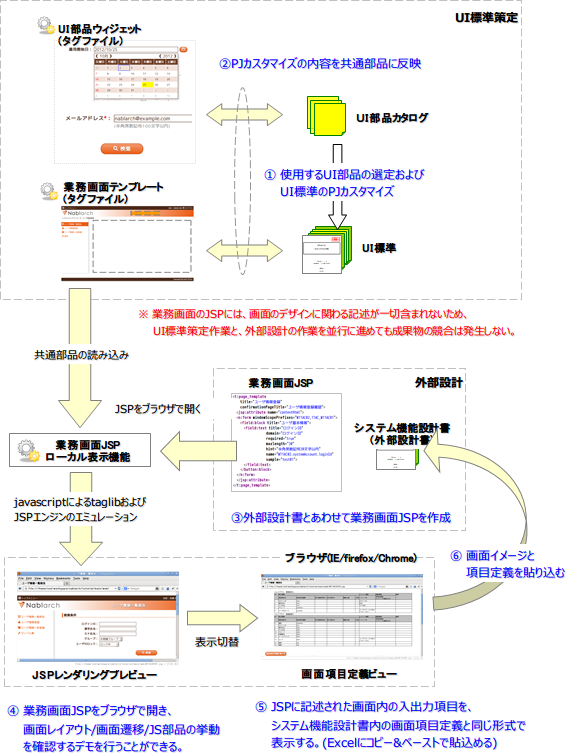

===============================
UI開発ワークフロー
===============================

--------------------------------------------
UI開発ワークフロー
--------------------------------------------
Nablarchでの画面開発のワークフローでは、画面項目定義書の記述レベルと同じ抽象度をもった
カスタムタグをJSPに記述し、デモ用に作成されたモックを、サーバ上で実際に稼動するJSPの作成に
そのまま利用することができる。

画面のJSPソースコードからは、画面の見た目に関する情報が排除され、
それらの内容は全て共通部品側に移動することになる。

これは、ユーザインターフェースの変更点の多くが、各画面のJSPではなく、
共通部品側の修正で対応できるということを意味する。
これにより、

  1. 各画面の担当者は、画面UIのうち、業務機能に関わる本質的な部分
     だけに集中することができ、作業負荷を軽減することができる。

  2. 画面デザインの変更が画面の実装に直接影響することがないため、
     画面設計とデザインのワークフローを完全に並列に進めることができる。
     また、開発終盤のユーザ打鍵検証で、ユーザインターフェースの変更要望が発生した場合にも、
     最小の工数で対応することができる。 
     
これを実現する上で最も重要なファクターとなるのが、Nablarch1.3以降に同梱される
:doc:`../internals/jsp_widgets` および :doc:`../internals/jsp_page_templates` の存在である。
これらの共通部品群は、同じくNablarchに付随するUI標準に準拠した
挙動・表示となるようにあらかじめ実装されており、画面の開発者がUI標準に
記述された見た目上の問題を一切意識しなくとも、自動的に標準に沿った画面を作成することが
可能となっている。

以下に、UI開発基盤を使用したNablarchにおける画面設計作業のワークフローを示す。

各画面の担当者の負荷が減るその一方で、PJごとの要求に沿ってUI標準に\
変更がかかるとその内容を共通部品側に反映する必要が発生する。\
図中の②がそれに相当する。

この修正が滞ると、顧客側の要望がデモ画面や設計書の画面イメージに反映されず、\
結果として、設計工程に支障をきたす可能性がある。

また、共通部品の改修を行う担当者には、クライアントサイド技術に関する高度な知識と
実装技術に加えNablarchを含むサーバサイド技術にも十分な理解が必要となる。

