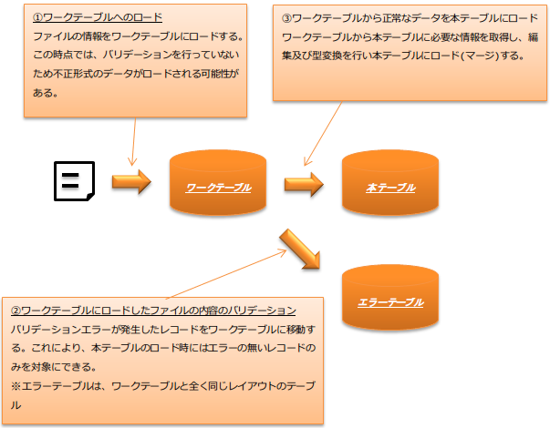

.. _etl:

ETL
==============================
.. contents:: 目次
  :depth: 3
  :local:

:ref:`jsr352_batch` 上で動作するETL機能を提供する。

ETLとは以下の略である。
 
* Extract(外部データの抽出)
* Transform(抽出したデータの検証と変換)
* Load(変換したデータの出力)

ETLを使うことで以下のメリットが得られる。

* インタフェースファイルの取り込みや作成処理を、設定ファイルとSQLおよびBeanの作成のみで実現できる。
* :ref:`jsr352_batch` のBatchletやChunkステップとして各フェーズが提供されているため、ステップを追加することで容易に任意の処理を追加できる。

.. tip::

  NablarchのETLは、厳密には一般的なETLとは各フェーズで行っている処理の内容が異なっている。
  詳細は、後述の :ref:`etl-phase` を参照。

ETLの処理イメージ
  ファイルの内容をデータベースへ登録
    .. image:: images/file_to_db.png
      :scale: 65

  データベースの内容をファイルへ出力
    .. image:: images/db_to_file.png
      :scale: 65

.. tip::

  ETLを使用したバッチアプリケーションの実例は、`Exampleアプリケーション <https://github.com/nablarch/nablarch-example-batch-ee>`_
  の以下のJOBを参照。

  * etl-zip-code-csv-to-db-insert-batchlet
  * etl-zip-code-csv-to-db-chunk
  * etl-zip-code-db-to-csv-chunk
  * etl-zip-code-db-to-fixedlength-chunk
  * etl-zip-code-fixedlength-to-db-chunk
    
モジュール一覧
--------------------
.. code-block:: xml

  <dependency>
    <groupId>com.nablarch.framework</groupId>
    <artifactId>nablarch-etl</artifactId>
  </dependency>
  
.. _etl-phase:

ETLの各フェーズの仕様
----------------------

.. _etl-extract_phase:

Extractフェーズ
~~~~~~~~~~~~~~~~~~~~~~~~~~~~~~~~~~~~~~~~~~~~~~~~~~
Extractフェーズでは、ファイルの内容をデータベース上のワークテーブルに取り込む処理を行う。

データのロード方法の選択
  本機能では、以下の2種類のロード方法を提供している。

  .. list-table::
    :widths: 75 200
    :header-rows: 1
    :class: white-space-normal
    
    * - ロード方法
      - 内容
    
    * - Chunk
      - Chunkステップを使用してデータをワークテーブルにロードする。
      
        詳細は、 :ref:`etl-extract-chunk` を参照。
        
    * - SQL*Loader
      - Oracle SQL*Loaderを使用してデータをワークテーブルにロードする。
      
        使用方法は、 :ref:`etl-extract-sql_loader` を参照。
      
.. _etl-transform_phase:

Transformフェーズ
~~~~~~~~~~~~~~~~~~~~~~~~~~~~~~
Transformフェーズでは、 :ref:`etl-extract_phase` でワークテーブルに取り込んだデータに対するバリデーションを行う。
なお、本機能では一般的なETLとは異なりデータの編集処理は :ref:`etl-load_phase` にて行う。

詳細は、 :ref:`etl-transform-validation` を参照。

.. _etl-load_phase:

Loadフェーズ
~~~~~~~~~~~~~~~~~~~~~~~~~~~~~~
Loadフェーズでは、データ変換用SQL文を実行し、データをデータベースやファイルに出力する。

データのLoad方法の選択
  本機能では出力先などに応じて以下のLoad方法を提供している。
  
  .. list-table::
    :widths: 75 200
    :header-rows: 1
    :class: white-space-normal
    
    * - ロード方法
      - 内容
      
    * - ファイル出力
      - ファイルに出力する場合に使用する。
      
        詳細は :ref:`etl-load-file` を参照。
        
    * - データベースの洗い替え
      - ロード先テーブルのデータを削除後にワークテーブルのデータを登録する場合に使用する。
      
        詳細は :ref:`etl-load-replace_database` を参照。
     
    * - データベースのマージ
      - ロード先テーブルにワークテーブルのデータをマージする場合に使用する。
      
        キーが一致するデータが存在する場合は更新処理が行われ、存在しない場合は登録処理が行われる。
        
        マージモードに対応しているデータベースは、 :java:extdoc:`MergeSqlGeneratorFactory <nablarch.etl.generator.MergeSqlGeneratorFactory>` を参照。
        
        詳細は :ref:`etl-load-merge_database` を参照。
    
    * - データベースへの登録
      - Chunkステップを使用してデータベースのテーブルにデータを登録する場合に使用する。
        
        SQLだけでは編集処理を行えない場合にChunkステップのprocessorを追加することで、Java側で編集処理を行えるメリットがある。

        詳細は :ref:`etl-load-insert_database` を参照
        
ETLを使用するバッチの設計ポイント
--------------------------------------------------

.. _etl-load_file_detail:

ファイル取り込み処理
~~~~~~~~~~~~~~~~~~~~
ファイルを本テーブルに取り込む際の処理の流れは下の図のようになる。

ワークテーブルやエラーテーブルなどの設計が誤っていると実装が出来ないため、本章の内容を理解して設計すること。

  
.. _etl-worktable_point:

ワークテーブル
  取り込み対象のファイルの内容を保持するテーブル。
  
  ワークテーブルは、 :ref:`etl-extract_phase` で取り込み対象ファイルの内容がロードされ、 :ref:`etl-transform_phase` 及び :ref:`etl-load_phase` の入力テーブルとなる。
  
  ファイル内の各項目に対応したカラムについて
    上記図の通りファイル内の項目に対応したカラムは、不正な値 [#invalid_file]_ であってもワークテーブルにロードできるよう以下の指針に従い設計すること。
    
    .. list-table::
      :widths: 75 200
      :class: white-space-normal
      
      * - カラムの型
        - 原則可変長の文字列型を使用する。
        
          ただし、ファイル内のバイナリデータを保存するカラムに関しては、文字列型に変換出来ないためバイナリ型を使用する。
          
      * - カラムのデータ長
        - CSVなどの可変長ファイルは、ファイル内の各項目の桁数が不明である。このため、想定外の桁数でもワークテーブルにロードできるよう、データベースで定義可能な最も大きい値とする。
          
          固定長の場合は決められた長さで各項目を区切るため、項目長をカラムのデータ長として使用する。
          
  .. _etl-line_number_col:
  
  行番号を格納するカラムについて
    ファイルの行番号を保持するカラムを必ず定義する。カラム名は、 ``LINE_NUMBER`` とし整数型として定義する。
    行番号カラムは後続のフェーズで以下のように使用するため必ず必要となる。
    
    .. list-table::
      :widths: 75 200
      :class: white-space-normal
    
      * - フェーズ
        - 利用目的
        
      * - Transform
        - :ref:`バリデーション <etl-transform-validation>` 時に、バリデーションエラーが発生した行番号をログに出力する際に使用する。
          また、ワークテーブルからエラーが発生したレコードを削除する際の条件として使用する。
          
      * - Load
        - :ref:`洗い替え <etl-load-replace_database>` 及び :ref:`マージ <etl-load-merge_database>` 処理でコミット間隔を制御する際に使用する。
        
    .. tip::
    
      行番号カラムは本テーブルにはロードする必要がない。
      
      :ref:`データベースへの登録 <etl-load-insert_database>` を使用する場合、本テーブルに対応したEntityからSQLが自動生成されるため、行番号カラムは自動的に除外される。
      :ref:`洗い替え <etl-load-replace_database>` 及び :ref:`マージ <etl-load-merge_database>` を使用する場合は、ワークテーブルから取得するSQLのSELECT句には行番号カラムを含めないようにすること。
      
      上記以外の方法を使用して本テーブルにデータをロードする場合は、行番号を除外するよう設計及び実装すること。
      
エラーテーブル
  :ref:`バリデーション <etl-transform-validation>` 時にエラーとなったレコードの退避先テーブル。
  
  エラーテーブルは、ワークテーブルと全く同じレイアウトとすること。
  
本テーブル
  本テーブルはアプリケーションの要件に従い設計する。ワークテーブルから本テーブルへデータをロードする際の変換処理は、 :ref:`etl-load_phase` にて実施する。
  :ref:`行番号カラム <etl-line_number_col>` で説明したように、行番号を保持するカラムは不要である。
  
  .. tip::
  
    :ref:`ワークテーブルの設計ポイント <etl-worktable_point>` で説明したようにワークテーブルの各カラムの型は基本的に文字列型として定義する。
    このため、本テーブルに取り込む際には型変換が必要となる。
    
    :ref:`データベースへの登録 <etl-load-insert_database>` を使用する場合は、本テーブルに対応したEntityの属性の型定義に従い自動的に型変換が行われる。
    :ref:`洗い替え <etl-load-replace_database>` 及び :ref:`マージ <etl-load-merge_database>` を使用する場合は、
    ワークテーブルからのデータ取得時のSQLで明示的に型変換する必要がある。
    明示的に型変換しなかった場合、データベースにより暗黙的に型変換されるため注意すること。
  
ファイル出力処理
~~~~~~~~~~~~~~~~~~~~~~~~~~~~~~~~~~~~~~~~~~~~~~~~~~
本テーブルの内容をファイルに出力する際の処理の流れは下の図のようになる。
:ref:`etl-load_file_detail` とは異なり、ファイル出力処理には設計時の注意点などはない。
要件に従い、本テーブル及びファイルレイアウトを設計し、 :ref:`ファイル出力 <etl-load-file>` 時にSQLを使用して値の編集などを行う。

.. image:: images/db_to_file_detail.png
  :scale: 80

使用方法
--------------------------------------------------

ETL JOBを実行するための設定
~~~~~~~~~~~~~~~~~~~~~~~~~~~~~~~~~~~~~

ETL JOBを実行するためには以下の設定ファイルが必要となる。

.. image:: images/setting_file.png

ETL用環境設定ファイル
  読み込むファイルパスなどの環境依存値を設定するファイル。

  詳細は、 :ref:`etl-common-configuration` を参照。

JOB定義ファイル
  ETL JOBのJOB構成を定義するファイル。

  詳細は、 :ref:`etl-json-configuration` および :ref:`jsr352_batch` 及び `JSR352 Specification <https://jcp.org/en/jsr/detail?id=352>`_ を参照。

ETL用JOB設定ファイル
  JOB毎に必要となる各フェーズ(Extract/Transform/Load)を設定するファイル。

  詳細は、 :ref:`etl-json-configuration` を参照。

.. _etl-common-configuration:

ETL用環境設定ファイルを作成する
~~~~~~~~~~~~~~~~~~~~~~~~~~~~~~~~~~~~~~~~~~~~~~~~~~
環境依存値はシステムリポジトリ機能の環境設定ファイルに設定する。
設定方法は、 :ref:`repository-environment_configuration` を参照。

ETLでは以下の環境依存値を設定する。

ファイル入力を行う場合
  +-------------------------------+-------------------------------------------+
  | nablarch.etl.inputFileBasePath| 入力ファイルを配置するディレクトリのパス  |
  +-------------------------------+-------------------------------------------+

ファイル出力を行う場合
  +--------------------------------+-------------------------------------------+
  | nablarch.etl.outputFileBasePath| 出力ファイルを配置するディレクトリのパス  |
  +--------------------------------+-------------------------------------------+

:ref:`Oracle SQL*Loaderを使用したデータのロード <etl-extract-sql_loader>` を行う場合
  +------------------------------------------+-------------------------------------------+
  | nablarch.etl.sqlLoaderControlFileBasePath| ctlファイルを配置するディレクトリのパス   |
  +------------------------------------------+-------------------------------------------+
  | nablarch.etl.sqlLoaderOutputFileBasePath | 実行ログを出力するディレクトリのパス      |
  +------------------------------------------+-------------------------------------------+

.. _etl-json-configuration:

JOB定義ファイルとETL用JOB設定ファイルを作成する
~~~~~~~~~~~~~~~~~~~~~~~~~~~~~~~~~~~~~~~~~~~~~~~~~~

ETL用JOB設定ファイルを作成する際は、ファイル名を ``<<JOB ID>>.json`` とし、``META-INF/etl-config/`` 配下に配置する。

.. tip::
  ETL用JOB設定ファイルを配置するディレクトリのパスを変更したい場合は、 :ref:`etl-loader-dir_path` を参照。

ジョブ設定ファイルは、以下からテンプレートをダウンロードし、ファイル内のコメントを参照し編集すること。

Oracle SQL*Loaderを使用したファイル取り込みテンプレート
  :ref:`etl-load_phase` で洗い替えモードを使用する場合のテンプレート
    * :download:`JOB定義ファイルのテンプレート <templates/sql_loader_replace.xml>`
    * :download:`ETL用JOB設定ファイルテンプレート <templates/sql_loader_replace_config.json>`
    
  :ref:`etl-load_phase` でマージモードを使用する場合のテンプレート
    * :download:`JOB定義ファイルのテンプレート <templates/sql_loader_merge.xml>`
    * :download:`ETL用JOB設定ファイルテンプレート <templates/sql_loader_merge_config.json>`

JSR352のChunkを使用したファイル取り込みのテンプレート
  * :download:`JOB定義ファイルのテンプレート <templates/chunk_replace.xml>`
  * :download:`ETL用JOB設定ファイルテンプレート <templates/chunk_replace.json>`

ファイル出力のテンプレート
  * :download:`JOB定義ファイルのテンプレート <templates/file_output.xml>`
  * :download:`ETL用JOB設定ファイルテンプレート <templates/file_output.json>`
  
.. tip::

 テンプレートで要件を満たせない場合には、テンプレートをベースにステップの追加や変更などを行うことで対応すること。
 例えば、Chunkステップを用いてファイルをワークテーブルにロードし、マージモードを使用して本テーブルにデータをロードしたい場合には、
 SQL*LoaderとChunkのテンプレートから必要なものを組み合わせてジョブを構成すると良い。
 
.. _etl-truncate:

テーブルクリーニングステップを利用してテーブルのデータを削除する
~~~~~~~~~~~~~~~~~~~~~~~~~~~~~~~~~~~~~~~~~~~~~~~~~~~~~~~~~~~~~~~~~~~~~~~~~~~~~~~~
ETLの処理の中で、テーブルのクリーニング(全削除)が必要となるシーンがある。
例えば、ワークテーブルへのデータロード(Extract)の前にワークテーブルを空にしておきたい場合が該当する。

このような場合は、テーブルクリーニング用のステップを定義することで対応する。

.. tip::

  JOB定義及びETL用JOB設定ファイルは、 :ref:`etl-json-configuration` の **Oracle SQL*Loaderを使用したファイル取り込みテンプレート** をダウンロードし編集すると良い。

JOB定義
  * batchletとしてステップを定義する。
  * batchletクラスには、 :java:extdoc:`tableCleaningBatchlet <nablarch.etl.TableCleaningBatchlet>` を設定する。
  
  .. code-block:: xml
  
    <!-- id及びnextは適宜変更すること -->
    <step id="truncate" next="extract">
      <listeners>
        <!-- リスナーの設定は省略 -->
      </listeners>
      <batchlet ref="tableCleaningBatchlet" />
    </step>
    
  .. tip::
  
    :java:extdoc:`TableCleaningBatchlet <nablarch.etl.TableCleaningBatchlet>` は、
    :ref:`database` 機能を使用してデータをクリーニングする。
    このため、 :ref:`database` を使用するための設定を事前に行う必要がある。

ETL用JOB設定ファイル
  JOB定義のステップ名(step id)に対応したキーに対して、以下の設定値を持つオブジェクトを設定する。
  
  .. list-table::
    :header-rows: 1
    :widths: 100 200
    :class: white-space-normal

    * - キー
      - 設定する値
    * - type
      - ``truncate`` を固定で設定する。
    * - entities
      - 削除対象のテーブルに対応したEntityクラスの完全修飾名を配列で設定する。
      
        Entityクラスは、 :ref:`universal_dao` のルールに従い作成すること。
  
  設定例
    .. code-block:: javascript
    
      "truncate": {
        "type": "truncate",
        "entities": [
          "sample.SampleEntity1",
          "sample.SampleEntity2"
        ]
      }

.. _etl-extract-chunk:

Extractフェーズ(Chunk)を使用する
~~~~~~~~~~~~~~~~~~~~~~~~~~~~~~~~~~~~~~~~~~~~~~~~~~
Chunkを使用したExtractフェーズの実装と設定について解説する。

.. tip::

  ワークテーブルの内容を事前に削除する必要がある場合は、Chunkステップの前処理として :ref:`テーブルのクリーニング <etl-truncate>` を行うようステップを定義すること。

.. tip::

  JOB定義及びETL用JOB設定ファイルは、 :ref:`etl-json-configuration` の **JSR352のChunkを使用したファイル取り込みのテンプレート** をダウンロードし編集すると良い。

.. _etl-extract-chunk-bean:

入力ファイルとワークテーブルに対応したJava Beansの作成
  入力ファイルとワークテーブルに対応したJava Beansを以下のルールに従い作成する。
  
  .. list-table::
    :widths: 100 200
    :class: white-space-normal
    
    * - 行番号を保持する属性
      - :ref:`ワークテーブルの設計について <etl-worktable_point>` で説明したように、ワークテーブルには行番号を必ず保持させる。
        このため、ワークテーブルに対応したJava Beansにも行番号を保持するための属性を定義する。
        
        なお、行番号をもつ属性の追加は、 :java:extdoc:`WorkItem <nablarch.etl.WorkItem>` を継承して実現すること。
        :java:extdoc:`WorkItem <nablarch.etl.WorkItem>` を継承していない場合、後続のフェーズが実行できなくなるため注意すること。
    
    * - 入力ファイルのレイアウトを定義
      - ファイルを読み込む :java:extdoc:`FileItemReader <nablarch.etl.FileItemReader>` は、 :ref:`data_bind` を使用する。
        このため、 :ref:`data_bind` を参照しアノテーションを設定すること。
        
    * - ワークテーブルのテーブルに関する定義
      - データベースに出力する :java:extdoc:`DatabaseItemWriter <nablarch.etl.DatabaseItemWriter>` は、 :ref:`universal_dao` を使用する。
        このため、 詳細は、 :ref:`universal_dao` を参照しアノテーションを設定すること。
  
JOB定義 
  * Chunkとしてステップを定義する。
  * readerには、 :java:extdoc:`fileItemReader <nablarch.etl.FileItemReader>` を設定する。
  * writerには、 :java:extdoc:`databaseItemWriter <nablarch.etl.DatabaseItemWriter>` を設定する。

  .. code-block:: xml
  
    <!-- id及びnextは適宜変更すること -->
    <step id="extract" next="validation">
      <listeners>
        <!-- リスナーの設定は省略 -->
      </listeners>
      <!-- item-countは適宜変更すること -->
      <chunk item-count="3000">
        <reader ref="fileItemReader" />
        <writer ref="databaseItemWriter" />
      </chunk>
    </step>
    
  .. tip::
    :java:extdoc:`fileItemReader <nablarch.etl.FileItemReader>` は、 :ref:`data_bind` を使用してファイルを読み込む。
    ファイルの行番号については、 :ref:`入力ファイルとワークテーブルに対応したJava Beansの作成 <etl-extract-sql_loader-bean>` に従って作成することで自動的に保持される。
    詳細は、 :ref:`data_bind-line_number` を参照
    
    :java:extdoc:`databaseItemWriter <nablarch.etl.DatabaseItemWriter>` は、 :ref:`universal_dao` を使用してワークテーブルにデータを登録する。
    

.. _etl-extract-chunk-configuration:

ETL用JOB設定ファイル
  JOB定義のステップ名(step id)に対応したキーに対して、以下の設定値を持つオブジェクトを設定する。
  
  .. list-table::
    :header-rows: 1
    :widths: 50 200
    :class: white-space-normal
    
    * - キー
      - 設定する値
    * - type
      - ``file2db`` を固定で設定する。
    * - bean
      - :ref:`入力ファイルとワークテーブルに対応したJava Beans <etl-extract-chunk-bean>` の完全修飾名を設定する。
    * - fileName
      - 入力ファイル名を設定する。
      
        入力ファイルの配置ディレクトリは、 :ref:`etl-common-configuration` を参照。
  
  設定例
    .. code-block:: javascript
    
      "extract": {
        "type": "file2db",
        "bean": "sample.Sample",
        "fileName": "sample.csv"
      }
    
メッセージの定義
  :java:extdoc:`FileItemReader <nablarch.etl.FileItemReader>` は、取り込み対象のファイルが存在しない場合例外を送出する。
  例外に設定するメッセージは、 :ref:`message` から取得するため、メッセージの設定が必要となる。
  詳細は、 :ref:`etl-message` を参照。
  
.. _etl-extract-sql_loader:

Extractフェーズ(SQL*Loader版)を使用する
~~~~~~~~~~~~~~~~~~~~~~~~~~~~~~~~~~~~~~~~~~~~~~~~~~
SQL*Loaderを使用したExtractフェーズの実装と設定について解説する。

.. tip::

  ワークテーブルの内容を事前に削除する必要がある場合は、SQL*Loaderの設定にてtruncateを実施すると良い。
  詳細は、Oracle社のマニュアルを参照。

.. tip::

  JOB定義及びETL用JOB設定ファイルは、 :ref:`etl-json-configuration` の **Oracle SQL*Loaderを使用したファイル取り込みテンプレート** をダウンロードし編集すると良い。
  
.. _etl-extract-sql_loader-bean:

入力ファイルとワークテーブルに対応したJava Beansの作成
  入力ファイルとワークテーブルに対応したJava Beansを以下のルールに従い作成する。
  
  .. list-table::
    :widths: 100 200
    :class: white-space-normal
    
    * - 行番号を保持する属性
      - :ref:`ワークテーブルの設計について <etl-worktable_point>` で説明したように、ワークテーブルには行番号を必ず保持させる。
        このため、ワークテーブルに対応したJava Beansにも行番号を保持するための属性を定義する。
        
        なお、行番号をもつ属性の追加は、 :java:extdoc:`WorkItem <nablarch.etl.WorkItem>` を継承して実現すること。
        :java:extdoc:`WorkItem <nablarch.etl.WorkItem>` を継承していない場合、後続のフェーズが実行できなくなるため注意すること。
    
    * - 入力ファイルのレイアウトを定義
      - :ref:`data_bind` を参照しファイルのレイアウト定義を表すアノテーションを設定する。
      
        :java:extdoc:`SqlLoaderBatchlet <nablarch.etl.SqlLoaderBatchlet>` では使用しないが、SQL*Loader用のコントロールファイルを自動生成する際に使用する。
        詳細は、 :ref:`コントロールファイルの作成 <etl-extract-sql_loader-control_file>` を参照。
        
    * - ワークテーブルのテーブルに関する定義
      - :ref:`universal_dao` を参照し、ワークテーブルの定義を表すアノテーションを設定する。
      
        :java:extdoc:`SqlLoaderBatchlet <nablarch.etl.SqlLoaderBatchlet>` では使用しないが、
        :ref:`バリデーション <etl-transform-validation>` 時に使用するため設定が必要となる。
        
        また、SQL*Loader用のコントロールファイルを自動生成する際に使用する。
        詳細は、 :ref:`コントロールファイルの作成 <etl-extract-sql_loader-control_file>` を参照。

JOB定義
  * batchletとしてステップを定義する。
  * batchletクラスには、 :java:extdoc:`sqlLoaderBatchlet <nablarch.etl.SqlLoaderBatchlet>` を設定する。
  
  .. code-block:: xml
  
      <!-- id及びnextは適宜変更すること -->
      <step id="extract" next="validation">
        <listeners>
          <!-- リスナーの設定は省略 -->
        </listeners>
        <batchlet ref="sqlLoaderBatchlet" />
      </step>
      

ETL用JOB設定ファイル
  :ref:`Extract(Chunk版)のETL用JOB設定ファイル <etl-extract-chunk-configuration>` を参照。
      
接続先データベースの設定
  :ref:`コンポーネント設定ファイル <repository>` に接続先データベースの情報を設定する。
  
  .. code-block:: xml
  
      <component name="sqlLoaderConfig" class="nablarch.etl.SqlLoaderConfig">
        <!-- 接続ユーザ -->
        <property name="userName" value="${nablarch.db.user}" />
        <!-- 接続パスワード -->
        <property name="password" value="${nablarch.db.password}" />
        <!-- 接続先データベース名 -->
        <property name="databaseName" value="${sqlloader.database}" />
      </component>
      
  ポイント
    * コンポーネント名は ``sqlLoaderConfig`` とする。
    * 設定するクラスは、 :java:extdoc:`nablarch.etl.SqlLoaderConfig` とする。
    * 接続先データベースの情報は、環境毎に変わる可能性があるため :ref:`環境設定ファイル <repository-environment_configuration>` に定義し、
      :ref:`環境設定ファイルの値を参照 <repository-user_environment_configuration>` するとよい。
  
      
.. _etl-extract-sql_loader-control_file:

コントロールファイルの作成
  コントロールファイルは、 :ref:`etl_maven_plugin` を使用して :ref:`入力ファイルとワークテーブルに対応したJava Beans <etl-extract-sql_loader-bean>` から自動生成できる。
  ワークテーブルへの行番号の挿入に関しても、 :ref:`etl_maven_plugin` を使用した場合は、 :ref:`入力ファイルとワークテーブルに対応したJava Beans <etl-extract-sql_loader-bean>` の定義を元に自動的に設定される。
  
  :ref:`etl_maven_plugin` を使用せずにコントロールファイルを作成する場合は、ワークテーブルに対する行番号の設定を必ず行うこと。
    
SQL*Loaderに関わるファイルについて
  SQL*Loaderに関わるファイルの命名ルールは以下の通り。
  なお、これらのファイルの配置ディレクトリの設定は、 :ref:`etl-common-configuration` を参照。
  
  .. list-table::
    :header-rows: 1
    :widths: 75 200
    :class: white-space-normal
    
    * - ファイルの種類
      - ファイル名
    * - コントロールファイル
      - ファイル名は、 :ref:`入力ファイルとワークテーブルに対応したJava Beans <etl-extract-sql_loader-bean>` のクラス名 + ``.ctl``
      
        例えば、クラス名が ``sample.SampleFile`` の場合、コントロールファイルの名前は ``SampleFile.ctl`` となる。
        
    * - 不良ファイル
      - ファイル名は、 :ref:`入力ファイルとワークテーブルに対応したJava Beans <etl-extract-sql_loader-bean>` のクラス名 + ``.bad``
      
        例えば、クラス名が ``sample.SampleFile`` の場合、コントロールファイルの名前は ``SampleFile.bad`` となる。
        
    * - ログファイル
      - ファイル名は、 :ref:`入力ファイルとワークテーブルに対応したJava Beans <etl-extract-sql_loader-bean>` のクラス名 + ``.log``
      
        例えば、クラス名が ``sample.SampleFile`` の場合、コントロールファイルの名前は ``SampleFile.log`` となる。
        
メッセージの定義
  :java:extdoc:`SqlLoaderBatchlet <nablarch.etl.SqlLoaderBatchlet>` は、取り込み対象のファイルが存在しない場合例外を送出する。
  例外に設定するメッセージは、 :ref:`message` から取得するため、メッセージの設定が必要となる。
  詳細は、 :ref:`etl-message` を参照。
    
    
.. _etl-transform-validation:

Transformフェーズでバリデーションを行う
~~~~~~~~~~~~~~~~~~~~~~~~~~~~~~~~~~~~~~~~~~~~~~~~~~
Transformフェーズで行うバリデーションの実装と設定について解説する。

.. tip::

  JOB定義及びETL用JOB設定ファイルは、 :ref:`etl-json-configuration` の **JSR352のChunkを使用したファイル取り込みのテンプレート** をダウンロードし編集すると良い。

バリデーションエラーとなったレコードを格納するテーブルを定義する
  バリデーションエラーとなったレコードはワークテーブルからエラーテーブルに移送(ワークテーブルからは削除)される。
  このため、ワークテーブルと全く同じレイアウトでエラーレコード格納用テーブルを定義する。
  
.. _etl-transform-validation-error_entity:

エラーテーブルに対応したEntityを作成する
  エラーレコード格納用のテーブルは、ワークテーブルと全く同じレイアウトとなるため、
  :ref:`Extract(Chunk版)<etl-extract-chunk-bean>` や :ref:`Extract(SQL*Loader版) <etl-extract-sql_loader-bean>`
  で作成したワークテーブルに対応するJava Beansを継承して作成すると良い。
  
  継承した場合、Entityであることを表す :java:extdoc:`Entity <javax.persistence.Entity>` アノテーションと、
  テーブル名を設定する :java:extdoc:`Table <javax.persistence.Table>` アノテーションを設定する。
  
JOB定義
  * batchletとしてステップを定義する。
  * batchletクラスには、 :java:extdoc:`validationBatchlet <nablarch.etl.ValidationBatchlet>` を設定する。
  * ``progressLogOutputInterval`` プロパティに、進捗ログの出力間隔を設定する。指定しない場合のデフォルトは ``1000`` 。
  
  .. code-block:: xml
  
    <!-- id及びnextは適宜変更すること -->
    <step id="validation" next="load">
      <listeners>
        <!-- リスナーの設定は省略 -->
      </listeners>
      <batchlet ref="validationBatchlet">
        <properties>
          <property name="progressLogOutputInterval" value="5000" />
        </properties>
      </batchlet>
    </step>

ETL用JOB設定ファイル
  JOB定義のステップ名(step id)に対応したキーに対して、以下の設定値を持つオブジェクトを設定する。
  
  .. list-table::
    :header-rows: 1
    :widths: 50 200
    :class: white-space-normal
    
    * - キー
      - 設定する値
    * - type
      - ``validation`` を固定で設定する。
    * - bean
      - :ref:`Extract(chunk版)<etl-extract-chunk-bean>` や :ref:`Extract(SQL*Loader版) <etl-extract-sql_loader-bean>`
        で作成したワークテーブルに対応するJava Beansの完全修飾名を設定する。
      
    * - errorEntity
      - :ref:`エラーテーブルに対応したEntity <etl-transform-validation-error_entity>` の完全修飾名を設定する。
      
    * - mode
      - バリデーションエラー発生時のJOBの継続モードを設定する。
      
        ``mode`` を設定しなかった場合は、デフォルトの動作として ``ABORT`` となる。
      
        ABORT
          ``ABORT`` を設定した場合、バリデーションエラーが発生すると後続のステップは実行せずに :java:extdoc:`EtlJobAbortedException <nablarch.etl.EtlJobAbortedException>` を送出しJOBを異常終了する。
          なお、異常終了のタイミングは全てのレコードのバリデーション後となる。
      
        CONTINUE
          ``CONTINUE`` を設定した場合、バリデーションエラーが発生しても後続のステップが実行される。
          
          なお、JOBの :java:extdoc:`Exit Status <javax.batch.runtime.context.JobContext.setExitStatus(java.lang.String)>` には、 ``WARNING`` を設定する。
          ``WARNING`` の詳細は、 :ref:`jsr352_exitcode_batch_application` を参照
        
    * - errorLimit
      - 許容するエラー数を設定する。
      
        ``mode`` の設定に関係なく、許容するエラー数を超えるバリデーションエラーが発生したタイミングで、
        :java:extdoc:`EtlJobAbortedException <nablarch.etl.EtlJobAbortedException>` を送出しJOBを異常終了する。
        
        なお設定を省略した場合や負数を設定した場合は、本設定は無効となる。
        
  
  設定例
    .. code-block:: javascript
    
      "validation": {
        "type": "validation",
        "bean": "com.nablarch.example.app.batch.ee.dto.ZipCodeDto",
        "errorEntity": "com.nablarch.example.app.batch.ee.dto.ZipCodeErrorEntity",
        "mode": "ABORT",
        "errorLimit" : 100
      }
    
メッセージの定義
  :java:extdoc:`ValidationBatchlet <nablarch.etl.ValidationBatchlet>` は、バリデーションエラーが発生したことをログに出力する。
  ログに出力する文言は、 :ref:`message` から取得するため、メッセージの設定が必要となる。
  詳細は、 :ref:`etl-message` を参照。
  
.. _etl-load-file:

Loadフェーズでファイルにデータを出力する
~~~~~~~~~~~~~~~~~~~~~~~~~~~~~~~~~~~~~~~~~~~~~~~~~~
Loadフェーズで行うファイル出力の実装と設定について解説する。

.. tip::

  JOB定義及びETL用JOB設定ファイルは、 :ref:`etl-json-configuration` の **ファイル出力のテンプレート** をダウンロードし編集すると良い。
  
.. _etl-load-file-bean:

出力先ファイルに対応したJava Beansの作成
  出力先ファイルに対応したJava Beansを作成する。
  
  レイアウト定義は、 :ref:`data_bind` を参照しアノテーションを設定する。
  
.. _etl-load-file-sql:

編集用SQLの作成
  ファイルに出力するデータを取得するSQLを作成する。なお、編集処理が必要な場合には、このSQLにて関数などを用いて実施する。
  
  作成したSQLは、以下のファイルに保存する。SQLファイル内でのSQLの記述方法は、 :ref:`database-use_sql_file` を参照。
  なお、本機能では外部から条件などのパラメータを与えることは出来ない。
  
  * ファイル名は、 :ref:`出力先ファイルに対応したJava Beans <etl-load-file-bean>` のクラス名 + ``.sql``
  * ファイルは、クラスパス配下の :ref:`出力先ファイルに対応したJava Beans <etl-load-file-bean>` のパッケージと同じディレクトリに配置する
  
  例えば、 :ref:`出力先ファイルに対応したJava Beans <etl-load-file-bean>` の完全修飾名が、 ``nablarch.sample.SampleFileDto`` の場合、
  ファイルの配置先はクラスパス配下の ``nablarch/sample`` ディレクトリ配下となる。
  ファイル名は、 ``SampleFileDto.sql`` となる。
  
  SQLファイル内に定義するSQLIDは任意の値を指定する。SQLIDは :ref:`ETL用JOB設定ファイル <etl-load-file-configuration>` で使用する。
  
JOB定義
  * Chunkとしてステップを定義する。
  * readerには、 :java:extdoc:`databaseItemReader <nablarch.etl.DatabaseItemReader>` を設定する。
  * writerには、 :java:extdoc:`fileItemWriter <nablarch.etl.FileItemWriter>`  を設定する。
  
  .. code-block:: xml
  
    <!--
    idは適宜変更すること
    load後に後続のステップを実行したい場合は、nextを定義し次のステップを実行すること
     -->
    <step id="load">
      <listeners>
        <!-- リスナーの設定は省略 -->
      </listeners>
      <!-- item-countは適宜変更すること -->
      <chunk item-count="3000">
        <reader ref="databaseItemReader" />
        <writer ref="fileItemWriter" />
      </chunk>
    </step>
  
.. _etl-load-file-configuration:

ETL用JOB設定ファイル
  JOB定義のステップ名(step id)に対応したキーに対して、以下の設定値を持つオブジェクトを設定する。
  
  .. list-table::
    :header-rows: 1
    :widths: 100 200
    :class: white-space-normal

    * - キー
      - 設定する値
    * - type
      - ``db2file`` を固定で設定する。
    * - bean
      - :ref:`出力先ファイルに対応したJava Beans <etl-load-file-bean>` の完全修飾名を設定する。
    * - fileName
      - 出力するファイルのファイル名を設定する。
      
        ファイルの出力先ディレクトリは、 :ref:`etl-common-configuration` を参照。
    * - sqlId
      - :ref:`編集用のSQL作成 <etl-load-file-sql>` で設定したSQLIDを設定する。

  設定例
    .. code-block:: javascript
    
      "load": {
        "type": "db2file",
        "bean": "sample.SampleDto",
        "fileName": "output.csv",
        "sqlId": "SELECT_ALL"
      }
  
メッセージの定義
  :java:extdoc:`FileItemWriter <nablarch.etl.FileItemWriter>` は、出力先ファイルを開けない場合例外を送出する。
  例外に設定するメッセージは、 :ref:`message` から取得するため、メッセージの設定が必要となる。 
  詳細は、 :ref:`etl-message` を参照。

.. _etl-load-replace_database:

Loadフェーズでデータベースのデータの洗い替えを行う
~~~~~~~~~~~~~~~~~~~~~~~~~~~~~~~~~~~~~~~~~~~~~~~~~~
Loadフェーズで行うデータベース上のテーブルデータの洗い替えの実装と設定について解説する。

.. tip::

  JOB定義及びETL用JOB設定ファイルは、 :ref:`etl-json-configuration` の **Loadフェーズで洗い替えモードを使用する場合のテンプレート** をダウンロードし編集すると良い。

.. _etl-load-replace_database-entity:

洗い替え対象テーブルに対応したEntityを作成する
  洗い替え対象テーブルの定義を表すEntityを作成する。
  
  テーブルの定義は、 :ref:`universal_dao` を参照しアノテーションを設定する。
  
.. _etl-load-replace_database-sql:

編集用SQLの作成
  データベースのテーブルに登録するデータを取得するSQLを作成する。なお、編集処理が必要な場合には、このSQLにて関数などを用いて実施する。
  
  作成したSQLは、以下のファイルに保存する。SQLファイル内でのSQLの記述方法は、 :ref:`database-use_sql_file` を参照。
  なお、本機能では外部から条件などのパラメータを与えることは出来ない。
  
  * ファイル名は、 :ref:`洗い替え対象テーブルに対応したEntity <etl-load-replace_database-entity>` のクラス名 + ``.sql``
  * ファイルは、クラスパス配下の :ref:`洗い替え対象テーブルに対応したEntity <etl-load-replace_database-entity>` のパッケージと同じディレクトリに配置する
  
  例えば、 :ref:`洗い替え対象テーブルに対応したEntity <etl-load-replace_database-entity>` の完全修飾名が、 ``nablarch.sample.SampleEntity`` の場合、
  ファイルの配置先はクラスパス配下の ``nablarch/sample`` ディレクトリ配下となる。
  ファイル名は、 ``SampleEntity.sql`` となる。
  
  SQLファイル内に定義するSQLIDは任意の値を指定する。SQLIDは :ref:`ETL用JOB設定ファイル <etl-load-replace_database-configuration>` で使用する。

JOB定義
  * batchletとしてステップを定義する。
  * batchletクラスには、 :java:extdoc:`deleteInsertBatchlet <nablarch.etl.DeleteInsertBatchlet>` を設定する。
  
  .. code-block:: xml
  
    <!--
    idは適宜変更すること
    load後に後続のステップを実行したい場合は、nextを定義し次のステップを実行すること
     -->
    <step id="load">
      <listeners>
        <!-- リスナーの設定は省略 -->
      </listeners>
      <batchlet ref="deleteInsertBatchlet" />
    </step>
    
.. _etl-load-replace_database-configuration:

ETL用JOB設定ファイル
  JOB定義のステップ名(step id)に対応したキーに対して、以下の設定値を持つオブジェクトを設定する。
  
  .. list-table::
    :header-rows: 1
    :widths: 50 200
    :class: white-space-normal

    * - キー
      - 設定する値
    * - type
      - ``db2db`` を固定で設定する。
    * - bean
      - :ref:`洗い替え対象テーブルに対応したEntity <etl-load-replace_database-entity>` の完全修飾名を設定する。
    * - sqlId
      - :ref:`編集用のSQLの作成 <etl-load-replace_database-sql>` で設定したSQLIDを設定する。
    * - insertMode
      - データの登録(INSERT)時に使用するモードを設定する。設定を省略した場合は ``NORMAL`` モードで動作する。
      
        NORMAL
          ``NORMAL`` を設定した場合は、ヒント句の設定などは行わずデータの登録処理を行う。
        
        ORACLE_DIRECT_PATH
          ``ORACLE_DIRECT_PATH`` を設定した場合、ヒント句を自動的に設定しダイレクトパスインサートモードにてデータの登録処理を行う。
          (Oracleデータベースの場合のみ有効)
          
    * - updateSize.size
      - コミット間隔を設定する。
      
        コミット間隔を設定すると、INSERT～SELECTの実行をコミット間隔毎に分割して行う。
        なお、分割してSQLを実行するために、 :ref:`ワークテーブルに定義された行番号カラム <etl-worktable_point>` を使用する。
        このため、 :ref:`編集用のSQL <etl-load-replace_database-sql>` には、行番号カラムを使用した範囲検索の条件を必ず設定する必要がある。
        付与する条件は、 ``where line_number between ? and ?`` となる。
        
        省略した場合(省略した場合は、 ``updateSize`` キー自体を定義しない)は、1回のINSERT～SELECTで全データの登録処理を行う。
      
        本設定値を設定した場合は、 ``updateSize.bean`` も設定すること。
        
    * - updateSize.bean
      - :ref:`Extractフェーズ(Chunk版) <etl-extract-chunk>` や :ref:`Extractフェーズ(SQL*Loader版) <etl-extract-sql_loader>` で作成した
        ワークテーブルに対応したJava Beansの完全修飾名を設定する。
        
        ここで設定したクラス名は、入力テーブル内の行番号カラムの中で最も大きい値を取得する際に、テーブル名を取得するために使用する。

  設定例
    .. code-block:: javascript
    
       "load": {
          "type": "db2db",
          "bean": "sample.SampleEntity",
          "sqlId": "SELECT_ALL"
          "insertMode" : "NORMAL"
          "updateSize": {
            "size": 5000
            "bean": "sample.SampleWorkEntity"
          }
        } 
        
.. _etl-load-merge_database:

Loadフェーズでデータベースのデータのマージを行う
~~~~~~~~~~~~~~~~~~~~~~~~~~~~~~~~~~~~~~~~~~~~~~~~~~
Loadフェーズで行うデータベース上のデータのマージ処理の実装と設定について解説する。

.. tip::

  JOB定義及びETL用JOB設定ファイルは、 :ref:`etl-json-configuration` の **Loadフェーズでマージモードを使用する場合のテンプレート** をダウンロードし編集すると良い。

.. _etl-load-merge_database-entity:

マージ対象テーブルに対応したEntityを作成する
  マージ対象テーブルの定義を表すEntityを作成する。
  
  テーブルの定義は、 :ref:`universal_dao` を参照しアノテーションを設定する。
  
.. _etl-load-merge_database-sql:

編集用SQLの作成
  データベースのテーブルにマージするデータを取得するSQLを作成する。なお、編集処理が必要な場合には、このSQLにて関数などを用いて実施する。
  
  作成したSQLは、以下のファイルに保存する。SQLファイル内でのSQLの記述方法は、 :ref:`database-use_sql_file` を参照。
  なお、本機能では外部から条件などのパラメータを与えることは出来ない。
  
  * ファイル名は、 :ref:`マージ対象テーブルに対応したEntity <etl-load-merge_database-entity>` のクラス名 + ``.sql``
  * ファイルは、クラスパス配下の :ref:`マージ対象テーブルに対応したEntity <etl-load-merge_database-entity>` のパッケージと同じディレクトリに配置する
  
  例えば、 :ref:`マージ対象テーブルに対応したEntity <etl-load-merge_database-entity>` の完全修飾名が、 ``nablarch.sample.SampleEntity`` の場合、
  ファイルの配置先はクラスパス配下の ``nablarch/sample`` ディレクトリ配下となる。
  ファイル名は、 ``SampleEntity.sql`` となる。
  
  SQLファイル内に定義するSQLIDは任意の値を指定する。SQLIDは :ref:`ETL用JOB設定ファイル <etl-load-merge_database-configuration>` で使用する。
  
JOB定義
  * batchletとしてステップを定義する。
  * batchletクラスには、 :java:extdoc:`mergeBatchlet <nablarch.etl.MergeBatchlet>` を設定する。
  
  .. code-block:: xml
  
    <!--
      idは適宜変更すること
      load後に後続のステップを実行したい場合は、nextを定義し次のステップを実行すること
    -->
    <step id="load">
      <listeners>
        <!-- リスナーの設定は省略 -->
      </listeners>
      <batchlet ref="mergeBatchlet" />
    </step>

.. _etl-load-merge_database-configuration:

ETL用JOB設定ファイル
  JOB定義のステップ名(step id)に対応したキーに対して、以下の設定値を持つオブジェクトを設定する。
  
  .. list-table::
    :header-rows: 1
    :widths: 50 200
    :class: white-space-normal

    * - キー
      - 設定する値
    * - type
      - ``db2db`` を固定で設定する。
    * - bean
      - :ref:`マージ対象テーブルに対応したEntity <etl-load-merge_database-entity>` の完全修飾名を設定する。
    * - sqlId
      - :ref:`編集用のSQL作成 <etl-load-merge_database-sql>` で設定したSQLIDを設定する。
          
    * - mergeOnColumns
      - マージ処理を行う際に、出力対象テーブルにデータが存在しているかをチェックする際に使用するカラム名を配列オブジェクトとして設定する。
    * - updateSize.size
      - コミット間隔を設定する。
      
        コミット間隔を設定すると、マージ処理の実行をコミット間隔毎に分割して行う。
        なお、分割してSQLを実行するために、 :ref:`ワークテーブルに定義された行番号カラム <etl-worktable_point>` を使用する。
        このため、 :ref:`編集用のSQL <etl-load-merge_database-sql>` には、行番号カラムを使用した範囲検索の条件を必ず設定する必要がある。
        付与する条件は、 ``where line_number between ? and ?`` となる。
        
        省略した場合(省略した場合は、 ``updateSize`` キー自体を定義しない)は、1回のマージ実行で全データの登録処理を行う。
      
        本設定値を設定した場合は、 ``updateSize.bean`` も設定すること。
        
    * - updateSize.bean
      - :ref:`Extractフェーズ(Chunk版) <etl-extract-chunk>` や :ref:`Extractフェーズ(SQL*Loader版) <etl-extract-sql_loader>` で作成した
        ワークテーブルに対応したJava Beansの完全修飾名を設定する。
        
        ここで設定したクラス名は、入力テーブル内の行番号カラムの中で最も大きい値を取得する際に、テーブル名を取得するために使用する。

  設定例
    .. code-block:: javascript
    
      "load": {
        "type": "db2db",
        "bean": "sample.SampleEntity",
        "sqlId": "SELECT_ALL",
        "mergeOnColumns": [
          "key1"
        ],
        "updateSize": {
          "size": 5000,
          "bean": "sample.SampleWorkEntity"
        }
      }

.. _etl-load-insert_database:

Loadフェーズでデータベースへ登録する
~~~~~~~~~~~~~~~~~~~~~~~~~~~~~~~~~~~~~~~~~~~~~~~~~~
Loadフェーズで行うデータベースへの登録の実装と設定について解説する。

.. tip::

  JOB定義及びETL用JOB設定ファイルは、 :ref:`etl-json-configuration` の **JSR352のChunkを使用したファイル取り込みのテンプレート** をダウンロードし編集すると良い。

.. _etl-load-insert_database-entity:

登録対象テーブルに対応したEntityを作成する
  登録対象テーブルの定義を表すEntityを作成する。

  テーブルの定義は、 :ref:`universal_dao` を参照しアノテーションを設定する。

.. _etl-load-insert_database-sql:

登録用SQLの作成
  データベースのテーブルに登録するデータを取得するSQLを作成する。なお、編集処理が必要な場合には、このSQLにて関数などを用いて実施する。

  作成したSQLは、以下のファイルに保存する。SQLファイル内でのSQLの記述方法は、 :ref:`database-use_sql_file` を参照。
  なお、本機能では外部から条件などのパラメータを与えることは出来ない。

  * ファイル名は、 :ref:`登録対象テーブルに対応したEntity <etl-load-insert_database-entity>` のクラス名 + ``.sql``
  * ファイルは、クラスパス配下の :ref:`登録対象テーブルに対応したEntity <etl-load-insert_database-entity>` のパッケージと同じディレクトリに配置する

  例えば、 :ref:`登録対象テーブルに対応したEntity <etl-load-insert_database-entity>` の完全修飾名が、 ``nablarch.sample.SampleEntity`` の場合、
  ファイルの配置先はクラスパス配下の ``nablarch/sample`` ディレクトリ配下となる。
  ファイル名は、 ``SampleEntity.sql`` となる。

  SQLファイル内に定義するSQLIDは任意の値を指定する。SQLIDは :ref:`ETL用JOB設定ファイル <etl-load-insert_database-configuration>` で使用する。

JOB定義
  * Chunkとしてステップを定義する。
  * readerには、 :java:extdoc:`databaseItemReader <nablarch.etl.DatabaseItemReader>` を設定する。
  * writerには、 :java:extdoc:`databaseItemWriter <nablarch.etl.DatabaseItemWriter>` を設定する。

  .. code-block:: xml

    <!--
      idは適宜変更すること
      load後に後続のステップを実行したい場合は、nextを定義し次のステップを実行すること
    -->
    <step id="load">
      <listeners>
        <!-- リスナーの設定は省略 -->
      </listeners>
      <!-- item-countは適宜変更すること -->
      <chunk item-count="3000">
        <reader ref="databaseItemReader" />
        <writer ref="databaseItemWriter" />
      </chunk>
    </step>

.. _etl-load-insert_database-configuration:

ETL用JOB設定ファイル
  JOB定義のステップ名(step id)に対応したキーに対して、以下の設定値を持つオブジェクトを設定する。

  .. list-table::
    :header-rows: 1
    :widths: 50 200
    :class: white-space-normal

    * - キー
      - 設定する値
    * - type
      - ``db2db`` を固定で設定する。
    * - bean
      - :ref:`登録対象テーブルに対応したEntity <etl-load-insert_database-entity>` の完全修飾名を設定する。
    * - sqlId
      - :ref:`登録用のSQL作成 <etl-load-insert_database-sql>` で設定したSQLIDを設定する。

  設定例
    .. code-block:: javascript

      "extract": {
        "type": "db2db",
        "bean": "sample.Sample",
        "sqlId": "SELECT_ALL"
      }

.. _etl-message:

ETLが使用するメッセージを定義する
~~~~~~~~~~~~~~~~~~~~~~~~~~~~~~~~~~~~~~~~~~~~~~~~~~
本機能では、 :ref:`message` から以下のメッセージを取得する。
このため、事前に :ref:`message` の設定に従いメッセージを定義すること。

必要なメッセージ
  .. list-table::
    :header-rows: 1
    :widths: 75 200
    :class: white-space-normal
    
    * - メッセージID
      - 説明
      
    * - nablarch.etl.input-file-not-found
      - :ref:`Extract(SQL*Loader版) <etl-extract-sql_loader>` 及び :ref:`Extract(Chunk版) <etl-extract-chunk>` で入力ファイルが存在しない場合の例外メッセージとして使用する。
      
        メッセージのプレースホルダ(添字:0)には、存在しない(読み込めない)入力ファイルのパスが設定される。
        
    * - nablarch.etl.invalid-output-file-path
      - :ref:`ファイル出力 <etl-load-file>` で出力先ファイルが開けない場合の例外メッセージとして使用する。
        
        メッセージのプレースホルダ(添字:0)には、開けないファイルのパスが設定される。
        
    * - nablarch.etl.validation-error
      - :ref:`バリデーション <etl-transform-validation>` でバリデーションエラーが発生したことをログに出力する際のメッセージとして使用する。
      

定義例
  .. code-block:: properties
  
    nablarch.etl.input-file-not-found=入力ファイルが存在しません。外部からファイルを受信できているか、ディレクトリやファイルの権限は正しいかを確認してください。入力ファイル=[{0}]
    nablarch.etl.invalid-output-file-path=出力ファイルパスが正しくありません。ディレクトリが存在しているか、権限が正しいかを確認してください。出力ファイルパス=[{0}]
    nablarch.etl.validation-error=入力ファイルのバリデーションでエラーが発生しました。入力ファイルが正しいかなどを相手先システムに確認してください。

拡張例
--------------------------------------------------

.. _etl-loader-dir_path:

ETL用JOB設定ファイルを配置するディレクトリのパスを変更する
~~~~~~~~~~~~~~~~~~~~~~~~~~~~~~~~~~~~~~~~~~~~~~~~~~~~~~~~~~

ETL用JOB設定ファイルを配置するディレクトリのパスを変更したい場合は、コンポーネント設定ファイルに設定する。

設定例を以下に示す。

  .. code-block:: xml

    <component name="etlConfigLoader" class="nablarch.etl.config.JsonConfigLoader">
      <property name="configBasePath" value="classpath:META-INF/sample" />
    </component>

ポイント
  * コンポーネント名は、 ``etlConfigLoader`` とすること。
  * :java:extdoc:`JsonConfigLoader <nablarch.etl.config.JsonConfigLoader>` の ``configBasePath`` プロパティにパスを設定すること。

.. [#invalid_file] ファイルの内容が不正とは、数値項目に非数値が設定されていた場合や、許容する桁数よりも大きい桁数の値が設定されていた場合のことを指す。

